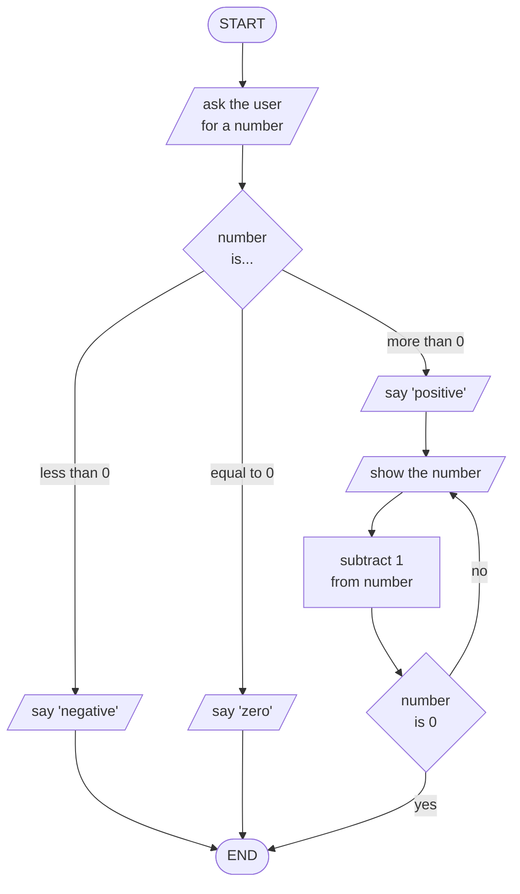
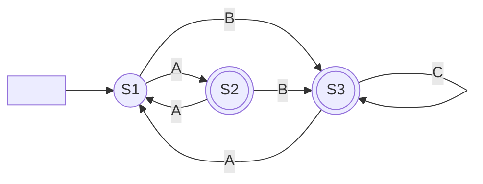

# Algorithms


```pseudo
// Test function
function test(a, b)
    return a + b
end

// Main program
start
  ask user for a number

  if the number is 0 then
    say the number is zero

  elseif the number < 0 then
    say the number is negative

  else
    say the number is positive

    repeat
      show the number
      subtract 1 from the number
    until number is 0

  endif
end
```

Like this...



Heh heh!

