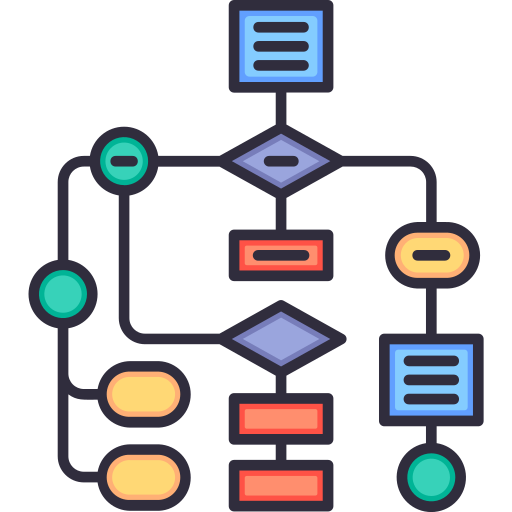
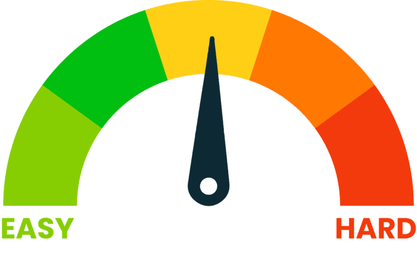
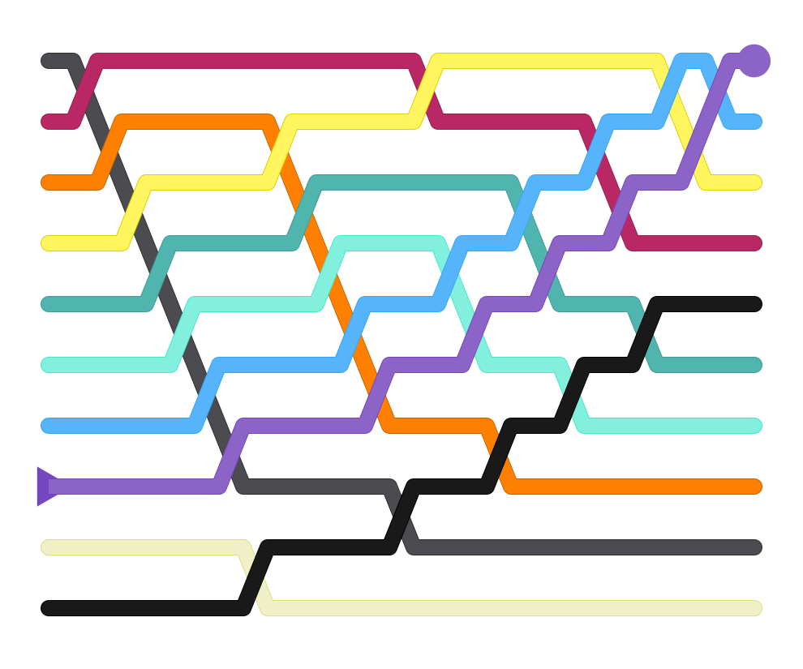

# Algorithmic Complexity Lesson

## Introduction to Complexity

Covers what we mean by 'complexity' and what it is a measure of.

<slides>

# Algorithmic Complexity

What it is and how we measure it

---

||| 3fr 2fr

## Algorithm

An algorithm is a **set of steps or instructions**

|||



|||

---

||| 5fr 3fr

## Example Algorithm

1. Put a teabag in the cup
2. Pour in boiling water
3. Wait for 1 min
4. Remove teabag
5. Add a splash of milk
6. Drink!

|||


|||

---

|||

## Computer Algorithm

Computer algorithms are more formally written using a **programming language**

|||

```python
def sum_array(array):
  total = 0
  for item in array:
    total += item
  return total
```

|||

---

||| 2fr 1fr

## Effort

Algorithms require '**effort**' to run...

The computer's **CPU** needs to perform various **operations**, which take **time**

|||


|||

---

||| 3fr 2fr

## Complexity

Complexity is the **measure of the effort required** to run an algorithm

Or, we could also say, it's a measure of the **time taken** to run the algorithm

|||



|||


</slides>


## Measuring Complexity

Covers how effort relates to problem size, and different algorithms have different relationships.

<slides>

# Measuring Complexity

Complexity is a measure of effort

---

## Problem Size, N

Algorithms usually get feed a **set of data values**, e.g. a list of names, or the location of enemy ships in a game.

The **size** of this data is written as **N**

---

# **N** = **size of the input data** for an algorithm or problem

---

## Effort can Vary with N

The **effort** to solve an algorithm can change as the **size of the input data (N) increases**

---

## Example 1 - Sum a List of Numbers

If we have a list of **three numbers**:

```python
[12, 4, 7]
```

How many steps / operations will it take to add them up?

---

## Example 1 - Sum a List of Numbers

It will take **three operations** (three additions):

+++ list
- Add the first value to the total
- Add the second value to the total
- Add the third value to the total

---

## Example 1 - Sum a List of Numbers

So, how about a list of a **hundred numbers**:

```python
[12, 4, 7, 56, 25, 5, 41, 17, 3, 83, 1, ... ,67]
```

How many steps / operations will it take to add them up?

---

## Example 1 - Sum a List of Numbers

It will take a **hundred operations** (all additions):

+++ list
- Add the first value to the total
- Add the second value to the total
- Add the third value to the total
- ...
- Add the hundredth value to the total

---

## Example 1 - Sum a List of Numbers

For this algorithm:

# effort = **N**

*Remember that effort = operations / steps = time taken*

---

## Example 2 - Access First List Value

If we have a list of **three numbers**:

```python
[12, 4, 7]
```

How many operations will it take to access the first value?

---

## Example 2 - Access First List Value

It will take **one operation**:

+++

- Go to the start of the list and get the value

---

## Example 2 - Access First List Value

So, how about a list of a **hundred numbers**:

```python
[12, 4, 7, 56, 25, 5, 41, 17, 3, 83, 1, ... ,67]
```

How many operations will it take to access the first value?

---

## Example 2 - Access First List Value

It will still take just **one operations**:

+++

- Go to the start of the list and get the value

+++

*The the size of the list, N, does not matter!*

---

## Example 2 - Access First List Value

For this algorithm:

# effort = **1**

*The the size of the list, N, does not matter!*

---

## Example 3 - Sorting a List of Values

If we have a list of a **hundred numbers**:

```python
[12, 4, 7, 56, 25, 5, 41, 17, 3, 83, 1, ... ,67]
```

How many operations will it take to put them into order?

---

## Example 3 - Sorting a List of Values

<videoembed id="Cq7SMsQBEUw"></videoembed>

---

## Example 3 - Sorting a List of Values

Using a simple **Bubble Sort** algorithm on a **hundred numbers**, requires:
- Running through the numbers a **hundred times**,
- Each time performing a **hundred operations**

That's **10,000 operations** in total!

---

## Example 3 - Sorting a List of Values

For this algorithm:

# effort = **N<sup>2</sup>**

---

## Effort for Different Examples

Each example requires a different level of effort, so each has a different **complexity**...

| Algorithm                            | Complexity        |
| ------------------------------------ | ----------------- |
| **Summing** a list                   | **N**             |
| Accessing **first item** in list     | **1**             |
| **Sorting** a list using Bubble Sort | **N<sup>2</sup>** |

---

## Example Effort Values

Looking at actual effort values as N increases...

| N         | **Sum** (**N**) | **First** (**1**) | **Sort** (**N<sup>2</sup>**) |
| --------- | --------------- | ----------------- | ---------------------------- |
| 1         | 1               | 1                 | 1                            |
| 10        | 10              | 1                 | 100                          |
| 100       | 100             | 1                 | 10,000                       |
| 1,000     | 1,000           | 1                 | 1,000,000                    |
| 1,000,000 | 1,000,000       | 1                 | 1,000,000,000,000            |

</slides>


## Best, Average and Worst Cases

Covers how effort can vary depending on the state of the initial data, and which case we focus on.

<slides>

# Best, Average and Worst Cases

What are these, and which is most important?

---

|||

## Consider using a Bubble Sort to sort a list...

|||



|||

---

## Bubble Sort, **Best**-Case

If **the values are already in order**, the sorting would just take just a single pass through to check.

If this case:

## effort = **N**

---

## Bubble Sort, **Average**-Case

If **the values are in a random order**, the sorting would involve multiple passes, but some would involve few operations.

If this case:

## effort = **N<sup>2</sup> / 2**

---

## Bubble Sort, **Worst**-Case

If **the values are completely in reverse order**, the sorting would involve multiple passes, each involving many operations.

If this case:

## effort = **N<sup>2</sup>**

---

## Which case is the most **important** / **interesting**?

---

## We focus on the **Worst Case**

- If we understand the worst-case scenario, we can design systems to cope with that.
- If the situation is not the worst-case, the system will still work just fine.

</slides>


## Big-O Notation

Covers how we categorise algorithmic complexity using BigO notation.

<slides>

# Big-O Notation

How we define the complexity category of an algorithm

---

## Effort Varies with N

We know that:

+++ list
- **Effort** can vary as **N increases**
- The effort depends on the **algorithm**
- Measuring effort gives the **complexity** (1, N, N<sup>2</sup>, etc.)
- We focus on the **worst-case** scenario

---

## Categorising Algorithms

We group algorithms into **categories** based on their **complexity**:

+++ list
- Effort never changes - Complexity **1**
- Effort varies with N - Complexity **N**
- Effort varies with N<sup>2</sup> - Complexity **N<sup>2</sup>**
- etc.

---

## Naming the Categories

We use a naming system called **Big-O Notation**. Each name takes the form:

# **O(**...**)**

*The 'O' means 'order of'*

We refer the them as **Big-O Time Complexity** categories

---

||| 2fr 3fr

## Big-O Time Complexities

|||

| Name        | Complexity           |
| ----------- | -------------------- |
| Constant    | **O(1)**             |
| Logarithmic | **O(log N)**         |
| Linear      | **O(N)**             |
| Log-Linear  | **O(N log N)**       |
| Quadratic   | **O(N<sup>2</sup>)** |
| Cubic       | **O(N<sup>3</sup>)** |
| Exponential | **O(2<sup>N</sup>)** |
| Factorial   | **O(N!)**            |

|||


---

||| 3fr 2fr

# O(1)

## **Constant** Time Complexity

|||


|||

The effort / time taken is **always the same**, regardless of N

*Example: Accessing the first item in a list*

---

||| 3fr 2fr

# O(log N)

## **Logarithmic** Time Complexity

|||


|||

The effort / time taken **goes up by 1 every time N doubles**

*Example: Searching a sorted list using a Binary Search*

---

||| 3fr 2fr

# O(N)

## **Linear** Time Complexity

|||


|||

The effort / time taken increases **proportionally to N**

*Example: Searching an unsorted list using a Linear Search*

---

||| 3fr 2fr

# O(N log N)

## **Log-Linear** Time Complexity

|||


|||

The effort / time taken increases **slightly steeper than proportional to N**

*Example: Sorting a list using a Quicksort or Merge Sort*

---

||| 3fr 2fr

# O(N<sup>2</sup>)

## **Quadratic** Time Complexity

|||


|||

The effort / time taken increases with the **square of N**

*Example: Sorting a list using a Bubble Sort*

---

||| 3fr 2fr

# O(N<sup>3</sup>)

## **Cubic** Time Complexity

|||


|||

The effort / time taken increases with the **cube of N**

*Example: Multiplying two matrices*

---

||| 3fr 2fr

# O(2<sup>N</sup>)

## **Exponential** Time Complexity

|||


|||

The effort / time taken increases with the **power of N**

*Example: ???*

---

||| 3fr 2fr

# O(N!)

## **Factorial** Time Complexity

|||


|||

The effort / time taken increases with the **factorial of N**

*Example: Finding a brute-force solution to the TSP*

---

<big-o-chart></big-o-chart>


</slides>
