# 1940s - The First Programmable, Digital Computers

<pagination>

- [Early](/history/pre.md)
- 1940s
- [1950s](/history/1950s.md)
- [1960s](/history/1960s.md)
- [1970s](/history/1970s.md)
- [1980s](/history/1980s.md)
- [1990s](/history/1990s.md)
- [2000s](/history/2000s.md)
- [2010s](/history/2010s.md)
- [2020s](/history/2020s.md)
- [Future](/history/future.md)

</pagination>

The 1940s established the absolute foundations of digital computing, catalysed by **World War II (1939-45)** military needs for code breaking, ballistics, aerodynamics and logistics calculations. This pivotal decade produced **the first programmable, electronic, digital giants like Colossus and ENIAC**, alongside the formulation of the Von Neumann architecture, which still dictates how modern computer processors operate today.

<timeline>

- 1941: Konrad Zuse's Z3 (Germany)

	**Konrad Zuse** built the **Z3**, an electro-mechanical computer using about 2,300 relays for floating-point binary arithmetic. It was used for aerodynamic calculations before being destroyed in a bombing raid on Berlin in 1943.

	<captioned>

	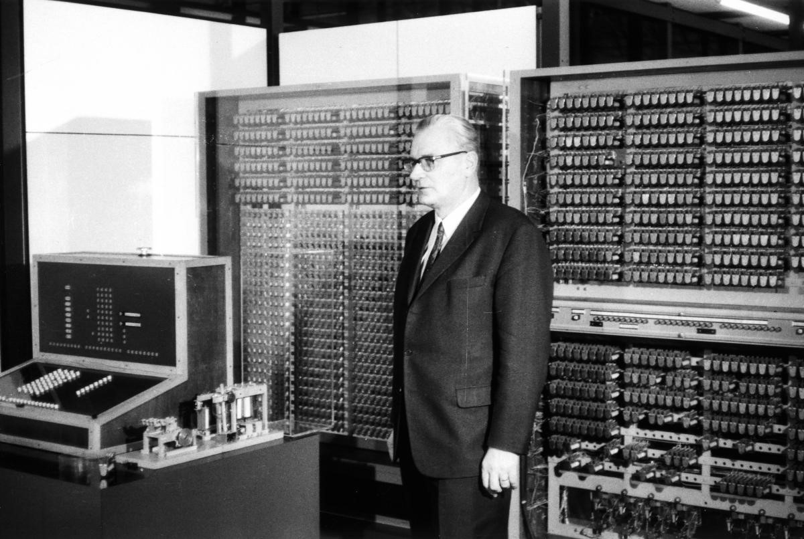

	Konrad Zuse and the Z3

	</captioned>

- 1941: The Bombe (UK)

    

	**Alan Turing** and his colleagues developed **the Bombe**, an electromechanical machine, to help decrypt messages protected by the German **ENIGMA cipher**. Its use helped the Allies read encrypted communications during the war.

    It was not programmable for other tasks, but it proved that complex, logical, and repetitive cognitive tasks could be automated on an industrial scale.

    

	<captioned>

	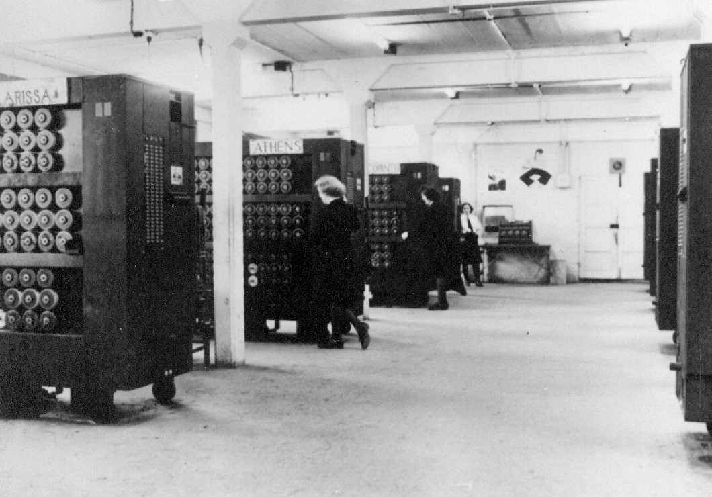

	Bombes used to attack ENIGMA

	</captioned>

- 1942: The Atanasoff-Berry Computer (USA)

	The **Atanasoff-Berry Computer**, or ABC, could solve 29 equations simultaneously and was the first computer able to store information in electronic main memory.

	<captioned>

	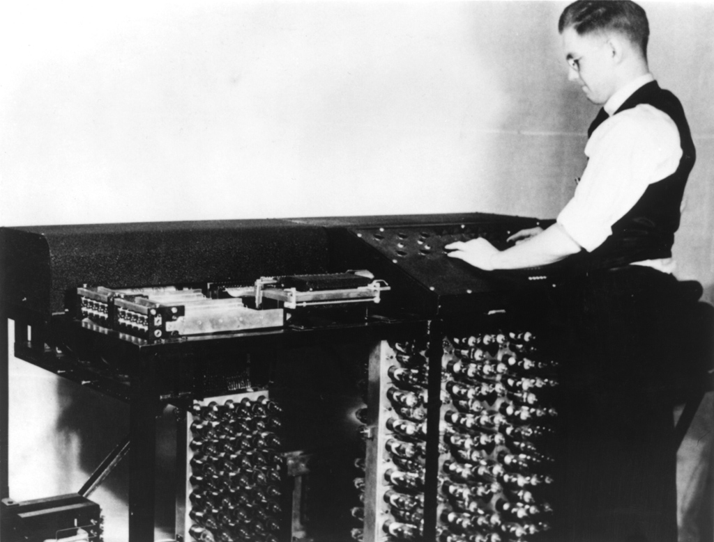

	The Atanasoff-Berry Computer

	</captioned>

- 1943-1944: ENIAC (USA)

	**John Mauchly** and **J. Presper Eckert** designed **ENIAC** for the US Army to help calculate artillery firing tables and ballistic trajectories. It filled a 7 by 12 metre room, weighed about 30 tonnes and used 18,000 vacuum tubes. Its electronic circuits made it dramatically faster than earlier electro-mechanical machines.

	<captioned>

	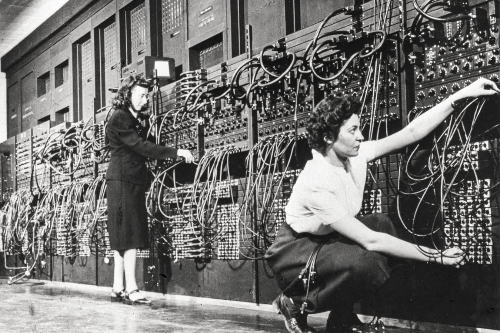

	Programming the ENIAC

	</captioned>

- 1944: Colossus (UK)

	**Tommy Flowers** built **Colossus** to help break the **Lorenz ciphers** used by the German Army. Its vacuum-tube circuits and continuous punched paper tape reduced the work of breaking messages from weeks to hours. The machine could be reprogrammed using switches and plugboards.

	<captioned>

	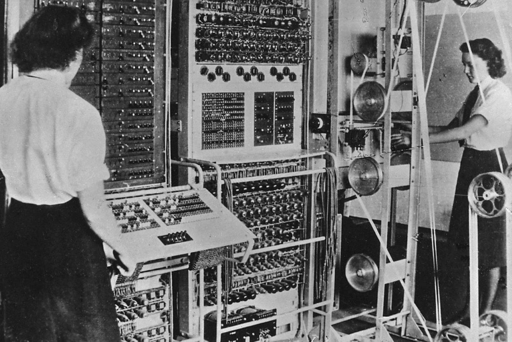

	The Colossus code-breaking computer

	</captioned>

- 1944: Harvard Mark I (USA)

	Designed by **Howard Aiken** and built by **IBM**, the **Harvard Mark I** was a room-sized relay-based calculator. A 15-metre steel camshaft synchronised its thousands of components while it produced mathematical tables.

	<captioned>

	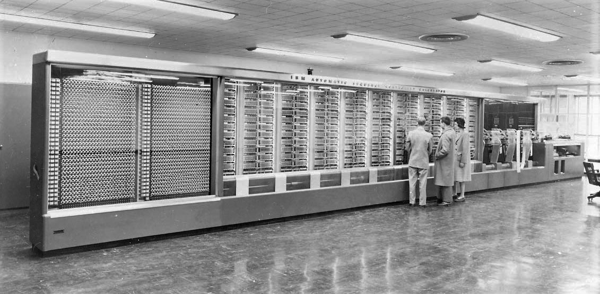

	The Harvard Mark I

	</captioned>

- 1945: Von Neumann Architecture

    

    The earliest computing machines had fixed programs, each designed for a particular task. However, the **stored-program computers** developed in the 1940s stored a set of instructions in memory that detailed the computation (a **program**).

    **John von Neumann**, after discussion with **John Mauchly** and **J. Presper Eckert** (the designers of ENIAC), described a design architecture for an electronic, stored-program, digital computer with:

    - A **control unit** to sequence operations
    - An **arithmetic & logic unit** (ALU)
    - **Memory** to store data and instructions
    - **Storage** for input and output data
    - Input and output **transfer** bus

    This computer architecture is still used in in today's modern computers.

    

    

	<captioned>

	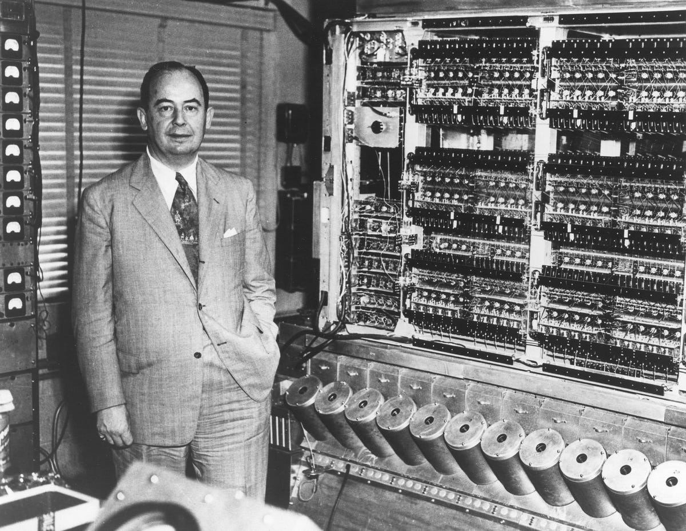

    John von Neumann

	</captioned>

	<captioned>

	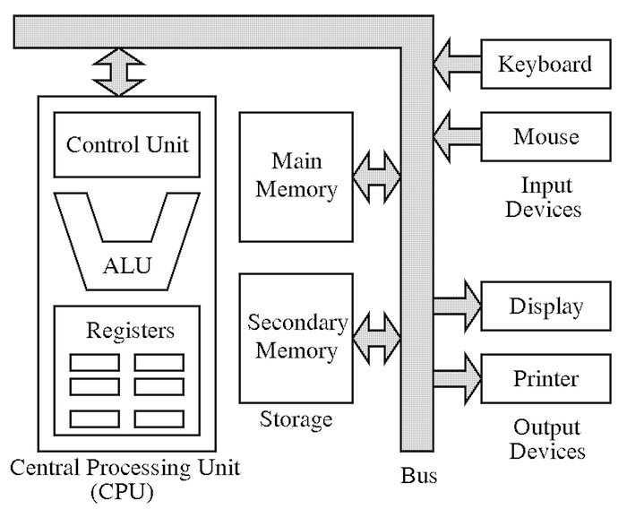

	Von Neumann computer architecture

	</captioned>

    

- 1947: The Transistor

	**William Shockley**, **John Bardeen** and **Walter Brattain** invented the transistor, a small **solid-state electronic switch**. Transistors used less power and space than vacuum tubes and opened the way to smaller, faster computers.

	<captioned>

	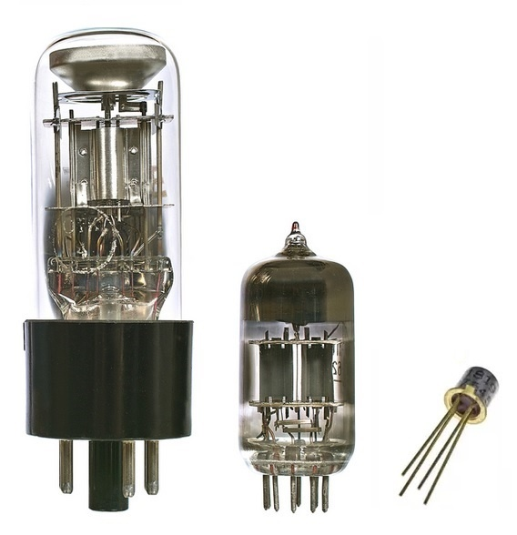

	Vacuum tubes and a transistor

	</captioned>

- 1948: The Manchester Baby (UK)

	The **Small-Scale Experimental Machine**, known as the **Manchester Baby**, tested the Williams Tube memory technology. On 21 June 1948 it ran the first ever program to be run on a digital, electronic, stored-program computer.

	<captioned>

	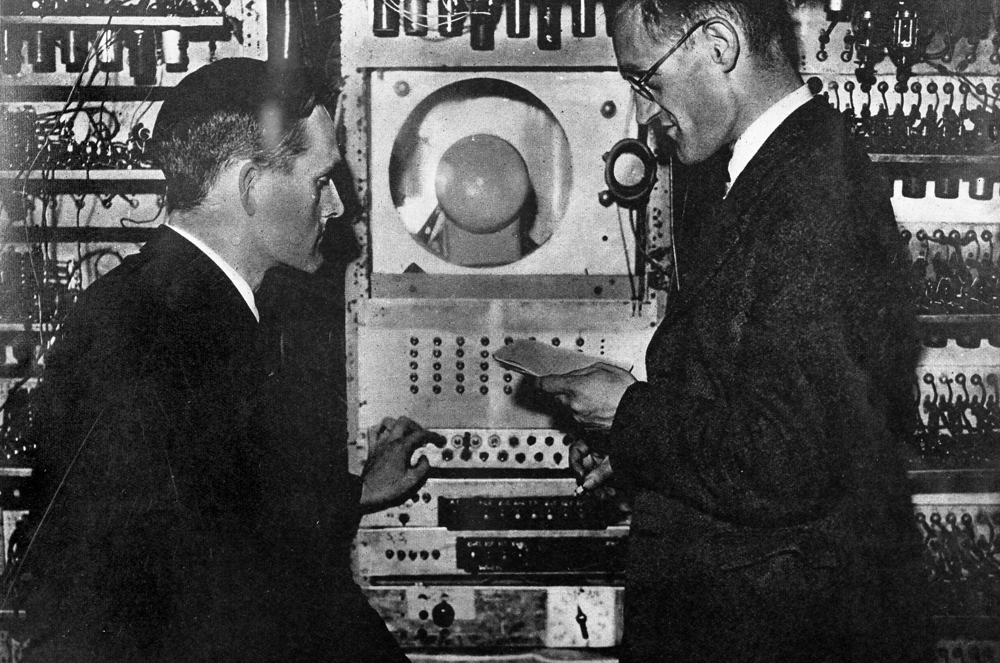

	The Manchester Baby

	</captioned>

- 1949: Manchester Mark 1 (UK)

    Based on lessons learnt from the Manchester Baby, the **Manchester Mark 1** was one of the earliest **stored-program** computers. It was operational in April 1949 and on the night of 16 June 1949 it ran a program error-free for nine hours, searching for Mersenne primes.

	<captioned>

	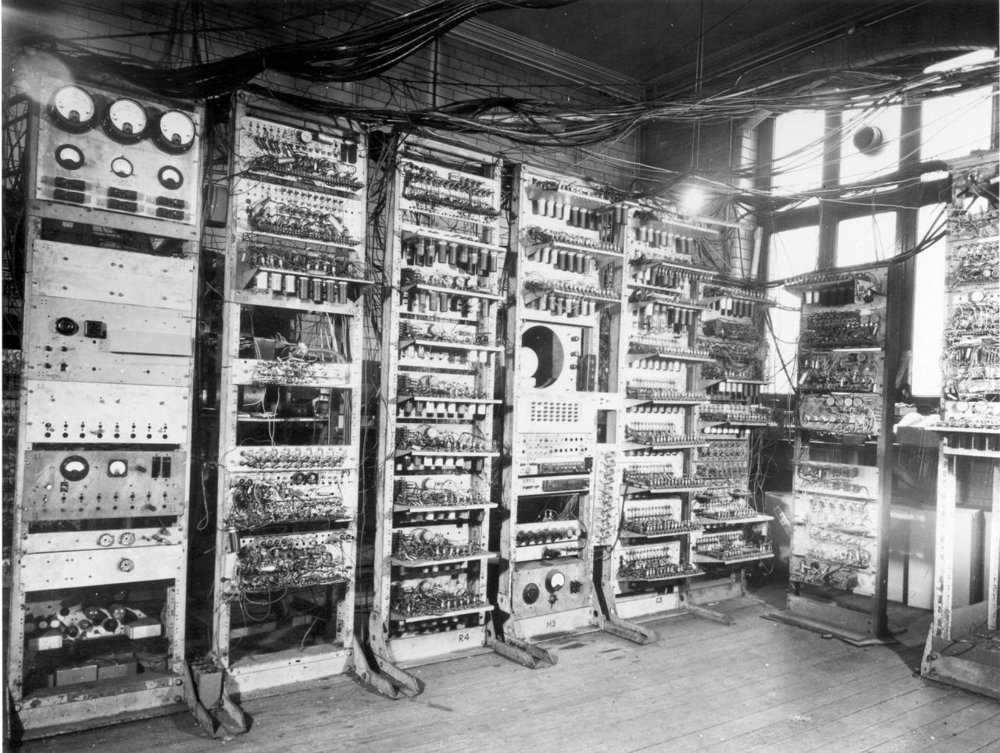

	The Manchester Mark 1

	</captioned>

- 1949: EDSAC (UK)

	**EDSAC** at Cambridge helped establish **practical stored-program computing**. EDSAC was the second electronic digital stored-program computer, after the Manchester Mark 1, to go into regular service.

	<captioned>

	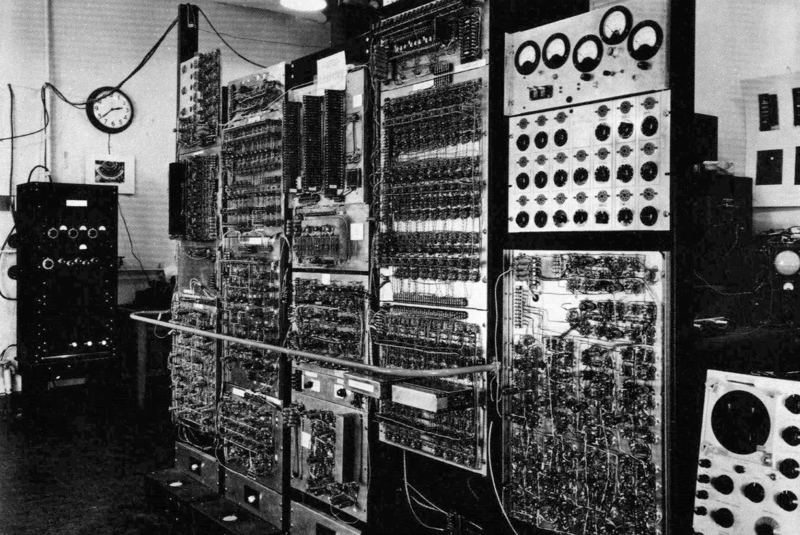

	EDSAC

	</captioned>

- 1949: CSIRAC (AUS)

	Australia's **CSIRAC** was completed in Sydney for the Council of Scientific and Industrial Research. It ran its first test program (multiplication of numbers) in November 1949. It's memory and processor ran at 1kHz.

	<captioned>

	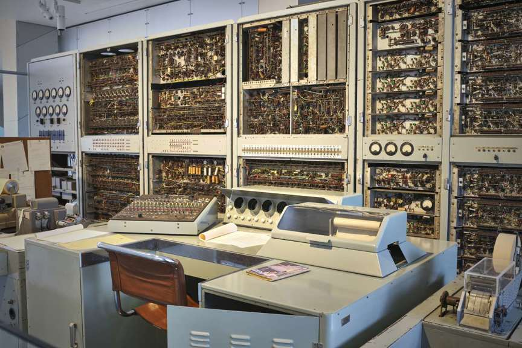

	The CSIRAC

	</captioned>

</timeline>

<pagination class="bottom">

- [Early](/history/pre.md)
- 1940s
- [1950s](/history/1950s.md)
- [1960s](/history/1960s.md)
- [1970s](/history/1970s.md)
- [1980s](/history/1980s.md)
- [1990s](/history/1990s.md)
- [2000s](/history/2000s.md)
- [2010s](/history/2010s.md)
- [2020s](/history/2020s.md)
- [Future](/history/future.md)

</pagination>

