# 1950s - New Programming Languages and First Commercial Use of Computers

In the post-war decade of the 1950s, new developments in computer hardware, new programming languages, and greater reliability of computers led to the adoption of computers by businesses.

<timeline>

- 1950s: Analogue Computers

    Analog computers were powerful electronic machines that used continuous electrical signals rather than the zeros and ones of digital computers. By the late 1950s, improvements in digital circuits made digital computers more reliable, precise, and cost-effective, leading to the gradual phase-out of pure analog machines.

	<captioned>

	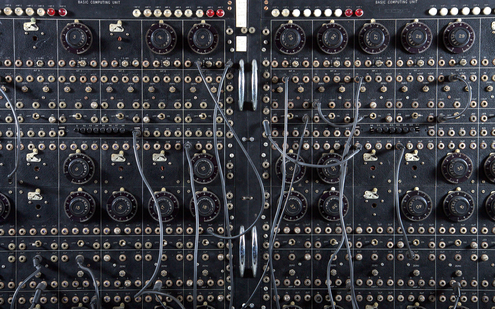

	A computing panel from an analogue computer

	</captioned>

- 1950s: Commercial Computers Arrive

	Computers changed from one-off research machines into products sold to organisations. The RCA 501 and UNIVAC were examples of systems marketed for general business and administrative work. By 1953, there were an estimated 100 computers in the world.

	<captioned>

	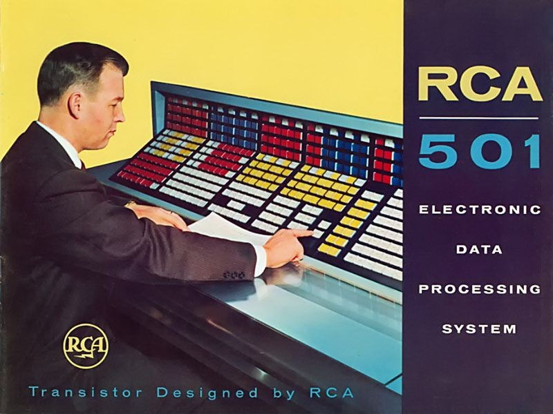

	A promotional booklet for the RCA 501

	</captioned>

- 1950: Magnetic Drum Memory

	The ERA Atlas computer used magnetic drum memory to store data. Information was written to and read from a rotating, magnetically coated cylinder. It could store about 50kB and offered a faster alternative to punched cards and paper tape.

	<captioned>

	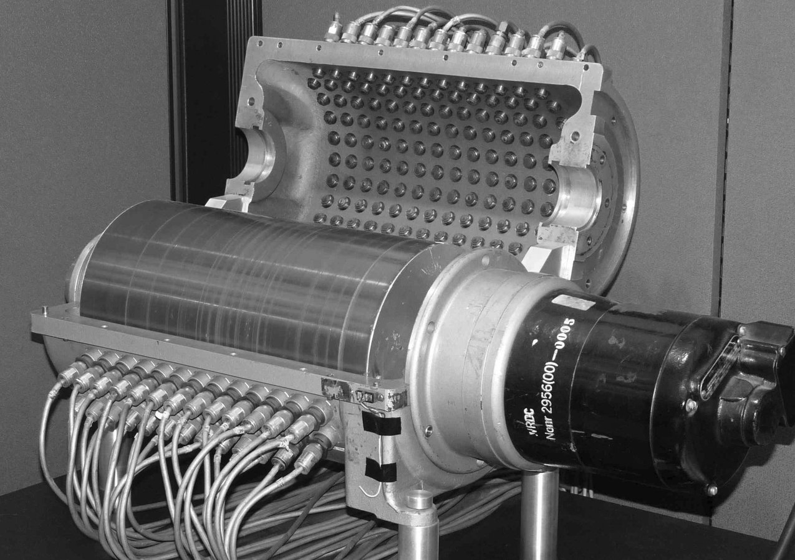

	Atlas magnetic drum memory

	</captioned>

- 1951: UNIVAC

    The UNIVAC (Universal Automatic Computer) was the first general-purpose electronic digital computer for business applications produced in the US. The first UNIVAC was acquired by the United States Census Bureau on March 31, 1951. A UNIVAC machine famously predict the result of the 1952 presidential election from a sample of a mere 5.5% of the voter turnout.

	<captioned>

	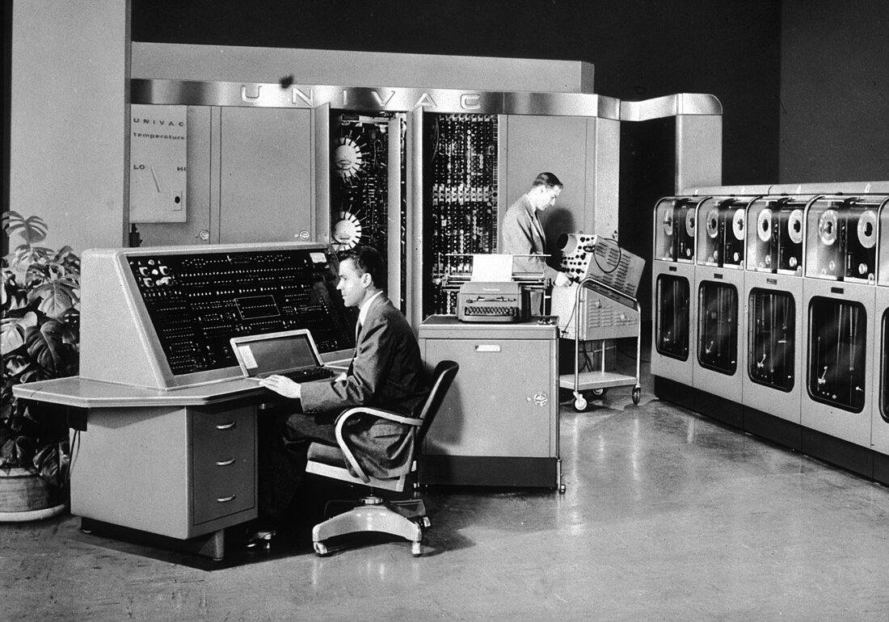

	The UNIVAC

	</captioned>

- 1951: Magnetic Tape

	UNIVAC used magnetic tape as a commercial storage medium. Each long metal tape could hold around 3MB, making it practical to keep much larger datasets than punched cards could hold.

	<captioned>

	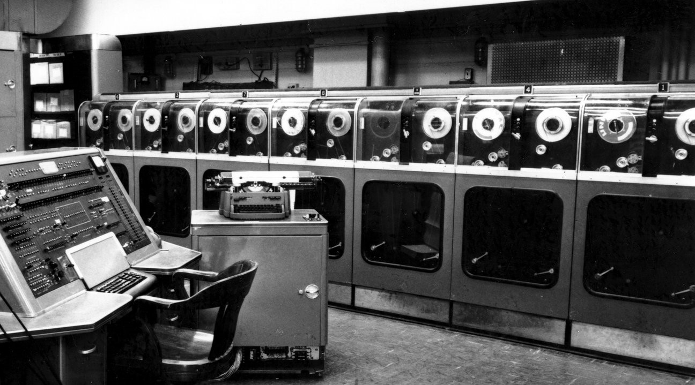

	Magnetic tape storage

	</captioned>

- 1951: Magnetic-Core Memory

	Magnetic-core memory stored bits in tiny doughnut-shaped rings threaded into a mesh of wires. It was reliable, compact and remained an important computer memory technology for decades.

	<captioned>

	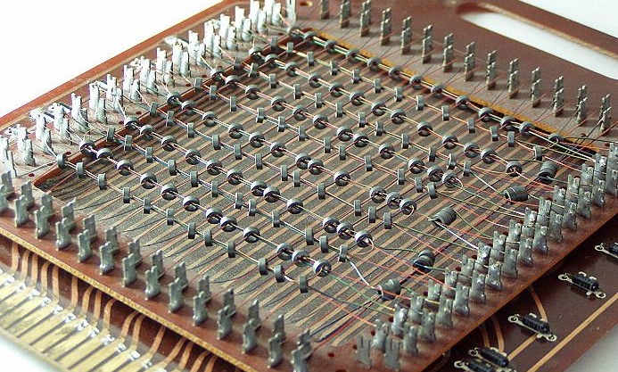

	Magnetic-core memory

	</captioned>

- 1953: FLOW-MATIC Programming Language

	Grace Hopper developed FLOW-MATIC, one of the first high-level programming languages. She worked for the US Navy and later became Rear Admiral Grace Hopper having spent years leading and developing some of the most important software systems of the time.

	<captioned>

	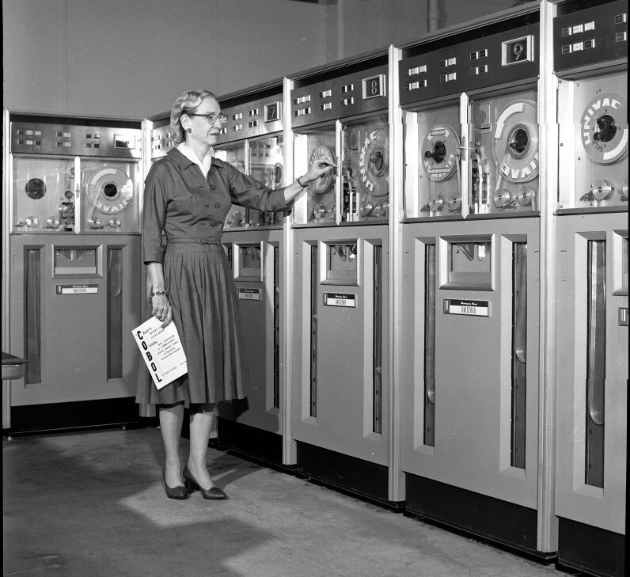

	Grace Hopper

	</captioned>

- 1954: FORTRAN

	IBM programmers led by John Backus developed FORTRAN, a language designed for mathematical, scientific and engineering work. FORTRAN stands for FORmula TRANslator, and modern versions are used today in weather prediction, finite element analysis, computational fluid dynamics, plasma physics, and many other fields. It is used for programs that benchmark and rank the world's fastest supercomputers.

	<captioned>

	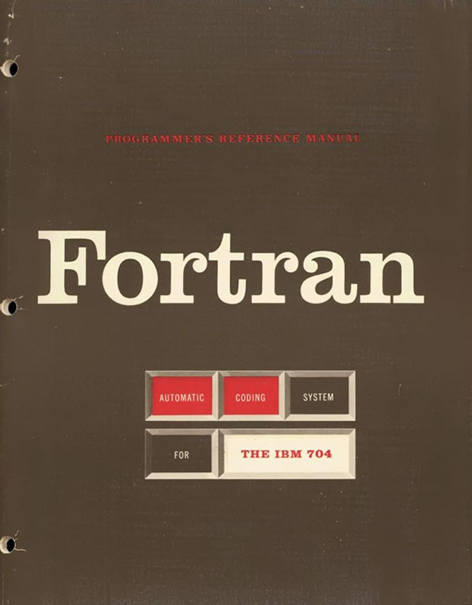

	Fortran language document

	</captioned>

- 1956: RAMAC 305 Disk Drive

	IBM's RAMAC 305 was the world's first commercial hard-disk drive. Its 50 magnetic disks stored about 5 MB and provided much faster access to large datasets than tape or punched cards.

	<captioned>

	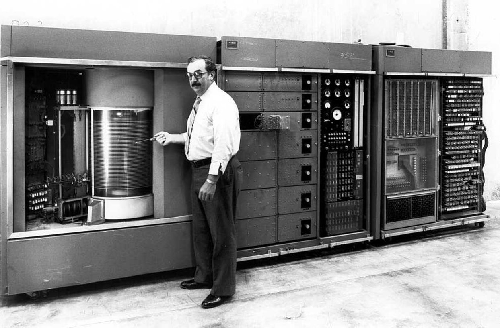

	The IBM RAMAC 305

	</captioned>

- 1956: Keyboard Input

	Researchers began experimenting with entering data directly through a keyboard instead of using punched cards or paper tape. Devices such as the Flexowriter helped establish the keyboard as a practical computer input device.

	<captioned>

	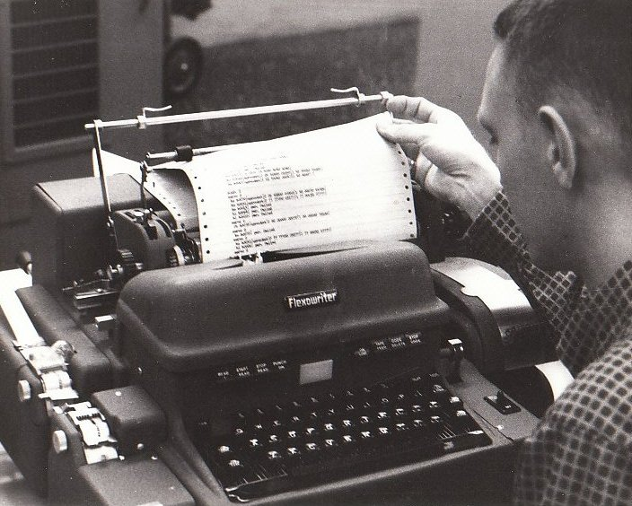

	A Flexowriter

	</captioned>

- 1958: Integrated Circuits (ICs)

	Jack Kilby and Robert Noyce independently helped develop the integrated circuit: multiple electronic components manufactured together on a single chip. Integrated circuits made computers smaller, faster and more reliable.

	<captioned>

	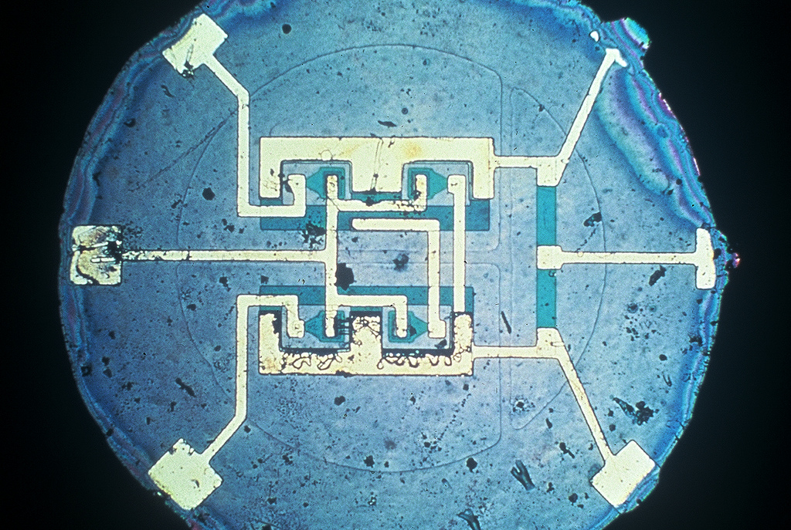

	An early integrated circuit

	</captioned>

- 1958: LISP Programming Language

	John McCarthy created LISP at MIT. LISP stands for LISt Processing, reflecting its core focus on manipulating lists rather than numbers. McCarthy created the language while doing research in artificial intelligence, shortly after he coined the term "artificial intelligence" itself.

	<captioned>

	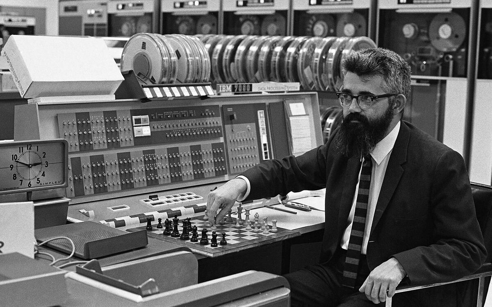

	John McCarthy in 1967

	</captioned>

- 1959: COBOL Programming Language

	FLOW-MATIC's ideas helped shape COBOL, a business language whose modern descendants are still used in important systems such as banking. COBOL stands for COmmon Business-Oriented Language.

	<captioned>

	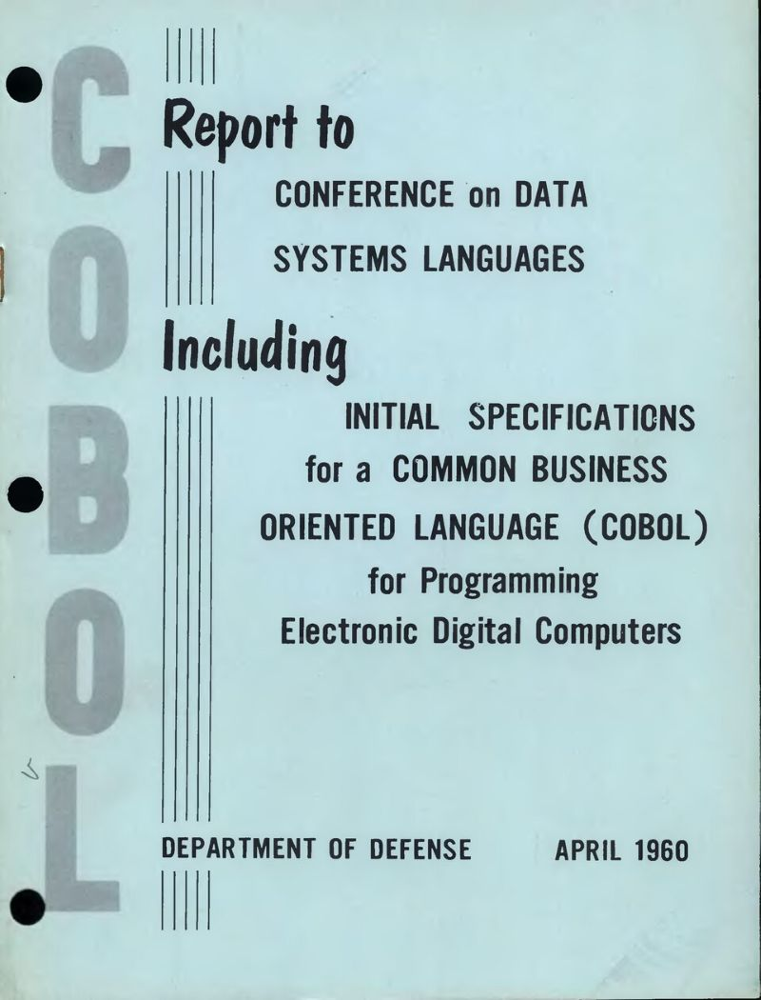

	COBOL, a high-level language

	</captioned>

</timeline>

