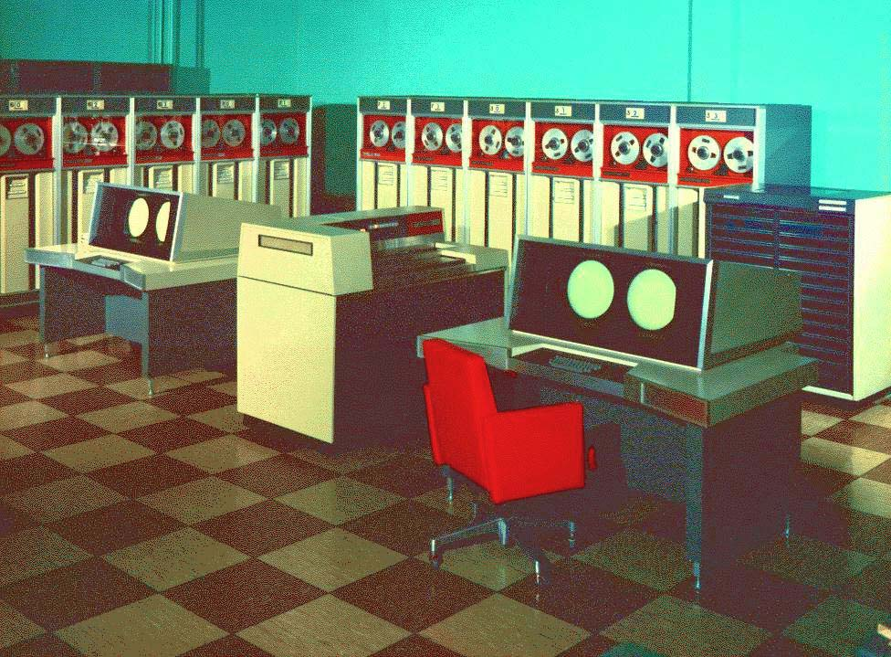
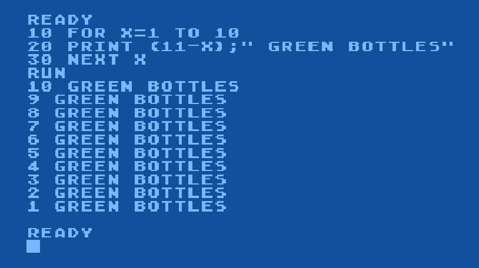

# 1960s - The Space Race and the Rise of the Mainframe Computer

<timeline>

- 1960: DEC PDP-1

	Digital Equipment Corporation introduced the PDP-1, an early commercial computer with a monitor and keyboard. Its interactive design helped make computing more accessible to researchers and programmers.

	<captioned>

	

	Dec's PDP-1

	</captioned>

- 1961: Minuteman guidance computer

	Minuteman missiles used rugged transistorised computers to calculate their position in flight. The need for reliable, compact electronics pushed computer engineering forward.

	<captioned>

	

	The Minuteman missile guidance computer

	</captioned>

- 1962: Spacewar!

	MIT student Steve Russell created [Spacewar! on the PDP-1](https://www.youtube.com/watch?v=1EWQYAfuMYw) (video), one of the first widely played computer games. It demonstrated that computers could be used for entertainment as well as calculations.

	<captioned>

	

	Playing SpaceWar! on the PDP-1

	</captioned>

- 1963: ASCII

	ASCII standardised a 7-bit code for representing letters, numbers, symbols and control characters. Having a set of shared character codes made it easier for different computer systems to exchange text.

	<captioned>

	

	ASCII code table

	</captioned>

- 1964: CDC 6600

	Seymour Cray's CDC 6600 became a commercially successful supercomputer. It cost US$2,370,000 (equivalent to US$25M today) and had a 60-bit processor running at 10MHz, memory up to 982kB and could perform 2MIPS

	<captioned>

	

	The Cray CDC 6600

	</captioned>

- 1964: IBM System/360

	IBM's System/360 family of computers, a modular, integrated system, allowed organisations to use compatible software across computers of different sizes.

	<captioned>

	

	IBM's System/360

	</captioned>

- 1964: BASIC

	John Kemeny and Thomas Kurtz developed BASIC at Dartmouth to make programming easier for students. It became the standard language used in school and was installed on most home computers in the 1980s, introducing generations of people to code.

	<captioned>

	

	A simple BASIC program

	</captioned>

- 1964: The 'Mother of All Demos'

	Douglas Engelbart demonstrated a computer with a mouse and graphical interface, pointing toward a future in which computers would be used by people beyond specialist researchers.

	<captioned>

	

	The famous demo with mouse and graphics

	</captioned>

- 1968: Apollo Guidance Computer

	The Apollo Guidance Computer packed processing, core memory and integrated circuits into a small spacecraft computer. Astronauts entered commands through the DSKY, and the system helped guide Apollo missions to the Moon.

	<captioned>

	

	The Apollo guidance computer and interface

	</captioned>

- 1969: UNIX

	Whilst working at Bell Labs,  Dennis Ritchie and Ken Thompson created UNIX, arguably the world's most important computer operating system. It was written in C and its architecture can be found on most computers in existence today.

	<captioned>

	

	Dennis Ritchie and Ken Thompson at Bell Labs

	</captioned>

- 1969: ARPANET

	The first four ARPANET nodes became operational, establishing an important ancestor of the Internet. The ARPANET was funded by ARPA (later DARPA), a research arm of the US military. They wanted a communication network that was robust.

	<captioned>

	

	A sketch of the first four ARPANET nodes

	</captioned>

</timeline>

