# 1960s - The Space Race and the Rise of the Mainframe Computer

<pagination>

- [Early](/history/pre.md)
- [1940s](/history/1940s.md)
- [1950s](/history/1950s.md)
- 1960s
- [1970s](/history/1970s.md)
- [1980s](/history/1980s.md)
- [1990s](/history/1990s.md)
- [2000s](/history/2000s.md)
- [2010s](/history/2010s.md)
- [2020s](/history/2020s.md)
- [Future](/history/future.md)

</pagination>

The 1960s transformed computing from isolated devices into **interconnected**, **interactive** systems, highlighted by the invention of the **microchip** and the creation of **ARPANET**, the internet's earliest ancestor. This decade also introduced the computer **mouse**, **hypertext**, and the concept of modern software through the widespread adoption of **high-level languages** like COBOL and BASIC.

<timeline>

- 1960: First Computers in New Zealand

    The first computer installed in **New Zealand** was an **ICT 1201**, installed on the ground floor of Shell House at The Terrace, Wellington for the **Education Department**. It was used to process the fortnightly teachers’ payroll.

    A year later, an **IBM 650** computer was installed at the **Treasury**, mainly to process staff payrolls.

	<captioned>

	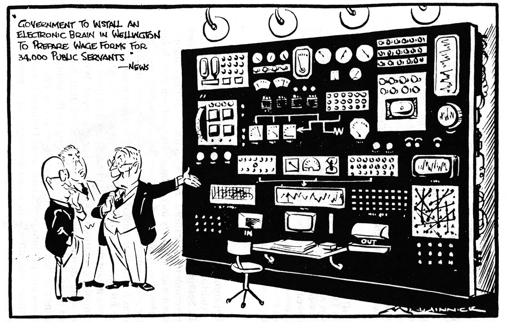

	A 1960 cartoon about the new computers

	</captioned>

- 1960: DEC PDP-1

	**Digital Equipment Corporation** introduced the **PDP-1**, an early commercial computer with a **monitor** and **keyboard**. Its interactive design helped make computing more accessible to researchers and programmers.

	<captioned>

	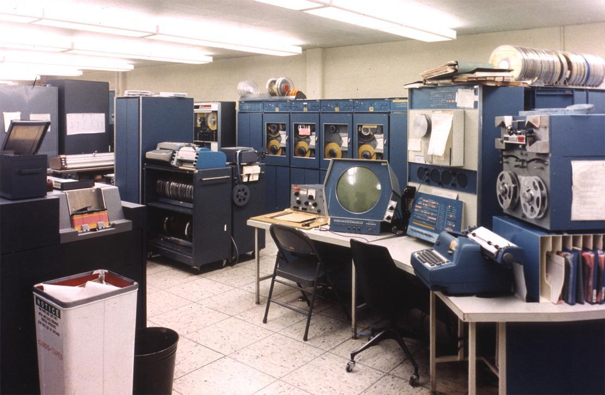

	Dec's PDP-1

	</captioned>

- 1961: Minuteman Guidance Computer

	**Minuteman nuclear missiles** used **rugged transistorised computers** to calculate their position in flight. The need for reliable, compact electronics pushed computer engineering forward.

	<captioned>

	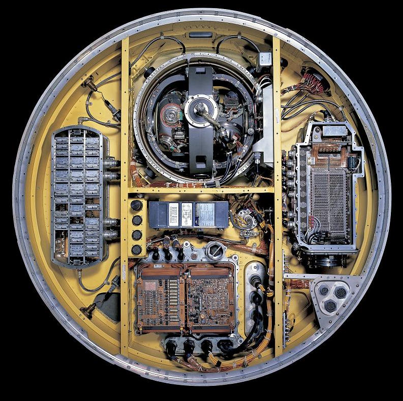

	The Minuteman missile guidance computer

	</captioned>

- 1962: Spacewar!

	MIT student **Steve Russell** created [**Spacewar!** on the **PDP-1**](https://www.youtube.com/watch?v=1EWQYAfuMYw) (video), one of the first widely played computer games. It demonstrated that computers could be used for entertainment as well as calculations.

	<captioned>

	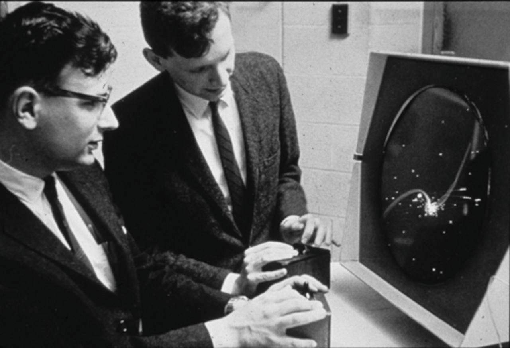

	Playing SpaceWar! on the PDP-1

	</captioned>

- 1963: ASCII Codes

	The **American Standard Code for Information Interchange (ASCII)** standardised a 7-bit code for representing **letters**, **numbers**, **symbols** and **control** characters. Having a set of shared character codes made it easier for different computer systems to exchange text.

	<captioned>

	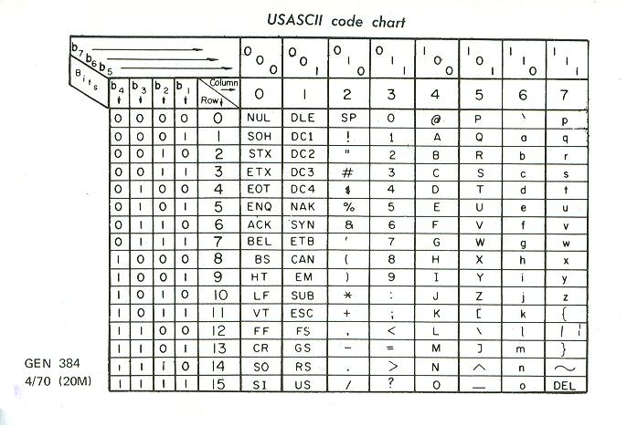

	ASCII code table

	</captioned>

- 1964: Cray CDC 6600

	**Seymour Cray**'s **CDC 6600** became a commercially successful **supercomputer**. It cost US$2,370,000 (equivalent to US$25M today) and had a 60-bit processor running at 10MHz, memory up to 982kB and could perform 2 million instructions per second (MIPS)

	<captioned>

	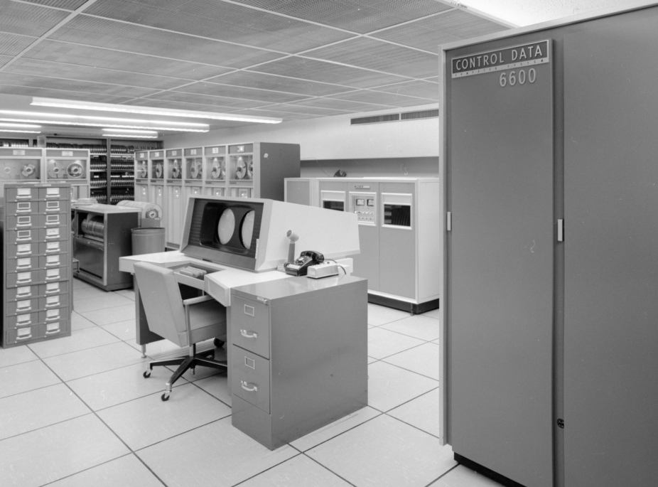

	The Cray CDC 6600

	</captioned>

- 1964: IBM System/360

	**IBM**'s **System/360** family of computers, a **modular**, **integrated** computer system, allowed organisations to use compatible peripheral devices and software across computers of different sizes.

	<captioned>

	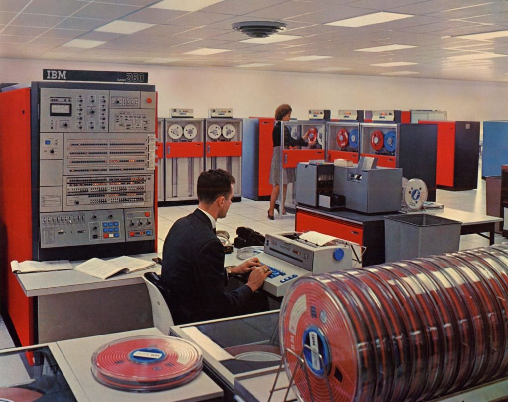

	IBM's System/360

	</captioned>

- 1965: DEC PDP-8

	The **DEC PDP-8** was a small and relatively affordable computer that could be used by laboratories, factories and schools. It became one of the first commercially successful **minicomputers**, showing that useful computers did not have to be enormous mainframes.

	<captioned>

	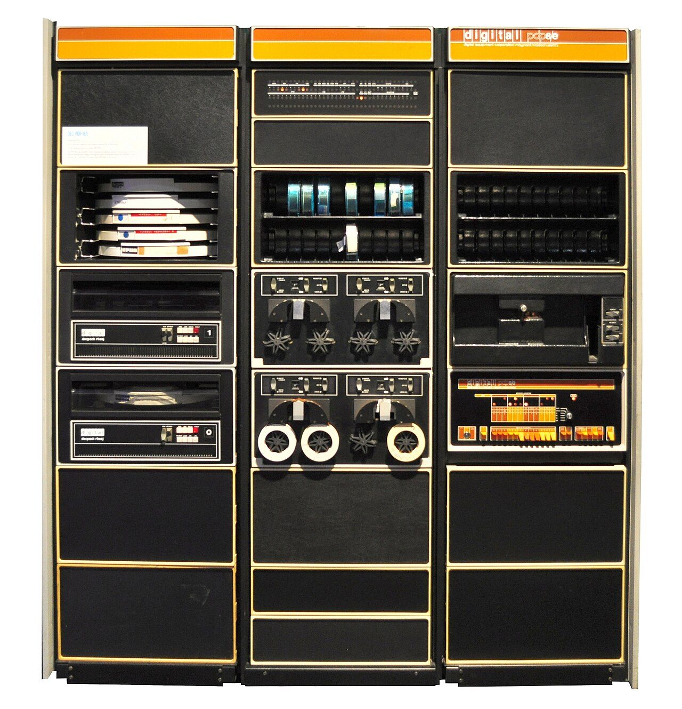

	The DEC PDP-8

	</captioned>

- 1964: BASIC Programming Language

	**John Kemeny** and **Thomas Kurtz** developed **BASIC** to make **programming easier for students**. It became the standard language used in school and was installed on most personal computers in the 1980s, introducing generations of people to code.

	<captioned>

	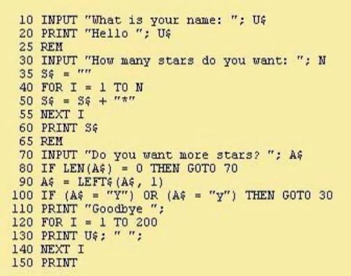

	A simple BASIC program

	</captioned>

- 1964: The 'Mother of All Demos'

	**Douglas Engelbart** demonstrated a computer with a **mouse** and **graphical interface** running user-friendly applications, including hypertext documents, pointing toward a future in which computers would be used by people beyond specialist researchers.

	<captioned>

	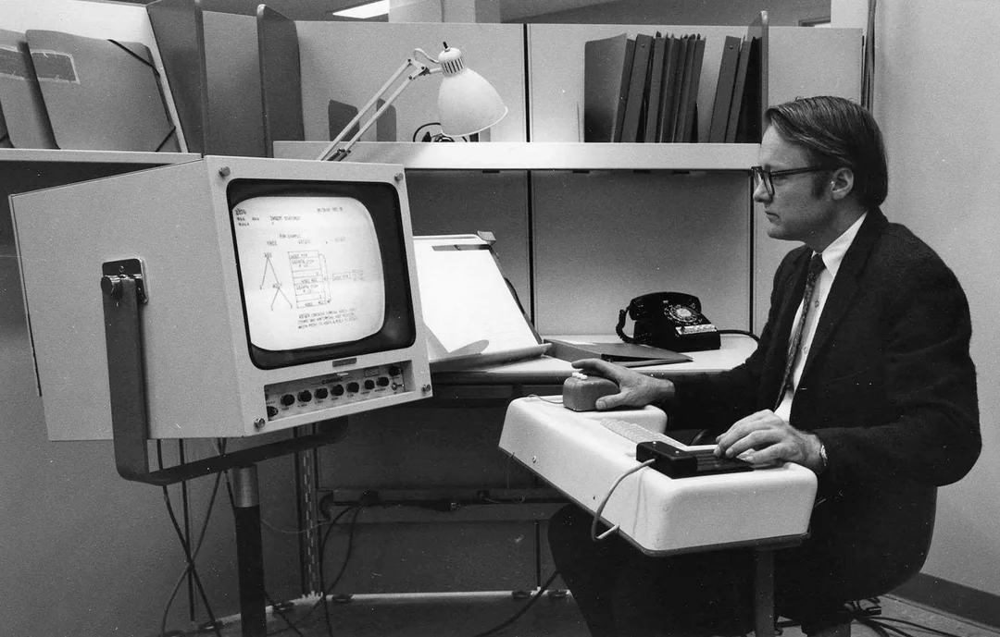

	The famous demo with mouse and graphics

	</captioned>

- 1968: Apollo Guidance Computer

	The **Apollo Guidance Computer** packed **processing**, **magnetic core memory** and **integrated circuits** into a small spacecraft computer. Astronauts entered commands through the DSKY, and the system helped guide Apollo missions to the Moon.

	<captioned>

	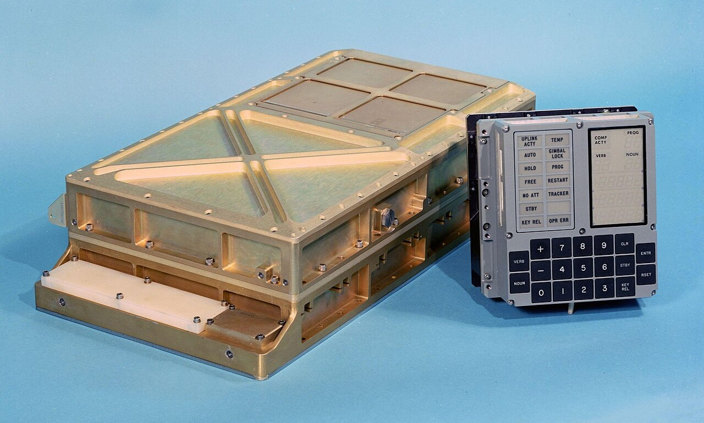

	The Apollo Guidance Computer and DSKY interface

	</captioned>

- 1969: Margaret Hamilton and Apollo Software

	**Margaret Hamilton** led the team at MIT that developed the **Apollo flight software** for the Apollo Guidance Computer. The software wa programmed into the computer by 'weaving' it into magnetic core memory.

    Hamilton's priority-scheduling code safely handled a computer overload during the 1969 **Apollo 11 moon landing**, preventing the lander from crashing.

    Hamilton helped popularise the term **software engineering**.

	<captioned>

	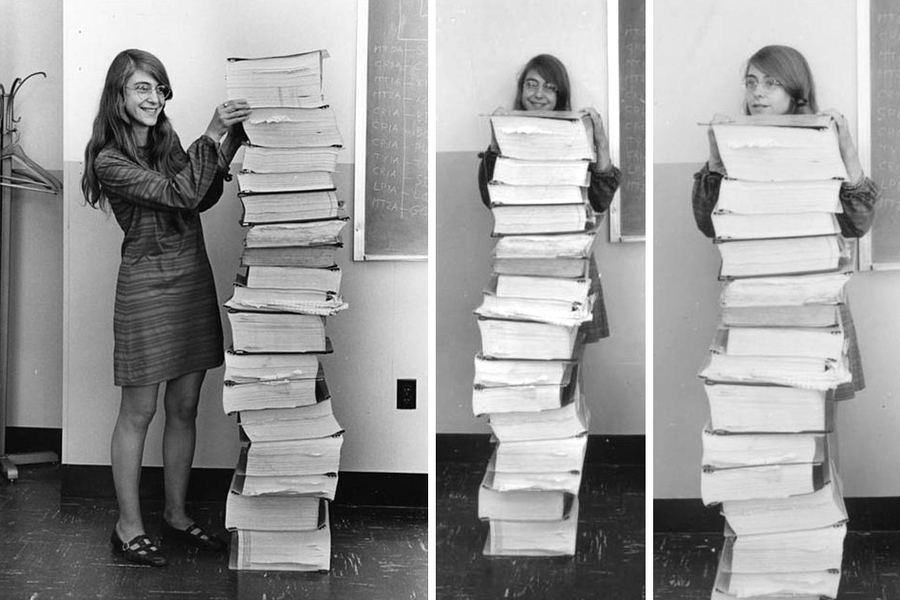

	Margaret Hamilton with printouts of the Ap0llo code

	</captioned>

	<captioned>

	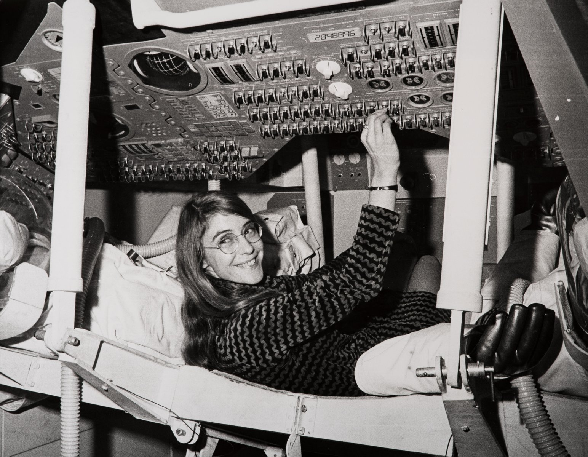

	Margaret Hamilton in the Apollo 12 simulator

	</captioned>

- 1969: UNIX Operating System

	Whilst working at **Bell Labs**, **Dennis Ritchie** and **Ken Thompson** created **UNIX**, arguably the world's most important computer operating system. It was written in the C programming language and it influenced the design of operating systems for decades to come.

	<captioned>

	

	Dennis Ritchie and Ken Thompson at Bell Labs

	</captioned>

- 1969: ARPANET - The Precursor of the Internet

	The **ARPANET** was funded by ARPA (later DARPA), a research arm of the US military. Its **packet-switching** design was intended to make communication more **efficient** and **resilient** than a centralised network.

	On 29 October 1969, UCLA sent the first message over ARPANET to the Stanford Research Institute. The attempted word was "LOGIN", but the system crashed after the first two letters.

    By December, four nodes at UCLA, SRI, the University of California, Santa Barbara and the University of Utah were connected.

	<captioned>

	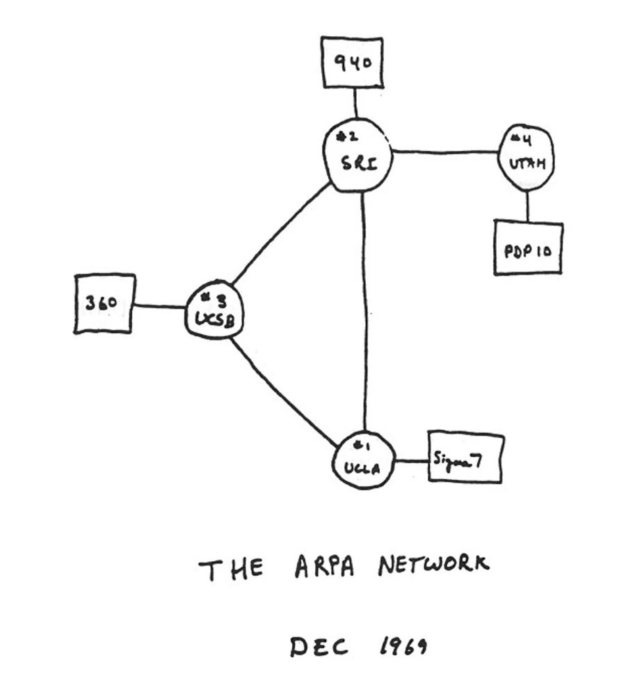

	A sketch of the first four ARPANET nodes

	</captioned>

</timeline>

<pagination class="bottom">

- [Early](/history/pre.md)
- [1940s](/history/1940s.md)
- [1950s](/history/1950s.md)
- 1960s
- [1970s](/history/1970s.md)
- [1980s](/history/1980s.md)
- [1990s](/history/1990s.md)
- [2000s](/history/2000s.md)
- [2010s](/history/2010s.md)
- [2020s](/history/2020s.md)
- [Future](/history/future.md)

</pagination>

