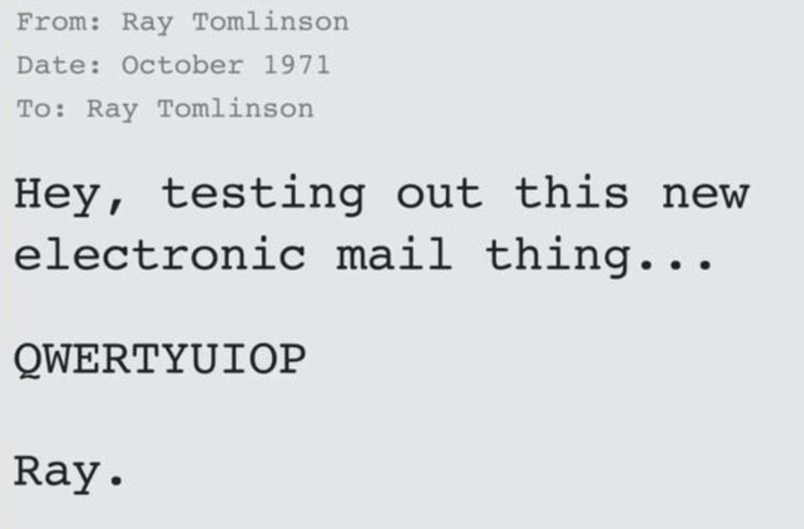
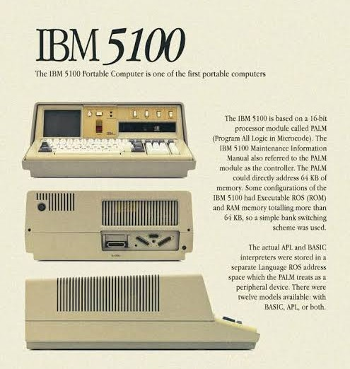

# 1970s - The Microchip Revolution

The 1970s marked the birth of personal computing, driven by the invention of the microprocessor which shrunk computers from room-sized machines to desktop devices. This decade saw the launch of foundational consumer PCs like the Apple II, the development of new programming languages, and the introduction of the floppy disk, laying the groundwork for the boom of personal computing in the 1980s.

<timeline>

- 1970: Intel 1103 DRAM

	Intel introduced the 1103, a 1kB dynamic random-access memory chip. This integrated circuit (IC) chip was cheaper and more compact than previous computer memory which was assembled from separate components.

	<captioned>

	

	Intel 1103 DRAM

	</captioned>

- 1971: Intel 4004 microprocessor

	Intel's 4004 processor put a central processing unit on a single integrated circuit (IC) chip. It was a 4-bit system, running at 750kHz, and priced at US$60 (equivalent to $500 today)

	<captioned>

	

	Intel 4004 microprocessor

	</captioned>

- 1971: Floppy disk

	IBM engineers led by Alan Shugart developed the floppy disk, making it easier to move software and data between computers. The original floppy disks were 8 inches in diameter and held 80kB on a thin disk of coated plastic, protected by a plastic shell.

	<captioned>

	

	8 inch floppy disk

	</captioned>

- 1971: Email

	Ray Tomlinson sent the first mail message between two computers on the ARPANET, introducing the now-familiar address syntax with the '@' symbol designating the user's system address. He chose '@' since it was a rarely used keyboard character. By 1973, email made up most of ARPANET traffic.

	<captioned>

	

	The first email

	</captioned>

- 1971: ARPANET reaches 15 nodes

	ARPANET had grown from its first four nodes to about 15 sites and 23 host computers. Researchers used it for remote login, file transfer and sharing access to expensive mainframes.

- 1971: Pascal

    Swiss computer scientist, Niklaus Wirth, created Pascal as a language for teaching structured programming. Pascal became a massive commercial success and influenced the engineering of modern languages like Ada, C++, and Java.

	<captioned>

	

	Niklaus Wirth

	</captioned>

- 1972: ARPANET is demonstrated publicly

	At the International Conference on Computer Communications, a network of about 40 ARPANET machines demonstrated remote login, file transfer and email. The event showed that packet switching could support many different applications, not only military communication.

- 1972: C

	Dennis Ritchie and colleagues developed C at Bell Labs. Its small runtime, compiled code and direct access to memory made it useful for operating systems and embedded devices. C became the main implementation language for UNIX and strongly influenced C++, Java and many later languages.

	<captioned>

	

	C programming language

	</captioned>

- 1972: Prolog

	Prolog introduced a logic-programming style based on facts, rules and queries. Instead of describing a sequence of instructions, a program describes relationships and lets the interpreter search for solutions. It became important in artificial intelligence and language research.

	<captioned>

	

	Prolog programming language

	</captioned>

- 1972: Pong

	Atari's Pong was one of the first commercially successful arcade video games. Its simple paddle-and-ball design helped create the video-game industry.

	<captioned>

	

	Pong arcade cabinet

	</captioned>

- 1973: Ethernet

	Robert Metcalfe and colleagues developed Ethernet at Xerox PARC for connecting computers and peripherals. Its packet-based design became the dominant wired local-area networking standard.

	<captioned>

	

	Early Ethernet hardware

	</captioned>

- 1973: Xerox Alto

	Xerox PARC's Alto combined Ethernet, a graphical interface and a mouse in a landmark personal workstation. This machine was the inspiration for Apple's Lisa and Macintosh computers.

	<captioned>

	

	The Xerox Alto

	</captioned>

- 1973: ARPANET crosses the Atlantic

	A satellite link connected ARPANET to NORSAR in Norway, with a further connection to University College London. These were the network's first international links and showed that packet-switched networks could span oceans.

- 1974: TCP is proposed

	Vint Cerf and Bob Kahn described the Transmission Control Protocol, which allowed separate computer networks to exchange data reliably. Their work became part of the TCP/IP architecture used by the Internet.

- 1975: ARPANET becomes an operational network

	The network moved from an experimental research project towards regular operation. BBN ran an early network operations centre, while universities, government organisations and research laboratories used ARPANET to share files, remote computing and messages.

- 1975: Altair 8800

	The Altair 8800 was one of the first successful commercial microcomputers. It was sold as a kit and helped launch the hobbyist computer movement.

	<captioned>

	

	Altair 8800 computer

	</captioned>

- 1975: IBM 5100

	The IBM 5100 was a portable, all-in-one computer with a 1.9MHz 16-bit PALM processor, up to 64kB of RAM, a screen, keyboard and tape drive. Its cartridge tape could store about 204kB, showing that small computers could be useful outside large data centres.

	<captioned>

	

	IBM 5100

	

	IBM 5100 advertisement

	</captioned>

- 1975: Microsoft begins

	After writing a 4kB BASIC interpreter for the Altair 8800, Paul Allen and Bill Gates formed Microsoft. Software became a major part of the emerging personal-computer industry, with Microsoft supplying languages for many later home computers.

	<captioned>

	

	Paul Allen and Bill Gates

	</captioned>

- 1976: Apple I

	Steve Wozniak designed the Apple I and Steve Jobs helped sell it as a single-board computer. Buyers supplied their own keyboard, display and power supply, but its simple design showed that a personal computer could be built around a microprocessor.

	<captioned>

	

	Apple I

	</captioned>

- 1977: TRS-80

	The TRS-80 Model I used a 1.77MHz Z80 processor, 4kB of RAM and a television or monitor for display. Sold through RadioShack, it was one of the first mass-market home computers and helped bring programming into homes and schools.

	<captioned>

	

	TRS-80 Model I

	</captioned>

- 1977: Commodore PET

	The Commodore PET combined a 1MHz 6502 processor, 4kB of RAM, keyboard, display and cassette storage in one case. It was among the first complete personal computers sold to schools and businesses.

	<captioned>

	

	Commodore PET

	</captioned>

- 1977: Apple II

	The Apple II used a 1MHz 6502 processor, launched with 4kB of RAM that could be expanded to 48kB, and included colour graphics, sound and cassette storage. Its approachable design and large software library made it one of the first mass-market successes in personal computing. It remained popular in homes, schools and businesses throughout the 1980s, even after Apple launched the Macintosh, helped by software such as VisiCalc and later Apple II models.

	<captioned>

	

	Apple II

	</captioned>

- 1977: Internetworking demonstration

	A demonstration linked ARPANET with packet-radio and satellite networks. The systems used gateways and common protocols to communicate without becoming one single physical network, proving the central idea behind the Internet.

- 1979: WordStar

	MicroPro released WordStar for CP/M systems, one of the first popular word processors. Word wrap, margins, search and printing made computers useful for everyday writing.

	<captioned>

	

	WordStar running on a computer

	</captioned>

</timeline>

