# 1970s - The Microchip Revolution

<pagination>

- [Early](/history/pre.md)
- [1940s](/history/1940s.md)
- [1950s](/history/1950s.md)
- [1960s](/history/1960s.md)
- 1970s
- [1980s](/history/1980s.md)
- [1990s](/history/1990s.md)
- [2000s](/history/2000s.md)
- [2010s](/history/2010s.md)
- [2020s](/history/2020s.md)
- [Future](/history/future.md)

</pagination>

The 1970s marked the **birth of personal computing**, driven by the invention of the **microprocessor** which shrunk computers from room-sized machines to desktop devices. This decade saw the launch of foundational personal computers like the Apple II, the development of **new programming languages**, and the introduction of the revolutionary hardware like the floppy disk, laying the groundwork for the personal computer boom of the 1980s.

<timeline>

- 1970: Intel 1103 DRAM

	**Intel** introduced the **1103 DRAM chip**, a **1-kilobit** dynamic random-access memory chip. This **integrated circuit (IC)** chip was cheaper and more compact than previous computer memory which was assembled from separate components.

	<captioned>

	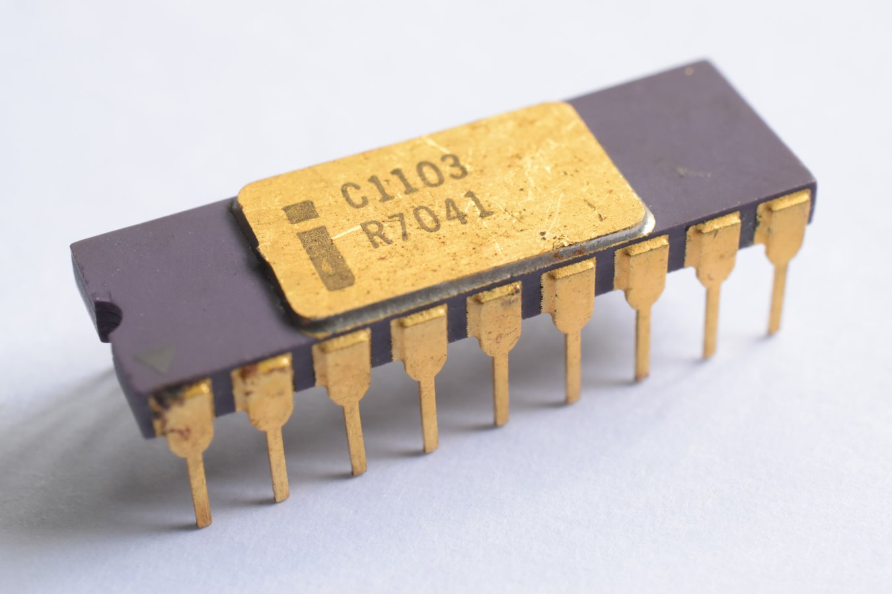

	Intel 1103 DRAM

	</captioned>

- 1970: Pascal Programming Language

    Swiss computer scientist, **Niklaus Wirth**, created **Pascal** as a language for **teaching structured programming**. Pascal became a commercial and educational success, later influencing the engineering of modern languages like Ada, C++, and Java.

	<captioned>

	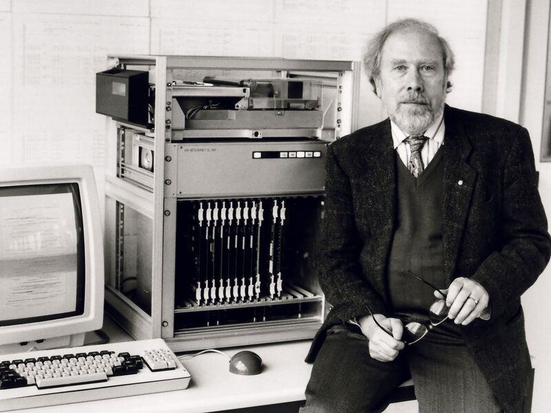

	Niklaus Wirth

	</captioned>

- 1971: Intel 4004 Microprocessor

	**Intel**'s **4004 microprocessor** put a central processing unit on a single **integrated circuit (IC)** chip. It was a 4-bit system, running at 750kHz, and priced at US$60 (equivalent to $500 today)

	<captioned>

	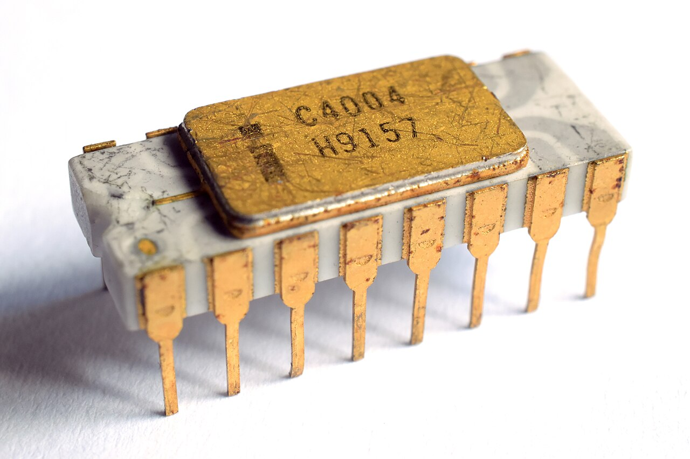

	Intel 4004 microprocessor

	</captioned>

- 1971: Floppy Disk

	**IBM** engineers led by **Alan Shugart** developed the **floppy disk**, making it easier to move software and data between computers. The original floppy disks were **8 inches** in diameter and held **80kB** on a thin disk of coated plastic, protected by a plastic shell.

	<captioned>

	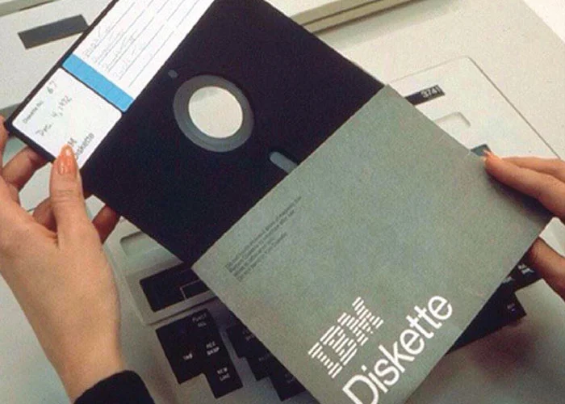

	8 inch floppy disk

	</captioned>

- 1971: Email

	**Ray Tomlinson** sent the **first mail message** between two computers on the ARPANET, introducing the now-familiar address syntax with the '**@**' symbol designating the user's system address. He chose '@' since it was a rarely used keyboard character. By 1973, email made up most of ARPANET traffic.

	<captioned>

	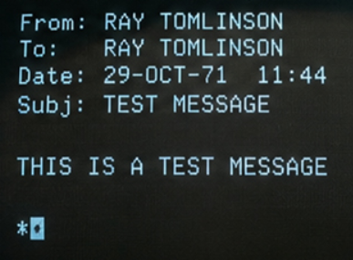

	The first email

	</captioned>

- 1971: ARPANET Reaches 15 Nodes

	**ARPANET** had grown from its first four nodes to about **15 sites** and **23 host computers**. Researchers used it for remote login, file transfer and sharing access to expensive mainframes.

	<captioned>

	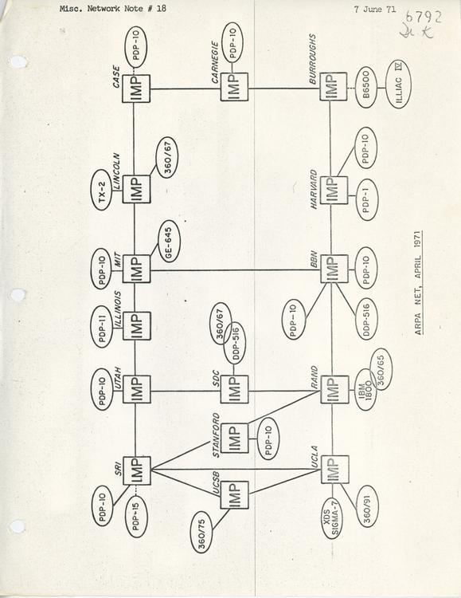

	ARPANET in 1971

	</captioned>

- 1972: C Programming Language

	**Dennis Ritchie** and colleagues began developing the C programming language at **Bell Labs** in 1969 as they worked on **UNIX**. However, most of its development occurred in 1972.

    Its small runtime, compiled code and direct access to memory made it useful for **operating systems** and **embedded devices**. C became the main implementation language for UNIX and strongly influenced C++, Java and many later languages.

	<captioned>

	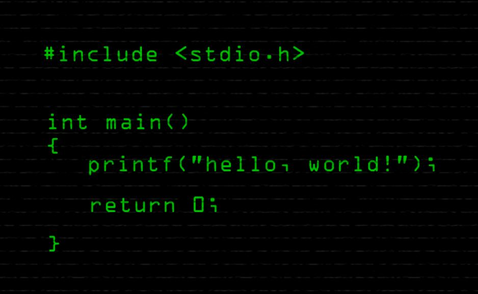

	Hello World in C

	</captioned>

- 1972: Pong Video Game

	**Atari**'s **Pong** was one of the first commercially successful **arcade video games**. Its simple paddle-and-ball design helped kick-start the video-game industry.

	<captioned>

	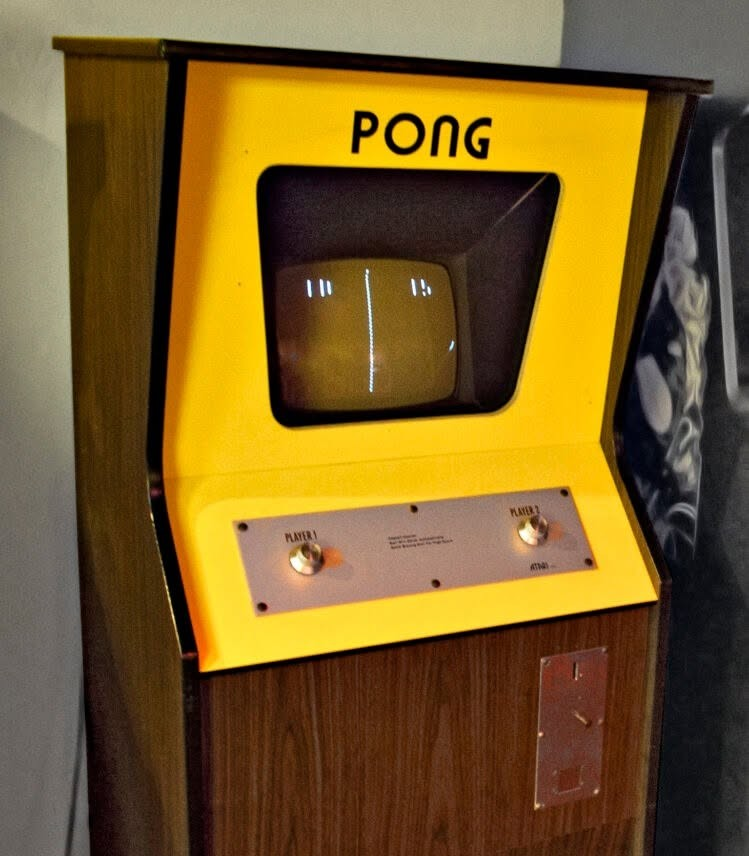

	Pong arcade cabinet

	</captioned>

- 1973: Ethernet Networking

	**Robert Metcalfe** and colleagues developed **Ethernet** at **Xerox PARC** for connecting computers and peripherals. Its **packet-based** design became the dominant wired local-area networking standard, and modern versions make up most of today's wired networks.

	<captioned>

	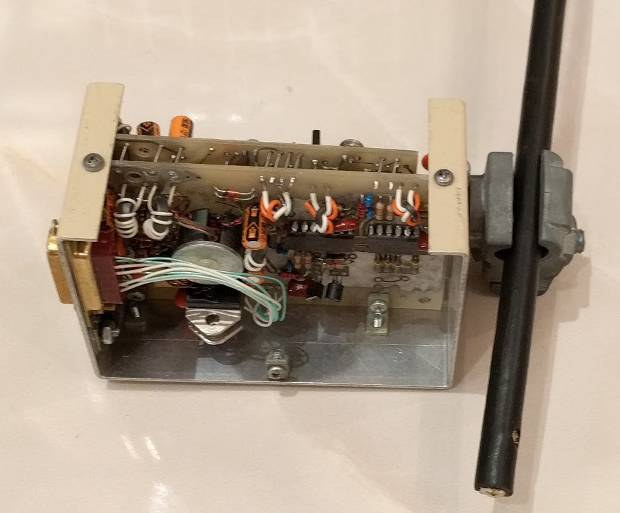

	Early Ethernet 'tap' connector

	</captioned>

- 1973: Xerox Alto

	**Xerox PARC**'s **Alto** computer combined **Ethernet**, a **graphical user interface (GUI)** and a **mouse** in a landmark personal workstation.

    The machine was never sold commercially (it would have cost about US$140,000 in today's money). However, it was the inspiration for Apple's Lisa and Macintosh computers.

	<captioned>

	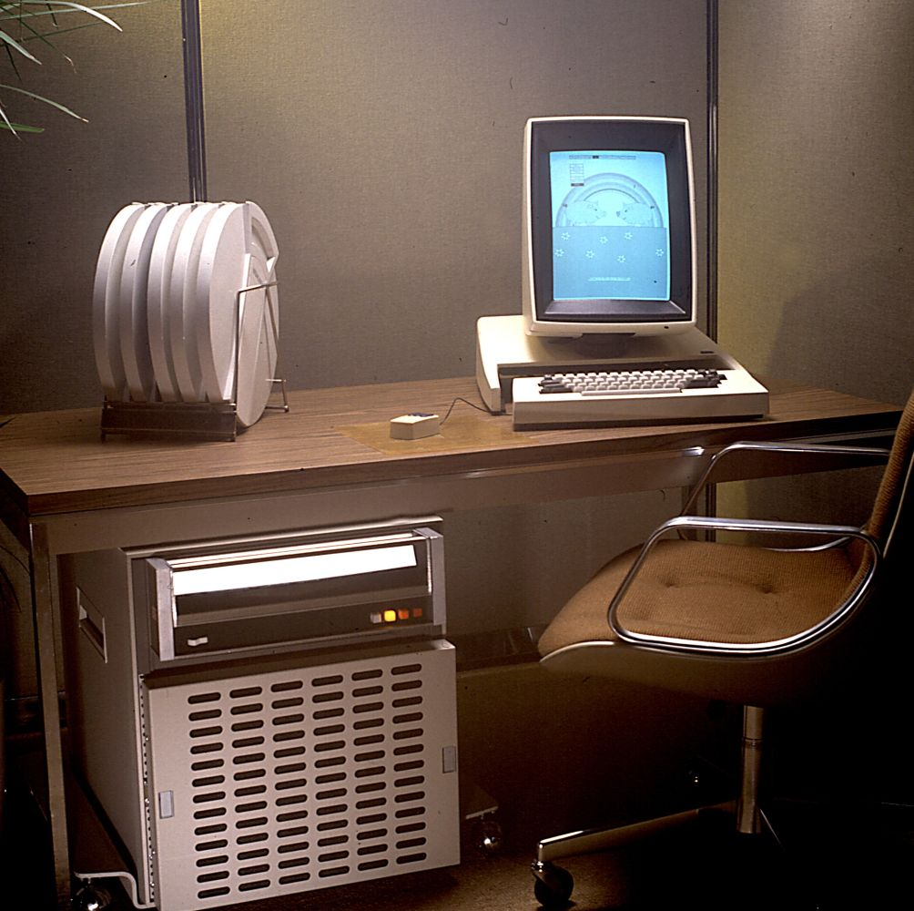

	The Xerox Alto

	</captioned>

- 1973: ARPANET Crosses the Atlantic

	A **satellite link** connected **ARPANET** to NORSAR in Norway, with a further connection to **University College London**. These were the network's first international links and showed that packet-switched networks could span oceans and international borders.

	<captioned>

	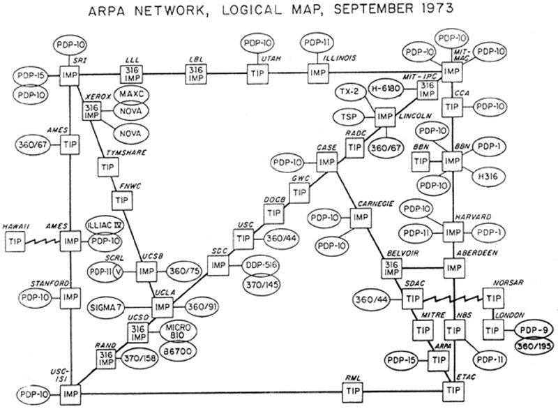

	ARPANET in 1971

	</captioned>

- 1974: Intel 8080 Microprocessor

	The **Intel 8080** was an influential **8-bit microprocessor** that was more powerful and easier to use than the 4004. It became a popular choice for early microcomputers and helped make hobbyist computers practical.

	<captioned>

	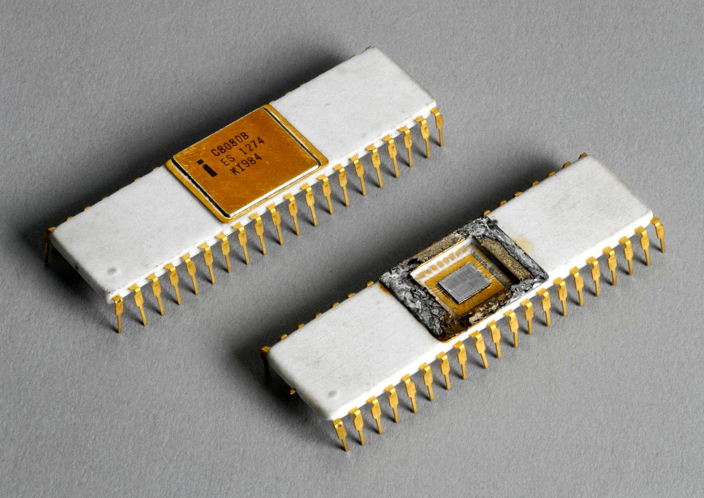

	Intel 8080 microprocessor

	</captioned>

- 1974: CP/M Operating System

	**Gary Kildall** created **CP/M**, an **operating system** for early microcomputers.

    Its standard way of managing files and running programs helped different computers use the same, written for CP/M software, and it became an important influence on later personal-computer operating systems.

	<captioned>

	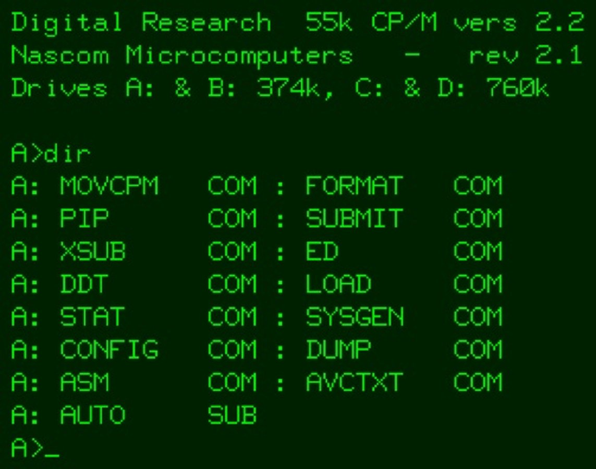

	CP/M running on a Nascom

	</captioned>

- 1974: TCP is Proposed

	**Vint Cerf** and **Bob Kahn** described the **Transmission Control Protocol**, which allowed separate computer networks to exchange data reliably. Their work became part of the **TCP/IP** architecture still used by every device connected to the Internet.

	<captioned>

	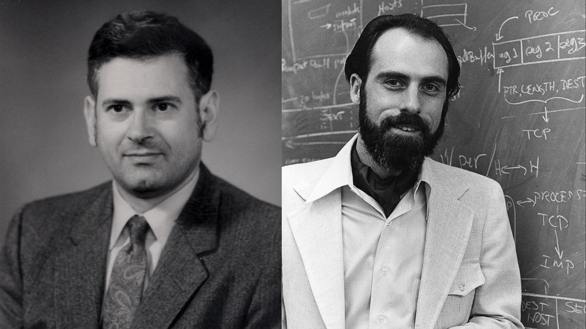

	Bob Khan and Vint Cerf

	</captioned>

- 1975: Altair 8800

	The **Altair 8800** was one of the **first successful commercial microcomputers**. It was sold as a **kit** and helped launch the hobbyist computer movement.

	<captioned>

	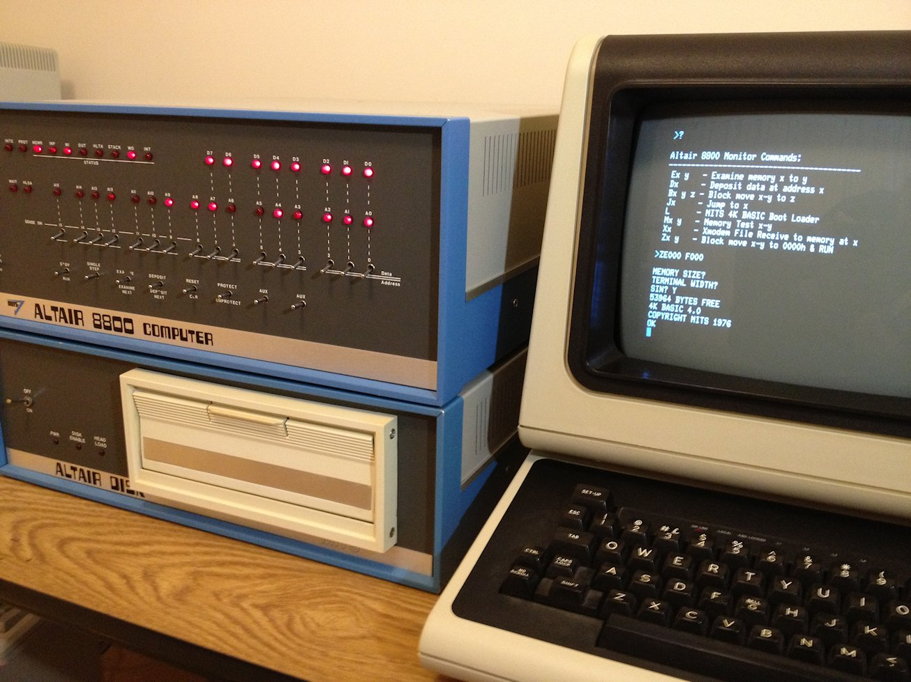

	Altair 8800 computer

	</captioned>

- 1975: IBM 5100

	The **IBM 5100** was a **portable**, **all-in-one** computer with a 1.9MHz 16-bit PALM processor, up to 64kB of RAM, a screen, keyboard and tape drive. Its cartridge tape could store about 204kB, showing that small computers could be useful outside large data centres.

	<captioned>

	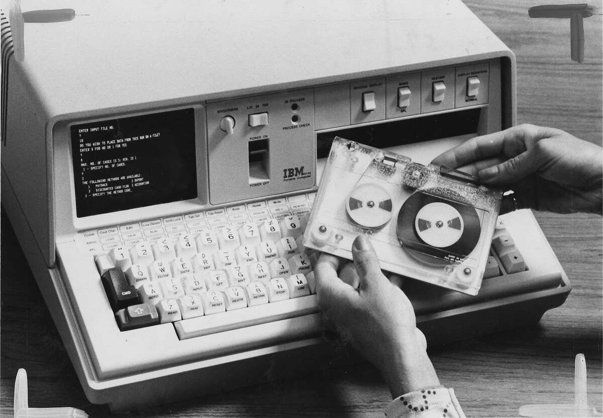

	IBM 5100

	</captioned>

- 1975: Microsoft Begins

	After writing a 4kB BASIC interpreter for the Altair 8800, **Paul Allen** and **Bill Gates** formed **Microsoft**. Software became a major part of the emerging personal-computer industry, with Microsoft supplying languages, operating systems and applications.

	<captioned>

	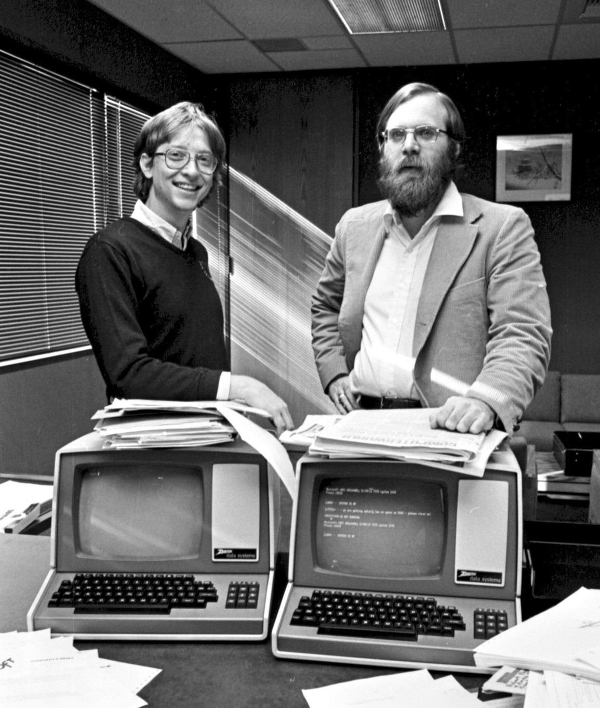

	Paul Allen and Bill Gates

	</captioned>

- 1976: Apple I

	**Steve Wozniak** designed the **Apple I** and **Steve Jobs** helped sell it as a single-board computer under the name of **Apple Computers**. Buyers supplied their own keyboard, display and power supply, but its simple design showed that a personal computer could be built around a microprocessor.

	<captioned>

	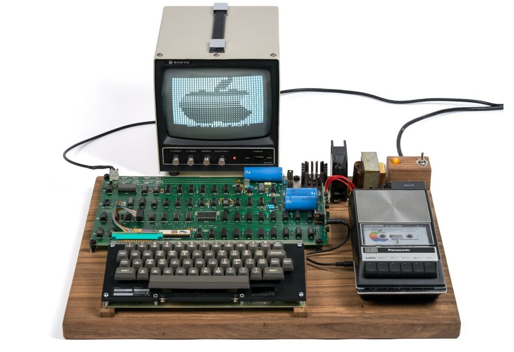

	An Apple I main board with peripherals

	</captioned>

- 1977: TRS-80

	The **TRS-80 Model I** used a 1.77MHz Z80 processor, 4kB of RAM and a television or monitor for display. Sold through **RadioShack** in the US, it was one of the **first mass-market home computers** and helped bring programming into homes and schools.

	<captioned>

	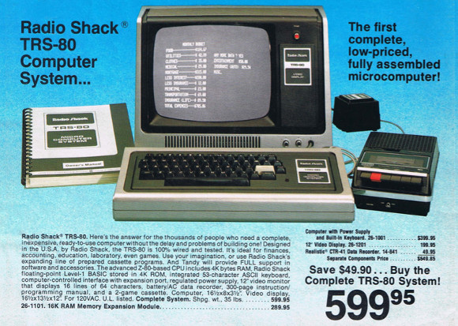

	TRS-80 Model I

	</captioned>

- 1977: Commodore PET

	The **Commodore PET** combined a 1MHz 6502 processor, 4kB of RAM, **keyboard**, **display** and **cassette storage** in a single case. It was among the **first complete personal computers** sold to schools and businesses.

	<captioned>

	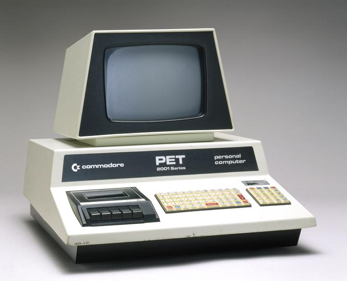

	Commodore PET

	</captioned>

- 1977: Apple II

	The **Apple II** used a 1MHz 6502 processor, launched with 4kB of RAM that could be expanded to 48kB, and included **colour graphics**, **sound** and **cassette storage**. Its approachable design and large software library made it one of the **first mass-market successes in personal computing**. It remained popular in homes, schools and businesses throughout the 1980s.

	<captioned>

	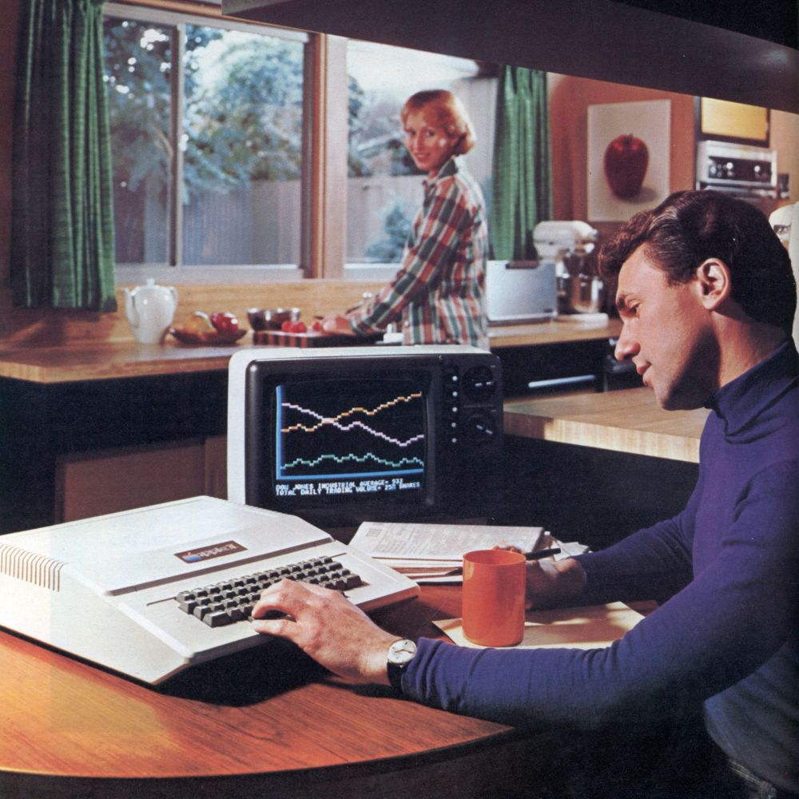

	Apple II

	</captioned>

- 1977: Inter-Networking Demonstration

	A demonstration linked **ARPANET** with **packet-radio** and **satellite** networks. The systems used gateways and **common protocols** to communicate without becoming one single physical network, **proving the central idea behind the Internet**.

	<captioned>

	

	ARPANET in 1977

	</captioned>

- 1977: New Zealand's Research Network

	New Zealand's **Department of Scientific and Industrial Research (DSIR)** connected research organisations using **PDP-11** and **LSI-11** computers over **leased telephone circuits**. This early national network helped researchers share programs, data and access to distant computers.

	<captioned>

	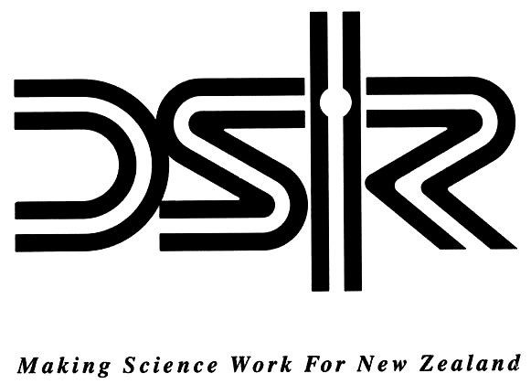

	The DSIR 1970s logo

	</captioned>

- 1978: Intel 8086 Processor

	The **Intel 8086** was a 16-bit microprocessor whose instruction set became the foundation of the **x86** family, leading on to the 80186, 80286, 80386, 80486 and the Pentium series.

    The compatible **8088** was later used in the **original IBM PC**, linking Intel's processor design to the dominant personal-computer standard.

	<captioned>

	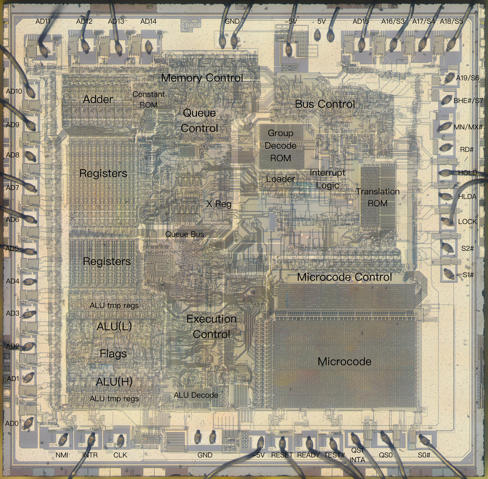

	The silicon die of the 8086

	</captioned>

- 1979: WordStar

	**MicroPro** released **WordStar** for **CP/M** systems, one of the first popular **word processors**. Word wrap, margins, search and printing made computers useful for everyday writing.

	<captioned>

	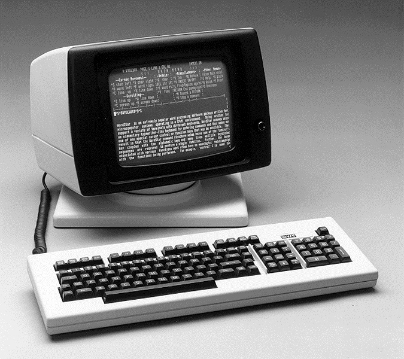

	WordStar running on a Wyse terminal

	</captioned>

- 1979: VisiCalc Spreadsheet

	**Dan Bricklin** and **Bob Frankston** created **VisiCalc**, the first widely successful **spreadsheet** program. Users could change one value and have related calculations update automatically, making personal computers valuable tools for businesses. Visicalc was so popular it was one of the key drivers of **Apple II** sales.

	<captioned>

	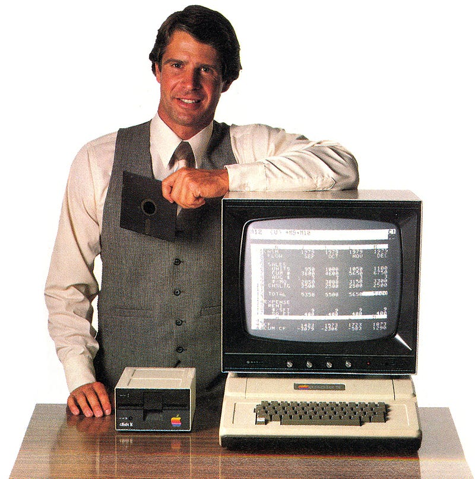

	Visicalc, the 'killer app' for the Apple II

	</captioned>

</timeline>

<pagination class="bottom">

- [Early](/history/pre.md)
- [1940s](/history/1940s.md)
- [1950s](/history/1950s.md)
- [1960s](/history/1960s.md)
- 1970s
- [1980s](/history/1980s.md)
- [1990s](/history/1990s.md)
- [2000s](/history/2000s.md)
- [2010s](/history/2010s.md)
- [2020s](/history/2020s.md)
- [Future](/history/future.md)

</pagination>

