# 1980s - The Rise of the Personal Computer

<pagination>

- [Early](/history/pre.md)
- [1940s](/history/1940s.md)
- [1950s](/history/1950s.md)
- [1960s](/history/1960s.md)
- [1970s](/history/1970s.md)
- 1980s
- [1990s](/history/1990s.md)
- [2000s](/history/2000s.md)
- [2010s](/history/2010s.md)
- [2020s](/history/2020s.md)
- [Future](/history/future.md)

</pagination>

The 1980s was a boom time for **personal computers**; computers became mass-market consumer devices. Computing giant IBM launched the **IBM PC**, setting a hardware standard that many manufacturers copied. The 1984 launch of the **Apple Macintosh** popularised the **graphical user interface (GUI)** and the computer **mouse** for everyday consumers.

This decade also brought a **video-game boom**, some of the first **portable** computers and the adoption of the **Internet protocol suite (TCP/IP)** across networks.

<timeline>

- 1980: First 'Spacie Parlours' in New Zealand

    Coin-operated **video game arcades**, or '**Spacie Parlours**', like **Space World in Auckland** and **Wizards in Christchurch**, were regular haunts for children and teenagers in the 1980s. Though the games were largely played by individuals or two players at the most, spending time in the arcade was a social experience because lots of other people congregated there, playing, watching and talking.

	<captioned>

	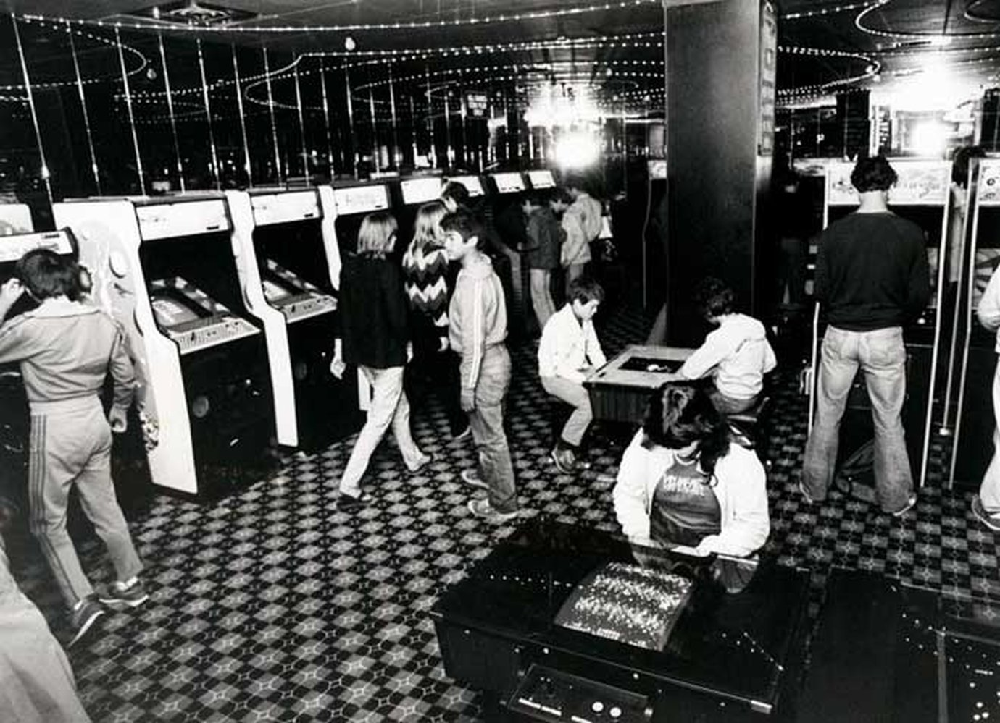

	Space World in Auckland

	</captioned>

- 1980: Osborne 1

	The **Osborne 1** was an early **portable** computer with a 4MHz Zilog Z80 CPU, 64kB of RAM, two 5.25-inch floppy drives and a 5-inch screen. Although it weighed about 12kg (it was often referred to as '**luggable**', rather than portable!) and cost US$1,795, its suitcase-sized form showed that computers did not always have to stay in a room.

	<captioned>

	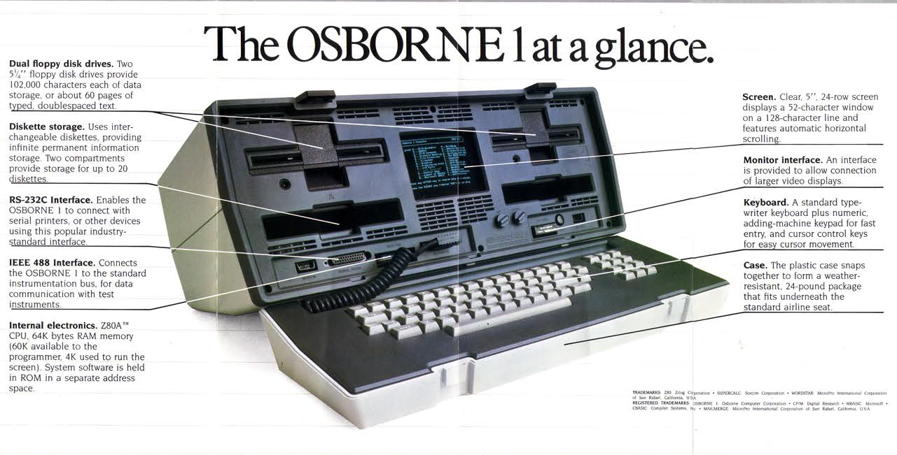

	Osborne 1

	</captioned>

- 1980: ZX-80

	**Sinclair**'s **ZX80** was an inexpensive home computer with a 3.25MHz Z80 CPU, 1kB of RAM and 4kB of ROM, and used a television as its display.

    When it launched in the UK at £79.95 as a kit or £99.95 ready-built it was ground-breaking: "**The first computer for under £100**". The ZX-80 helped make programming affordable for families.

    The tiny 1kB of memory was partly used by the video text buffer. With a full screen of text, you would only have about 200 bytes left for actual program code.

	<captioned>

	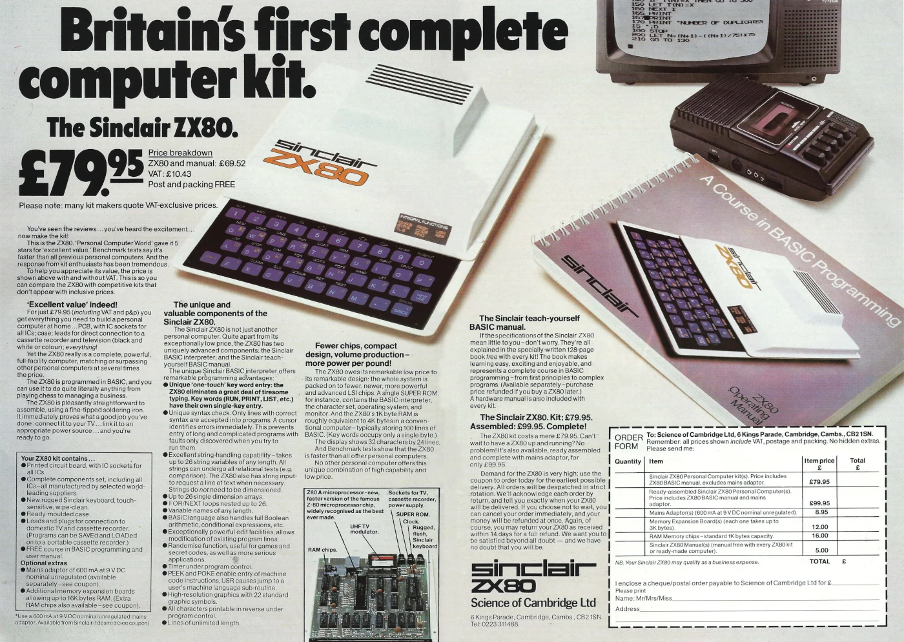

	Ad for the Sinclair ZX80

	</captioned>

	<captioned>

	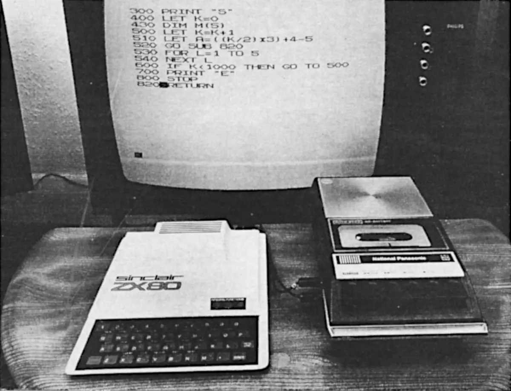

	BASIC coding on a ZX80

	</captioned>

- 1980: Seagate ST-506 Hard Disk Drive

	The first consumer-grade **hard disk drive** for **personal computers** was the **Seagate ST-506**, released in 1980. It had a capacity of **5MB**, using a stack of spinning metal platters housed in a 5.25 inch enclosure. It cost US$1,500 at launch.

	<captioned>

	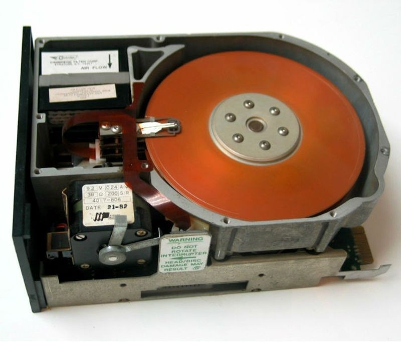

	Seagate ST-506 HDD

	</captioned>

- 1981: ZX-81

	The **ZX81** improved upon the previous year's ZX80, using a 3.25MHz Z80 CPU, 1kB of RAM and 8kB of ROM. It launched in the UK at **£49.95** as a kit or £69.95 ready-built and sold in large numbers, further helping turn home computers into a British mass-market hobby.

	<captioned>

	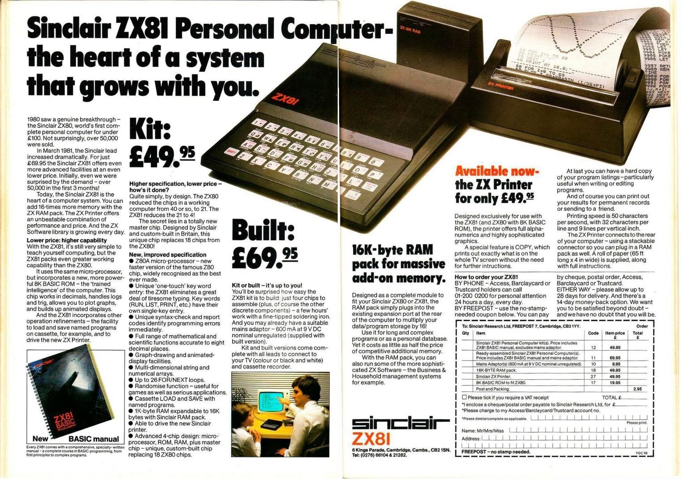

	Ad for the Sinclair ZX81

	</captioned>

- 1981: IBM PC 5150

	**IBM** introduced its first personal computer, the **IBM PC 5150**, with a 4.77MHz Intel 8088 processor, 16kB of RAM, floppy-disk storage and **Microsoft's MS-DOS** as its operating system. It cost US$1,500, equivalent to US$5,500 today).

    The IBM PC helped popularise the term '**PC**' and proved extremely popular with businesses for whom IBM was a trusted name. It created a widely copied hardware standard, most other manufacturers ensuring their PCs were fully compatible with IBM's machine.

	<captioned>

	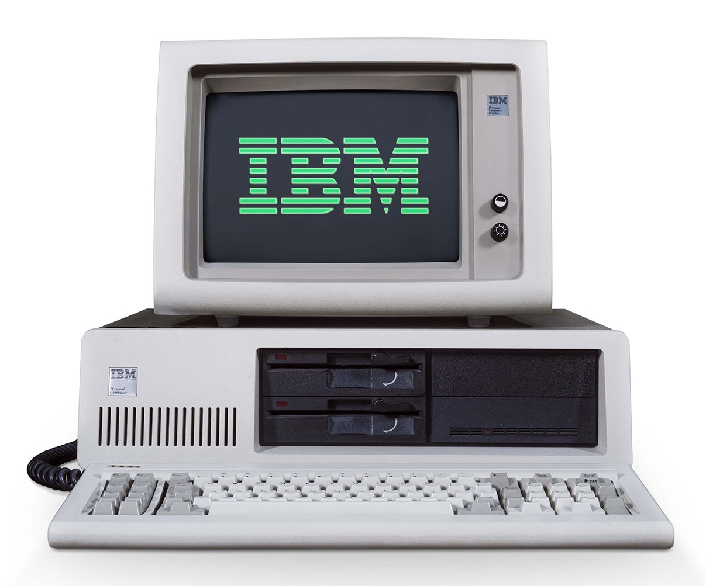

	IBM PC 5150

	</captioned>

- 1982: ZX Spectrum

	The **ZX Spectrum** used a 3.5MHz Z80A CPU, colour graphics and 16kB or 48kB of RAM. It launched in the UK at **£125** for the 16K model and £175 for the 48K model, becoming **one of Britain's most popular home computers**, mainly due to the huge range of games available for it, and introduced many more people to programming through the built-in BASIC programming language.

	<captioned>

	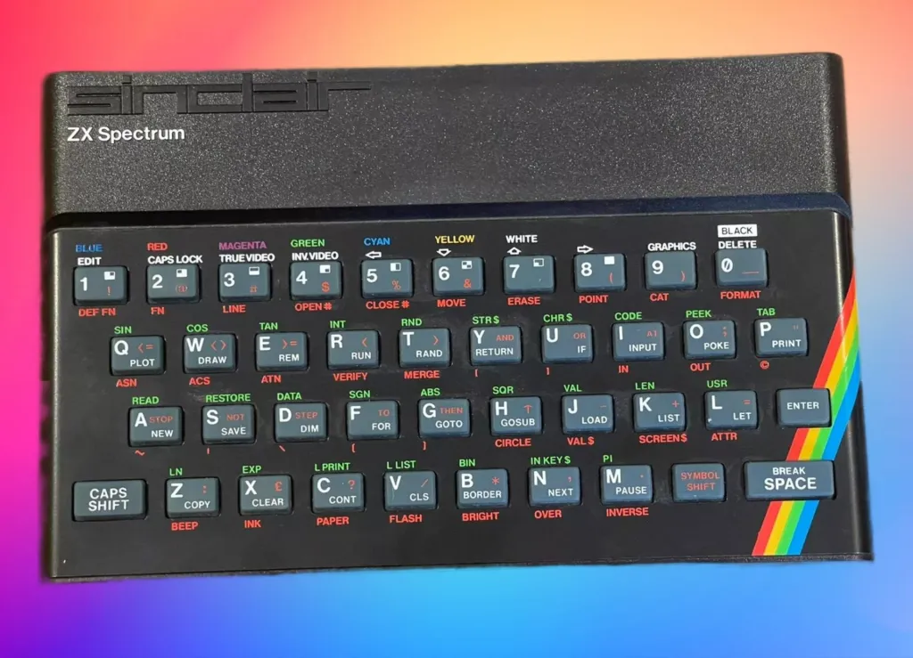

	Sinclair ZX Spectrum

	</captioned>

- 1982: Commodore 64

	The **Commodore 64** used a 1MHz 6510 CPU, 64kB of RAM, a colour graphics chip and the SID programmable sound chip. It became the **highest-selling single desktop computer model of all time**, selling over 20 million units worldwide. Its colour graphics, sound and large software library made it popular for both games and programming.

	<captioned>

	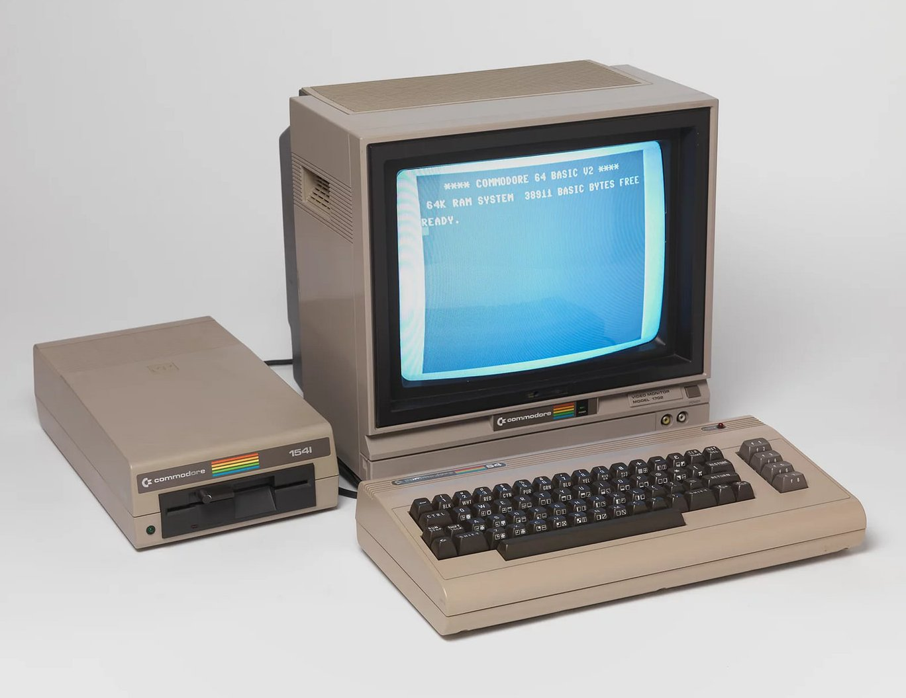

	Commodore 64

	</captioned>

- 1982: Epson HX-20

	The **Epson HX-20** was an early **battery-powered portable computer**, with a small **screen**, **keyboard**, built-in **printer** and **cassette storage**. Despite its tiny screen, it proved very popular and showed the direction portable computing would take.

	<captioned>

	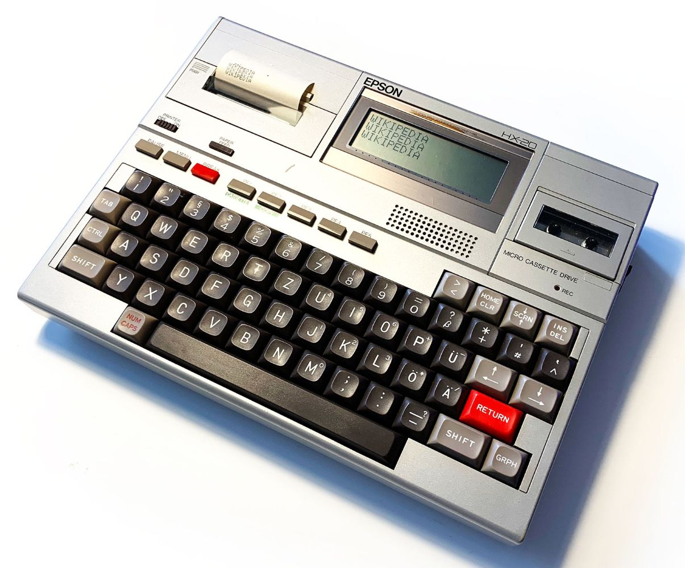

	Epson HX-20

	</captioned>

- 1982: Grid Compass

	The **Grid Compass** was an influential **clamshell portable computer**. Its flat design and screen-over-keyboard arrangement became a model for later laptops. Grid Compass computers flew aboard NASA's **Space Shuttle**, chosen because of its rugged metal case and its use of a solid-state memory instead of a rotating disk.

	<captioned>

	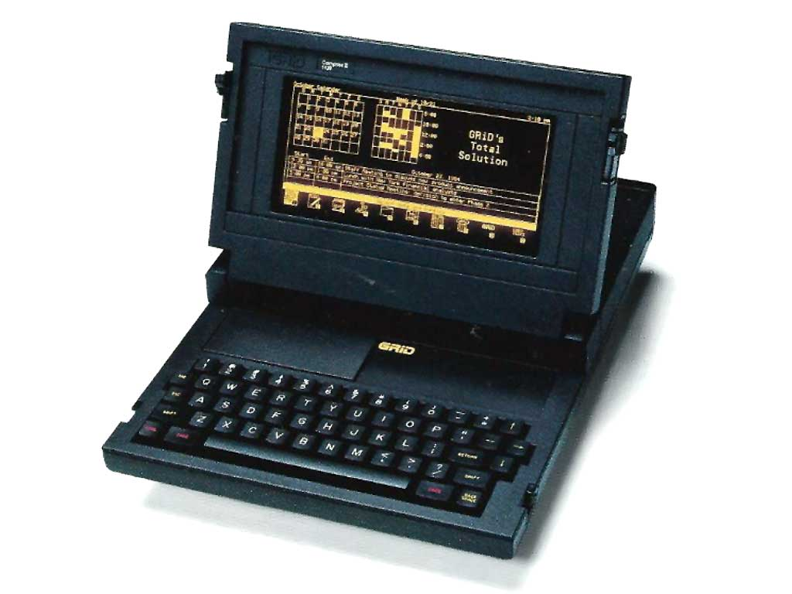

	Grid Compass

	</captioned>

- 1983: Apple Lisa

	**Apple**'s **Lisa** used a 5MHz Motorola 68000 processor and introduced a **graphical interface with icons, windows and pull-down menus** (inspired heavily by the Xerox Alto which Apple engineers had seen demonstrated). Later Lisa models supported up to 1MB of RAM and a 5MB hard drive, but its high price limited sales, costing US$10,000 equivalent to US$30,000 today.

	<captioned>

	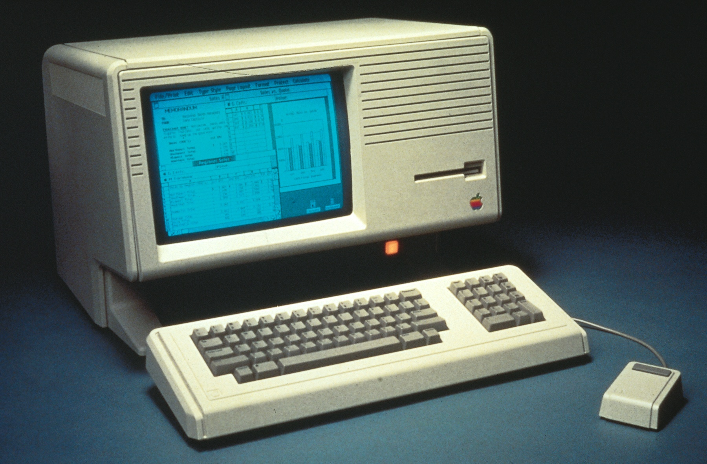

	Apple Lisa

	</captioned>

- 1983: Motorola DynaTAC 8000X Mobile

	**Motorola**'s **DynaTAC 8000X** became the **first commercially available handheld mobile phone**. It weighed about 800g, offered roughly 30 minutes of talk time and needed about 10 hours to recharge, but at the time was revolutionary.

	<captioned>

	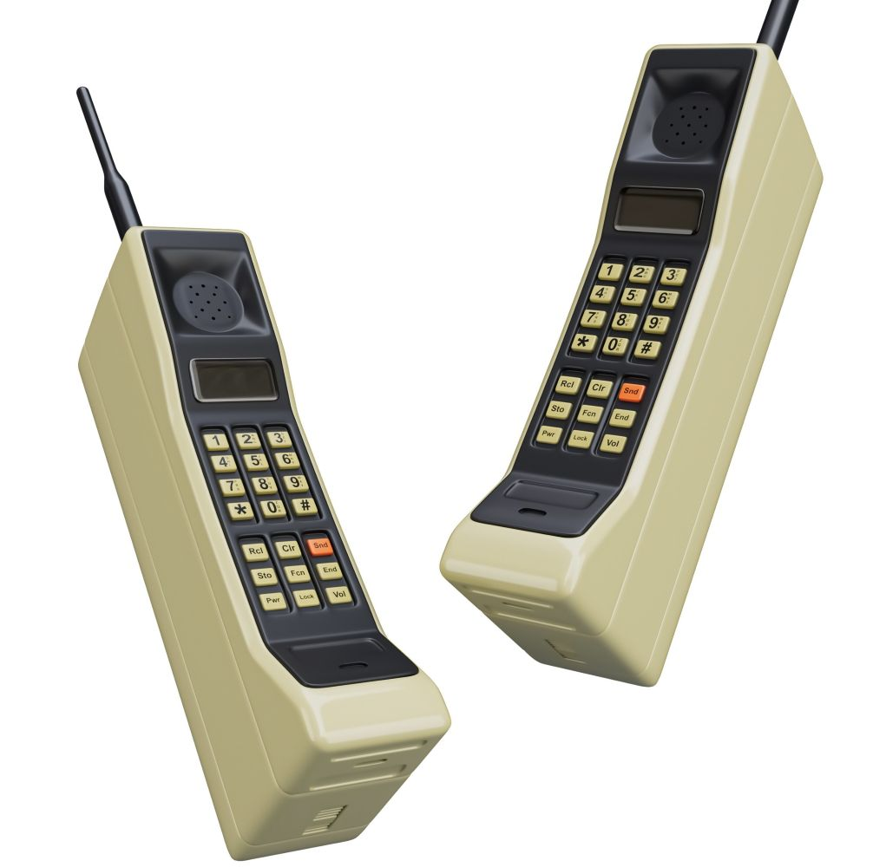

	Motorola DynaTAC 8000X

	</captioned>

- 1983: C++ Programming Language

	**Bjarne Stroustrup** began developing **C++** (originally called "C with Classes") by extending C with **classes** and **object-oriented programming** features. It became a major language for systems, games and application software while retaining C's speed and low-level control, and modern versions are still widely used today.

	<captioned>

	

	Bjarne Stroustrup, creator of C++

	</captioned>

- 1983: ARPANET Adopts TCP/IP

	**ARPANET** switched to **TCP/IP** on 1 January 1983. **TCP** handled **reliable delivery** between applications, while **IP** **addressed and routed packets** between networks. Together they allowed different networks to interconnect and became the foundation of the modern Internet.

	<captioned>

	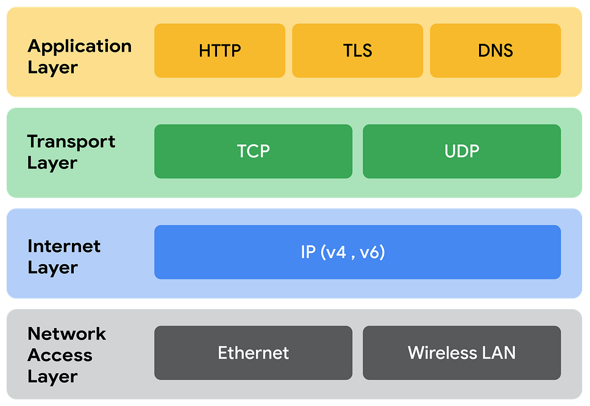

	TCP/IP protocol suite

	</captioned>

- 1983: The GNU Project

	**Richard Stallman** announced the **GNU Project**, which aimed to build a complete **operating system** from **freely shared software**. GNU is a recursive acronym, standing for 'GNU is Not Unix'.

    GNU established important ideas about **software freedom**, creating the **GNU General Public License (GPL)**, now the most widely used free and open-source software copy-left license in the world, and later provided many tools used with the **Linux** kernel.

	<captioned>

	

	Richard Stallman and GNU

	</captioned>

- 1983: Domain Name System

	The **Domain Name System (DNS)** was introduced to map memorable names such as `example.com` to numerical **IP addresses**, acting a little like a '**phone book**' for networks.

    Created primarily by **Paul Mockapetris**, DNS replaced the need to keep a manually maintained hosts file on your computer, with a distributed, hierarchical naming system.

	<captioned>

	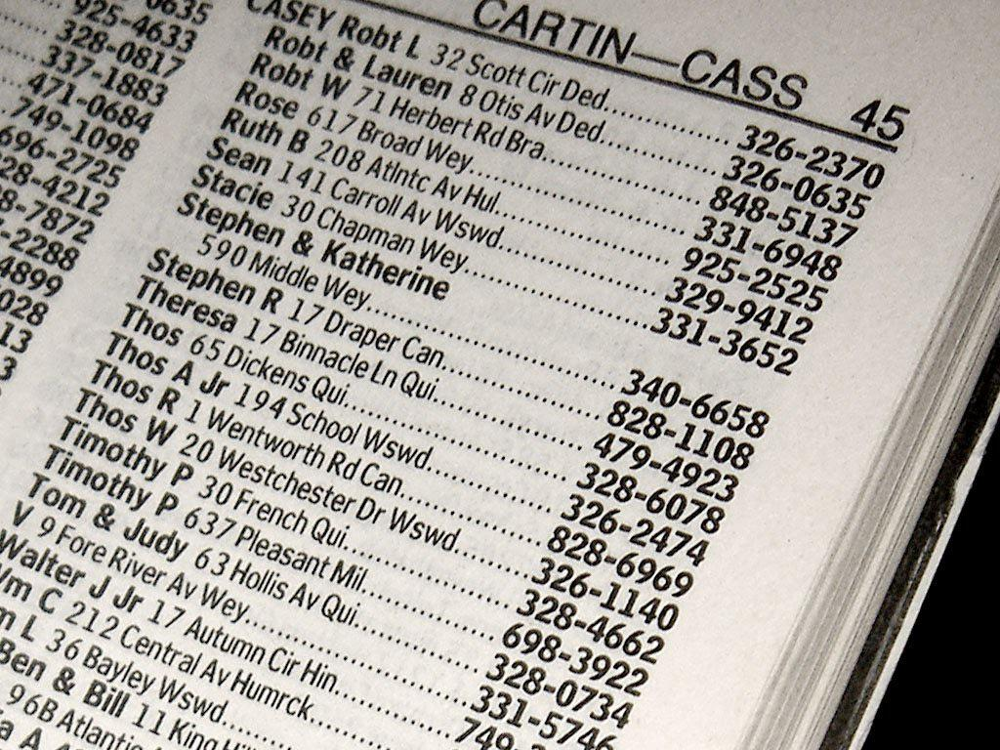

	Connecting names to numbers

	</captioned>

- 1984: Internet Reaches 1,000 Connected Computers

	The number of computers recorded in the **Internet**'s host tables passed **1,000** for the first time in 1984 (connected **computers**, not people). The  network was growing beyond its original research community.

	<captioned>

	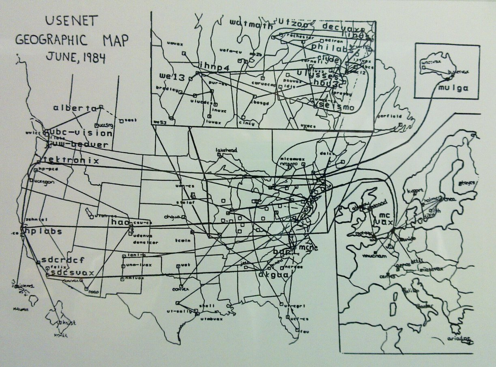

	Truly an Inter-Net

	</captioned>

- 1984: Macintosh 128k

	**Apple** released the **Macintosh** with an 8MHz Motorola 68000, a 9-inch screen, 128kB of memory and a 400kB floppy drive. Its **graphical user interface (GUI)** and **mouse** made it easy to use but its small memory limited what software it could run. The Macintosh popularised graphical computing for consumers, although its relatively high price (US$2,500, US$8,000 today) meant it had trouble competing with cheaper IBM PC clones.

	<captioned>

	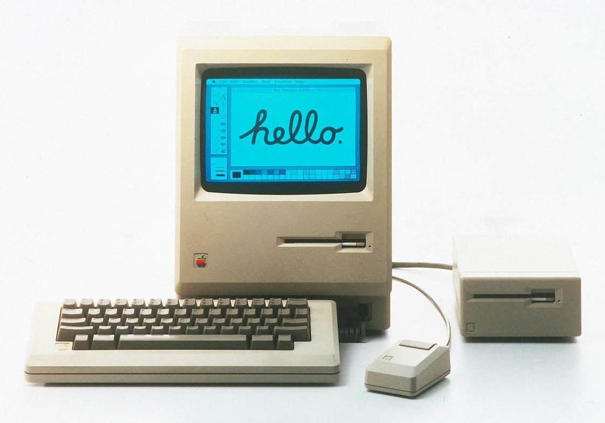

	Macintosh 128K

	</captioned>

- 1984: IBM PC Portable

	**IBM**'s **PC Portable** moved PC-compatible hardware into a **transportable** case. It was heavy, but it helped establish demand for computers that could leave the office.

	<captioned>

	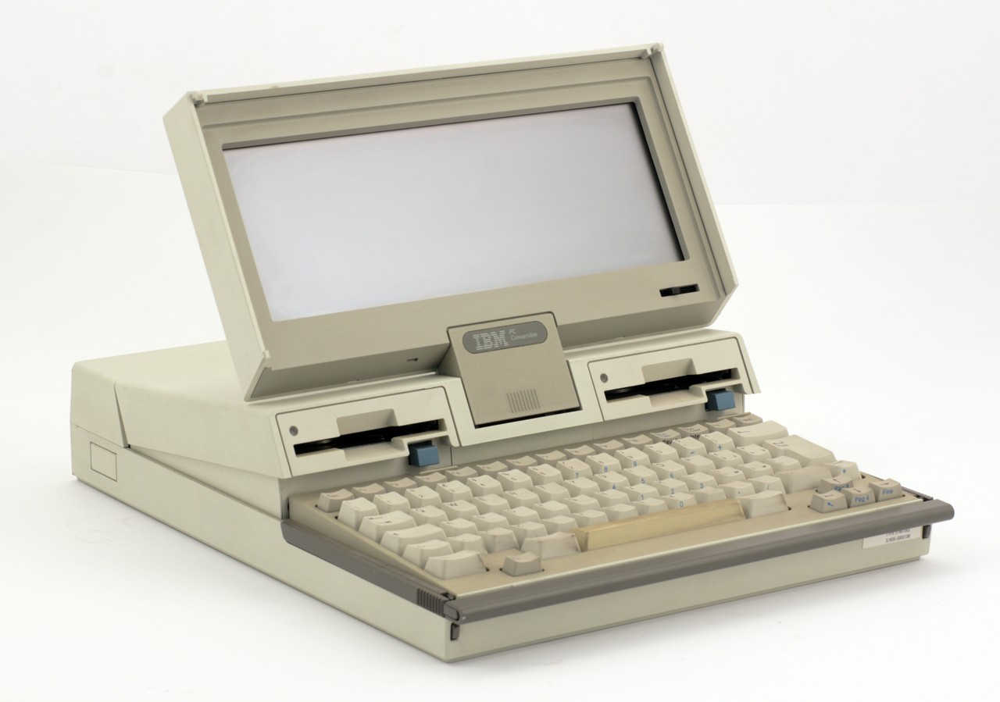

	IBM PC Portable

	</captioned>

- 1984: CD-ROM

	Audio CDs had been around for some years, but using the medium for data was new. **CD-ROM** technology offered a large, durable medium for distributing software and reference material. A standard disc stored **550-650MB**, far more than a floppy disk's 1.44MB.

	<captioned>

	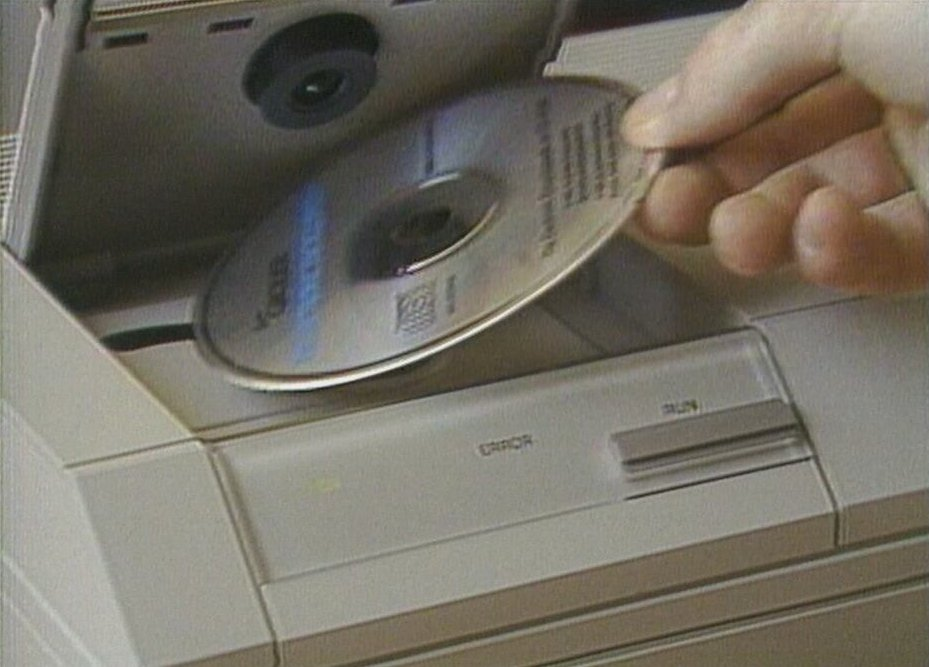

	Early CD-ROM drive

	</captioned>

- 1985: Windows 1.0

	**Microsoft** released **Windows 1.0** as a **graphical** environment running on top of **MS-DOS**. It provided **mouse** support, drop-down **menus**, limited **multi-tasking** and basic apps like a calculator. Windows could not overlap, so it was quite impractical to use. However, it was the first step on Microsoft's Windows journey.

	<captioned>

	

	Windows 1.0

	</captioned>

- 1985: Amiga 1000

	**Commodore**'s **Amiga 1000** used a 7.16MHz Motorola 68000, 256kB of RAM and custom chips for graphics and sound. It stood out for displaying up to **4,096 colours** and playing **digital audio** at a time when most home computers had much simpler hardware.

	<captioned>

	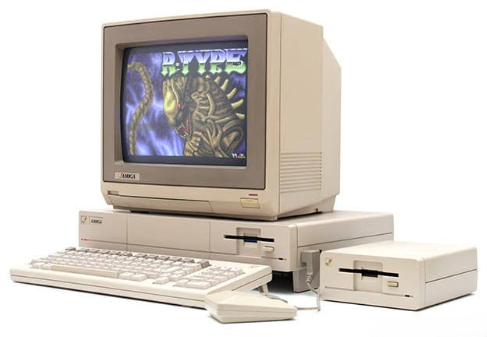

	Amiga 1000

	</captioned>

- 1987: Internet Reaches 10,000 Connected Computers

	The number of known **Internet** hosts passed **10,000** for the first time as more universities, research organisations and emerging network providers joined the inter-connected network.

	<captioned>

	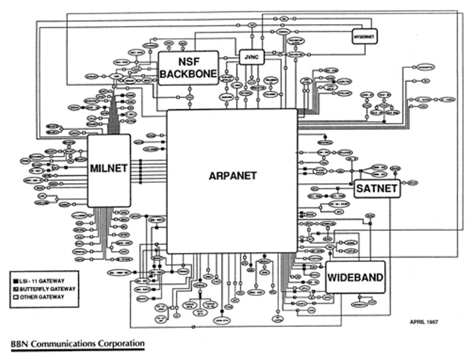

	Internet in 1987 - Interconnected

	</captioned>

- 1988: The Morris Worm

	**Robert Morris**, a 23-year-old Cornell University graduate student, created a computer '**worm**' (**software that could travel via network links**) as an experiment. Unfortunately, the worm spread right across the early Internet, far quicker than he expected, disrupting systems worldwide at great cost. The experience did help establish **computer security** as a major concern.

	<captioned>

	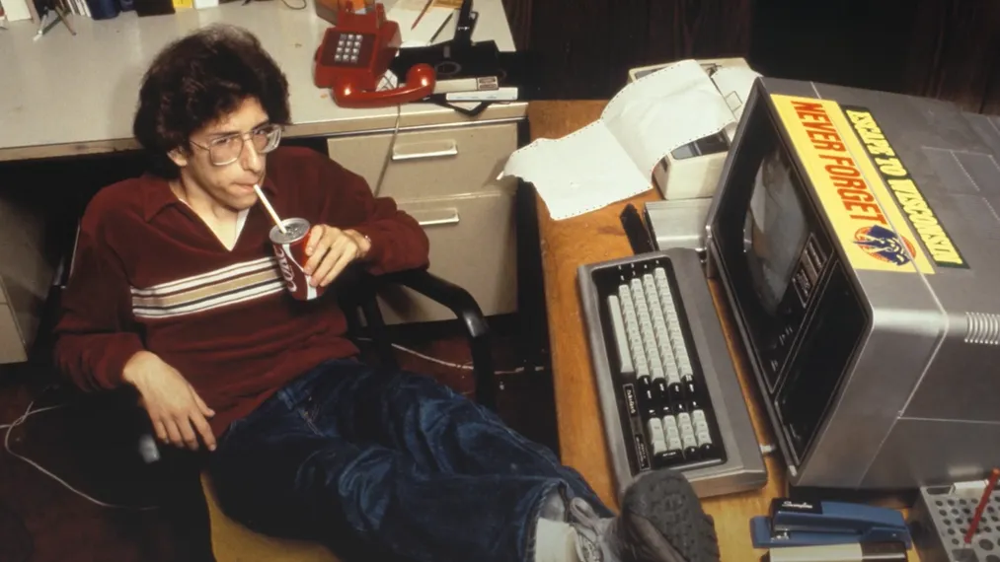

	Robert Morris

	</captioned>

- 1988: NeXT Computer

    The **NeXT Computer** was a high-end workstation housed in a 30cm black magnesium cube. It combined a powerful Motorola 68030 processor, a built-in **digital signal processor (DSP)**, integrated **magneto-optical drive** for primary storage. Its launch price was US$6,500 ($18,500 today).

    **Tim Berners-Lee** used a NeXT Computer at CERN to write **the world's first web browser** (WorldWideWeb) and **host the very first web server**, and NeXT’s innovative object-oriented operating system, NeXTSTEP, became the architecture behind **Mac OS X** (now macOS) and **iOS** after Apple acquired NeXT in 1996.

	<captioned>

	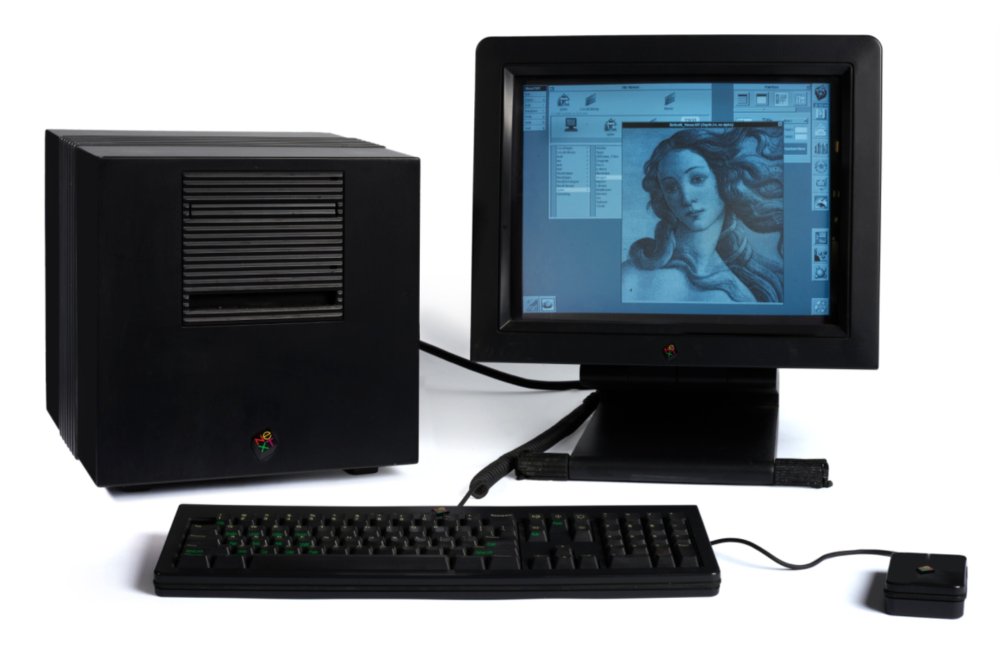

	The NeXT Computer

	</captioned>

	<captioned>

	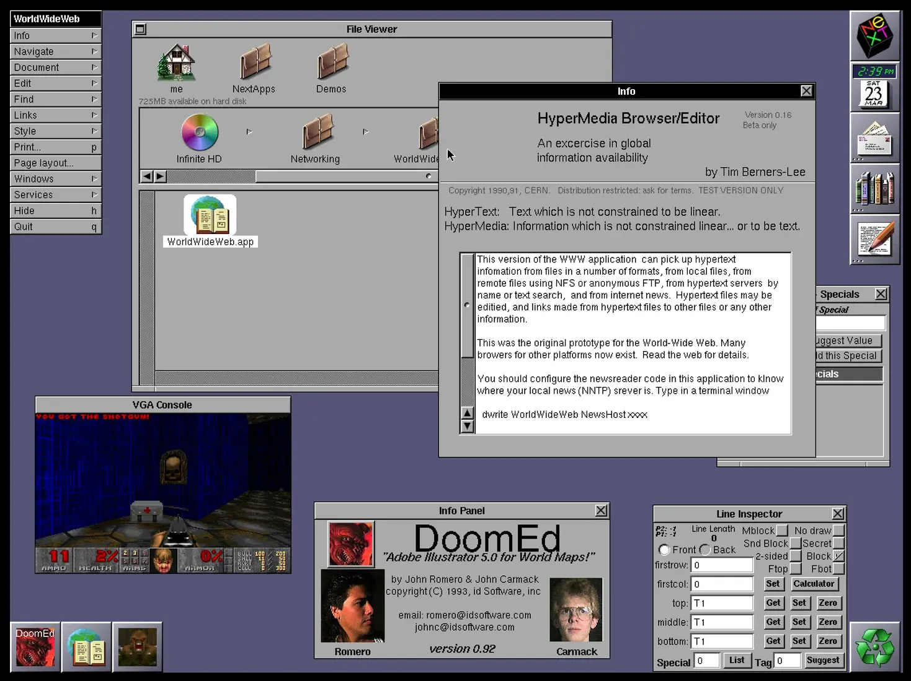

	NeXTSTEP GUI

	</captioned>

- 1989: Game Boy

	**Nintendo**'s **Game Boy** used a low-power 8-bit processor, 8kB of RAM and a 160x144 four-shade display. Its interchangeable cartridges, long battery life and compact size showed how a simple, hand-held computer could become a mass-market games platform.

	<captioned>

	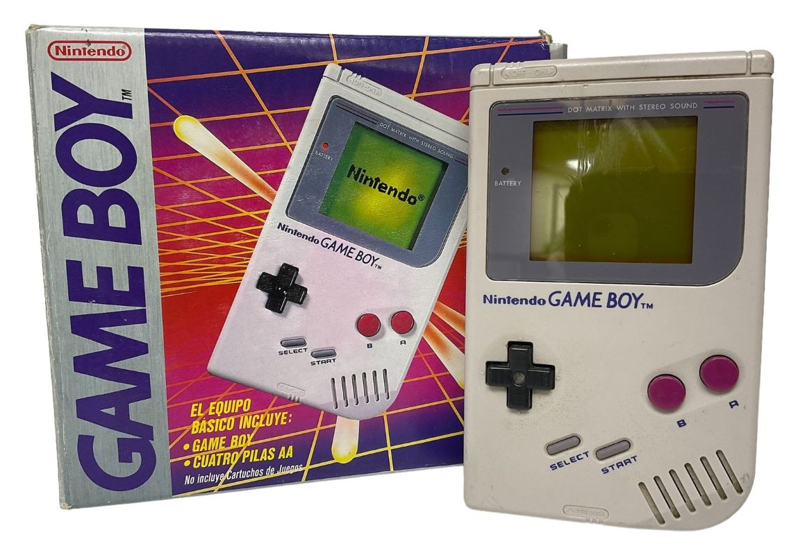

	Nintendo Game Boy

	</captioned>

- 1989: The World Wide Web is proposed

	**Tim Berners-Lee** proposed the **World Wide Web** at **CERN**, combining **hypertext** with **Internet networking** so documents could be linked and accessed across different computers. The proposal was deemed "**Vague but exciting**"!

    The World Wide Web went on to become **the most popular application running over the Internet**. For individuals, its ease-of-use, access to a huge range of information and entertainment, and the ability to self-publish personal web-logs, or 'blogs' made it a truly exciting experience. Businesses realised it could be used for e-commerce, and the number of websites exploded.

	<captioned>

	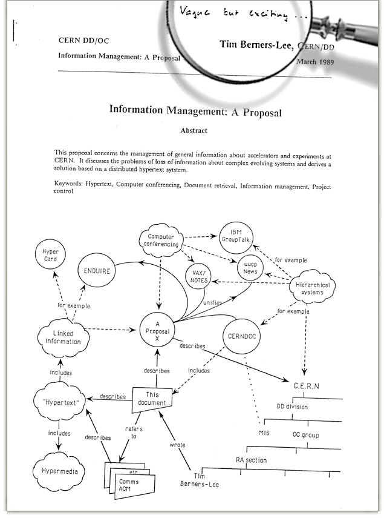

	The World Wide Web proposal

	</captioned>

- 1989: New Zealand Joins the Internet

	**John Houlker** lead a project at the **University of Waikato**, working with IBM and other research organisations, to establish **New Zealand**'s first international **Internet connection**. It linked the University of Waikato to the University of **Hawaii** (and the wider global internet) using the analog **ANZCAN undersea cable**. The connection ran at a blistering **9,600 bits per second**.

	<captioned>

	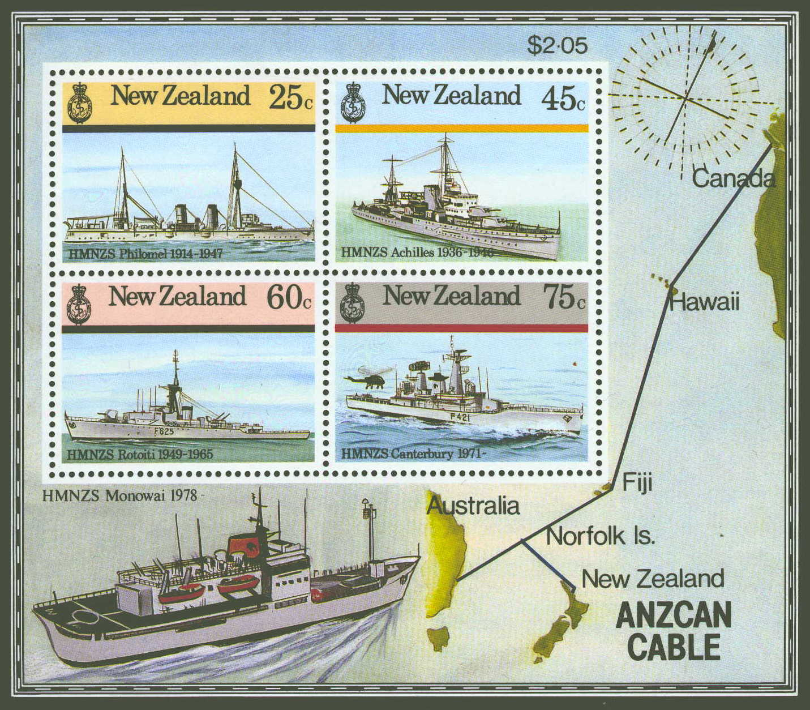

	Stamps celbrating the ANZCAN cable

	</captioned>

</timeline>

<pagination class="bottom">

- [Early](/history/pre.md)
- [1940s](/history/1940s.md)
- [1950s](/history/1950s.md)
- [1960s](/history/1960s.md)
- [1970s](/history/1970s.md)
- 1980s
- [1990s](/history/1990s.md)
- [2000s](/history/2000s.md)
- [2010s](/history/2010s.md)
- [2020s](/history/2020s.md)
- [Future](/history/future.md)

</pagination>

