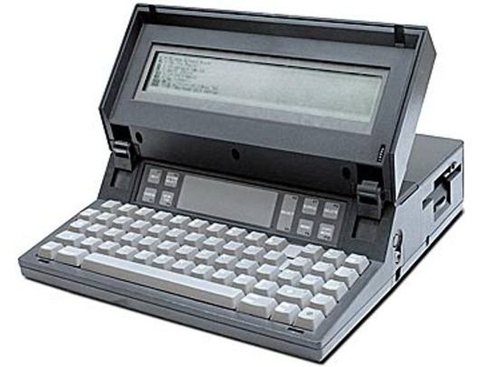
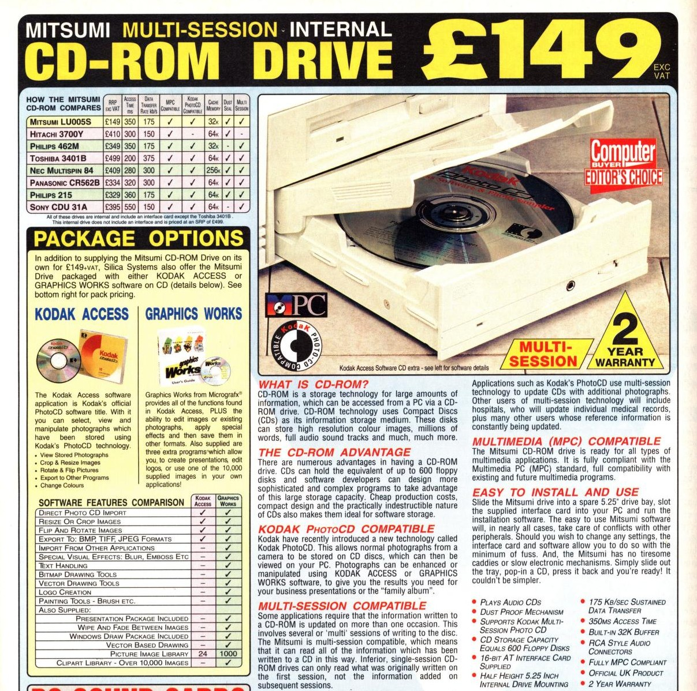

# 1980s - The Rise of the Personal Computer

The 1980s turned computers into mass-market consumer electronics. Computing giant IBM launched the IBM PC, setting a hardware standard that many manufacturers copied. The 1984 launch of the Apple Macintosh popularised the graphical user interface (GUI) and computer mouse for everyday consumers. This decade also brought a video-game boom, portable computing and the public adoption of the Internet protocol suite (TCP/IP).

<timeline>

- 1980: Osborne 1

	The Osborne 1 was an early portable computer with a 4MHz Zilog Z80 CPU, 64kB of RAM, two 5.25-inch floppy drives and a 5-inch screen. Although it weighed about 24 pounds and cost US$1,795, its suitcase-sized form showed that computers did not always have to stay in a room.

	<captioned>

	

	Osborne 1

	</captioned>

- 1980: ZX-80

	Sinclair's ZX80 was an inexpensive home computer with a 3.25MHz Z80 CPU, 1kB of RAM and 4kB of ROM. It used a television as its display and launched in the UK at £99.95 as a kit or £149.95 ready-built, helping make programming affordable for families.

	<captioned>

	

	BASIC coding on a ZX80

	</captioned>

- 1980: Seagate ST-506 Hard Disk Drive

	The first consumer-grade hard disk drive for personal computers was the Seagate ST-506, released in 1980. It was a 5.25 inch unit with a capacity 5MB, using a stack of spinning metal platters. It cost US$1,500 at launch. Prices dropped significantly during the decade and capacities increased.

	<captioned>

	

	Seagate ST-506 HDD

	</captioned>

- 1981: ZX-81

	The ZX81 simplified the ZX80, using a 3.25MHz Z80 CPU, 1kB of RAM and 8kB of ROM. It launched in the UK at £49.95 as a kit or £69.95 ready-built and sold in large numbers, helping turn home computers into a British mass-market hobby.

	<captioned>

	

	Ad for the Sinclair ZX81

	</captioned>

- 1981: IBM PC 5150

	IBM introduced its first personal computer, code-named Acorn, with a 4.77MHz Intel 8088 processor, 16kB of RAM, floppy-disk storage and Microsoft's MS-DOS. It helped popularise the term PC and created a widely copied hardware standard.

	<captioned>

	

	IBM PC 5150

	</captioned>

- 1982: ZX Spectrum

	The ZX Spectrum used a 3.5MHz Z80A CPU, colour graphics and 16kB or 48kB of RAM. It launched in the UK at £125 for the 16K model and £175 for the 48K model, becoming one of Britain's most popular home computers and introducing many people to programming through BASIC and games.

	<captioned>

	

	Sinclair ZX Spectrum

	</captioned>

- 1982: Commodore 64

	The Commodore 64 used a roughly 1MHz 6510 CPU, 64kB of RAM, the VIC-II graphics chip and the SID programmable sound chip. It became the best-selling single personal-computer model; its colour graphics, sound and large software library made it popular for both games and programming.

	<captioned>

	

	Commodore 64

	</captioned>

- 1982: Epson HX-20

	The Epson HX-20 was an early battery-powered portable computer, with a small screen, keyboard, printer and cassette storage. It showed the direction portable computing would take.

	<captioned>

	

	Epson HX-20

	</captioned>

- 1982: Grid Compass

	The Grid Compass was an influential clamshell portable computer. Its flat design and screen-over-keyboard arrangement became a model for later laptops.

	<captioned>

	

	Grid Compass

	</captioned>

- 1983: Apple Lisa

	Apple's Lisa used a 5MHz Motorola 68000 processor and introduced a graphical interface with icons, windows and pull-down menus. Later Lisa models supported up to 1MB of RAM and a 5MB hard drive, but its high price limited sales.

	<captioned>

	

	Apple Lisa

	</captioned>

- 1983: Gavilan SC

	The Gavilan SC was among the first computers marketed as a laptop, using the now-familiar hinged form.

	<captioned>

	

	Gavilan SC

	</captioned>

- 1983: Motorola DynaTAC 8000X

	Motorola's DynaTAC 8000X became the first commercially available handheld mobile phone. It weighed about 800g, offered roughly 30 minutes of talk time and needed about 10 hours to recharge, showing how much mobile hardware still had to improve.

	<captioned>

	

	Motorola DynaTAC 8000X

	</captioned>

- 1983: C++

	Bjarne Stroustrup began developing C++, originally called "C with Classes", by extending C with classes and object-oriented programming features. It became a major language for systems, games and application software while retaining C's speed and low-level control.

	<captioned>

	

	C++ programming language

	</captioned>

- 1983: TCP/IP becomes standard for ARPANET

	ARPANET switched to TCP/IP on 1 January 1983. TCP handled reliable delivery between applications, while IP addressed and routed packets between networks. Together they allowed different networks to interconnect and became the foundation of the modern Internet.

	<captioned>

	

	TCP/IP protocol suite

	</captioned>

- 1984: Macintosh 128k

	Apple released the Macintosh with an 8MHz Motorola 68000, a 9-inch screen, 128kB of memory and a 400kB floppy drive. Its graphical interface, icons, menus and mouse made it easy to use but its small memory limited what software it could run. The Macintosh popularised graphical computing for consumers, although its high price meant that the Apple II continued selling strongly for years.

	<captioned>

	

	Macintosh 128K

	</captioned>

- 1984: IBM PC Portable

	IBM's PC Portable moved PC-compatible hardware into a transportable case. It was heavy, but it helped establish demand for computers that could leave the office.

	<captioned>

	

	IBM PC Portable

	</captioned>

- 1984: CD-ROM

	CD-ROM technology offered a large, durable medium for distributing software and reference material. A standard disc stored about 650-700MB, far more than a floppy disk's 1.44MB.

	<captioned>

	

	CD-ROM advertisement

	</captioned>

- 1985: Windows 1.0 OS

	Microsoft released Windows 1.0 as a graphical environment for MS-DOS. It was a pretty terrible system with limited functionality. Ironically, it didn't even have overlapping Windows.

	<captioned>

	

	Windows 1.0

	</captioned>

- 1985: Amiga 1000

	Commodore's Amiga 1000 used a 7.16MHz Motorola 68000, 256kB of RAM and custom chips for graphics and sound. It stood out for displaying up to 4,096 colours and playing digital audio at a time when most home computers had much simpler hardware.

	<captioned>

	

	Amiga 1000

	</captioned>

- 1988: The Morris Worm

	 Robert Morris, a 23-year-old Cornell University graduate student, created a computer 'worm' (software that could travel via network links) as an experiment. Unfortunately, the worm spread right across the early Internet, disrupting systems and requiring them to be disconnected whilst they were cleaned. The experience helped establish computer security as a major concern.

	<captioned>

	

	Robert Morris

	</captioned>

- 1989: The World Wide Web is proposed

	Tim Berners-Lee proposed the World Wide Web at CERN, combining hypertext with Internet networking so documents could be linked and accessed across different computers. The proposal was deemed "Vague but exciting"!

	<captioned>

	

	The World Wide Web proposal

	</captioned>

- 1989: Game Boy

	Nintendo's Game Boy used a low-power 8-bit processor, 8kB of RAM and a 160x144 four-shade display. Its interchangeable cartridges, long battery life and compact size showed how a simple computer could become a mass-market games platform.

	<captioned>

	

	Nintendo Game Boy

	</captioned>

</timeline>

