# 1990s - The Birth of the Internet and World Wide Web

<pagination>

- [Early](/history/pre.md)
- [1940s](/history/1940s.md)
- [1950s](/history/1950s.md)
- [1960s](/history/1960s.md)
- [1970s](/history/1970s.md)
- [1980s](/history/1980s.md)
- 1990s
- [2000s](/history/2000s.md)
- [2010s](/history/2010s.md)
- [2020s](/history/2020s.md)
- [Future](/history/future.md)

</pagination>

The 1990s brought the digital world to the masses through the **explosion of the World Wide Web**. Computers moved from being business productivity tools to **communication hubs** in the home. Modern, **internet-connected operating systems** like Windows 95 launched, along with **web browsers** like Netscape. As the Web exploded in popularity, the 90s saw the birth of online giants like Amazon and Google. Computing devices also became more mobile with early **smartphones** and **laptops**.

<timeline>

- 1990: HTML Language

    

	**Tim Berners-Lee** created the first web technologies, including **HTML** and **HTTP**. HTML used plain-text **tags** to describe **document structure** and to define **hyperlinks** to other documents. HTML and HTTP allowed browsers to display web pages served from one computer on a networked computer, potentially in a different country.

    Berners-Lee intentionally ensured that all of the **standards** for the Web, such as HTML and HTTP, were published under an **open license**, so nobody could limit or restrict the system. This was one of the key reasons for its explosive growth.

    

	<captioned>

	

	HTML document markup

	</captioned>

- 1990: ARPANET is retired

	ARPANET was decommissioned after its role had been taken over by larger networks, especially NSFNET. Its protocols, ideas and research community had already become the foundation of the modern Internet.

- 1990: Windows 3.0 OS

	Microsoft's Windows 3.0 made graphical computing more practical for a much larger audience. It was a 16-bit graphical environment for MS-DOS and the first version of Windows that was widely used by businesses.

	<captioned>

	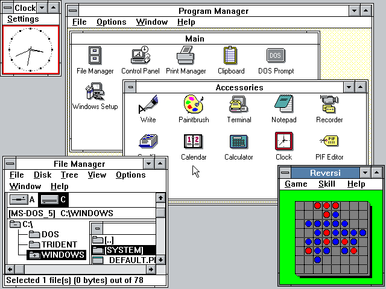

	Windows 3.0

	</captioned>

- 1991: First Website

    Hosted at [CERN](http://info.cern.ch/hypertext/WWW/TheProject.html), the workplace of Tim Berners-Lee, the first website explained the World Wide Web project and how to use it. Publishing it made the Web a working public information system rather than only a proposal.

	<captioned>

	

	The first website

	</captioned>

- 1991: Linux kernel

	Linus Torvalds released the first Linux kernel as a free, open-source Unix-like kernel for Intel 80386 PCs. Combined with GNU tools and other free software, Linux became the foundation for servers, supercomputers, embedded devices, Android and much of the cloud.

	<captioned>

	

	Linux kernel and GNU tools

	</captioned>

- 1991: PowerPC Processor

	IBM, Apple and Motorola introduced the PowerPC architecture, based on reduced instruction set computing ideas and used in Macintosh computers through the 1990s.

	<captioned>

	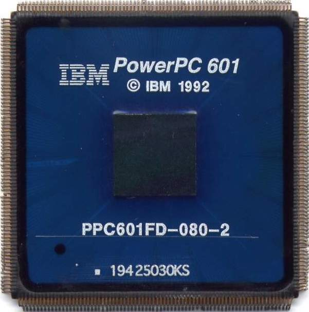

	PowerPC processor

	</captioned>

- 1991: PowerBook 100

	The PowerBook 100 used a 16MHz Motorola 68000 processor, up to 8MB of RAM and a 20MB hard drive. Its compact design helped define the modern laptop layout by placing a pointing device in front of the keyboard.

	<captioned>

	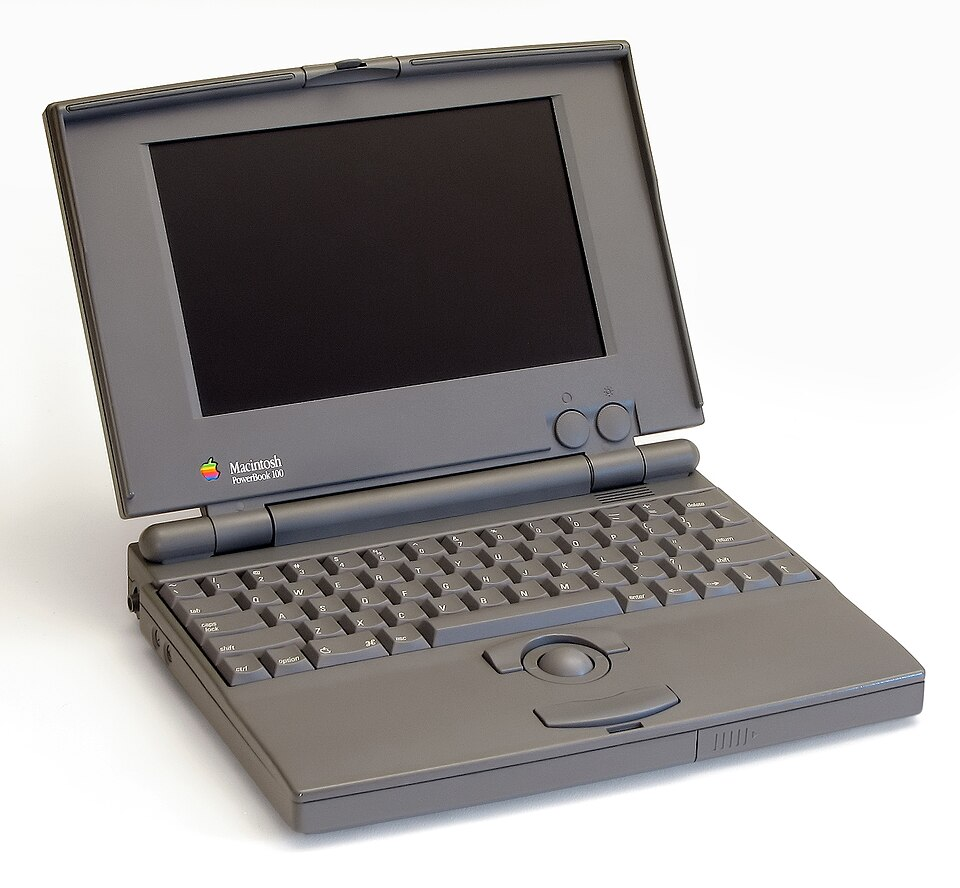

	Apple PowerBook 100

	</captioned>

- 1992: Orbitel 901 Mobile Phone

	The Orbitel 901 was one of the first GSM mobile phones. GSM introduced a shared digital standard that made mobile networks and international roaming more practical.

	<captioned>

	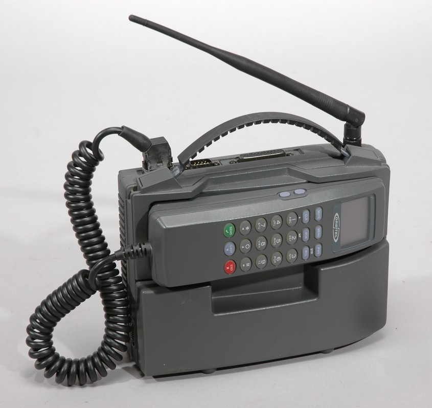

	Orbitel 901

	</captioned>

- 1992: Nokia 1011 Mobile Phone

	The Nokia 1011 was the first mass-produced GSM phone. Digital cellular networks made clearer calls and text messaging possible at a much larger scale.

	<captioned>

	

	Nokia 1011

	</captioned>

- 1993: Pentium Processor

	Intel released the Pentium processor, which used superscalar design to execute more than one instruction in some cycles. It became a major processor family for personal computers.

	<captioned>

	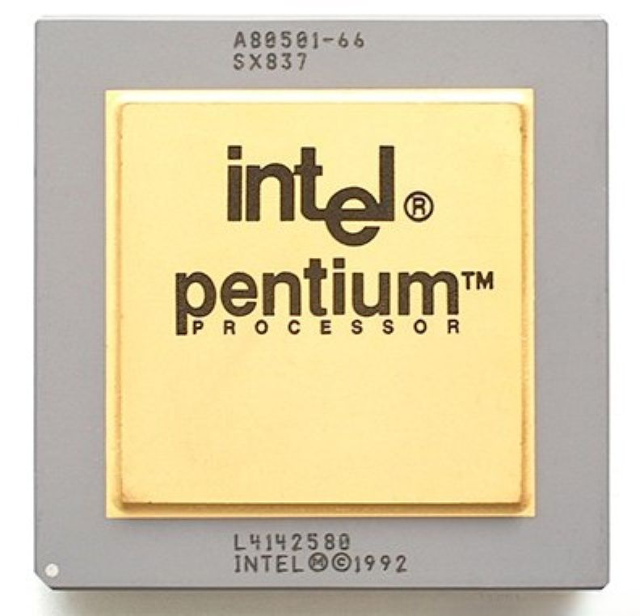

	Pentium Processor

	</captioned>

- 1993: Mosaic Web Browser

	The Mosaic browser made the World Wide Web easier to explore by displaying text and images together in one page. Its visual approach helped move the Web beyond specialist and text-only interfaces.

	<captioned>

	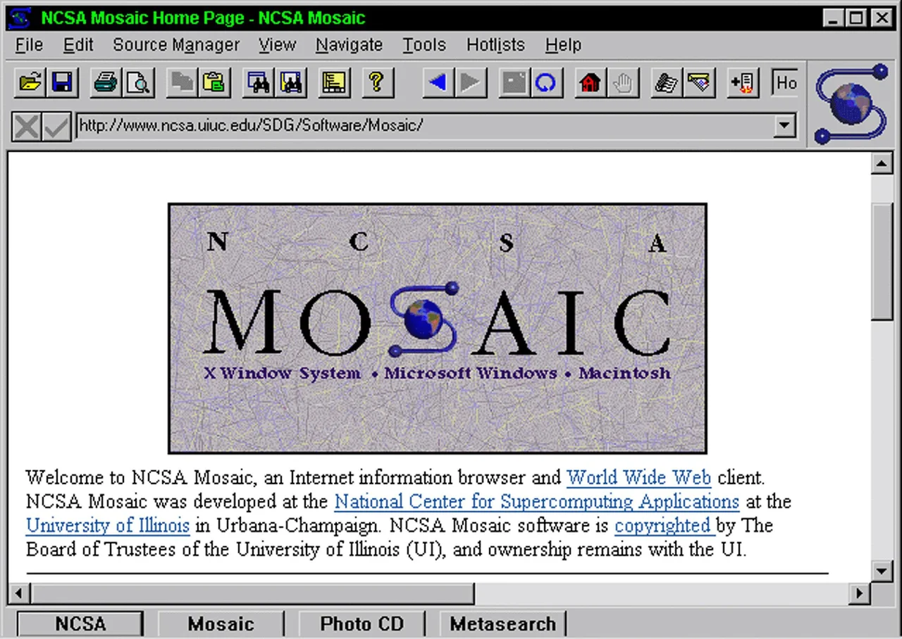

	Mosaic web browser

	</captioned>

- 1993: Apple Newton

	Apple's Newton MessagePad was an early handheld computer with handwriting recognition, anticipating later personal digital assistants and smartphones.

	<captioned>

	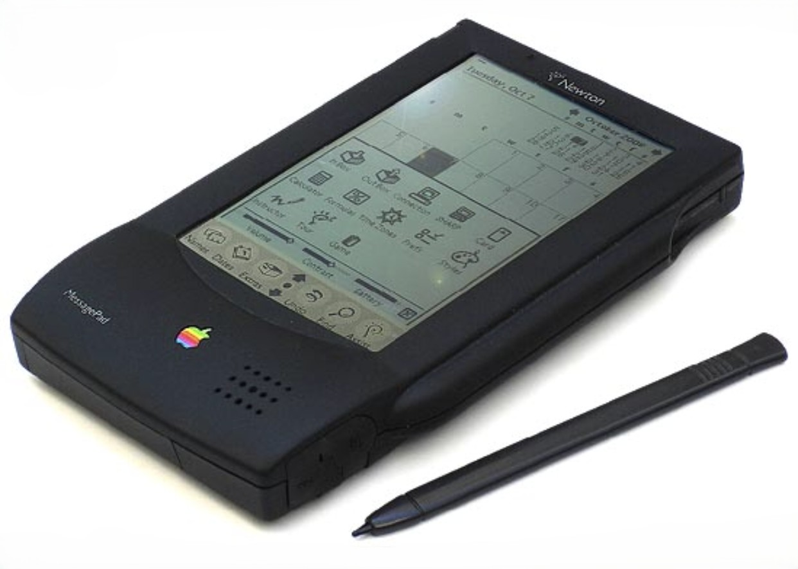

	Apple Newton MessagePad

	</captioned>

- 1993: Internet reaches one million hosts

	The number of registered Internet hostnames passed one million. This measured networked machines and services rather than individual users, but it marked the transition from specialist network to mass infrastructure.

- 1994: Netscape Navigator

	Netscape Navigator made the Web accessible to a mass audience and quickly became the leading browser. Its rapid adoption helped drive the commercial growth of websites and online services.

- 1995: Commercial Internet access expands

	NSFNET stopped acting as the main commercial backbone, allowing private Internet service providers and network operators to expand. Dial-up access brought the Web into homes, while businesses began building online services and websites.

- 1995: Internet reaches about five million hosts

	The rapidly growing public and commercial Internet contained roughly five million registered hosts. Search engines, online shops and service providers were beginning to turn network access into a mainstream industry.

- 1995: Java Programming Language

	Sun Microsystems released Java with a promise of running across different platforms. One piece of Java code could run on Mac, Windows and Unix systems through the Java Virtual Machine.

	<captioned>

	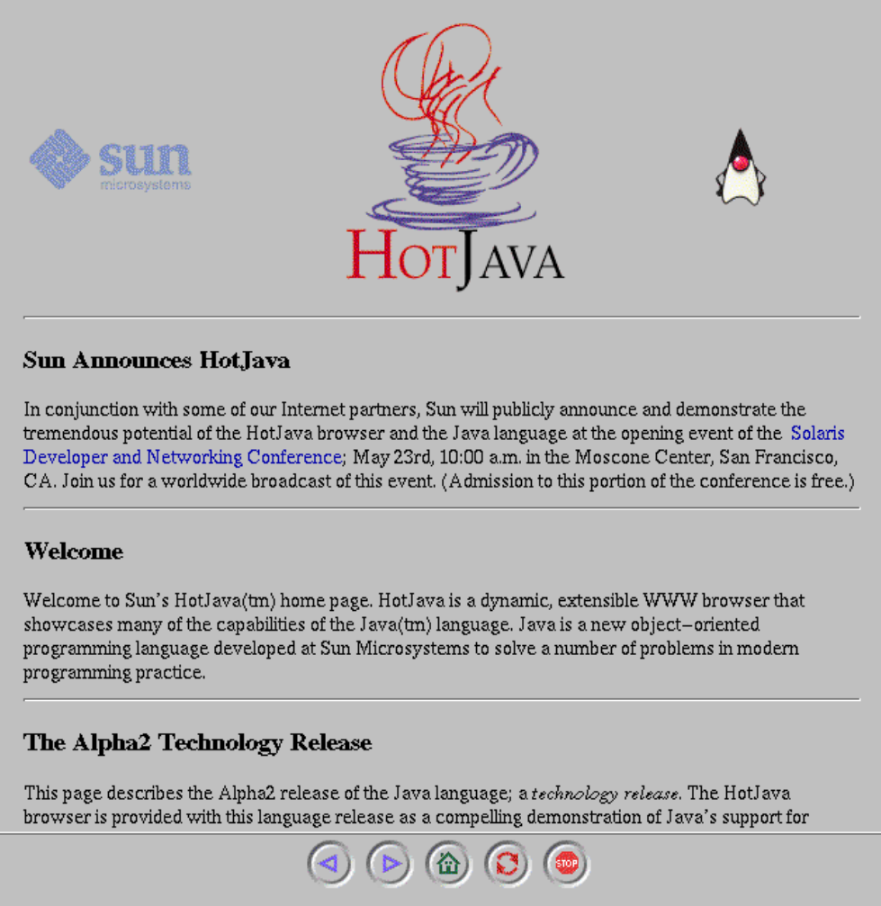

	Java programming language

	</captioned>

- 1995: Windows 95 OS

	Windows 95 brought a more familiar desktop interface and made the Start menu a standard part of personal computing. It was a huge commercial success.

	<captioned>

	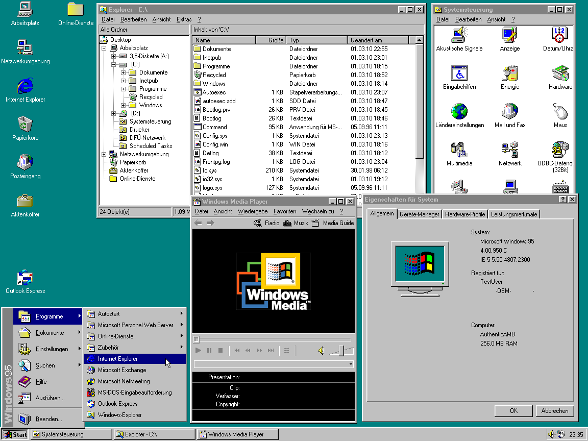

	Windows 95

	</captioned>

- 1996: Google Begins

	Larry Page and Sergey Brin began developing the search engine that became Google. Its ranking approach helped people find useful information as the web grew rapidly.

	<captioned>

	

	Google search

	</captioned>

- 1997: Mac OS 7

	Mac OS 7 represented the mature classic Macintosh operating system, which combined a graphical desktop with cooperative multitasking and a large software ecosystem.

	<captioned>

	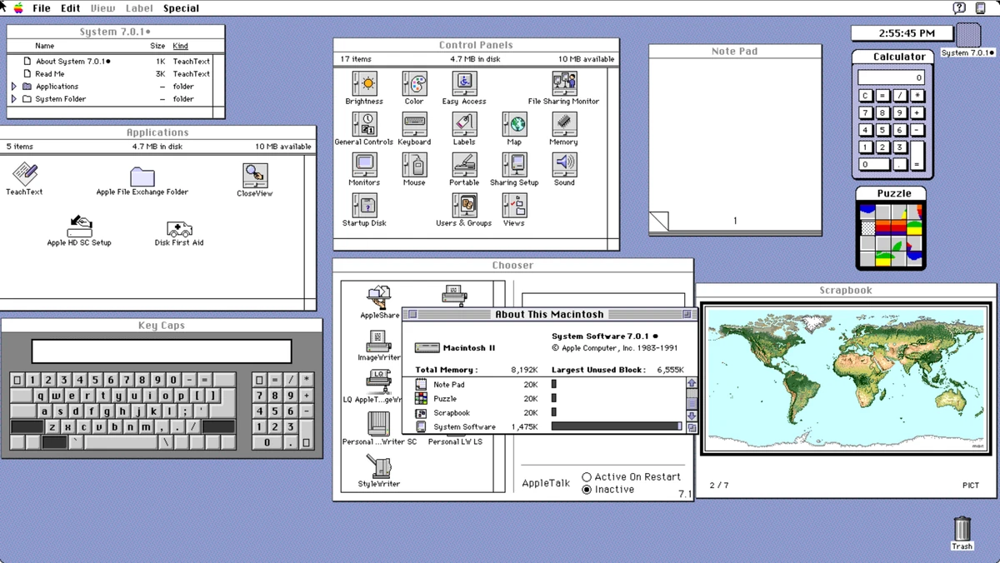

	Mac OS 7

	</captioned>

- 1998: ICANN

	The Internet Corporation for Assigned Names and Numbers was created to coordinate domain names, IP address allocation and key Internet protocols. This provided a global governance structure as the Internet became commercial and international.

- 1998: iMac G3

	The translucent iMac G3 combined the computer and display in one colourful case. Its simple setup and USB ports helped make Apple products appealing to a wider audience.

	<captioned>

	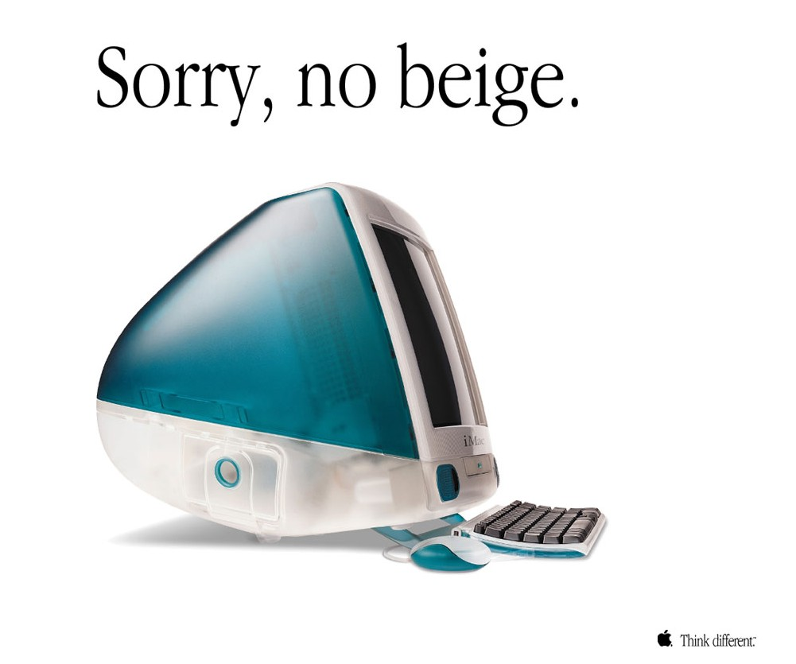

	The iMac G3

	</captioned>

- 1999: Mac OS 9

	Mac OS 9 was the final major release of Apple's classic Mac OS before the transition to the Unix-based Mac OS X. It supported features such as multi-user accounts, file encryption and Sherlock search, but still used cooperative multitasking.

	<captioned>

	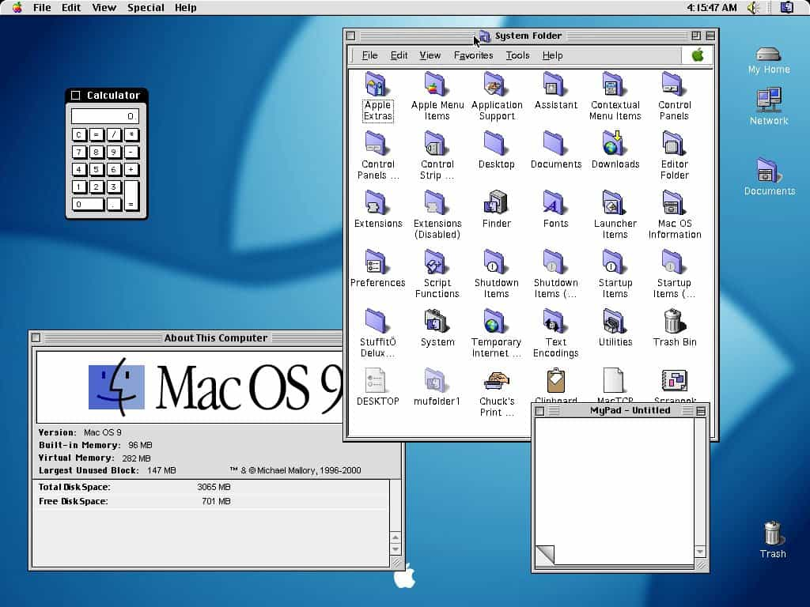

	Mac OS 9 desktop

	</captioned>

- 1999: Wi-Fi

	The first 802.11b products helped establish Wi-Fi as a practical way to connect computers to local networks without cables.

	<captioned>

	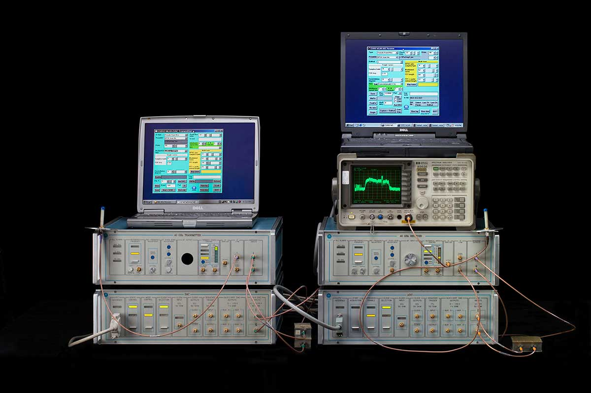

	Prototype Wi-Fi hardware

	</captioned>

</timeline>

<pagination class="bottom">

- [Early](/history/pre.md)
- [1940s](/history/1940s.md)
- [1950s](/history/1950s.md)
- [1960s](/history/1960s.md)
- [1970s](/history/1970s.md)
- [1980s](/history/1980s.md)
- 1990s
- [2000s](/history/2000s.md)
- [2010s](/history/2010s.md)
- [2020s](/history/2020s.md)
- [Future](/history/future.md)

</pagination>

