# 1990s - The World Wide Web Goes Mainstream

<pagination>

- [Early](/history/pre.md)
- [1940s](/history/1940s.md)
- [1950s](/history/1950s.md)
- [1960s](/history/1960s.md)
- [1970s](/history/1970s.md)
- [1980s](/history/1980s.md)
- 1990s
- [2000s](/history/2000s.md)
- [2010s](/history/2010s.md)
- [2020s](/history/2020s.md)
- [Future](/history/future.md)

</pagination>

The 1990s brought the digital world to the masses through the **explosion of the World Wide Web**. Computers moved from being business productivity tools to **communication hubs** in the home. Modern, **internet-connected operating systems** like Windows 95 launched, along with **web browsers** like Netscape. As the Web exploded in popularity, the 90s saw the birth of online giants like Amazon and Google. Computing devices also became more mobile with early **smartphones** and **laptops**.

<timeline>

- 1990: Web Standards: HTTP and HTML

	Based on his 1989 proposal, **Tim Berners-Lee** defined the first web standards: **HTTP** defines how a web browser **requests** a web page, and how a web server should **respond**. **HTML** uses plain-text with mark-up '**tags**' to define **structure** and **hyperlinks**.

    Berners-Lee ensured that all of the standards for the Web were published under an **open license**, ensuring nobody could limit or restrict their use.

	<captioned>

	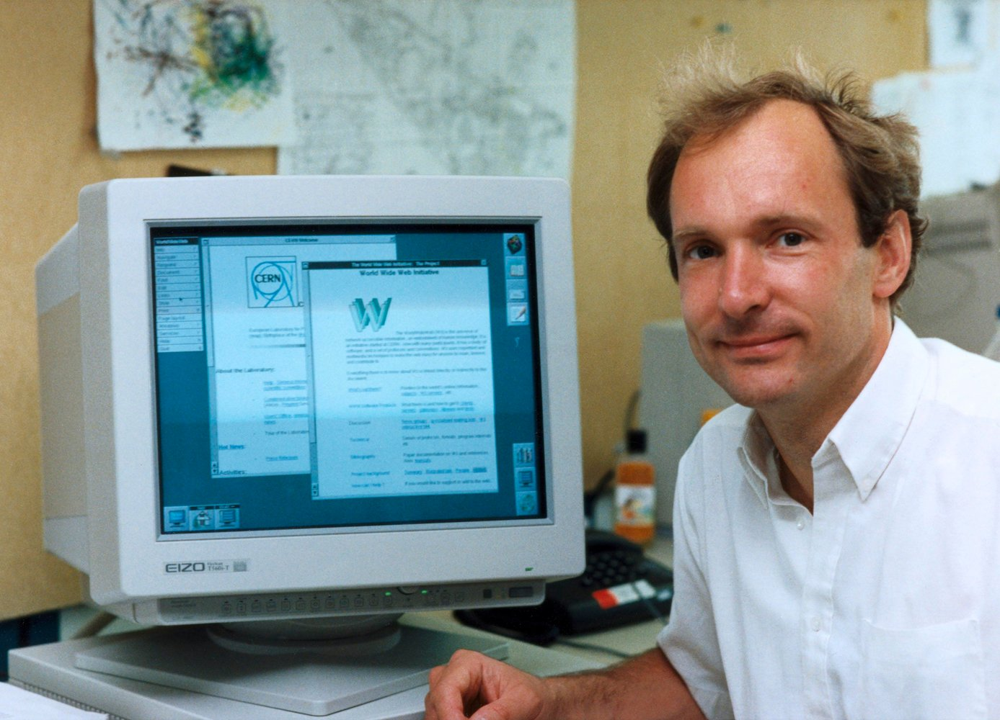

	Tim Berners-Lee

	</captioned>

- 1990: Windows 3.0

	**Microsoft**'s **Windows 3.0** made graphical computing more practical for a much larger audience, and the first version of Windows that was **widely used by businesses**. Unlike Windows 1, this version had features that made it genuinely useful: full **multi-tasking**, a modern **graphical interface**, and a range of useful **applications**.

	<captioned>

	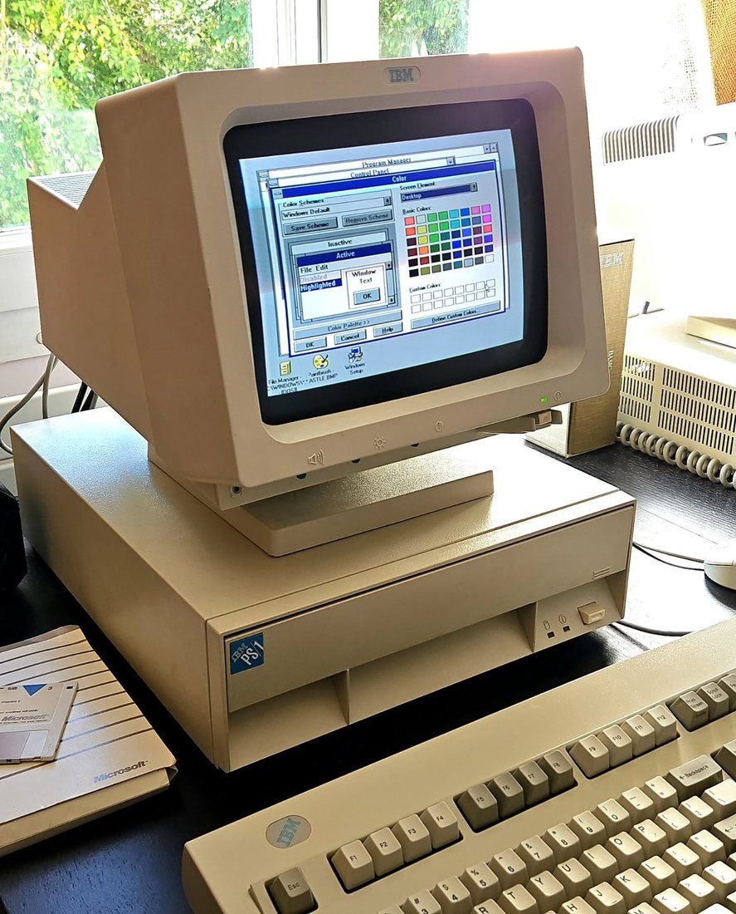

	PC running Windows 3.0

	</captioned>

- 1991: The First Web Server and Website

    Hosted at **CERN** on a **NeXT Computer**, the first website explained the **World Wide Web project** and how to use it. By publishing the site, **Tim Berners-Lee** took the World Wide Web from a proposal to a working public information system.

    The original site remains accessible [here](http://info.cern.ch/hypertext/WWW/TheProject.html)

	<captioned>

	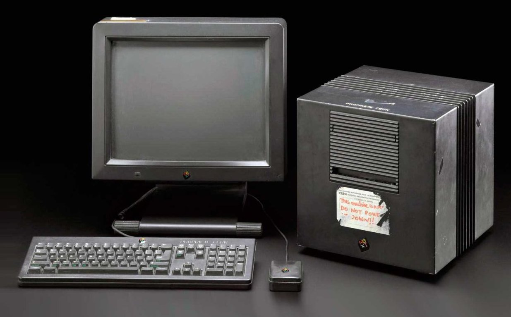

	The first Web server

	</captioned>

- 1991: Linux Kernel

	**Linus Torvalds** released the first **Linux kernel** as a **free**, **open-source**, **Unix-like** kernel for Intel 80386 PCs. It powers the vast majority of the world's **web servers**, **cloud computing** platforms and **supercomputers**, while its kernel forms the foundation of the **Android** operating system.

    Linux established open-source software as a viable alternative to proprietary systems. Its collaborative development model proved that open-source software could be highly secure, stable, and cost-effective.

	<captioned>

	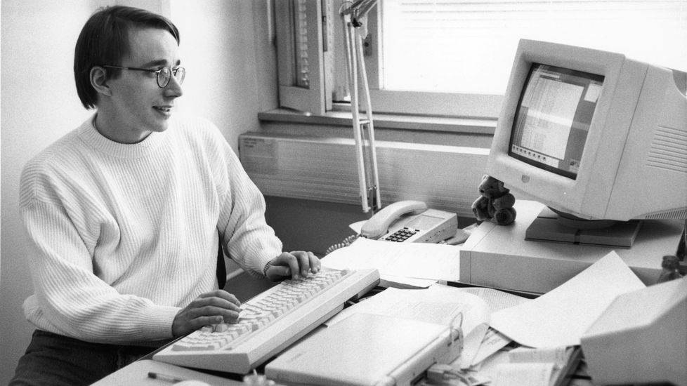

	Linus Torvalds

	</captioned>

	<captioned>

	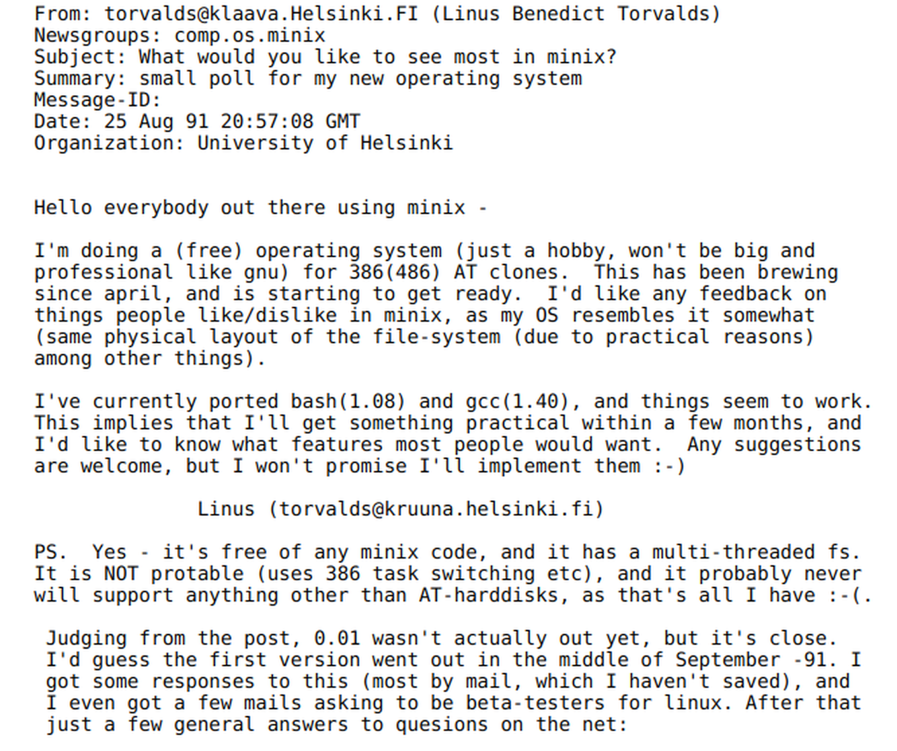

	Torvalds' announcement of Linux

	</captioned>

- 1991: PowerBook 100

	The **Apple PowerBook 100** used a 16MHz Motorola 68000 processor, up to 8MB of RAM and a 20MB hard drive. Its compact design helped define the **modern laptop layout** by placing a pointing device in front of the keyboard, in this case a **trackball**.

	<captioned>

	

	Apple PowerBook 100

	</captioned>

- 1991: PowerPC CPU Architecture

	**IBM**, **Apple** and **Motorola** introduced the **PowerPC architecture** for microprocessors, based on reduced instruction set computing (**RISC**) ideas.

    Apple used PowerPC chips during the 1990s and into the 2000s. **Nintendo** used PowerPC for the GameCube, Wii, and Wii U, while **Microsoft** and **Sony** built custom PowerPC chips for the Xbox 360 and PlayStation 3. **NASA** used PowerPC chips to power the Curiosity and Perseverance Mars rovers, alongside multiple satellites and the Juno spacecraft.

    > [!NOTE]
    > The PowerPC G4 was so advanced that the U.S. government briefly classified it as a controlled military technology / weapon to limit its export.

	<captioned>

	

	PowerPC processor

	</captioned>

	<captioned>

	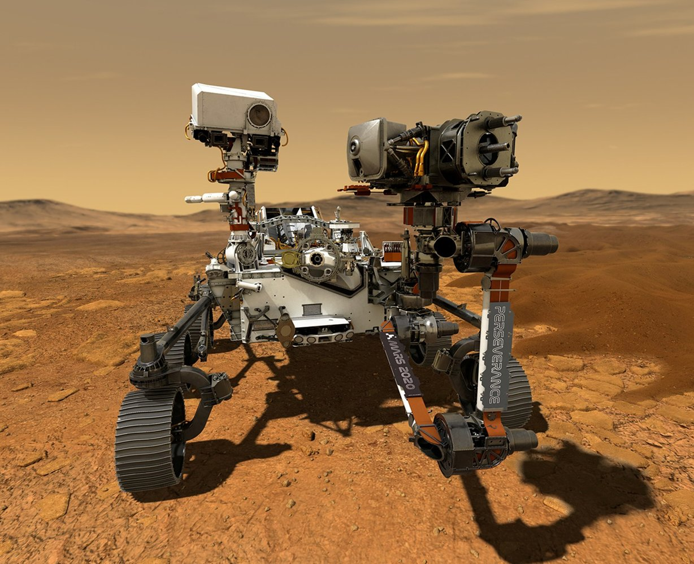

	The Perseverance rover

	</captioned>

- 1991: Macintosh System 7

	**Apple**'s **System 7** represented the latest version of the Macintosh operating system. introducing a **colourful** graphical desktop with true **co-operative multitasking**, **TrueType fonts** and other quality of life improvements.

	<captioned>

	

	Mac System 7

	</captioned>

- 1991: Psion Series 3 Organiser

    Launched by **Psion**, the Psion **Series 3** was a **palmtop computer** and **personal digital assistant (PDA)**. It had a compact clamshell pocket design with a full physical QWERTY keyboard. Powered by a full **pre-emptive multitasking** operating system (EPOC) it ran on two standard AA batteries, often for weeks at a time. The built-in software included a **word processor**, **database**, **calendar**, **calculator**, and a **programming language** called OPL (Organiser Programming Language). It was upgradable via two cartridge ports. For its time, the device was groundbreaking and defined the future of mobile computing.

	<captioned>

	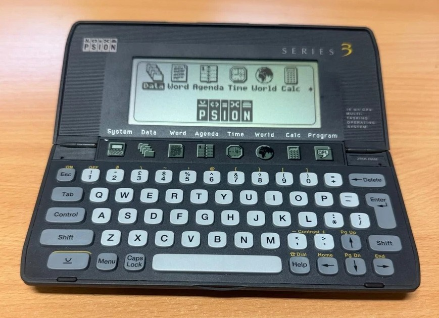

	Psion Series 3 palmtop

	</captioned>

- 1992: GSM Digital Phone Networks

	The international **GSM** committee, based in Europe, introduced a shared **digital mobile phone** standard. Digital networks enabled clearer, more secure calls and allowed for simpler international roaming.

    GSM phones could not just make voice calls, but could also **exchange data** such as SMS messages, and later emails, images and more. This enabled the development of **smartphones** and **mobile computing**.

    The **Orbitel 901** was one of the first **GSM** mobile phones, whilst the **Nokia 1011** was the first mass-produced GSM phone.

	<captioned>

	

	Orbitel 901

	</captioned>

	<captioned>

	

	Nokia 1011

	</captioned>

- 1992: Internet Reaches One Million Hosts

	The number of registered **Internet** hostnames passed **one million**. This measured networked machines and services rather than individual users, but it clearly showed that the Internet was no longer just a specialist network; it was now mass infrastructure.

- 1993: Pentium Processor

	**Intel** released the Pentium processor, which used **superscalar design** to execute more than one instruction in some cycles.

    It was the next in line in the **x86** family, following on from the highly successful 8086 (1978), 80286 (1982), 80386 (1985) and 80486 (1989).

	<captioned>

	

	Pentium Processor

	</captioned>

- 1993: Mosaic Web Browser

	The **Mosaic browser** made the **World Wide Web** easier to explore by displaying text and **images** together in one page.

    Its visual approach helped move the Web beyond specialist and text-only interfaces, and helped popularise the Web as a platform.

	<captioned>

	

	Mosaic web browser

	</captioned>

- 1993: Apple Newton

	**Apple**'s **Newton MessagePad** was an early **handheld** computer with **handwriting recognition**, anticipating later personal digital assistants and smartphones.

	<captioned>

	

	Apple Newton MessagePad

	</captioned>

- 1993: Doom

	**Doom**, created by **John Carmack** and **John Romero** of **id Software**, popularised the **multi-player** **first-person shooter (FPS)**.

    At launch of the game, the press release jokingly predicted it would be the '**number one cause of decreased productivity in businesses around the world**'. This wasn't a joke for long: the game became a viral phenomenon and brought many corporate and academic networks to their knees.

	<captioned>

	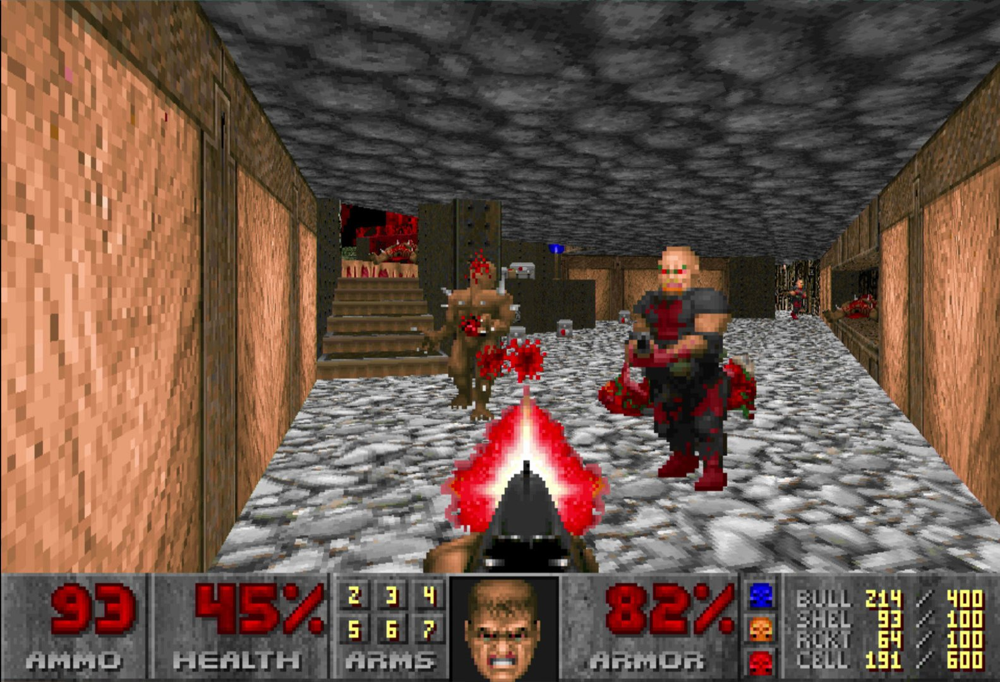

	Doom

	</captioned>

- 1994: Netscape Navigator

	The **Netscape Navigator browser** made the Web accessible to a mass audience and quickly became the **leading browser**. Its rapid adoption helped drive the commercial growth of websites and online services.

	<captioned>

	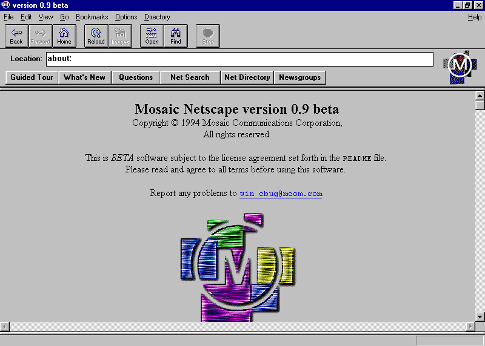

	Netscape Navigator

	</captioned>

- 1994: The World Wide Web Consortium

	**Tim Berners-Lee** founded the **World Wide Web Consortium (W3C)** to coordinate **open Web standards**.

    The W3C continues to ensure browsers and websites follow shared specifications, allowing the Web to work across different computers and companies.

	<captioned>

	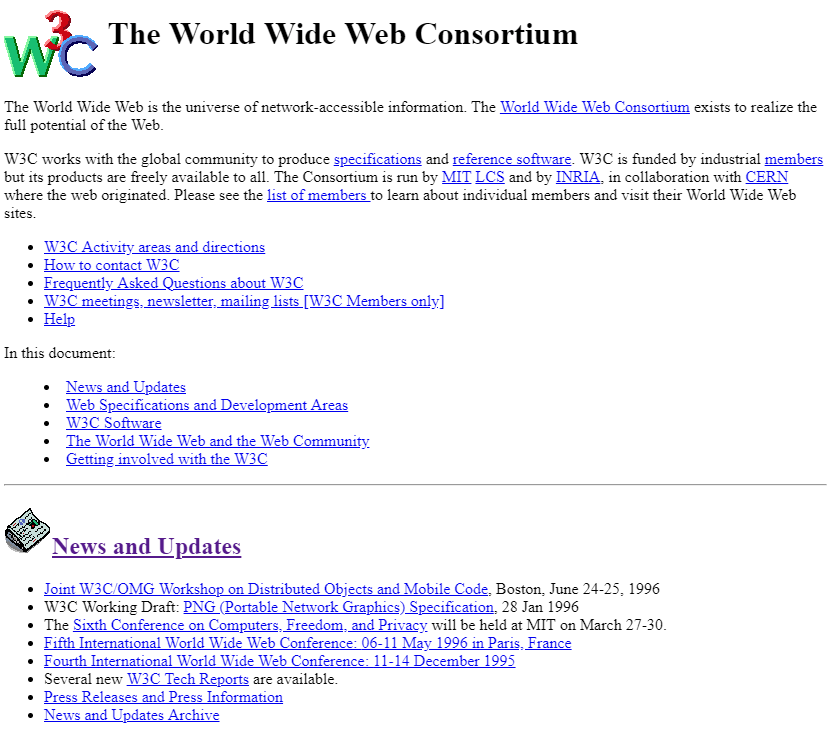

	The W3C website

	</captioned>

- 1994: Amazon Begins

	**Jeff Bezos** founded **Amazon** as an online **bookshop**. Selling through a website allowed a small company to offer far more titles than a physical shop could keep on its shelves, helping demonstrate the potential of **online commerce**.

	<captioned>

	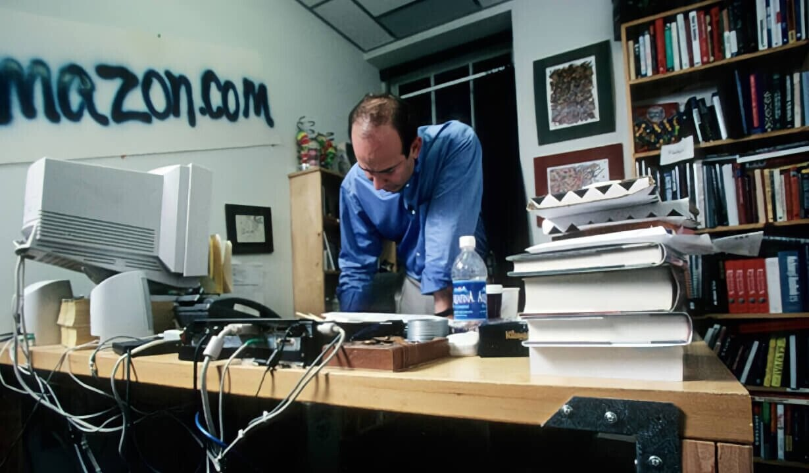

	Jeff Bezos at Amazon's original office

	</captioned>

- 1994: Sony PlayStation

	**Sony**'s **PlayStation** used **CD-ROMs** and dedicated **3D graphics hardware** to bring large, cinematic games to a mass audience. Its success made Sony a major console manufacturer and helped establish three-dimensional games as the industry standard.

	<captioned>

	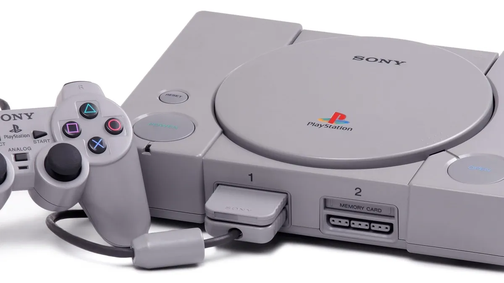

	Sony PlayStation

	</captioned>

- 1995: Internet Reaches Five Million Hosts

	The rapidly growing public and commercial **Internet** contained roughly **five million** registered hosts. **Search engines**, **online shops** and **service providers** were beginning to turn network access into a mainstream industry.

- 1995: Java Programming Language

	**Sun Microsystems** released **Java** with a promise of running across **different platforms**. One piece of Java code could run on **Mac**, **Windows** and **Unix** systems through the **Java Virtual Machine**.

    Java remains one of the most highly used and influential programming languages. It popularised features like automatic memory '**garbage collection**' and cam with a comprehensive **standard library**.

	<captioned>

	

	Java programming language

	</captioned>

- 1995: JavaScript Programming Language

	**Brendan Eich** created **JavaScript** for the **Netscape Navigator browser**. JavaScript could respond to **user actions** and **change web page content**, making websites **interactive** for the first time.

    Brendan Eich created JavaScript in a frantic **10-day** sprint. The extreme time constraint resulted in several permanent design flaws in the language that web developers are still dealing with today. Despite this, JavaScript is now **the most widely used programming language** in the world.

    <em>JavaScript has no relationship to the Java language, but shared the 'Java' name as a marketing tactic to capitalise on Java's massive popularity at the time.</em>

	<captioned>

	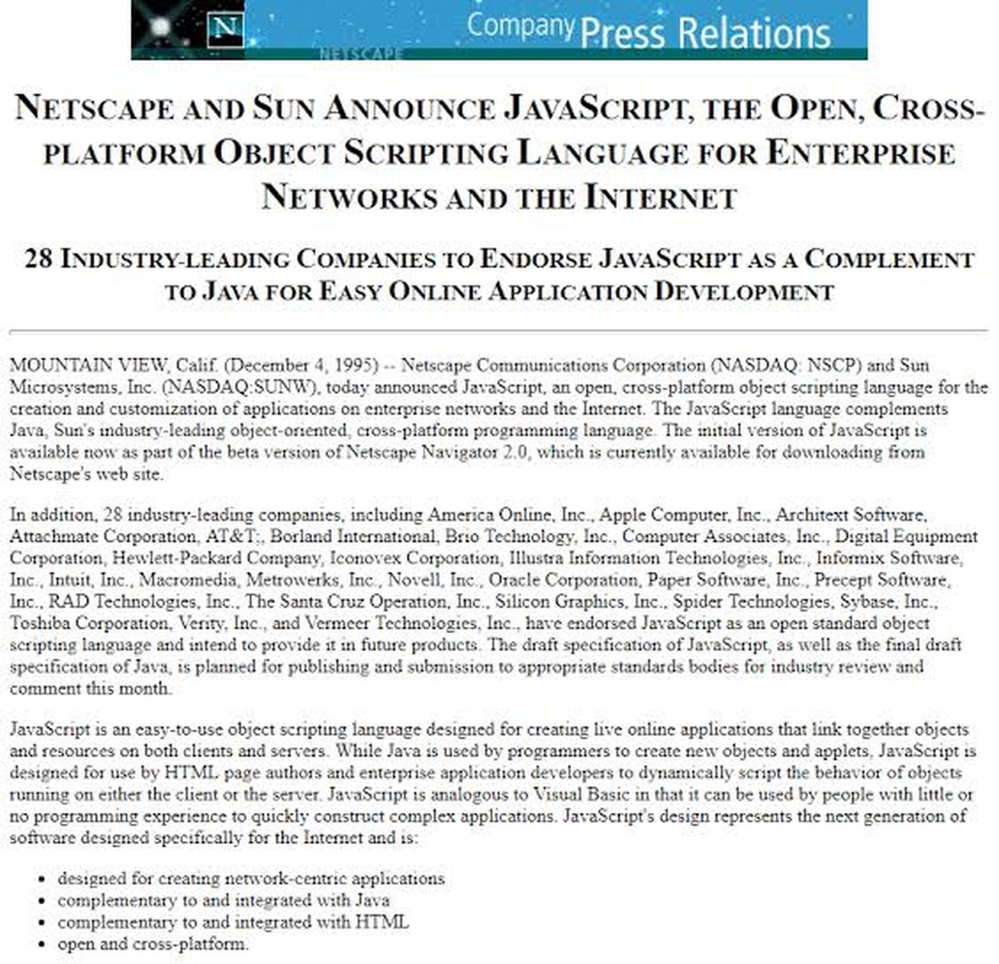

	JavaScript announcement

	</captioned>

	<captioned>

	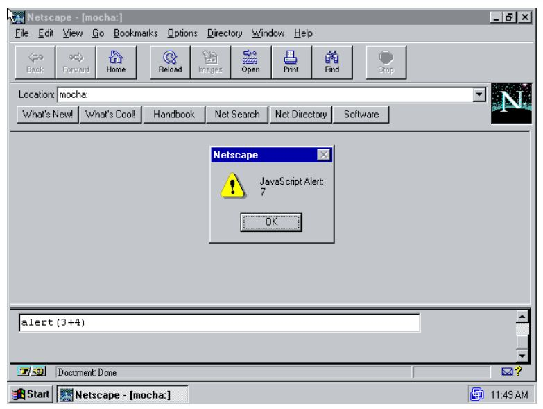

	JavaScript running in Netscape Navigator

	</captioned>

- 1995: eBay Begins Online Auctions

	**Pierre Omidyar** created an online auction site, **AuctionWeb**, that later became **eBay**, establishing the world's first person-to-person online auction platform. The first Sale was of a non-functional laser pointer which sold for $14.83. It showed that internet users were willing to send money to unknown individuals for secondhand goods, creating a new peer-to-peer marketplace model.

	<captioned>

	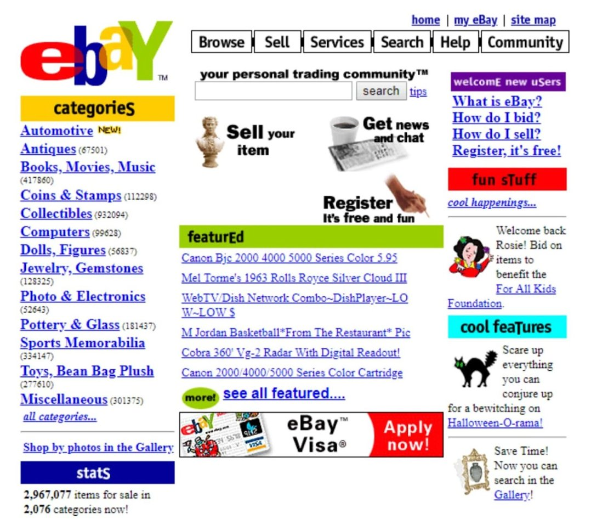

	The original eBay website

	</captioned>

- 1995: Windows 95

	**Microsoft**'s **Windows 95** refined the Windows desktop interface and introduced the **Start menu**, a standard part of all Windows versions since. It was a huge commercial success, coming bundled and pre-installed on the majority of IBM-compatible PCs.

    In 1998, **Windows 98** was launched, a refined version of the same OS with improvements such as USB support and support for larger drives.

	<captioned>

	

	Windows 95

	</captioned>

- 1996: Google Begins

	**Larry Page** and **Sergey Brin** began developing the **search engine** that became **Google**. Its revolutionary ranking algorithm, **PageRank**, helped people find useful information as the web grew rapidly. Google later went on to launch applications such as **GMail** and **Google Docs**, and a range of software and hardware innovations such as the **Chrome** web browser and the **Android** operating system.

	<captioned>

	

	Google search

	</captioned>

- 1996: Pokémon

	**Pokémon**, created by **Satoshi Tajiri** and developed by **Game Freak**, combined role-playing games with collecting and trading creatures. It was a huge commercial success on the Game Boy.

	<captioned>

	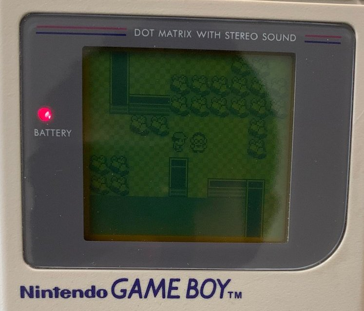

	Pokémon on the Game Boy

	</captioned>

- 1998: ICANN

	The **Internet Corporation for Assigned Names and Numbers (ICANN)** was created to coordinate **domain names**, **IP address allocation** and **key Internet protocols**. This provided a global governance structure as the Internet became commercial and international.

	<captioned>

	

	</captioned>

- 1998: iMac G3

	**Apple**'s translucent **iMac G3** combined the computer and display in a **single colourful case**, a refreshing change from the standard grey or beige cases of most other manufacturers.

    Its simple setup, built-in dial-up modem and USB ports, helped make the computer appealing to a wide audience.

	<captioned>

	

	The iMac G3

	</captioned>

- 1999: Mac OS 9

	**Mac OS 9** was the final major release of **Apple**'s classic Mac OS before the transition to the Unix-based Mac OS X.

    It supported features such as **multi-user accounts**, **file encryption** and the Sherlock **search agent**.

	<captioned>

	

	Mac OS 9 desktop

	</captioned>

- 1999: Wi-Fi

	Products using the brand name '**Wi-Fi**' and following the **802.11b** standard, helped establish wireless networking as a practical way to connect computers to local networks without cables at speeds of up to **11Mbps**.

    <em>Note: 'Wi-Fi' doesn't stand for anything, it's just a play on the audio term 'Hi-Fi'</em>

	<captioned>

	

	Prototype Wi-Fi hardware

	</captioned>

</timeline>

<pagination class="bottom">

- [Early](/history/pre.md)
- [1940s](/history/1940s.md)
- [1950s](/history/1950s.md)
- [1960s](/history/1960s.md)
- [1970s](/history/1970s.md)
- [1980s](/history/1980s.md)
- 1990s
- [2000s](/history/2000s.md)
- [2010s](/history/2010s.md)
- [2020s](/history/2020s.md)
- [Future](/history/future.md)

</pagination>

