# 2000s - The Mobile Computing Revolution

<pagination>

- [Early](/history/pre.md)
- [1940s](/history/1940s.md)
- [1950s](/history/1950s.md)
- [1960s](/history/1960s.md)
- [1970s](/history/1970s.md)
- [1980s](/history/1980s.md)
- [1990s](/history/1990s.md)
- 2000s
- [2010s](/history/2010s.md)
- [2020s](/history/2020s.md)
- [Future](/history/future.md)

</pagination>

The 2000s saw a shift from fixed desktop computers to machines that we could carry in our pockets through the creation of the **smartphone**. Internet connections transitioned from dial-up to always-on **high-speed broadband** access, and the rise of **interactive** **Web 2.0** websites like YouTube and Facebook drove the start of the **social media** revolution. Gaming console technology advanced, bringing **advanced 3D graphics** and a huge library of games to many households.

<timeline>

- 2000: Internet Reaches 72 Million Hosts

	Around **72 million hostnames** were recorded on the **Internet**, while the number of people regularly online was estimated to be roughly **360 million users**, or **6% of the world's population**.

	<captioned>

	

	6% of the world online

	</captioned>

- 2000s: Undersea Optical-Fibre Cables

    During the late 1990s and early 2000s, massive capital was poured into **laying hundreds of thousands of kilometres** of new **undersea high-speed optical-fibre cables**. By the year 2000, every populated continent was connected by fibre. Today, over 600 active and planned cables span more than 1.4 million kilometres, and carry 97% of global Internet traffic.  Modern fibre-optic submarine cables can transmit up to 100 Tbps, have inter-continental latency below 60 ms, and are designed to operate for an average of 25 years.

	<captioned>

	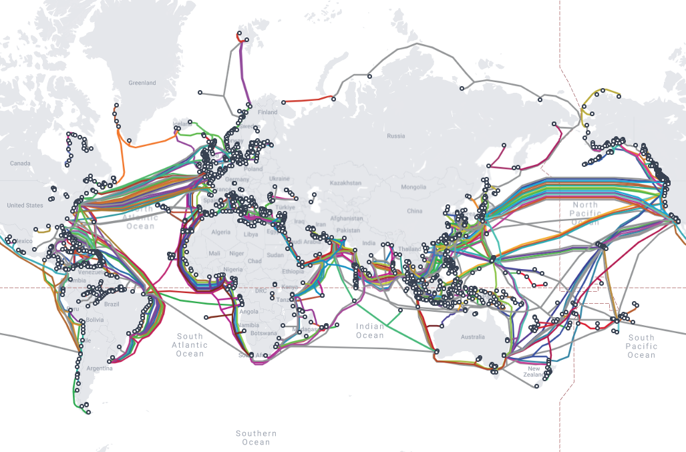

	Internet undersea cables

	</captioned>

- 2000s: Broadband Internet into Homes

	**DSL and cable broadband** replaced dial-up for many homes, providing **always-on connections** that were fast enough for **music**, **video**, **online games** and richer websites. Broadband changed the Internet from an occasional destination into everyday infrastructure, although prices were very high compared to internet plans today.

	<captioned>

	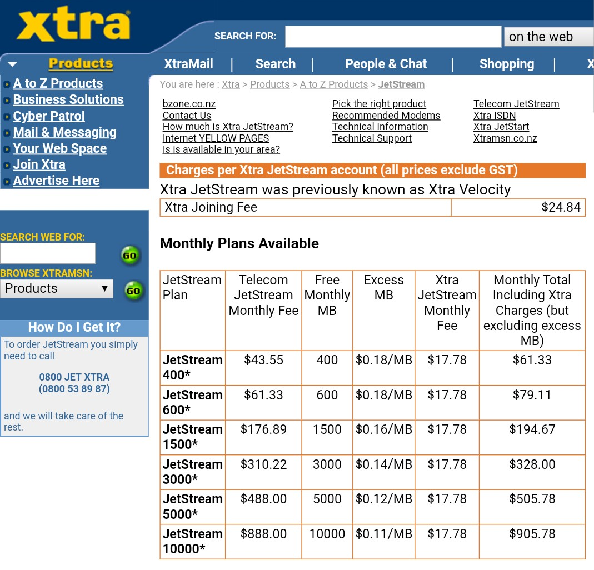

	NZ Broadband pricing in 2001

	</captioned>

- 2000: USB flash drives

	**USB flash drives** began replacing floppy disks as a convenient way to **store and carry files**. Early commercial drives stored about **8MB** and were fairly expensive compared with later USB storage, original drives costing around **US$50** (today an 8GB drive with 1000 times the storage, costs less than NZ$10).

	<captioned>

	

	First commercial USB drive

	</captioned>

- 2000: C#

	**Microsoft** introduced **C#** as a **modern**, **type-safe** language for the **.NET platform**. It compiled to intermediate language for the Common Language Runtime and was created as a direct competitor to Java. The language was designed by a team led by Danish software engineer, **Anders Hejlsberg**, a highly influential figure in programming language design, also known for creating Turbo Pascal, Delphi, and later, TypeScript.

    C# unexpectedly came to dominate **game development** when the **Unity** game engine adopted it, since Unity powers more than half of the world's mobile, PC, and console games.

	<captioned>

	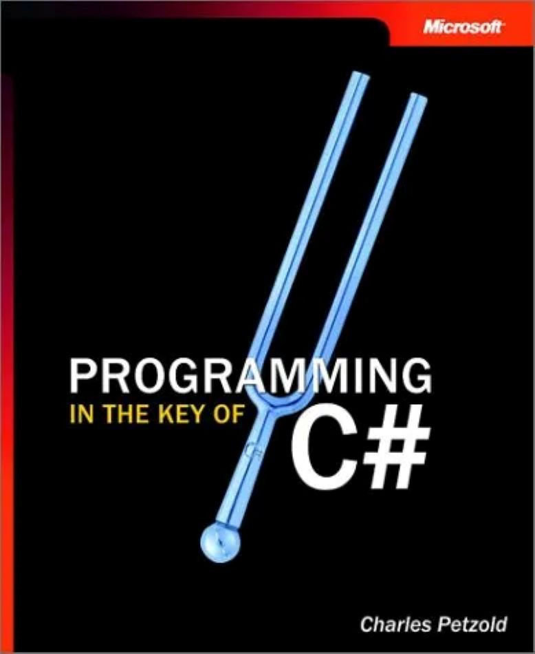

	C# programming language

	</captioned>

- 2001: Mac OS X

	**Apple** released **Mac OS X**, their next generation operating system, replacing the aging OS 9. Mac OS X was developed from the **NeXTSTEP** operating system acquired from NeXT when Apple purchased the company in 1996. OS X was an entirely modern operating system with a **Unix** architecture (the Darwin kernel).

    The OS was stable and sported features like **protected memory**, **pre-emptive multitasking**, advanced **graphics ('Quartz')** and an advanced **file system (HFS+)**. The user interface, 'Aqua', introduced a **dock**, **drop-shadows** and **translucency**, **photo-real icons** and dynamic **visual effects**.

    The platform became the basis for Apple's later macOS, iOS, iPadOS and watchOS systems.

	<captioned>

	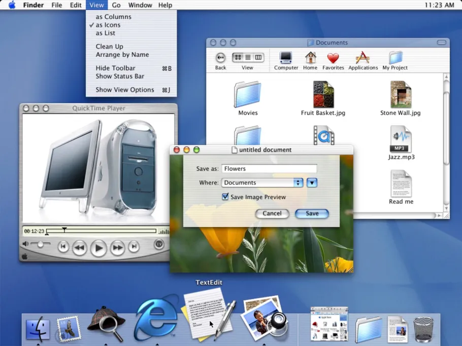

	Mac OS X 10.0

	</captioned>

- 2001: Creative Commons

    **Creative Commons (CC)** is a non-profit organization that provides **free**, standardized **copyright licenses** for **creators** to **share their digital work legally**. **Lawrence Lessig** and others formed Creative Commons to fight strict copyright laws. The group developed a flexible '**some rights reserved**' alternative to traditional 'all rights reserved' copyright. Major platforms like Flickr and Wikipedia adopted CC licenses, and these licenses remain the global standard for open digital sharing, education, and cultural collaboration.

	<captioned>

	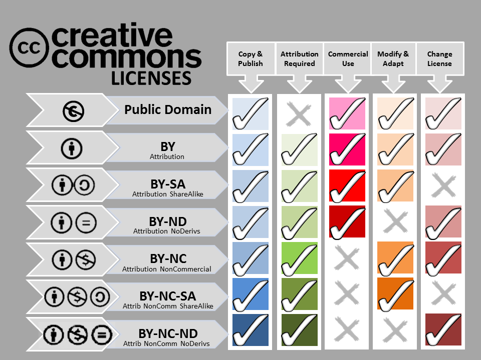

	CC licenses

	</captioned>

- 2001: Wikipedia

	**Wikipedia** was formed by **Jimmy Wales** and **Larry Sanger**. It launched as a **free**, **crowd-sourced** **encyclopaedia** that anyone could edit. Its collaborative model showed that massive, decentralized global communities could self-govern, coordinate, and maintain high-data integrity without central corporate editing.

    Wikipedia redefined **open-content licensing** (moving from the GNU Free Documentation License to **Creative Commons**), establishing a blueprint for open access in digital culture. Later, its structured data became the foundational training datasets for modern Natural Language Processing (**NLP**), **search engines**, and Large Language Models (**LLMs**).

    <captioned>

	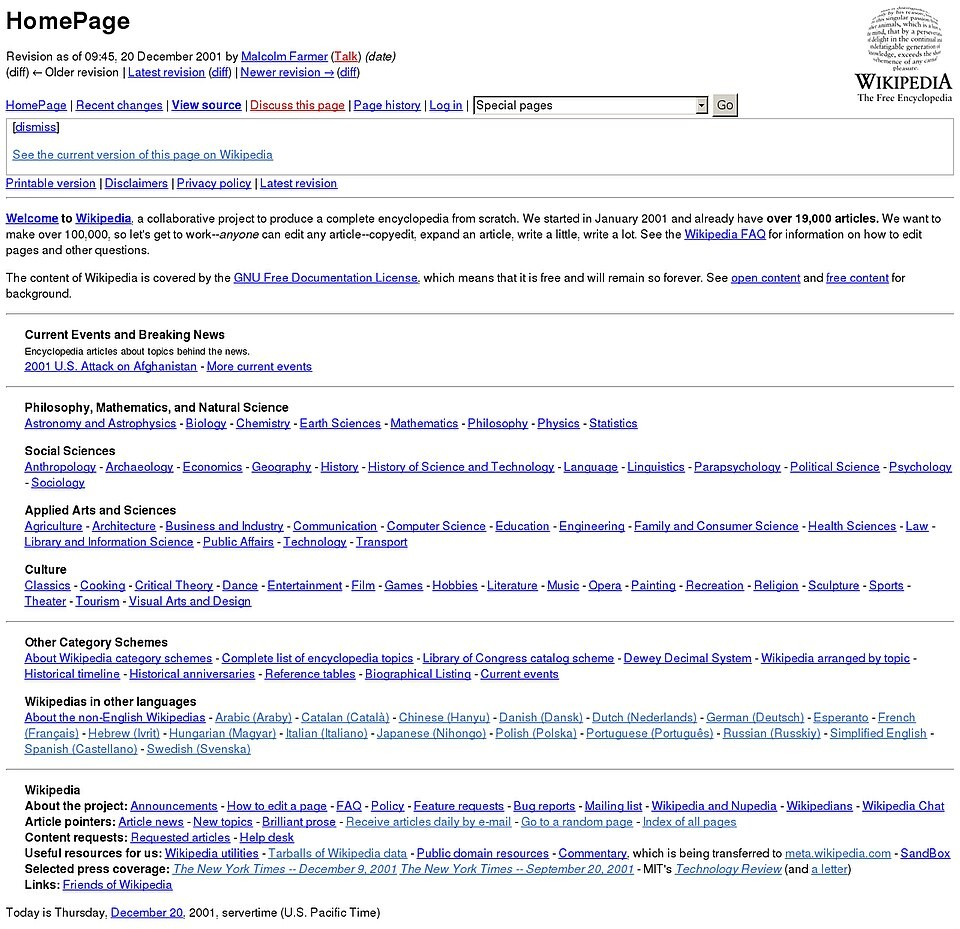

	Wikipedia at launch

	</captioned>

- 2001: Wētā Digital

	**New Zealand** visual-effects (**VFX**) company **Wētā Digital** achieved global recognition and won its first **Academy Award** for Best Visual Effects for **The Lord of the Rings: The Fellowship of the Ring**, delivering groundbreaking computer-generated imagery (**CGI**) and digital environments that brought Middle-earth to life. The studio utilized its custom software, **Massive**, to animate huge digital armies realistically, and pioneered early **virtual camera** techniques. Wētā Digital remains a world-leader in digital visual effects.

	<captioned>

	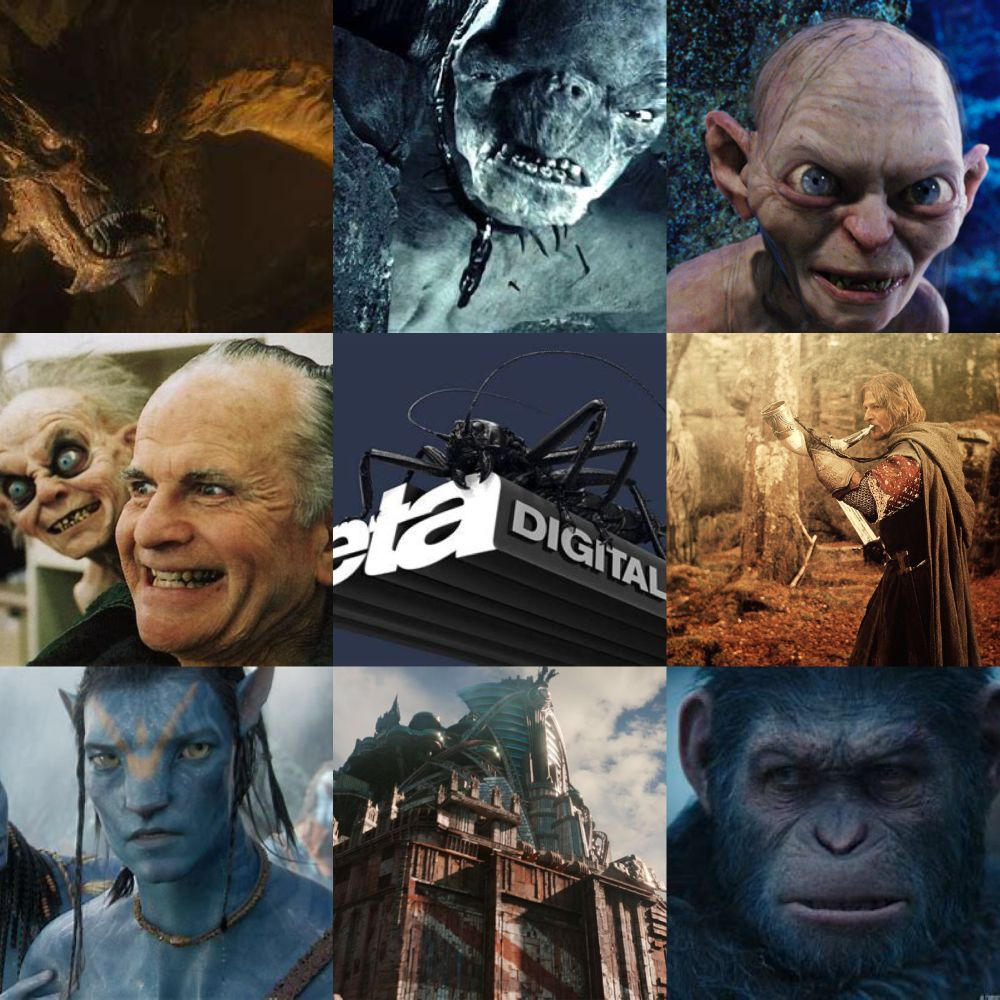

	Wētā Digital groundbreaking VFX

	</captioned>

- 2001: iPod

	**Apple** launched the **iPod**, an **MP3 music player** with an intuitive user interface and enough storage for dozens of albums. The first iPod used a **5GB miniature hard drive**, stored about **1,000 songs** and offered up to 10 hours of battery life. Its **scroll wheel** and high speed FireWire connection made it easy to carry and quickly load a large music collection.

	<captioned>

	

	iPod

	</captioned>

- 2001: Xbox

	**Microsoft**'s **Xbox** brought **PC-style hardware** and the **DirectX** software platform into the console market. The Xbox competed with Sony's PlayStation 2 and Nintendo's GameCube. **Halo** helped establish first-person shooters on consoles, while **Xbox Live** later made online console gaming, downloadable content and voice chat mainstream.

	<captioned>

	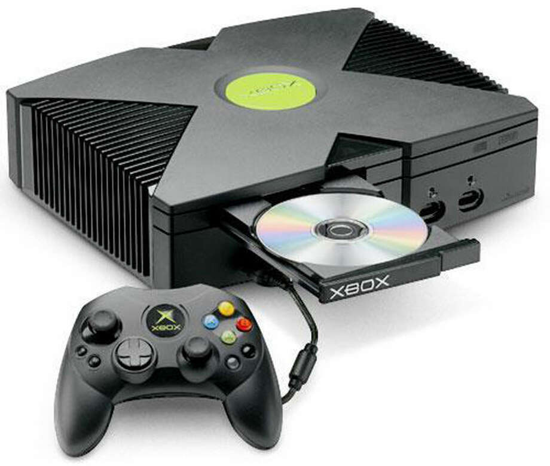

	Original Xbox console

	</captioned>

- 2003: 64-bit CPUs

	**AMD**'s **Opteron** CPU introduced the **x86-64 instruction set**, which **extended** the familiar **x86** architecture while retaining compatibility with 32-bit software. 64-bit processors allowed operating systems and applications to use **much larger memory spaces**, and have become the norm for all personal computers today.

	<captioned>

	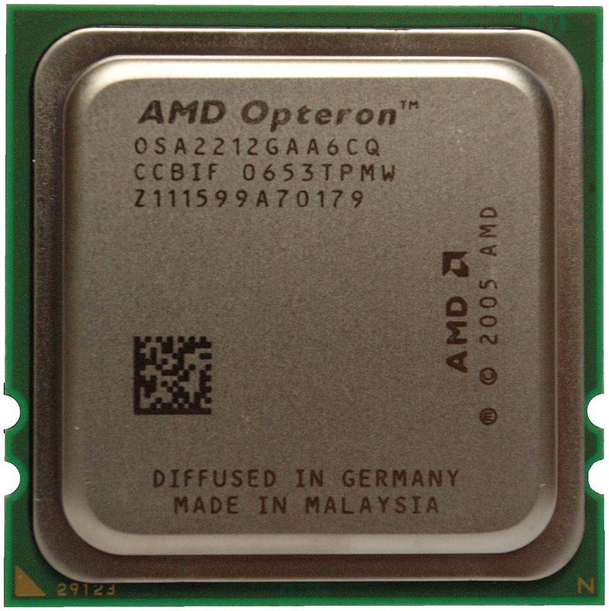

	AMD's 64-bit Opteron CPU

	</captioned>

- 2003: BlackBerry Mobile

	**BlackBerry** devices combined **email**, **messaging** and **phone calls** in a pocket computer. Their **physical keyboards** and push email made mobile communication an everyday business tool, long before touch-screen smartphones took over.

	<captioned>

	

	BlackBerry

	</captioned>

- 2003: Steam

	**Valve** launched **Steam** as a platform for distributing and updating **PC games** online. Steam solved the game industry's fragmentation and anti-piracy struggles by centralising **digital game libraries**, eliminating physical media, and proving that large-scale digital software delivery could work. It introduced seamless, automatic background updates, saving players from manually searching the internet for patches or waiting for new CD-ROMs. Steam also gave independent developers a global route to market.

	<captioned>

	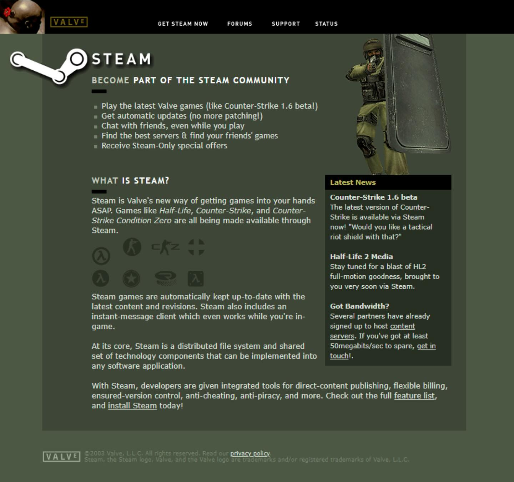

	Steam in 2003

	</captioned>

- 2004: Web 2.0

	The term **Web 2.0** described the shift shift of websites from passive 'read-only' spaces into **interactive** 'read-write' platforms, driven by **user participation**. Websites would be built around **user accounts**, **collaboration** and **user-created content** rather than pages that people only read. Web 2.0 was powered by technologies like **AJAX**, improved **JavaScript**, and robust web browsers that allowed web pages to update dynamically without reloading.

    Some key examples of Web 2.0 platforms: **social media networks** (Facebook, Twitter), **video and photo sharing** (YouTube, Flickr), **wikis** (Wikipedia), and **user-created blogs**.

	<captioned>

	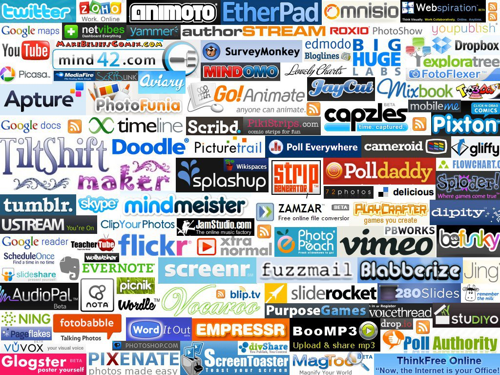

	The Web 2.0 landscape

	</captioned>

- 2004: PlayStation Portable

	**Sony**'s **PlayStation Portable (PSP)** proved that a handheld device could deliver near-console power and allowed Sony to break Nintendo’s monopoly on portable gaming. The PSP delivered **3D graphics** comparable to a PlayStation 2, displayed on a bright 16:9 LCD screen. It used specialized separate processors for the CPU, 3D graphics, and media playback, supporting not just games but **music**, **photos**, and **movie** playback from the Universal Media Disc (UMD) drive on the rear. It even offered **web browsing** and **GPS** before modern smartphones.

	<captioned>

	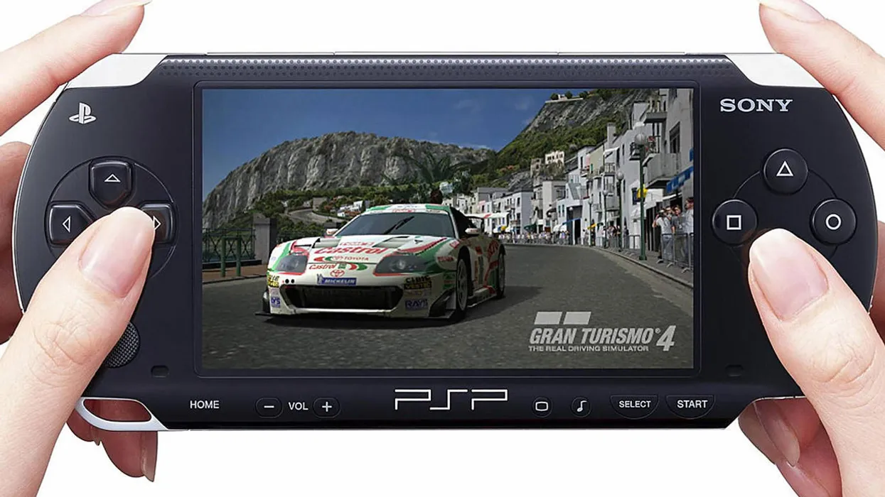

	PlayStation Portable

	</captioned>

- 2004: Nintendo DS

	The **Nintendo DS** introduced a **dual-screen** setup with the bottom display featuring a resistive **touchscreen** operated via a **stylus**. The DS trained over 150 million users to interact with digital interfaces through direct **touch**, **dragging**, and **gestures**. It included a built-in microphone for **voice commands**.

	<captioned>

	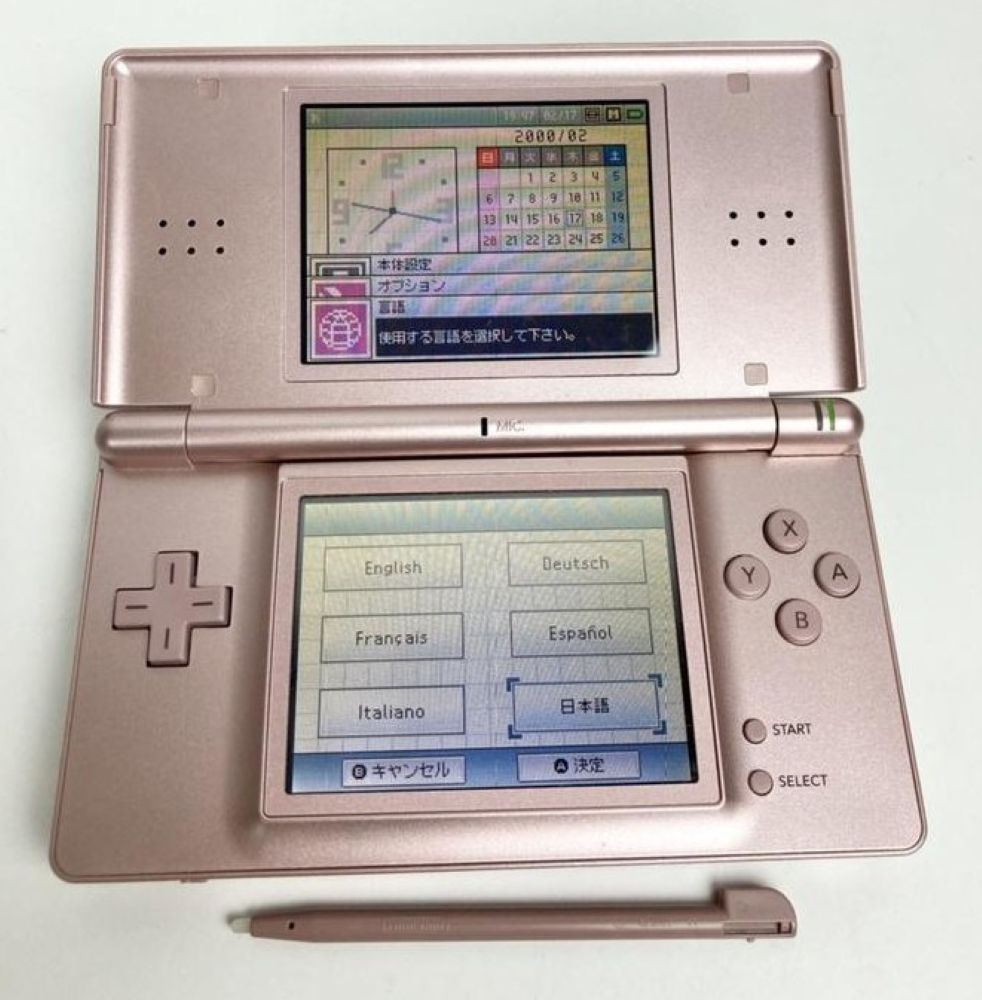

	Nintendo DS

	</captioned>

- 2004: World of Warcraft

	**World of Warcraft (WoW)**, developed by **Blizzard Entertainment** brought massively multiplayer online role-playing games (**MMORPGs**) into the mainstream and set a new blueprint for online community design. WoW moved the focus from endless monster grinding in older games like EverQuest to structured, **story-driven quests**, allowing millions of casual players alongside hardcore fans to enjoy it. The game acted as a **massive social hub** where online guilds formed deep, real-life friendships and it became a cultural phenomena.

	<captioned>

	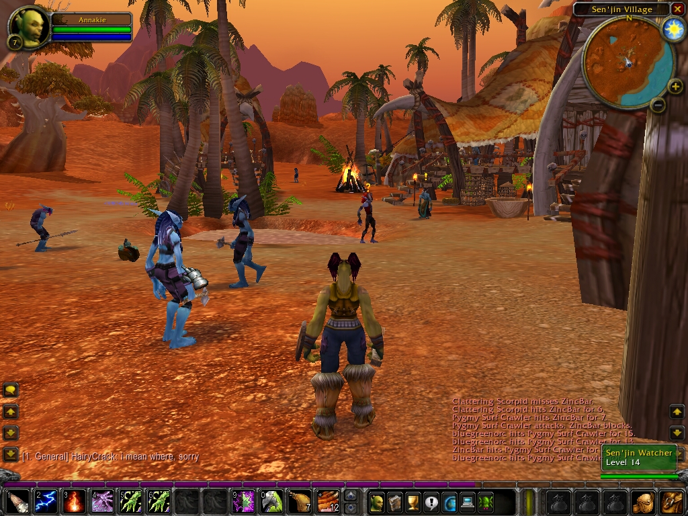

	World of Warcraft

	</captioned>

- 2004: Facebook

	**Facebook**, launched as 'Thefacebook' by **Mark Zuckerberg** and Harvard classmates as a campus directory. Later it opened publicly to anyone over 13, introduced the **News Feed**, and became a **social media** phenomenon.

    Handling billions of active users forced Facebook to pioneer breakthroughs in distributed data storage, massive databases, and efficient data center design. Facebook open-sourced some technologies, including **React** (now a dominant web interface library) and **GraphQL** (an API query language), but also pursued ethically questionable **user data tracking**, **targeted advertising**, and **algorithmic feed** models.

	<captioned>

	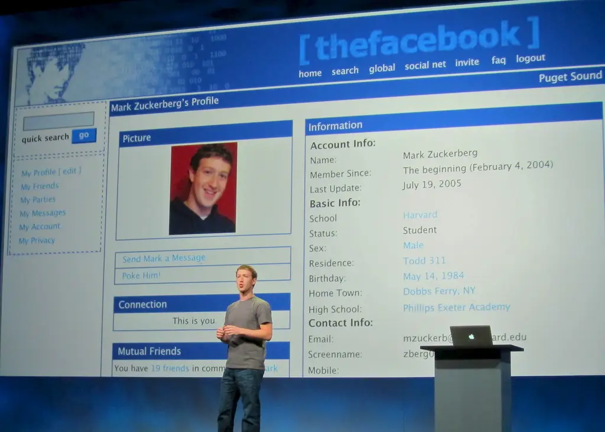

	Zuckerburg and Facebook

	</captioned>

- 2004: Firefox Browser

	**Mozilla**'s **Firefox web browser** offered an **open** alternative in web browsing. By 2003, Microsoft's **Internet Explorer (IE)**, which was bundled with Windows, controlled **95%** of the browser market, and Microsoft had stopped updating and improving IE, leaving it full of unpatched bugs and vulnerabilities. Firefox, with its **Gecko** rendering engine, supported **modern web standards**, and its **extension** system let users customise the browser. It achieved **100 million downloads in its first year** and went on to capture **30%** of the browser market, forcing Microsoft back into active browser development.

	<captioned>

	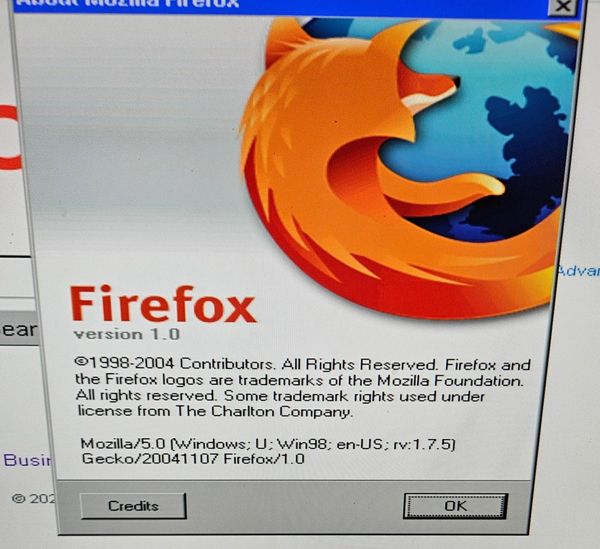

	Mozilla Firefox 1.0

	</captioned>

- 2004: Gmail

	**Google** launched **Gmail** with **1GB** of free storage - hundreds of times more than its competitors. With so much free storage, Gmail popularized the concept of 'keep everything', meaning users could forget about having to manage their inbox, instead replying on Google's **powerful search** to find what they needed. Gmail was an iconic **Web 2.0** application, utilising **AJAX** (Asynchronous JavaScript and XML) to create a great **interactive** user experience, on a par with a native desktop app. Gmail paved the way for other Google apps like Google **Maps** and Google **Docs**.

	<captioned>

	

	Gmail

	</captioned>

- 2005: YouTube

	**YouTube** made publishing and watching **user-created video** simple through a web browser. Another iconic **Web 2.0** app, it accelerated the growth of online video and participatory media. The explosive popularity of YouTube meant it had to push the boundaries of **video compression**, and **distributed storage** infrastructure to allow the storage and streaming of billions of videos. Today, creators upload more than 500 hours of video every minute to YouTube. It would take a single person over 80 years of continuous, non-stop watching to view the content uploaded in just one day.

	<captioned>

	

	YouTube's first uploaded video

	</captioned>

- 2005: Git Version Control

	**Linus Torvalds** created **Git** to manage the **source code** of the **Linux kernel**. The design of Git made **collaboration** and **reviewing** code changes practical for large software projects. The system is now the most widely used **source code management system (SCM)** in the world, used within thousands of businesses and behind the scenes at code repository sites like **GitHub** and **GitLab**.

	<captioned>

	

	Git version control

	</captioned>

- 2006: GPU Computing

	**Graphics Processing Units** (**GPUs**) are designed for processing graphics, calculating the colour of **millions of pixels in parallel**, but this also makes them suitable for other massively parallel calculations. The birth of **General-Purpose computing on Graphics Processing Units (GPGPU)** was driven by **NVIDIA**'s launch of the **CUDA (Compute Unified Device Architecture)** platform. This meant GPUs could be used for general-purpose **parallel computing**, later making them especially useful for **training neural networks**.

	<captioned>

	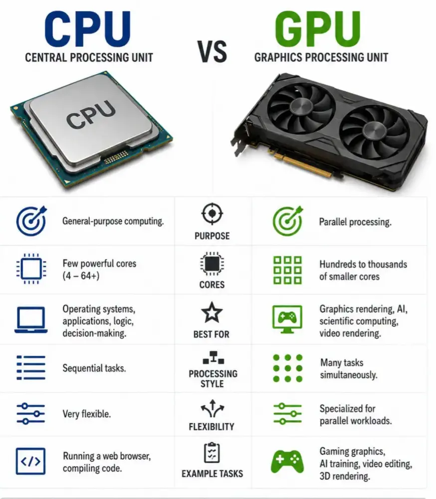

	CPU vs GPU processing

	</captioned>

- 2006: Amazon Web Services

	**Amazon Web Services (AWS)** launched **Simple Storage Service (S3)** and **Elastic Compute Cloud (EC2)**, allowing businesses and developers to **rent storage and computing power** in the 'cloud', **replacing expensive physical servers** with an **on-demand**, **pay-as-you-go** digital infrastructure. It also allowed small teams and college students to rent enterprise-grade computing power for minimal cost. AWS has expanded with other cloud offerings and has helped spawn the '**serverless**' era.

	<captioned>

	

	Amazon Web Services

	</captioned>

- 2006: Xero Accounting SaaS

	**New Zealand** company **Xero** began developing **cloud accounting software** for small businesses. Instead of installing an accounting program on one computer, customers could access their records through the **Internet** from **multiple devices**. Xero proved that a global **software-as-a-service (SaaS)** company could scale internationally from **Wellington**. Xero now holds **over 60%** of the online accounting market share in New Zealand and Australia.

	<captioned>

	

	Xero in Wellington

	</captioned>

- 2006: Nintendo Wii

	The **Nintendo Wii** used a **motion-sensitive controller** to make movement part of the game. The console sidestepped the game industry’s focus on raw processing power, instead creating a lower-powered console with a fun, novel **Natural User Interface (NUI)**. Users didn't need to memorize a layout of buttons; swinging a controller to swing a virtual racket made computer input instantly intuitive. The massive success of the Wii prompted the development of **Microsoft's Kinect** and **Sony's PlayStation Move**.

	<captioned>

	

	Fun on the Nintendo Wii

	</captioned>

- 2006: Intel Core 2 Duo

    **Intel** launched the **Core 2 Duo**, a low-power, efficient, **multi-core CPU**. Prior to this, the computer industry was locked in a brutal 'Gigahertz race', pushing CPU clock speeds higher and higher, but leading to chips became dangerously hot, inefficient, and power-hungry. The Core 2 Duo's internal architecture was so efficient that even a low-end Core 2 Duo could easily outperform a top-of-the-line Pentium 4, despite having almost half the clock speed. It also **dropped power consumption by roughly 40%**, making it ideal for laptops and other mobile devices.

	<captioned>

	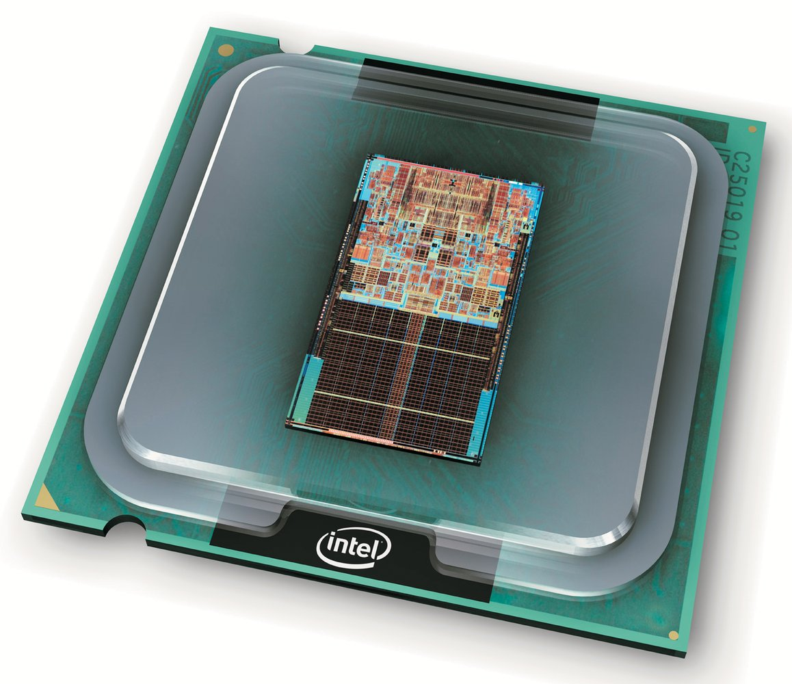

	Intel Core 2 Duo

	</captioned>

- 2006: New Zealand's KAREN Network

	**New Zealand**'s **Kiwi Advanced Research and Education Network (KAREN)** connected **universities** and Crown **research institutes** with high-speed fibre connections, and provided international Internet connectivity, supporting data-intensive research, innovation, and tertiary education.

	<captioned>

	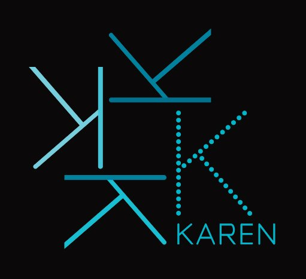

	KAREN academic network

	</captioned>

- 2007: iPhone

    **Apple**'s launch of the **iPhone** was a significant event for personal computing, helping to permanently shift the focus from full-sized computers towards ubiquitous, **pocket-sized smartphones**.

    Its **3.5-inch touchscreen**, **412MHz ARM processor** and **16GB** of storage were innovative for the time. The iPhone introduced a **multi-touch user interface** that allowed fluid interactions with software using touches and gestures. Other smartphones relied on physical keyboards or plastic styluses for user input. With **pinch-to-zoom**, **inertial scrolling**, and context-aware **virtual keyboards**, the iPhone established a new form of HCI.

    The iPhone successfully combined multiple devices in one: **phone**, **camera**, **MP3 player** and a **web browser**, rendering full websites, not the cut-down mobile variants competing phones relied on. Thanks to its powerful **Unix-based operating system**, it could run a wide variety of **apps**, and the **App Store** offered a central, curated marketplace, allowing small indie developers to achieve global distribution instantly.

	<captioned>

	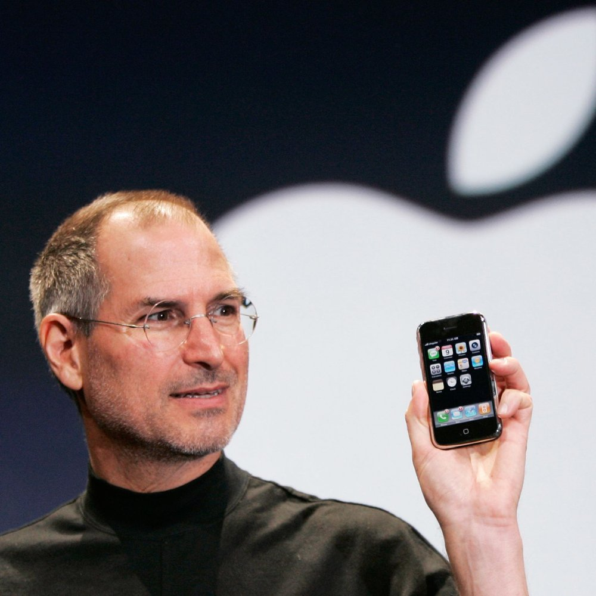

	Steve Jobs launces the iPhone

	</captioned>

	<captioned>

	

	First-generation iPhone

	</captioned>

- 2007: ASUS Eee PC 701 Netbook

    The **ASUS Eee PC 701** wasn't built to replace a main computer; it was a companion device meant for **basic web surfing and email**. Most consumer laptops at the time were bulky and heavy. By stripping out an optical CD-ROM drive, omitting a heavy graphics card, and utilizing a **low-power processor** like the **Intel Atom**, ASUS and other manufacturers created a new category of small, simple, cheap laptops, or '**netbooks**' as they became known. Most used tiny **4GB to 8GB flash storage modules** and shipped with custom, lightweight **Linux** distributions. These small, tough, basic devices were the spiritual ancestors of the Google Chromebook.

	<captioned>

	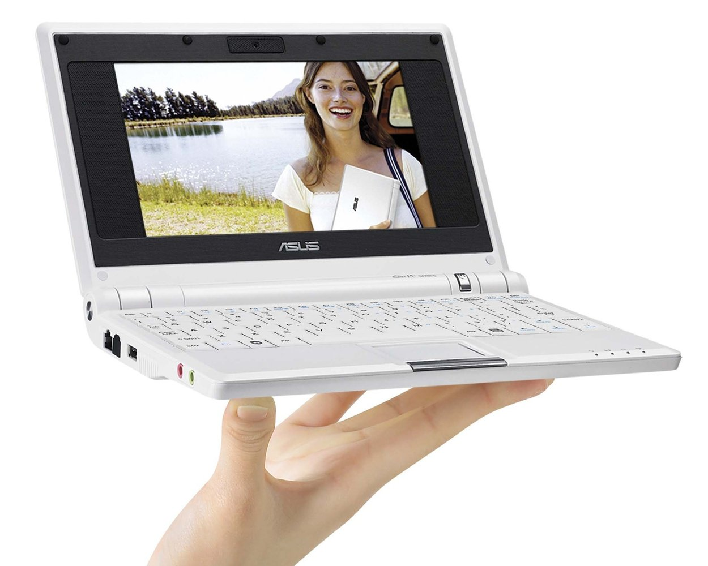

	ASUS Eee PC 701 netbook

	</captioned>

- 2008: Android OS

	**Google** and the **Open Handset Alliance** released **Android** as a **Linux-based mobile operating system** that could compete with the iPhone and iOS. Android allowed dozens of hardware manufacturers (like **Samsung**, **HTC**, and **Motorola**) to build affordable smartphones that had a consistent, well-designed OS, helping further establish smartphones as the primary computing device for many people.

    Unlike Apple's closed iOS ecosystem, Android's **open-source** model gave developers and device makers deep customisability, sparking rapid innovations in hardware and software. Android surpassed iOS in 2012 to become **the world's most popular mobile operating system**.

    Android has evolved beyond smartphones, now powering smart TVs (**Android TV**), wearables (**Wear OS**), and vehicles (**Android Auto**). Android ensured Google services remained the default gateway for mobile users worldwide, and the creation of the **Android Market (later Google Play)** gave independent developers an open and global platform to distribute and sell their work.

	<captioned>

	

	Android 1.0

	</captioned>

	<captioned>

	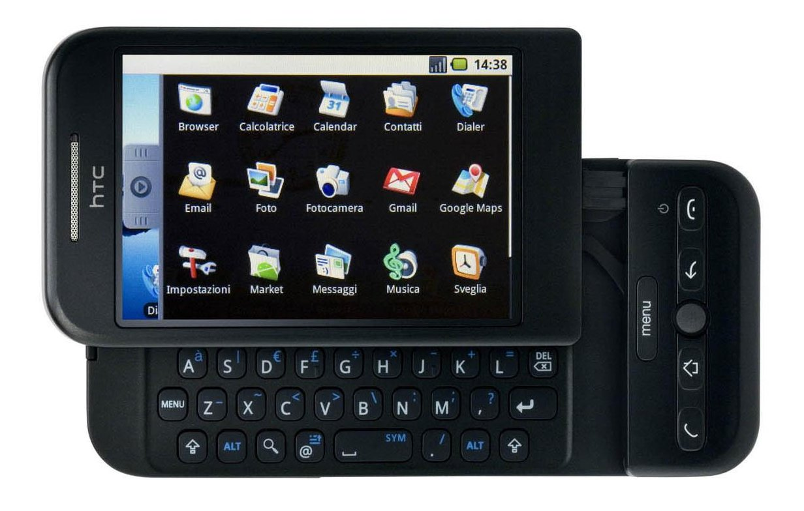

	HTC Dream the first Android smartphone

	</captioned>

- 2009: Bitcoin

	**Bitcoin** introduced a **decentralised digital-currency** system based on a public **blockchain** and **proof-of-work mining**. It was created by a person or group using the pseudonym **Satoshi Nakamoto**, whose real identity remains unknown. Its design limits the total supply to 21 million coins, of which more than 20 million have now been mined.

	<captioned>

	

	Bitcoin's value since launch

	</captioned>

</timeline>

<pagination class="bottom">

- [Early](/history/pre.md)
- [1940s](/history/1940s.md)
- [1950s](/history/1950s.md)
- [1960s](/history/1960s.md)
- [1970s](/history/1970s.md)
- [1980s](/history/1980s.md)
- [1990s](/history/1990s.md)
- 2000s
- [2010s](/history/2010s.md)
- [2020s](/history/2020s.md)
- [Future](/history/future.md)

</pagination>

