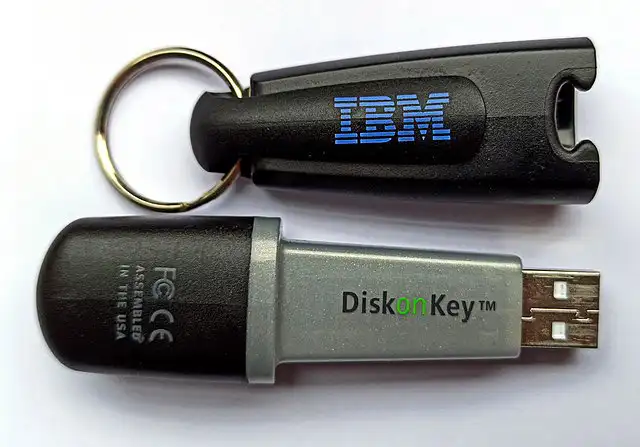
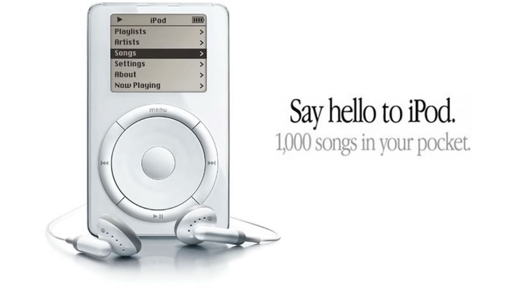
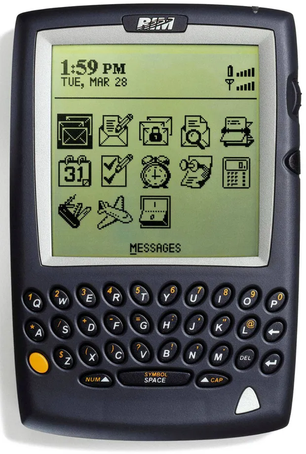
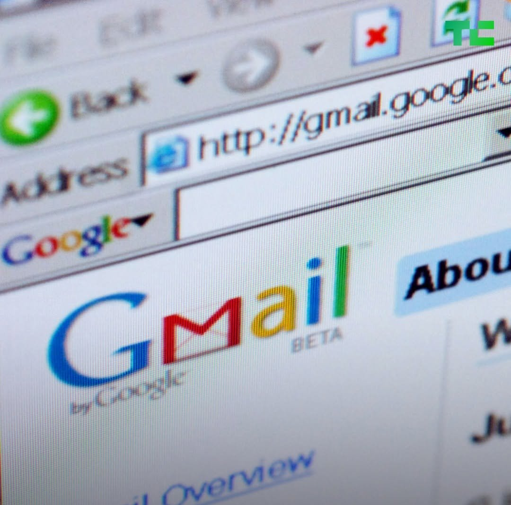
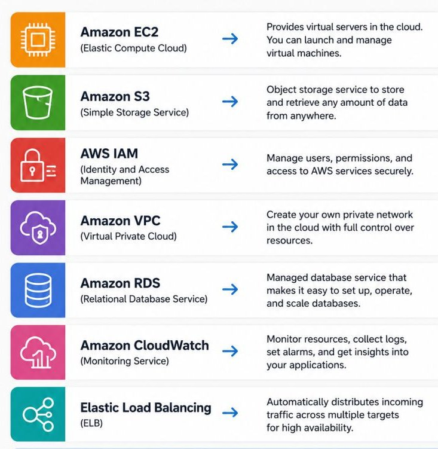
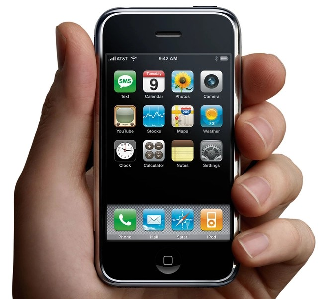
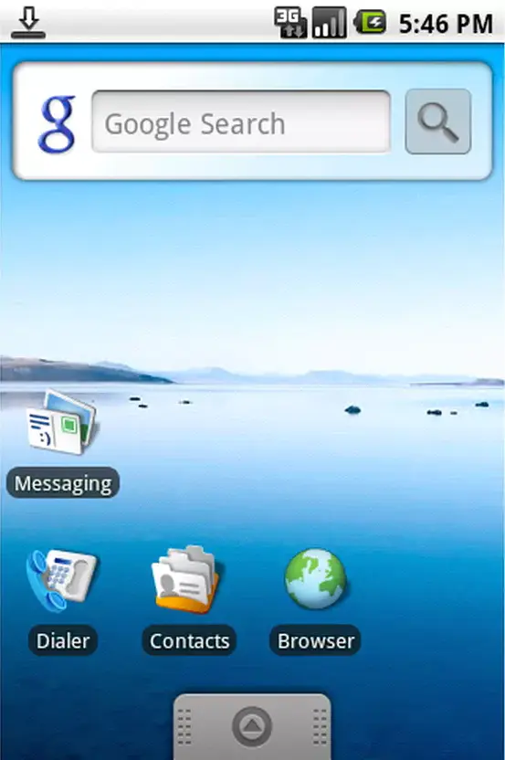
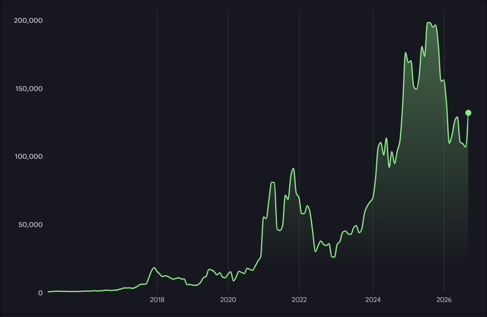

# 2000s - The Mobile Computing Revolution

<pagination>

- [Early](/history/pre.md)
- [1940s](/history/1940s.md)
- [1950s](/history/1950s.md)
- [1960s](/history/1960s.md)
- [1970s](/history/1970s.md)
- [1980s](/history/1980s.md)
- [1990s](/history/1990s.md)
- 2000s
- [2010s](/history/2010s.md)
- [2020s](/history/2020s.md)
- [Future](/history/future.md)

</pagination>

The 2000s shifted computing from stationary desktops into our pockets through the creation of the smartphone and the rise of high-speed broadband. Internet connections transitioned from dial-up to always-on access, and the rise of interactive, 'Web 2.0' websites like YouTube and Facebook drove the start of the social media revolution.

<timeline>

- 2000: USB flash drives

	USB flash drives began replacing floppy disks as a convenient way to carry files. The first commercially available USB drive stored 8MB and cost $1000.

	<captioned>

	

	The first USB flash drive

	</captioned>

- 2000: C#

	Microsoft introduced C# as a modern, type-safe language for the .NET platform. It compiled to intermediate language for the Common Language Runtime and was created partly as a competitor to Java.

	<captioned>

	

	C# programming language

	</captioned>

- 2000: Internet reaches about 72 million hosts

	Around 72 million hostnames were recorded on the Internet, while estimates put the number of users at roughly 360 million. The difference matters: one person could use several devices, and one organisation could operate many hosts.

- 2000s: Broadband Internet

	DSL and cable broadband replaced dial-up for many homes, providing always-on connections that were fast enough for music, video, online games and richer websites. Broadband changed the Internet from an occasional destination into everyday infrastructure.

- 2001: Mac OS X

	Apple released Mac OS X with a Unix foundation, the Darwin kernel and the Aqua graphical interface. This platform became the basis for Apple's later macOS, iOS, iPadOS and watchOS systems.

	<captioned>

	

	Mac OS X

	</captioned>

- 2001: iPod

	The first iPod used a 5GB miniature hard drive, stored about 1,000 songs and offered up to 10 hours of battery life. Its scroll wheel and FireWire connection made it easy to carry and quickly load a large music collection.

	<captioned>

	

	iPod

	</captioned>

- 2003: 64-bit CPUs

	AMD's 2003 Opteron introduced the x86-64 instruction set, which extended the familiar x86 architecture while retaining compatibility with 32-bit software. 64-bit processors allowed operating systems and applications to use much larger memory spaces.

	<captioned>

	

	64-bit processor

	</captioned>

- 2003: BlackBerry Mobile

	BlackBerry devices combined email, messaging and phone calls in a pocket computer. Their physical keyboards and push email made mobile communication an everyday business tool before touch-screen smartphones took over.

	<captioned>

	

	BlackBerry

	</captioned>

- 2004: Firefox

	Mozilla Firefox offered an open alternative in web browsing. Its Gecko rendering engine supported modern web standards and its extension system let users customise the browser.

	<captioned>

	

	Mozilla Firefox

	</captioned>

- 2004: Gmail

	Google launched Gmail with 1GB of storage and powerful search, offering far more space than many competing services. It showed how much software could be delivered as an online service.

	<captioned>

	

	Gmail

	</captioned>

- 2005: YouTube

	YouTube made publishing and watching user-created video simple through a web browser and Flash video playback. It accelerated the growth of online video and participatory media.

	<captioned>

	

	YouTube's first uploaded video

	</captioned>

- 2006: Amazon Web Services

	Amazon launched S3 object storage and EC2 virtual servers, allowing developers to rent storage and computing power over the Internet. These services helped make elastic cloud infrastructure a normal software platform.

	<captioned>

	

	Amazon Web Services

	</captioned>

- 2007: iPhone

	Apple's iPhone combined a mobile phone, web browser and multi-touch interface. Its 3.5-inch screen, 412MHz ARM processor and up to 16GB of storage helped make smartphones general-purpose computers that people carried everywhere.

	<captioned>

	

	First-generation iPhone

	</captioned>

- 2008: Android OS

	Google and the Open Handset Alliance released Android as a Linux-based mobile operating system with a Java-style application framework. It enabled many manufacturers to build smartphones and helped make touch-screen computing widespread.

	<captioned>

	

	Android smartphone

	</captioned>

- 2008: Git Version Control

	Linus Torvalds created Git to manage the Linux kernel. Its distributed design, content-addressed object database and fast branching made collaboration and reviewing changes practical for large software projects.

	<captioned>

	

	Git version control

	</captioned>

- 2009: Bitcoin

	Bitcoin introduced a decentralised digital-currency system based on a public blockchain and proof-of-work mining. It was created by a person or group using the pseudonym Satoshi Nakamoto, whose real identity remains unknown. Its design limits the total supply to 21 million coins, or which over 20 million have been mined.

	<captioned>

	

	Bitcoin's value since launch

	</captioned>

</timeline>

<pagination class="bottom">

- [Early](/history/pre.md)
- [1940s](/history/1940s.md)
- [1950s](/history/1950s.md)
- [1960s](/history/1960s.md)
- [1970s](/history/1970s.md)
- [1980s](/history/1980s.md)
- [1990s](/history/1990s.md)
- 2000s
- [2010s](/history/2010s.md)
- [2020s](/history/2020s.md)
- [Future](/history/future.md)

</pagination>

