# 2010s - Cloud Computing and Big Data

<pagination>

- [Early](/history/pre.md)
- [1940s](/history/1940s.md)
- [1950s](/history/1950s.md)
- [1960s](/history/1960s.md)
- [1970s](/history/1970s.md)
- [1980s](/history/1980s.md)
- [1990s](/history/1990s.md)
- [2000s](/history/2000s.md)
- 2010s
- [2020s](/history/2020s.md)
- [Future](/history/future.md)

</pagination>

Faster **mobile networks**, multi-core ARM processors and capable cameras made **smartphones** the dominant form of personal computing for many people; apps, maps, payments and social communication become part of everyday life. **Cloud storage**, **hosted databases** and **on-demand computing** became standard infrastructure for organisations. **Big data** became big business, where information collected about people's habits drove **targeted advertising** at them. Physical media such as CDs and DVDs declined as people transitioned to **streaming services**. Access to vast amounts of data and cloud computing also drove research and development of **artificial intelligence** systems.

<timeline>

- 2010: Two Billion People Online

	The number of **Internet** users passed roughly **two billion**, around **30% of the world's population**. Internet access was shifting from desktop computers to smartphones, shared public connections and always-on broadband.

	<captioned>

	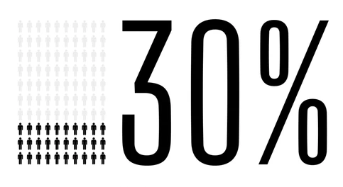

	30% of the world online

	</captioned>

- 2010s: Ultrafast Fibre Broadband (UFB)

	**Fibre optic** based **ultra-fast broadband (UFB)** rolled out for most homes, schools and businesses in **New Zealand** during this and the following decade, providing **always-on connections** with speeds up to **100Mbps** or more. This made a household internet connection suitable for **high definition (HD) video streaming**, contributing to the decline of terrestrial and satellite TV.

	<captioned>

	

	Fibre optic UFB

	</captioned>

- 2010s: Mobile Gaming

	**Smartphones** and **app stores** made games available to billions of people without a dedicated console. **Free-to-play** games, **touch controls** and **in-app purchases** created a new business model, making mobile gaming a central part of the games industry. Today, mobile gaming accounts for around **50%** of the global gaming market.

	<captioned>

	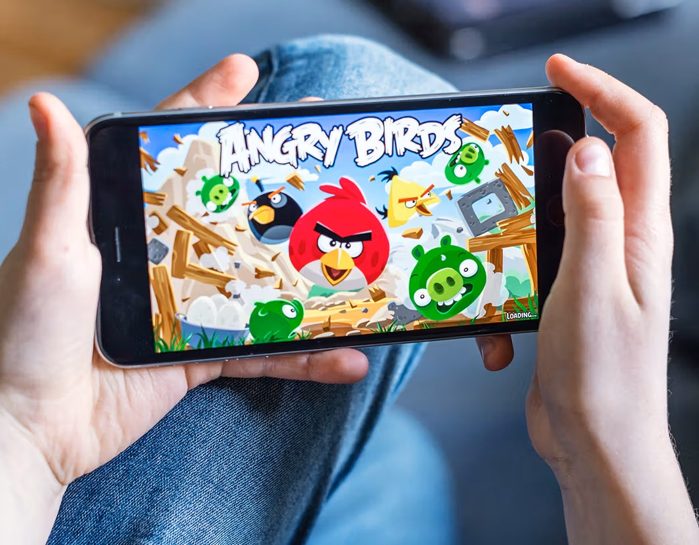

	Mobile gaming on a smartphone

	</captioned>

- 2010: iPad

	**Apple**'s **iPad** made **tablet** computing a mainstream product. The first model used a **1GHz A4 system-on-chip**, a **9.7-inch 1024x768 display** and **16-64GB of storage**. Its large touch screen was ideally suited to reading, watching video, playing games and using creative apps. Before 2010, the computer industry was obsessed with netbooks - small, cheap, low-powered laptops. The iPad effectively eradicated the netbook market; consumers preferred a highly optimized, responsive touch device. A new category of mobile computing device was created that sat between pocket-sized smartphones and full-sized laptops.

	<captioned>

	

	Apple iPad

	</captioned>

- 2011: IPv4 Address Exhaustion Begins

	IANA allocated its **last large blocks of IPv4 addresses** to regional Internet registries. All of the available '**dotted-quad**', **32-bit** addresses (IPv4 uses addresses like 64.12.178.200) had been assigned to regions. The 32-bit address space had been designed when it was assumed only a limited number of computers would ever be connected to the Internet, but with billions of devices now online, it proved inadequate. This resulted in some reallocation of existing address and increased pressure to adopt the newer, much larger **IPv6** address space.

	<captioned>

	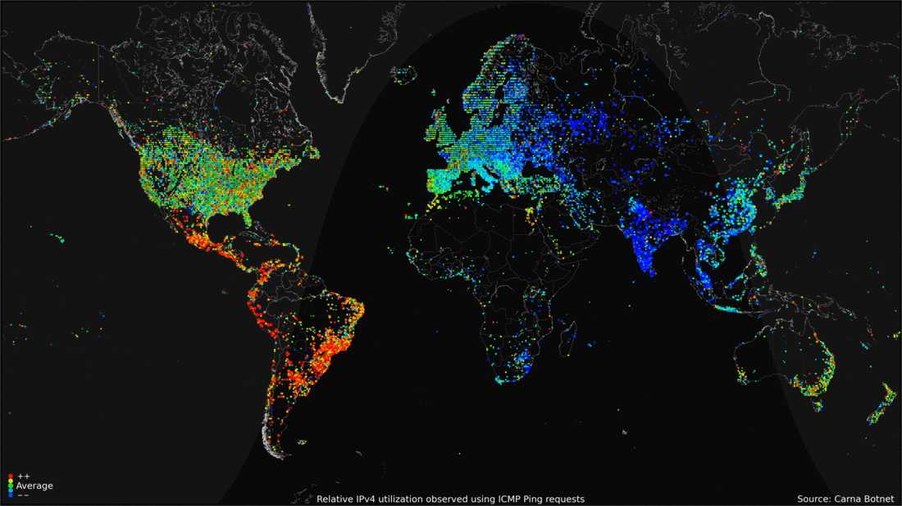

	IPv4 usage globally

	</captioned>

- 2011: Minecraft

    Swedish developer **Markus 'Notch' Persson** coded a simple **block-building sandbox game** inspired by titles like Infiniminer. Released publicly on the TIGSource forums in 2009, the indie project rapidly evolved, adding survival mechanics, crafting, and hostile mobs before its official full release as version **1.0** in November 2011.

    Following its massive viral success and the establishment of **Mojang Studios**, Microsoft acquired the game for **$2.5 billion** in 2014. It has since expanded across multiple platforms, received continuous major updates, and grown into the **best-selling video game of all time** with hundreds of millions of players worldwide.

	<captioned>

	

	Very early Minecraft

	</captioned>

- 2011: Google Chromebooks

	**Chromebooks** used the **Linux-based ChromeOS**, **browser-focused software** and **cloud services** instead of traditional desktop applications. They became common in schools because they were **inexpensive**, **simple to manage** and could run on **modest hardware**.

	<captioned>

	

	Chromebook

	</captioned>

- 2011: IBM Watson Wins Jeopardy!

	**IBM Watson** defeated human contestants on the quiz show **Jeopardy!** during a three-day special featuring the show's all-time greatest players. Watson was developed over four years by IBM researchers and relied on **massive parallel processing**, and **probabilistic natural language processing** to parse complex, ambiguous human phrasing, puns, and trivia, proving for the first time that this was possible. Watson's win marked a major milestone in **artificial intelligence (AI)**.

	<captioned>

	

	IBM Watson wins Jeopardy!

	</captioned>

- 2012: Fei-Fei Li and ImageNet

	**Dr. Fei-Fei Li**, widely known as '**The Godmother of AI**', revolutionized modern artificial intelligence by co-creating **ImageNet**, a vast database of roughly **15 million labelled images**. This dataset served as the training data and benchmark that led to breakthroughs in deep learning, when advanced **neural networks** first proved capable of **high-accuracy object recognition**.

	<captioned>

	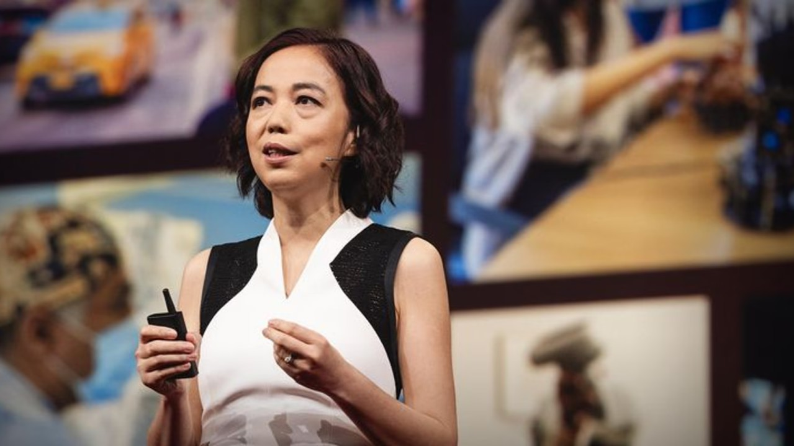

	Fei-Fei Li launching ImageNet

	</captioned>

- 2012: Raspberry Pi

	The original **Raspberry Pi Model B** put a **700MHz ARM11 processor**, **256MB of RAM** and an **SD-card slot** on a board costing **US$35**. It defined a new category of small, cheap **single-board computers (SBC)** that became popular for teaching programming, electronics and physical computing.

	<captioned>

	

	Raspberry Pi

	</captioned>

- 2012: Titan Supercomputer

	The **Titan** supercomputer combined conventional **AMD processors** with more than **299,008 CPU cores** and **50,213,248 NVIDIA GPU accelerator cores**. It achieved **17.59 quadrillion floating point operations per second (PFLOPS)**, showing how graphics processors could massively accelerate scientific calculations.

	<captioned>

	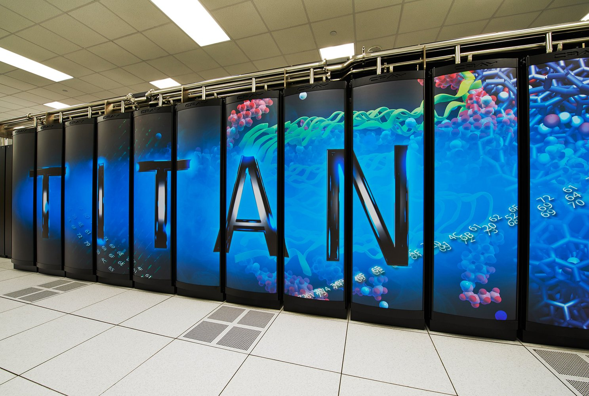

	Titan supercomputer

	</captioned>

- 2012: Oculus Rift

	The **Oculus Rift** kicked off the modern era of **virtual reality (VR)**. Hardware enthusiast, **Palmer Luckey**, built the first prototype of the Rift using cheap, off-the-shelf smartphone displays and low-power electronics. John Carmack (co-founder of id Software and creator of Doom) demonstrated it at the 2012 E3 gaming convention, generating massive hype. A Kickstarter campaign raised **$2.4 million** to develop the headset. Mark Zuckerberg acquired Oculus VR for **$2 billion** in 2014.

	<captioned>

	

	Oculus Rift

	</captioned>

- 2012: AlexNet Deep Learning

    Deep-learning model, **AlexNet**, revolutionized computer vision and triggered the modern deep learning boom by **winning the ImageNet Large Scale Visual Recognition Challenge**. It won the ImageNet contest by achieving a top-5 error rate of 15.3%, beating the runner-up by a huge 10.9 percentage points. It used an **eight-layer Convolutional Neural Network (CNN)** with roughly **60 million parameters**.

	<captioned>

	

	AlexNet neural network

	</captioned>

- 2015: Apple Watch

	The **Apple Watch** brought **sensors**, **notifications** and **small apps** to a **wearable** computer, turning smartwatches from a niche gadget category into a mainstream consumer market. The device claimed **over 50%** of the global smartwatch market by the end of its first year. The inclusion of an optical heart rate sensor and daily activity rings popularised continuous health monitoring.

	<captioned>

	

	Apple Watch

	</captioned>

- 2015: Te Mana Raraunga

	**Te Mana Raraunga**, the **Māori Data Sovereignty Network**, formed to support Māori rights and interests in data. Māori data sovereignty asks who controls data about Māori, how it is used and how it can support Māori and iwi aspirations. It established six core data principles: **Rangatiratanga** (Authority), **Whakapapa** (Relationships), **Whanaungatanga** (Obligations), **Kotahitanga** (Collective benefit), **Manaakitanga** (Reciprocity), and **Kaitiakitanga** (Guardianship). The principles treat **data as a living taonga (treasure)** rather than a neutral asset.

	<captioned>

	

	Te Mana Raraunga

	</captioned>

- 2016: Over Three Billion People Online

	Global **Internet** use passed roughly **3.4 billion people**, or **45% of the world's population**. Billions of phones, computers, servers and connected devices were now communicating across networks built on the original Internet architecture.

	<captioned>

	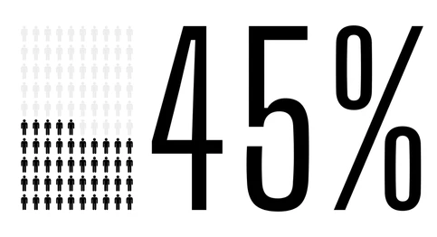

	45% of the world online

	</captioned>

- 2016: AlphaGo Wins at Go

	**DeepMind**'s **AlphaGo** defeated world champion Go player, **Lee Sedol**. AlphaGo’s 4-1 victory proved that machine learning could conquer intuition-heavy, complex domains previously thought impossible for computers. Go was too vast for any sort of brute-force solution (the possible games exceed the number of atoms in the universe), so AlphaGo combined **deep neural networks** with **reinforcement learning**, teaching itself by playing millions of games against human data and later against itself.

	<captioned>

	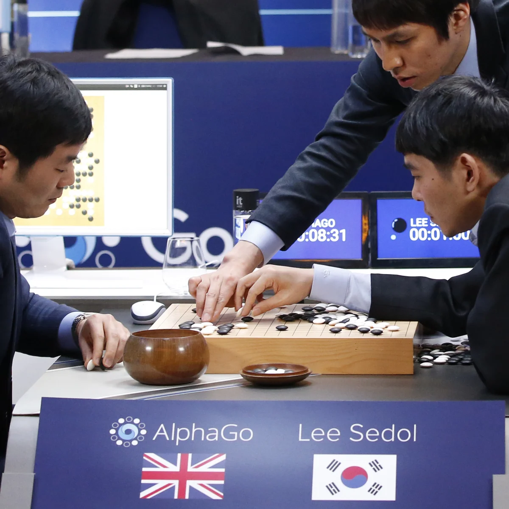

	AlphaGo plays Lee Sedol

	</captioned>

- 2016: Pokémon Go

	**Pokémon Go** combined **smartphone maps**, camera-based **augmented-reality** and **location data** with a familiar game franchise. Players explored real places to find virtual creatures. The game was a global cultural phenomenon and made augmented-reality gaming visible to a worldwide public.

	<captioned>

	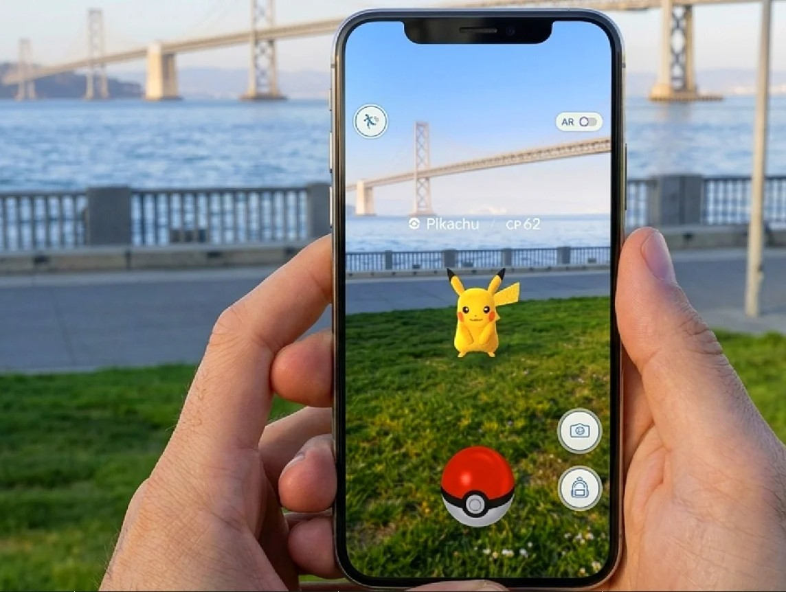

	Pokémon Go

	</captioned>

- 2016: IPv6 Adoption Grows

	As the supply of IPv4 addresses became scarce, organisations increasingly deployed **IPv6**. Its **128-bit addresses** provide a vastly **larger address space** than IPv4's 32-bit addresses and support continued Internet growth.

	<captioned>

	

	IPv6 vs IPv4

	</captioned>

- 2016: Tensor Processing Units and Tensor Cores

	Modern **artificial intelligence** needs huge numbers of matrix calculations. **Google's Tensor Processing Units (TPUs)** and **NVIDIA's tensor cores** are specialised hardware designed to perform these calculations quickly and efficiently. This hardware helped make large **neural networks** practical for image recognition, language models and other machine-learning systems.

	<captioned>

	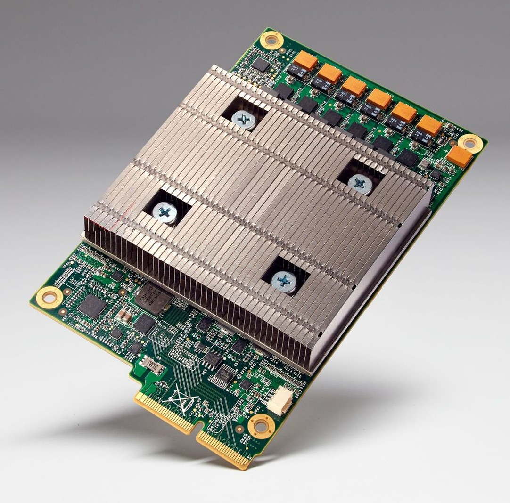

	Google's first gen TPU

	</captioned>

- 2017: Transformer Architecture

	Researchers of **neural networks** introduced the **transformer** architecture, which used **attention mechanisms** to process **relationships between words** efficiently. They replaced sequential data processing with **parallel processing**, allowing machine learning workloads to make use of the **matrix-multiplying** power of **Graphics Processing Units (GPUs)** and **Tensor Processing Units (TPUs)**. Transformers became the technical foundation for many modern language and generative AI systems (the 'T' in ChatGPT).

	<captioned>

	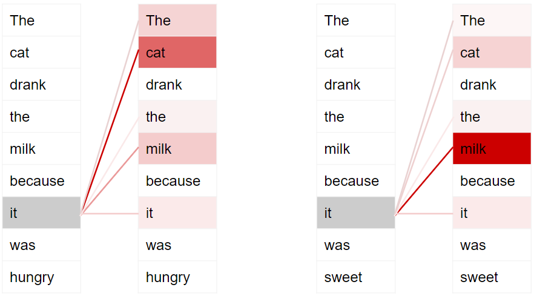

	Attention focuses on the meaning 'it' from the context

	</captioned>

- 2018: Algorithmic Bias and Accountability

	**Dr. Joy Buolamwini** along with **Timnit Gebru** transformed the field of AI by exposing **systemic racial and gender bias** in facial recognition technology. Their groundbreaking research revealed that commercial facial analysis systems by major tech companies had **error rates of up to 35% for darker-skinned women**, compared to **less than 1% for lighter-skinned**. Her work helped make bias, testing and accountability central questions in artificial intelligence.

	<captioned>

	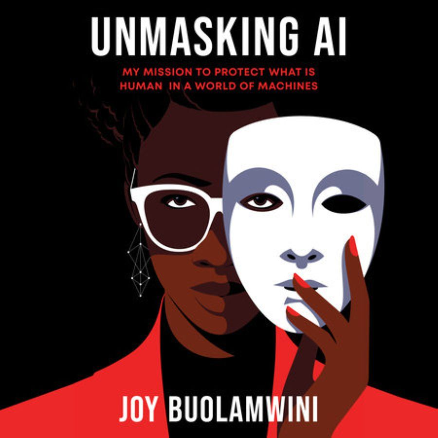

	Dr. Joy Buolamwini's book

	</captioned>

- 2018: GDPR and Data Protection

	The **General Data Protection Regulation (GDPR)** came into force in the **European Union**. It strengthened rules about **personal data**, **consent**, **access** and **deletion**, and influenced privacy law and online services around the world.

	<captioned>

	

	Protecting data across networks

	</captioned>

- 2019: Google Sycamore Quantum Supremacy

	Google's **Sycamore** processor used **53 superconducting qubits** to perform a specialised sampling experiment in about **200 seconds**. Google claimed this achieved **quantum supremacy**, stating that the task would take a classical supercomputer over 10,000 years. The result demonstrated a significant experimental milestone.

	<captioned>

	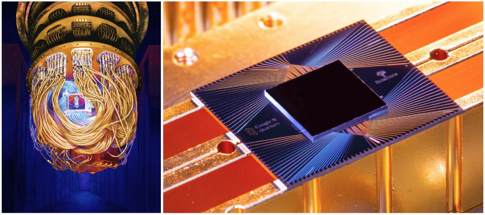

	Google's Sycamore quantum chip

	</captioned>

</timeline>

<pagination class="bottom">

- [Early](/history/pre.md)
- [1940s](/history/1940s.md)
- [1950s](/history/1950s.md)
- [1960s](/history/1960s.md)
- [1970s](/history/1970s.md)
- [1980s](/history/1980s.md)
- [1990s](/history/1990s.md)
- [2000s](/history/2000s.md)
- 2010s
- [2020s](/history/2020s.md)
- [Future](/history/future.md)

</pagination>

