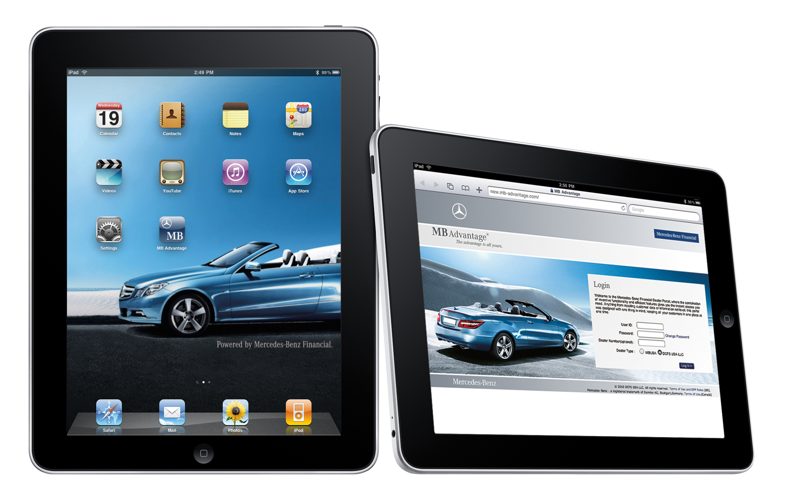
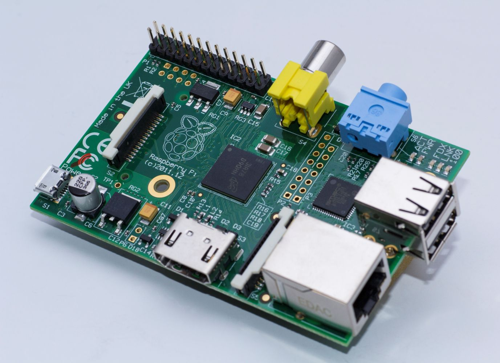
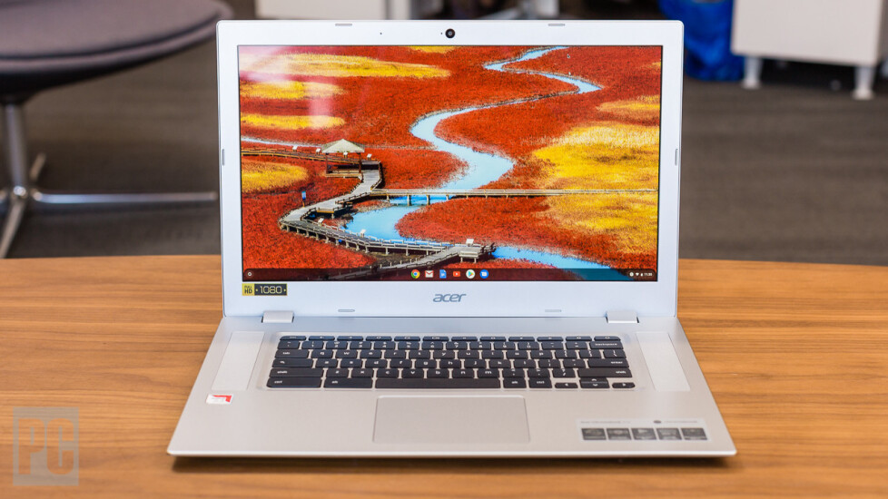
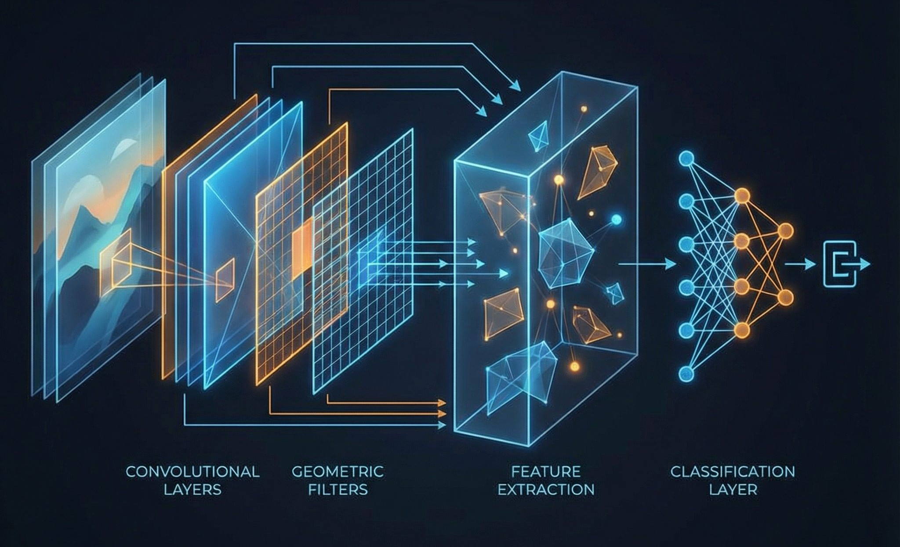
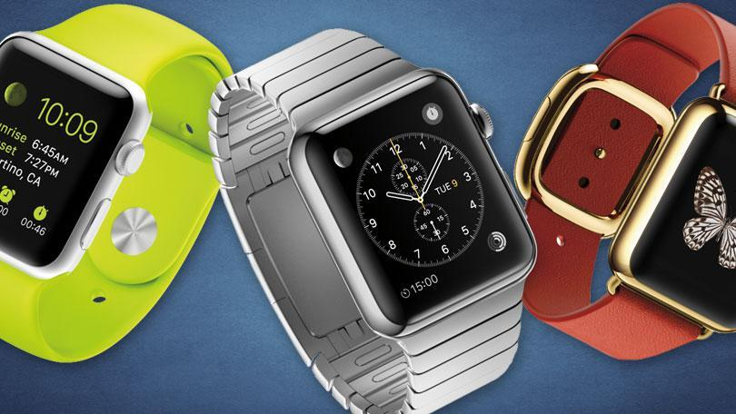
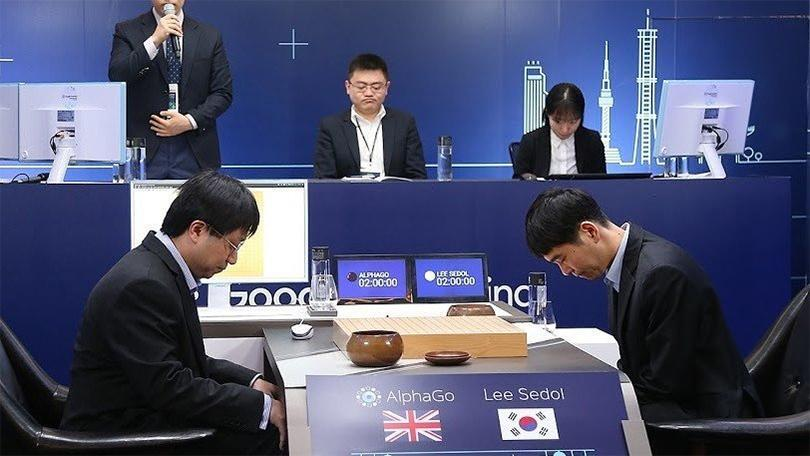
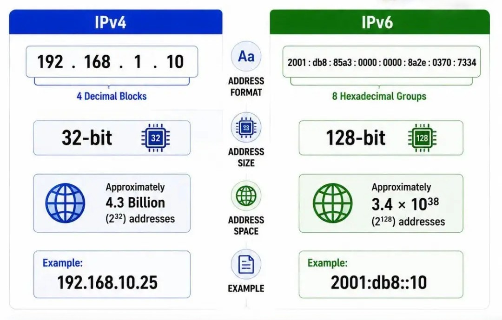

# 2010s - Cloud Computing and Big Data

For most people, their always-connected smartphone became the only computer they owned, and the Internet was the apps they used. Faster mobile networks, multi-core ARM processors and capable smartphone cameras made apps, maps, payments and social communication part of everyday computing. App stores gave developers a global distribution channel.

Online storage, hosted databases and on-demand computing became standard tools for organisations. Infrastructure-as-a-service let teams create virtual machines and networks through APIs, allowing software to scale without every team owning its own servers. Big data became big business, where information collected about people's habits drove targeted advertising at them.

Physical media such as CDs and DVDs disappeared as people transitioned to streaming services. Access to vast amounts of data and cloud computing also drove research and development of artificial intelligence system.

<timeline>

- 2010: iPad

	Apple's iPad made tablet computing a mainstream product. The first model used a 1GHz A4 system-on-chip, a 9.7-inch 1024x768 display and 16-64GB of storage. Its large touch screen suited reading, video, games and creative apps.

	<captioned>

	

	Apple iPad

	</captioned>

- 2011: Raspberry Pi

	The original Raspberry Pi Model B put a 700MHz ARM11 processor, 256MB of RAM and an SD-card slot on a board costing US$35. It became popular for teaching programming, electronics and physical computing.

	<captioned>

	

	Raspberry Pi

	</captioned>

- 2011: Minecraft

	Minecraft showed how a simple, programmable-looking world could support building, exploration and collaboration at enormous scale. It became one of the best-selling games ever made.

	<captioned>

	

	Minecraft

	</captioned>

- 2011: Google Chromebooks

	Chromebooks used the Linux-based ChromeOS, browser-focused software and cloud services instead of traditional desktop applications. They became common in schools because they were inexpensive, simple to manage and could run on modest hardware.

	<captioned>

	

	Chromebook

	</captioned>

- 2012: Deep learning breakthrough

	AlexNet showed that a deep neural network trained with GPUs could recognise objects in images much better than previous methods. Its eight-layer design helped start the modern machine-learning boom and demonstrated the value of large datasets and specialised hardware.

	<captioned>

	

	AlexNet neural network

	</captioned>

- 2013: Docker containers

	Docker made application containers practical for ordinary development and deployment. Containers package software with its dependencies while sharing the host operating system's kernel, helping make cloud applications portable and repeatable.

	<captioned>

	

	Docker container platform

	</captioned>

- 2013: Oculus Rift

	The Oculus Rift popularised affordable virtual-reality headsets for consumers and helped restart interest in immersive 3D computing.

	<captioned>

	

	Oculus Rift

	</captioned>

- 2014: Apple Watch

	The Apple Watch brought sensors, notifications and small apps to a wearable computer. It also made health and activity tracking a mainstream use of personal technology.

	<captioned>

	

	Apple Watch

	</captioned>

- 2016: AlphaGo

	DeepMind's AlphaGo defeated leading Go player Lee Sedol. Its success demonstrated how neural networks and search could solve problems once thought beyond artificial intelligence.

	<captioned>

	

	AlphaGo

	</captioned>

- 2016: IPv6 adoption grows

	As the supply of IPv4 addresses became scarce, organisations increasingly deployed IPv6. Its 128-bit addresses provide a vastly larger address space than IPv4's 32-bit addresses and support continued Internet growth.

	<captioned>

	

	IPv6 network diagram

	</captioned>

- 2016: IBM Watson

	IBM Watson demonstrated large-scale natural-language question answering and data analysis. It showed how machine learning could be packaged as a service for organisations.

	<captioned>

	

	IBM Watson

	</captioned>

</timeline>

