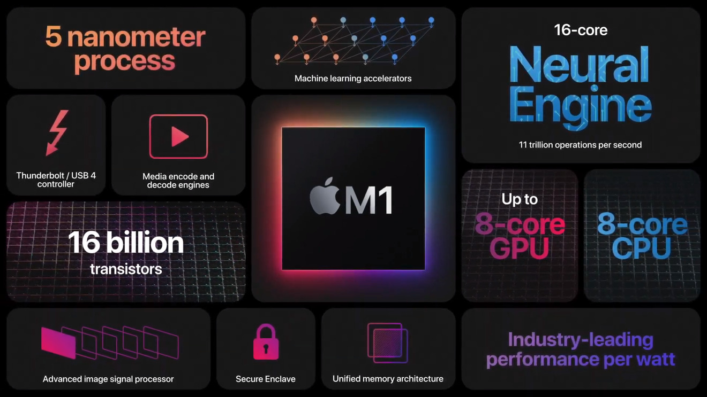
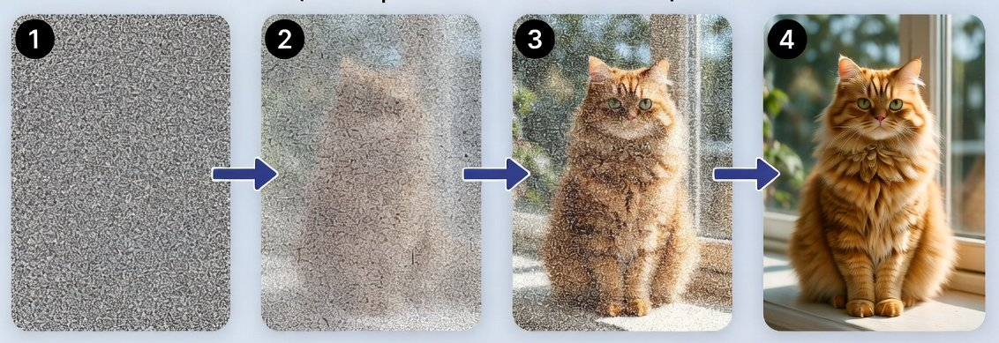
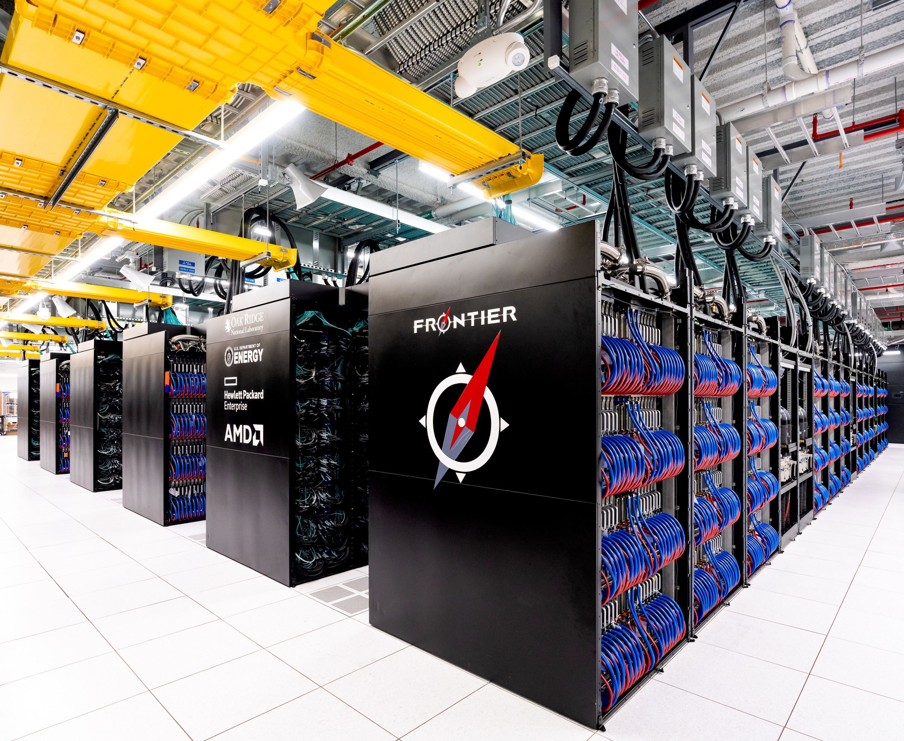

# 2020s - The Rise of AI

<pagination>

- [Early](/history/pre.md)
- [1940s](/history/1940s.md)
- [1950s](/history/1950s.md)
- [1960s](/history/1960s.md)
- [1970s](/history/1970s.md)
- [1980s](/history/1980s.md)
- [1990s](/history/1990s.md)
- [2000s](/history/2000s.md)
- [2010s](/history/2010s.md)
- 2020s
- [Future](/history/future.md)

</pagination>

This decade's history is still developing, but it has already been dominated by the development of **large language models (LLMs)** and other **generative AI**. These systems have brought **natural-language interaction** and **machine-generated content** into everyday software and driven the building of vast infrastructure to support the training and running of the models. Work in the creative sector, junior programming roles and many other jobs have been hugely impacted, and the future remains uncertain...

<timeline>

- 2020: 4.6 Billion People Online

	The number of **Internet** users passed roughly **4.6 billion**, about **60%** of the world's population. Internet access had become the essential platform for **communication**, **work**, **entertainment**, **shopping** and **public services**.

	<captioned>

	

	60% of the world online

	</captioned>

- 2020: Apple Silicon

	Apple introduced the **M1**, a **5nm ARM-based system-on-chip** for Macs. It **combined CPU cores, GPU cores and shared memory** in one package, delivering high performance with much lower power use than many desktop processors. Apple's CPUs have become the ones to beat in terms of **compute per Watt**, with later generations continuing to push the limits.

	<captioned>

	

	Apple M1 system-on-chip

	</captioned>

- 2020: COVID-19 and Remote Computing

	The **COVID-19 pandemic** moved work, school, healthcare and social events online for many people. **Video calls**, **cloud documents** and **online learning** became essential. Businesses moved from in-house networks to **infrastructure-as-a-service (IaaS)** so employees could work remotely. Laptop and desktop computers became necessities and unequal access to devices and reliable Internet exposed the **digital divide**.

	<captioned>

	

	Computing during a global crisis

	</captioned>

- 2020: GPT-3

	**OpenAI**'s **GPT-3** showed how scaling a **transformer language model** to **175 billion parameters** could produce **fluent text**, **answer questions** and **generate code**.  The raw model size, massive internet text corpora it was trained on, and high compute gave GPT-3 generalized capabilities with the model adapting to new tasks dynamically. GPT-3 was a direct predecessor of **ChatGPT** (built on GPT-3.5), which brought generative models into mainstream consciousness.

	<captioned>

	

	GPT-3 language model

	</captioned>

- 2020: AlphaFold

	**DeepMind**'s **AlphaFold** demonstrated that neural networks could predict the **three-dimensional structure of proteins** from their amino-acid sequences with remarkable accuracy, helping with the 50-year-old '**protein folding problem**', and helping earn the researchers who developed it the **2024 Nobel Prize in Chemistry**. Historically, scientific computing meant running massive simulations on supercomputers (e.g., weather modelling), but AlphaFold showed that using **machine learning models trained on vast empirical data sets** could bypass simulations entirely.

	<captioned>

	

	AlphaFold featured in Science

	</captioned>

- 2022: Diffusion Image Generation

	**Diffusion models** can generate high quality images from text prompts. They **gradually remove noise** from random data to create an image and can now do the same for video. Their adoption expanded generative AI beyond text.

	<captioned>

	

	Diffusion image generation

	</captioned>

- 2022: ChatGPT

	**ChatGPT** made **large language models (LLMs)** widely accessible to the **general public**. Sign-ups reached **1 million users in five days** and **100 million users in two months**. The success triggered a race across the tech sector, with competitors like Google, Anthropic, Meta and X accelerating their AI development and making multi-billion-dollar investments in infrastructure. The race continues, seemingly with no end.

	<captioned>

	

	ChatGPT

	</captioned>

- 2022: Frontier Supercomputer

	The **Frontier** supercomputer became the first machine to exceed **one quintillion floating point operations per second (EFLOPS)**, achieving **1.102 EFLOPS** on the TOP500 benchmark. Its processors and GPU accelerators work together across more than **8.7 million cores** to run scientific simulations and artificial intelligence workloads.

	<captioned>

	

	Frontier supercomputer

	</captioned>

- 2025: 6 Billion People Online

	The number of **Internet** users passed roughly **6 billion**, about **75%** of the world's population.

	<captioned>

	

	75% of the world online

	</captioned>

</timeline>

<pagination class="bottom">

- [Early](/history/pre.md)
- [1940s](/history/1940s.md)
- [1950s](/history/1950s.md)
- [1960s](/history/1960s.md)
- [1970s](/history/1970s.md)
- [1980s](/history/1980s.md)
- [1990s](/history/1990s.md)
- [2000s](/history/2000s.md)
- [2010s](/history/2010s.md)
- 2020s
- [Future](/history/future.md)

</pagination>

