# The Future of Computing

<pagination>

- [Early](/history/pre.md)
- [1940s](/history/1940s.md)
- [1950s](/history/1950s.md)
- [1960s](/history/1960s.md)
- [1970s](/history/1970s.md)
- [1980s](/history/1980s.md)
- [1990s](/history/1990s.md)
- [2000s](/history/2000s.md)
- [2010s](/history/2010s.md)
- [2020s](/history/2020s.md)
- Future

</pagination>

Looking into the future, developments in **quantum computing**, specialised **AI hardware**, new **data storage** methods and richer **user interfaces** may enable computers to solve different problems and act in more complex ways. The timing is uncertain: some changes are already emerging, while others are in the research stage.

<speak>

I wonder what's coming in the future... I hope we don't end up **destroying humanity**!

</speak>

## Possible Hardware Changes

<timeline>

- Near Term: Hybrid Quantum Computing

    **Quantum processors** store information in **qubits**, which can use superposition and entanglement. Useful systems will probably work alongside classical computers rather than replace them. Progress depends on error correction: practical machines need many physical qubits to create one reliable logical qubit.

    <captioned>

    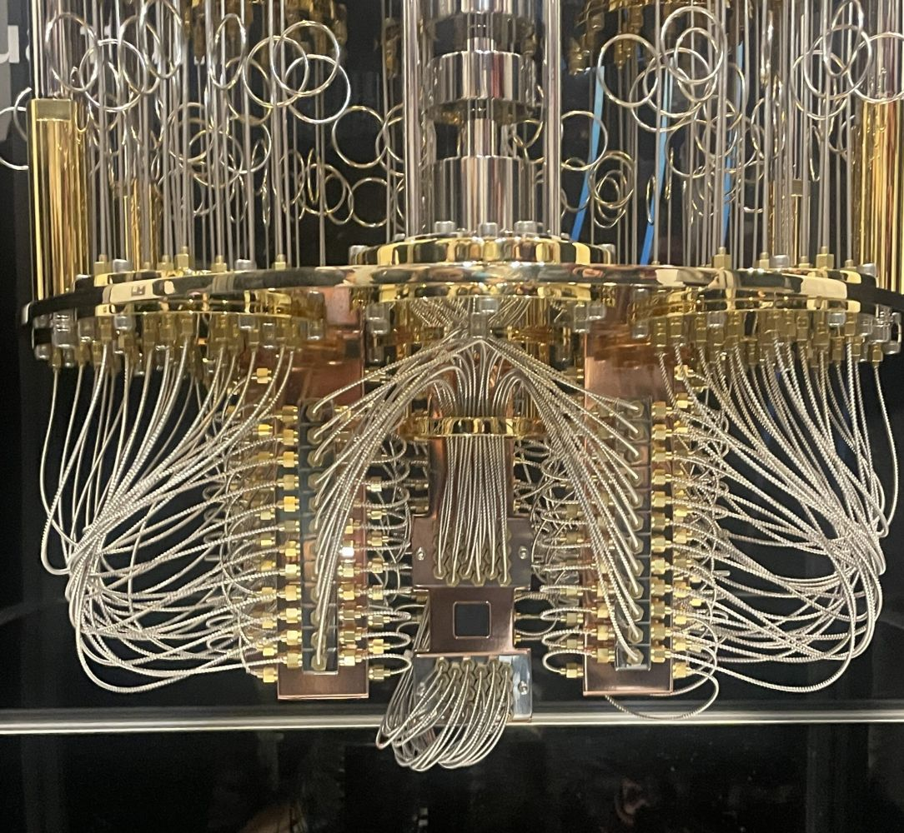

    An experimental quantum computer

    </captioned>

- Near Term: Robotics and Autonomous Systems

    **Robots** combine sensors, processors, software and motors to observe the world and act within it. Future robotic system, **combined with AI**, will be able to learn new tasks, move safely through changing environments and work alongside people in homes, hospitals, farms and factories.

    <captioned>

    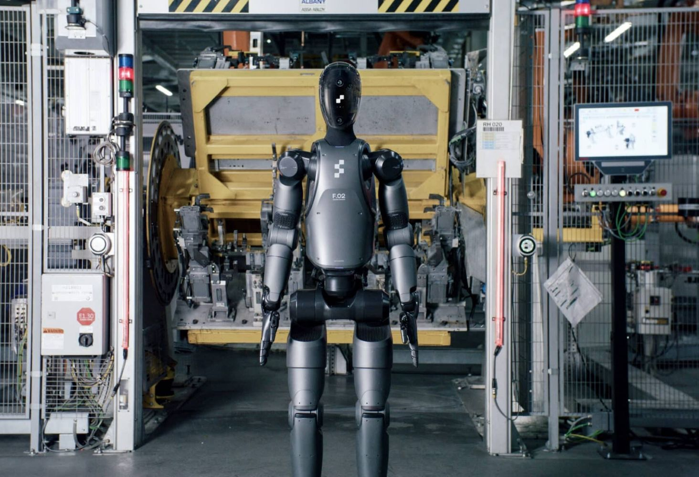

    Autonomous robots

    </captioned>

- Possible Future: Neuromorphic Circuitry

    **Neuromorphic** chips use networks of **artificial neurons** designed to mimic the structure, parallel processing, and learning mechanisms of the human brain. The work with event-based signals rather than processing every pixel or sensor reading continuously. This could let speech, vision and robotics systems run locally with much less power, although general-purpose CPUs and GPUs will remain important.

    <captioned>

    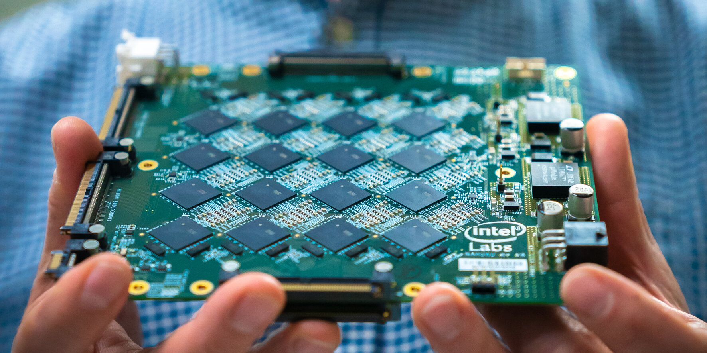

    Processor board with neuromorphic chips

    </captioned>

- Possible Future: Optical Processors

    **Photonic processors** use **light** to move or transform data, especially for matrix operations in AI systems. They may reduce the energy and delay involved in moving data, but they will not eliminate heat or replace electronic memory and control circuits entirely.

    <captioned>

    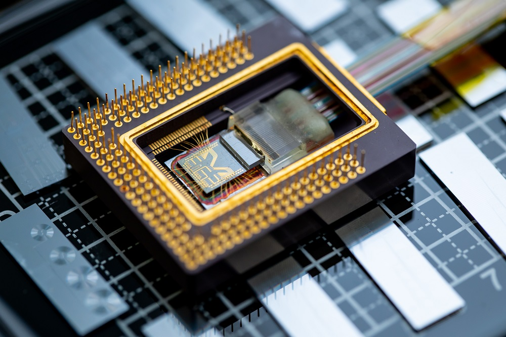

    Photonic processor

    </captioned>

- Possible Future: Biological Data Storage

    **Synthetic DNA** can **store data at extremely high theoretical densities**, potentially reaching **petabytes** or more in a tiny mass. Slow writing, reading, sequencing errors and the cost of laboratory equipment mean it is most likely to suit long-term archives rather than everyday storage.

    <captioned>

    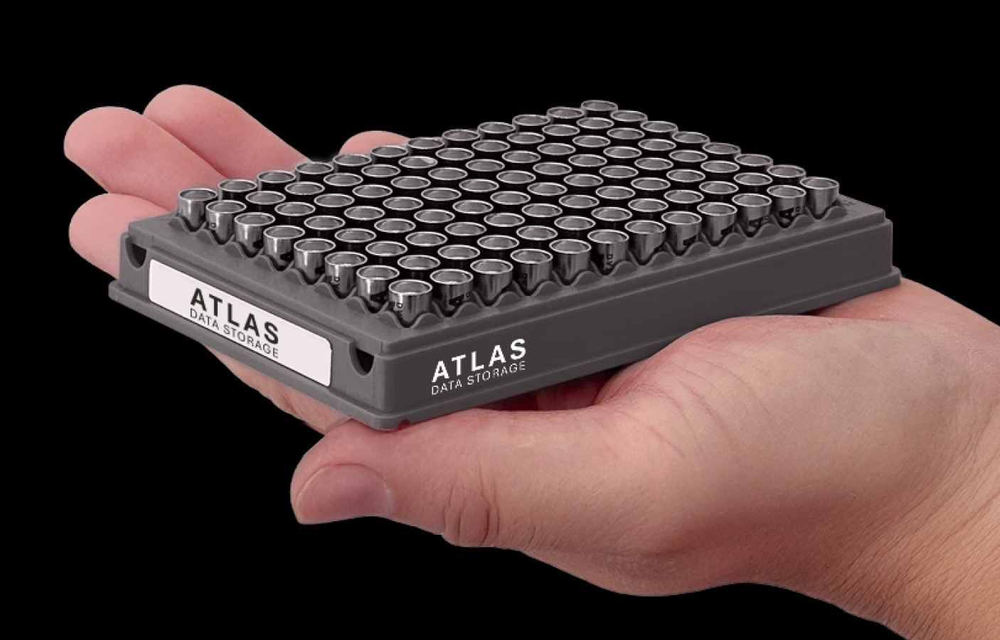

    Experimental DNA storage (1kB)

    </captioned>

- Possible Future: Advanced Carbon Electronics

    **Carbon electronics** replaces traditional silicon with carbon-based materials like **graphene** and **carbon nanotubes** to build faster, smaller, and more flexible electronic devices, replacing silicon circuitry which is reaching practical limits. Manufacturing reliable large-scale carbon electronics remains difficult, so they are more likely to complement silicon than replace it suddenly.

    <captioned>

    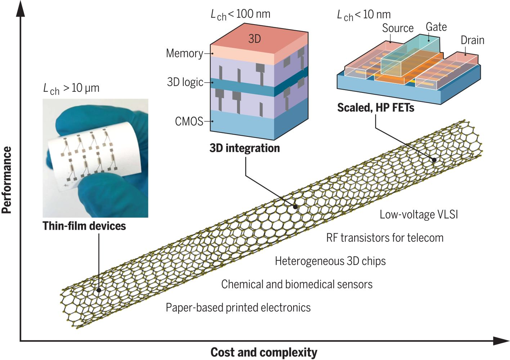

    Carbon nanotube circuits

    </captioned>

</timeline>

## Possible Software Changes

<timeline>

- Near Term: Post-Quantum Cryptography

    Modern **public-key cryptography** algorithms are theoretically vulnerable to algorithms, such as Shor's algorithm, running on quantum computers. Organisations are beginning to replace systems with standardised **post-quantum cryptography** methods. Migration will take years because certificates, devices and archived encrypted data all need to be updated before large fault-tolerant quantum computers exist.

    <captioned>

    

    Post-quantum cryptography

    </captioned>

- Near Term: Natural-Language Programming

    AI tools will translate **natural-language requests into code**, tests and configuration, without the need for the user to have any programming experience. They can lower the barrier to experimentation, but generated software will still likely need human review for security, correctness, performance and maintenance.

    <captioned>

    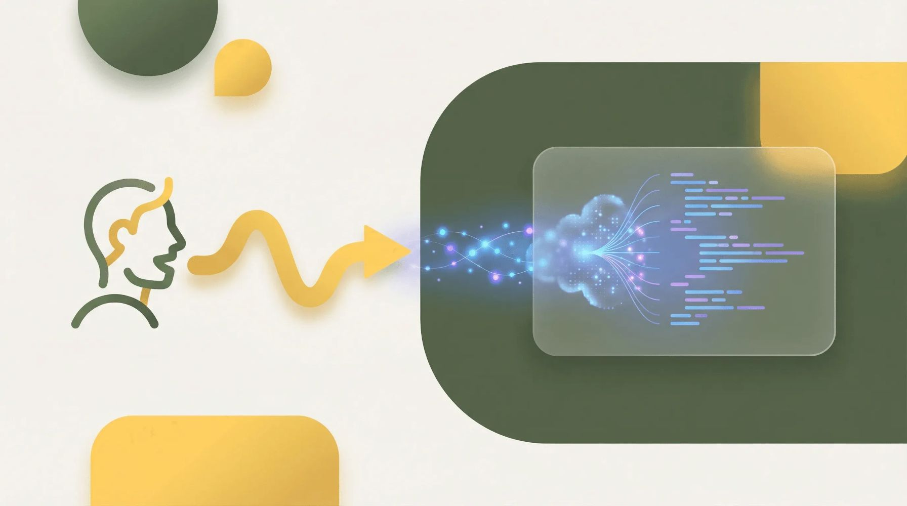

    Natural-language programming

    </captioned>

- Near Term: Autonomous Agent Architecture

    Software may shift from fixed applications to **networks of AI agents** that plan and execute multi-step workflows. Reliable agents will need permissions, audit logs, human approval for risky actions and ways to recover from incorrect decisions.

    <captioned>

    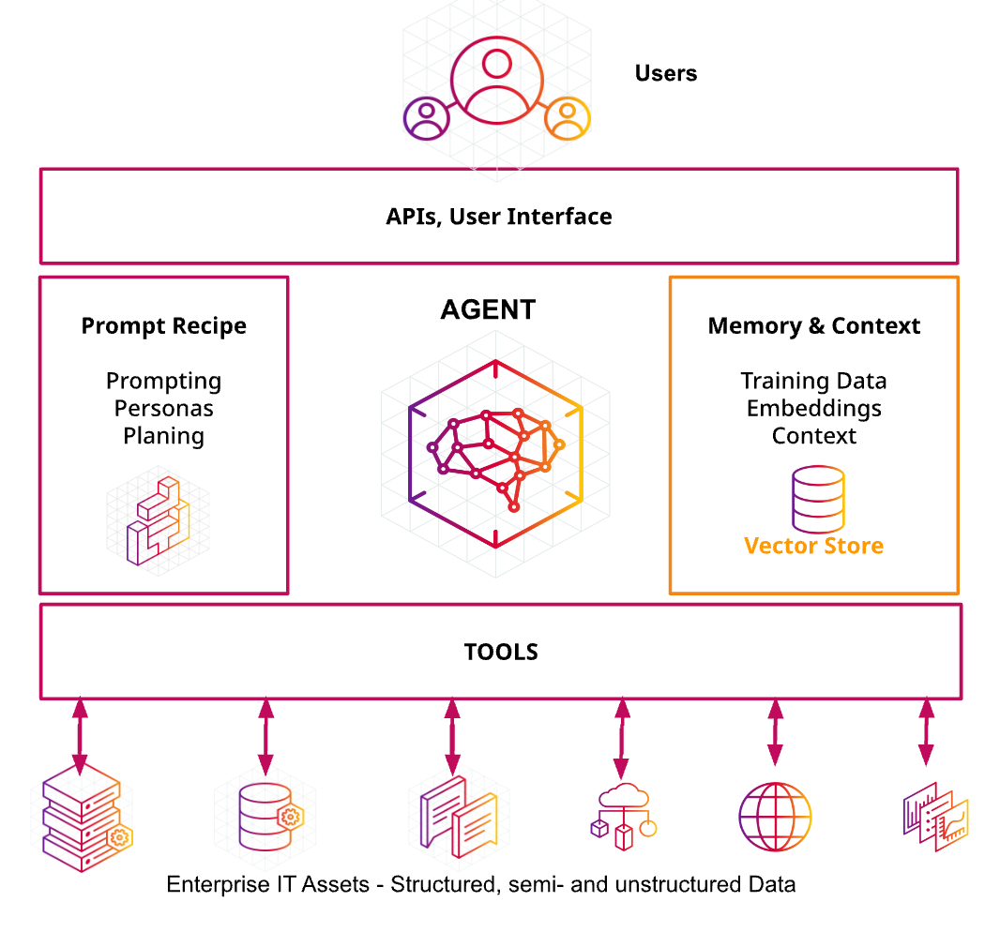

    AI agent workflow

    </captioned>

- Possible Future: Spatial Operating Systems

    Operating systems may move beyond flat screens into **three-dimensional** environments for **augmented and virtual reality**. Useful spatial systems will need accurate tracking, comfortable displays, accessible interaction methods and strong privacy controls for cameras and sensors.

    <captioned>

    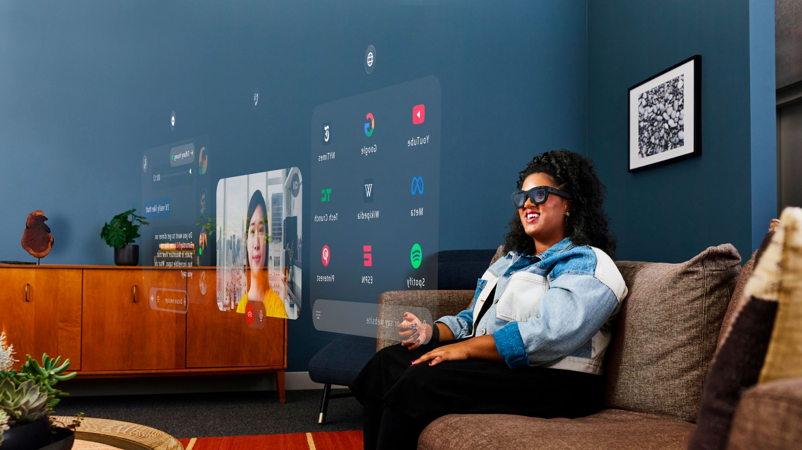

    Spatial-computing interface

    </captioned>

</timeline>

## Possible Social Changes

<timeline>

- Near Term: AI Safety and Accountability

    Future AI systems may make **decisions about work, education, health and public services**. People will need ways to test for unfair bias, explain important decisions, challenge mistakes and identify who is responsible when an automated system causes harm.

    <captioned>

    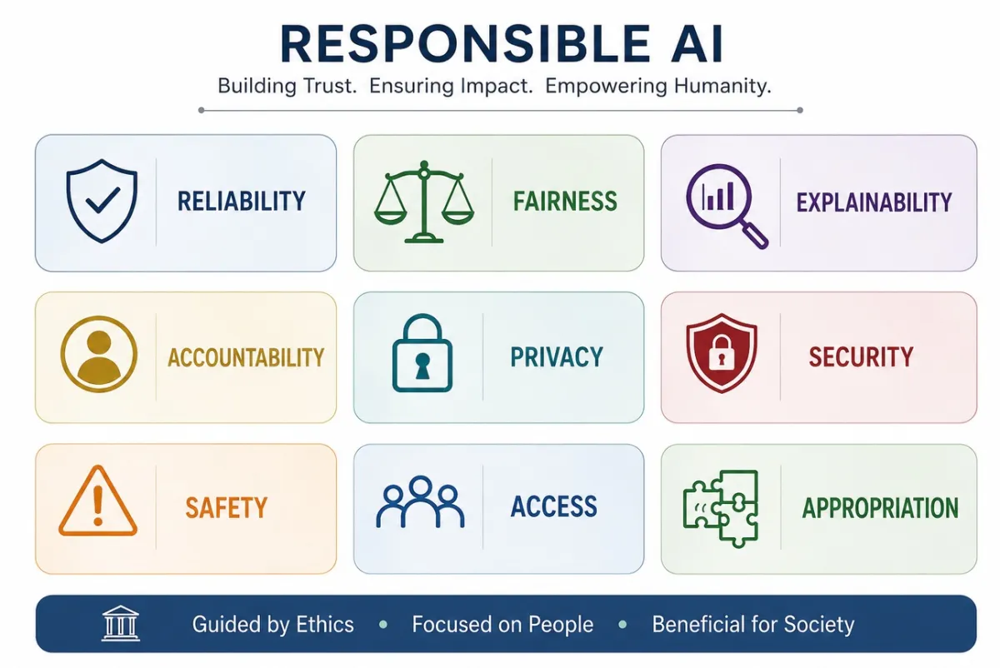

    AI ethics

    </captioned>

- Near Term: Digital Identity and Privacy

    **Digital identity** systems may make it easier to prove who we are online, but they could also allow organisations to track people across many services, raising **privacy** concerns. Future systems will need strong **security**, meaningful **consent** and ways to use essential services without surrendering **unnecessary personal data**.

    <captioned>

    

    Identity and privacy in connected systems

    </captioned>

- Near Term: Human-AI Collaboration

    **AI may handle routine tasks**: searching, drafting and analysis while **people set goals, bring judgement and take responsibility** for decisions. Education and workplaces will need to value human creativity, relationships, critical thinking and the ability to check machine-generated results.

    <captioned>

    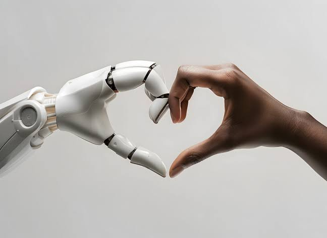

    People working with intelligent tools

    </captioned>

- Possible Future: Sustainable and Repairable Hardware

    Computing will need to use **less energy** and produce **less electronic waste**. Longer-lasting devices, replaceable parts, repair rights, recycling and lower-impact materials could matter as much as faster processors.

    <captioned>

    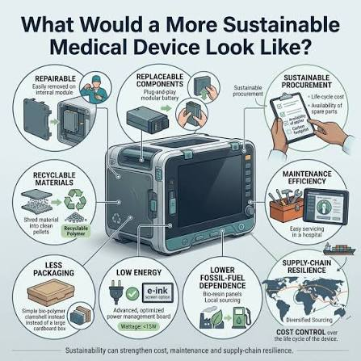

    Sustainable technology choices

    </captioned>

</timeline>

<pagination class="bottom">

- [Early](/history/pre.md)
- [1940s](/history/1940s.md)
- [1950s](/history/1950s.md)
- [1960s](/history/1960s.md)
- [1970s](/history/1970s.md)
- [1980s](/history/1980s.md)
- [1990s](/history/1990s.md)
- [2000s](/history/2000s.md)
- [2010s](/history/2010s.md)
- [2020s](/history/2020s.md)
- Future

</pagination>

