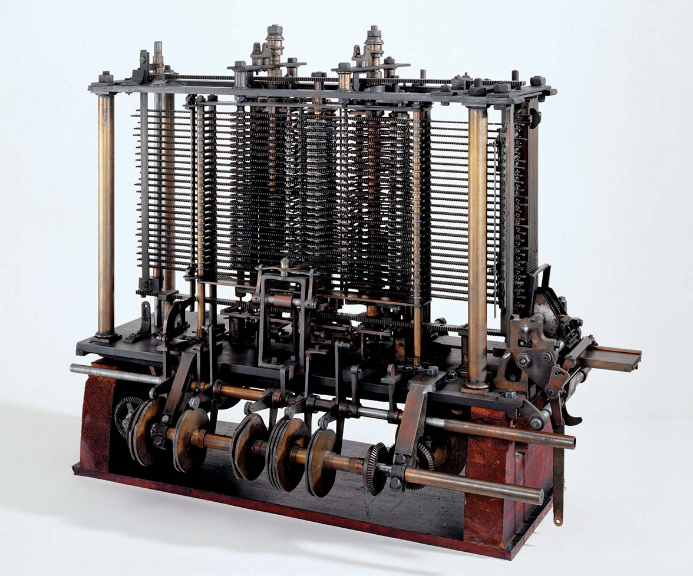
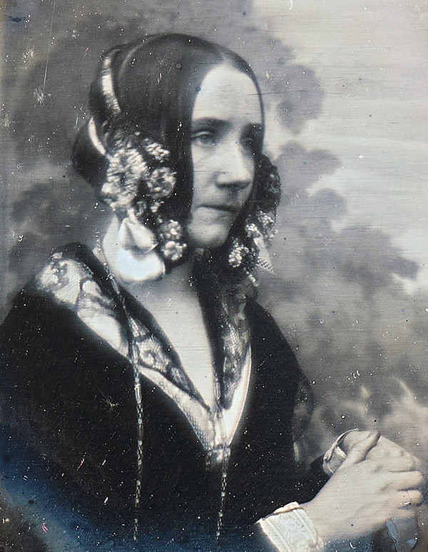
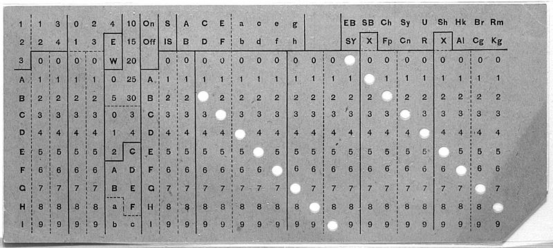

# Computing Before Digital Computers

Before the invention of the first digital computers in the 1940s, people had created a whole host of clever mechanical machines to help do computations.

> [!IMPORTANT]
> The term '**computer**' is far older than today's meaning. Before digital computers, a 'computer' was the name of **a person who performed calculations** - it was a job!

<timeline>

- 1822: Charles Babbage's Difference and Analytical Engines

    English mathematician Charles Babbage conceived steam-driven machines that could calculate tables of numbers. He never completed the full machines, but the designs introduced ideas that would later appear in programmable computers.

    <captioned>

    

    Part of Babbage's Analytical Engine

    </captioned>

- 1815-1852: Ada Lovelace

    Ada Lovelace, was an English mathematician and writer, famous for her work with Charles Babbage's Analytical Engine. She was the first to recognise the machine had applications beyond pure calculation, and is often considered the first computer programmer.

    <captioned>

    

    Ada Lovelace, age 28

    </captioned>

- 1890: Hollerith's punched-card system

    Herman Hollerith designed a punched-card system to process the 1880 United States census. The system completed the work in three years, and punched cards became a standard way to store and process data. Hollerith's company eventually became IBM, one of the largest computer companies in history.

    <captioned>

    

    Hollerith's punched card

    </captioned>

- 1920s: Human computers

    Before digital machines, a computer was a person who performed calculations. By the 1920s, these computers used mechanical calculators to help them. However, even with these machines, human computers could be slow and could make errors.

    <captioned>

    

    A room of human computers

    </captioned>

- 1936: Turing's Universal Machine

    Alan Turing described a Universal Machine capable of carrying out any computation that could be expressed as an algorithm. This theoretical model established a foundation for the general-purpose digital computers built in the following decade.

</timeline>