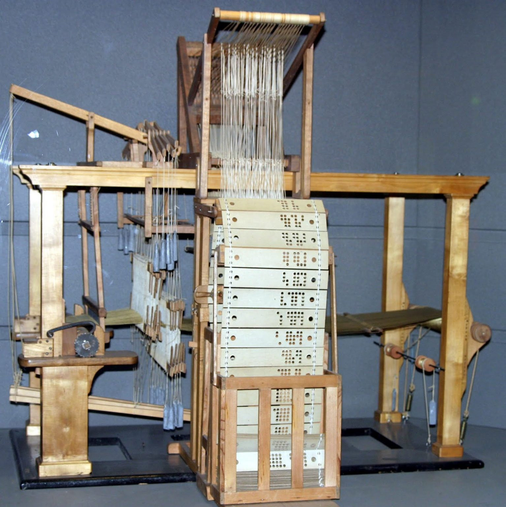
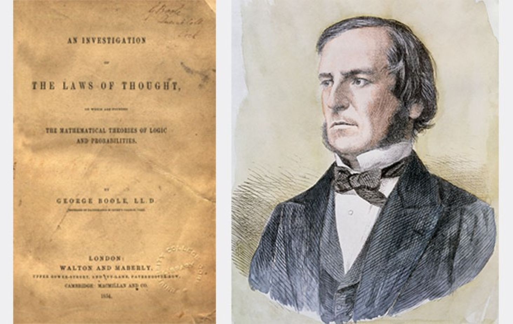
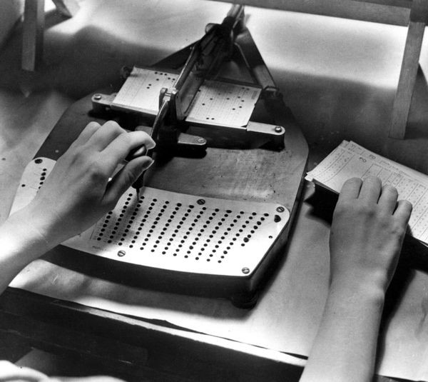
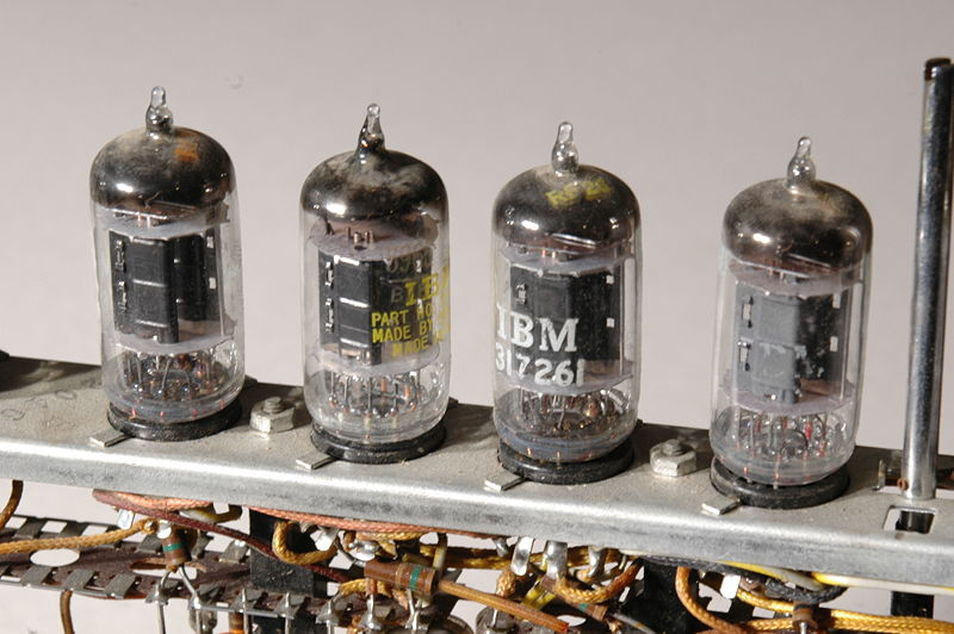
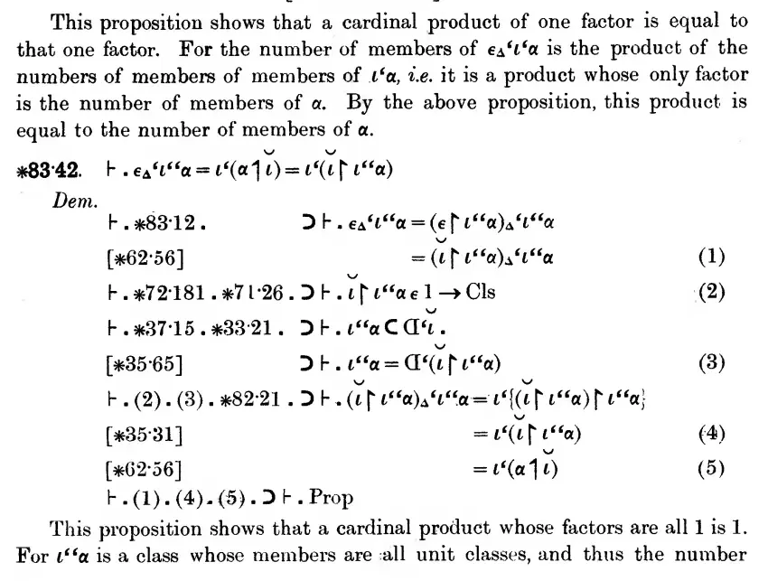
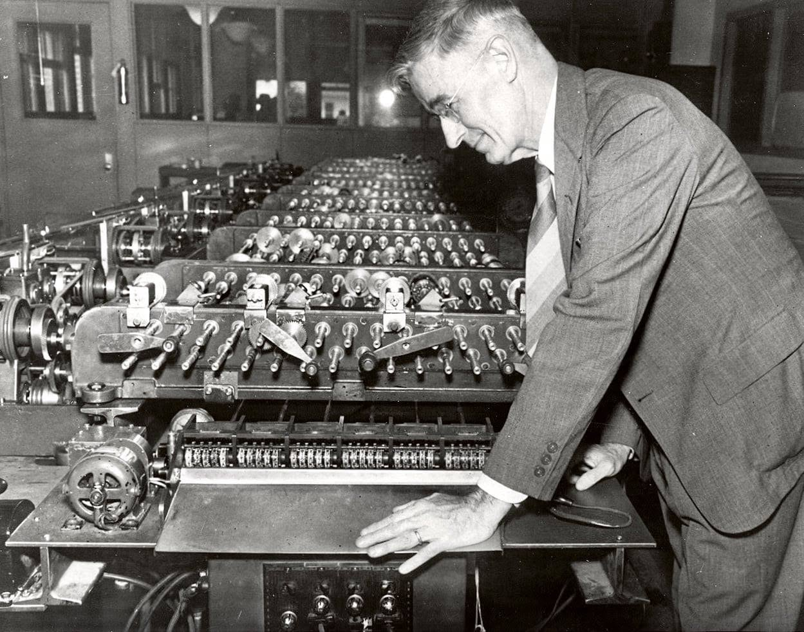
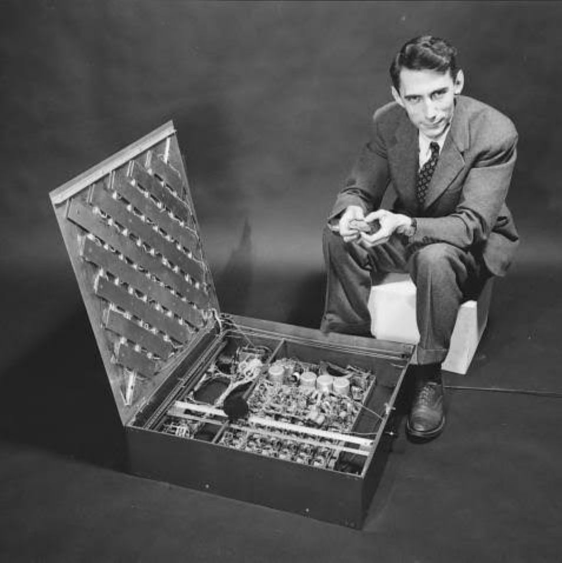
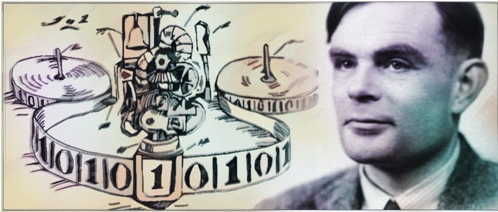

# Computing Before Digital Computers

<pagination>

- Early
- [1940s](/history/1940s.md)
- [1950s](/history/1950s.md)
- [1960s](/history/1960s.md)
- [1970s](/history/1970s.md)
- [1980s](/history/1980s.md)
- [1990s](/history/1990s.md)
- [2000s](/history/2000s.md)
- [2010s](/history/2010s.md)
- [2020s](/history/2020s.md)
- [Future](/history/future.md)

</pagination>

<aside narrow>

  <captioned>

  

  A room of human computers

  </captioned>

</aside>

Businesses and governments have long required calculations to be performed. For centuries, these calculations were carried out **manually**. The people tasked with this were known as '**computers**' - this was their job title.

During the 19th and early 20th Centuries, a whole host of clever **mechanical machines** were invented to help with computation, whilst other technologies and ideas were developed that would form the **foundation** for the development of digital computers in the 1940s.

## 19th Century

<timeline>

- 1801: Jacquard Loom

    **Joseph-Marie Jacquard** developed a loom controlled by punched cards. The holes told the loom which threads to raise, allowing complex patterns to be woven automatically. The idea showed how instructions could be stored separately from a machine and changed without rebuilding it.

    <captioned>

    

    Punched cards used as weaving loom instructions

    </captioned>

- 1822-37: The Difference and Analytical Engines

    English mathematician **Charles Babbage** conceived of steam-driven machines that could calculate tables of numbers. He never completed the full machines, but the designs introduced ideas that would later appear in programmable computers.

    <captioned>

    

    Part of Babbage's Analytical Engine

    </captioned>

- 1815-1852: Ada Lovelace

    **Ada Lovelace**, was an English mathematician and writer, famous for her work with Charles Babbage's Analytical Engine. She was the first to recognise the machine had applications beyond pure calculation, and is often considered the **first computer programmer**.

    <captioned>

    

    Ada Lovelace, age 28

    </captioned>

- 1854: Boolean Algebra

    **George Boole** published a system of **algebra** for working with **true and false values**. Although little use was made of this during his lifetime, his **Boolean algebra** gave later engineers a mathematical way to describe logic gates, digital circuits and computer decisions.

    <captioned>

    

    George Boole and his logical 'Laws of Thought'

    </captioned>

- 1890: Hollerith's Punched-Card System

     **Herman Hollerith** designed a **punched-card** system to process the 1890 United States census. Data was recorded as holes in stacks of cards, which were fed into tabulating machines to be processed. The system completed the work in only three years, seven years quicker than previously.

     Punched cards became a standard way to store and process data into the digital computer era. Hollerith's company eventually became **IBM**, one of the largest computer companies of the 20th Century.

    <captioned>

    

    test

    

    Hollerith's punched cards

    </captioned>

</timeline>

## Early 20th Century

<timeline>

- 1904: Vacuum Tube Diode

    **John Ambrose Fleming** invented the **vacuum tube diode** in 1904, and **Lee de Forest** added a third electrode to create the **triode** in 1906, giving engineers a way to amplify and switch electrical signals. Before the transistor, vacuum tubes were at the heart of all early digital computers.

	<captioned>

	

	Early vacuum tubes in a circuit

	</captioned>

- 1913: Symbolic Logic

    **Bertrand Russell** and **Alfred North Whitehead**'s **Principia Mathematica** pushed the formalisation of **symbolic logic** notation, building on 19th-century Boolean algebra. This groundwork mattered enormously once people started asking whether logical operations could be mechanised.

	<captioned>

	

	Symbolic logic

	</captioned>

- 1931: Analogue Computers

    **Vannevar Bush** built the **Differential Analyser** at MIT, an analog mechanical computer for solving differential equations. It wasn't digital, but it demonstrated that complex calculations could be automated at scale, and it trained a generation of engineers who later moved into digital computing. Analogue computers appeared in later decades, but by the late 1950s, improvements in digital circuits made digital computers more reliable, precise, and cost-effective,

	<captioned>

	

	Bush and the Differential Analyser

	</captioned>

- 1937: Claude Shannon's Switching Circuits

    **Claude Shannon** showed that **Boolean algebra** could describe the behaviour of **electrical switching circuits**. He connected abstract logic to real hardware and helped establish many of the ideas used in modern digital circuit design.

    <captioned>

    

    Claude Shannon

    </captioned>

- 1936: Turing's Universal Machine

    In 1936, **Alan Turing** described a theoretical **Universal Machine** capable of carrying out **any computation** that could be expressed as an **algorithm**. The machine would follow instructions, recording and reading data on an infinite paper tape as it went. This ground-breaking idea established a foundation model for the general-purpose digital computers built in the following decade.

    <captioned>

    

    Alan Turing and the Universal Machine

    </captioned>

</timeline>

<pagination class="bottom">

- Early
- [1940s](/history/1940s.md)
- [1950s](/history/1950s.md)
- [1960s](/history/1960s.md)
- [1970s](/history/1970s.md)
- [1980s](/history/1980s.md)
- [1990s](/history/1990s.md)
- [2000s](/history/2000s.md)
- [2010s](/history/2010s.md)
- [2020s](/history/2020s.md)
- [Future](/history/future.md)

</pagination>

