# Great Nerdy Books

<!-- recommendations media -->

## Adventure Books

- 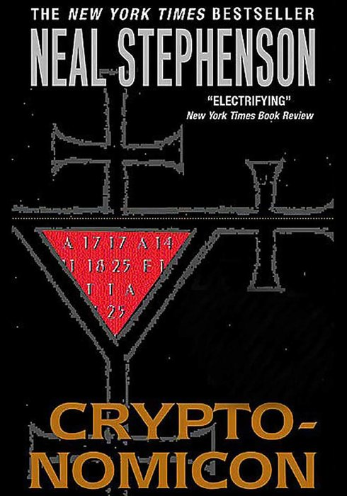
    [Cryptonomicon](hhttps://www.goodreads.com/book/show/816.Cryptonomicon)

    - **Adventure**
    - **Sci-Fi**
    - **History**
    - **Computing**
    - Neal Stephenson
    - 1999

    Two interconnected storylines: One in WWII and one in the 1990s; linked by code breaking, conspiracies, computers, mysterious organisations, and gold... Lots of gold.

- 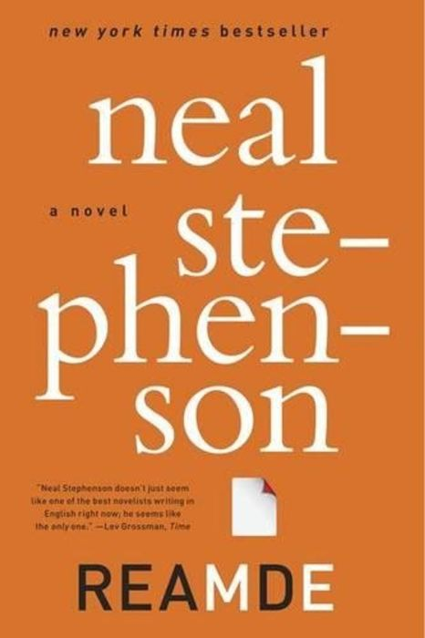
    [REAMDE](https://www.goodreads.com/book/show/10552338-reamde)

    - **Sci-Fi**
    - **Action**
    - **Thriller**
    - **Hacking**
    - Neal Stephenson
    - 2011

    A ransomware outbreak becomes a globe-spanning chase involving hackers, terrorists, spies and one very dangerous video game.

- 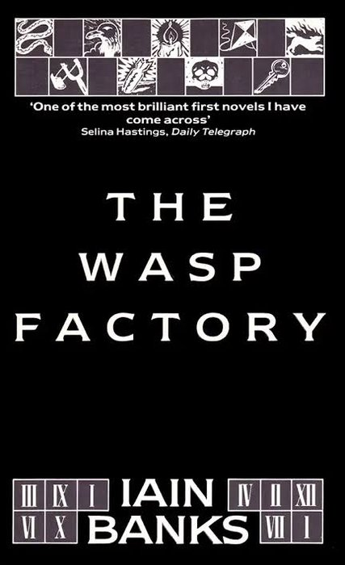
    [The Wasp Factory](https://www.goodreads.com/en/book/show/567678.The_Wasp_Factory)

    - **Action**
    - **Thriller**
    - **Horror**
    - Iain Banks
    - 1984

    A dark tale of a disturbed teenager on a remote Scottish island who spends his days performing cruel rituals and consulting a homemade death-trap clock. This book is really dark, but also has humorous undertones.

- 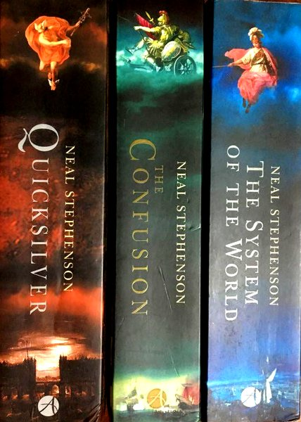
    The Baroque Cycle Trilogy

    - **Adventure**
    - **History**
    - **Sci-Fi**
    - Neal Stephenson
    - 2003-2004

    A tale that is ambitious and epically vast in scope, crossing oceans, centuries and generations; a tale of conspiracies, royalty, science, pirates, gold, battles and maths.

    1. [Quicksilver](https://www.goodreads.com/book/show/823.Quicksilver) (2003)
    1. [The Confusion](https://www.goodreads.com/book/show/822.The_Confusion) (2004)
    1. [The System of the World](https://www.goodreads.com/book/show/116257.The_System_of_the_World) (2004)

- 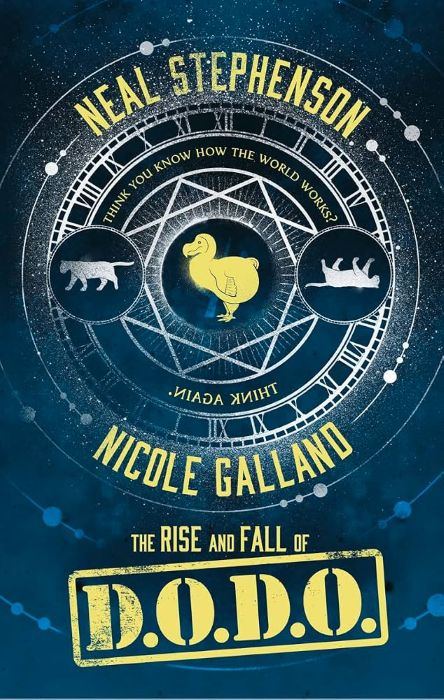
    [Project DODO](https://www.goodreads.com/book/show/32920280-the-rise-and-fall-of-d-o-d-o)

    - **Sci-Fi**
    - **Adventure**
    - **History**
    - **Fantasy**
    - Neal Stephenson, Nicole Galland
    - 2017

    A government project combines magic, science and time travel in a secret attempt to rewrite history.

## Sci-Fi Books

- 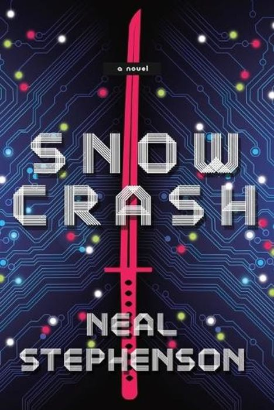
    [Snow Crash](https://www.goodreads.com/book/show/830.Snow_Crash)

    - **Sci-Fi**
    - **Action**
    - **Adventure**
    - Neal Stephenson
    - 1992

    A pizza delivery driver and a sword-wielding hacker face a digital virus that threatens both the Metaverse and the real world.

- 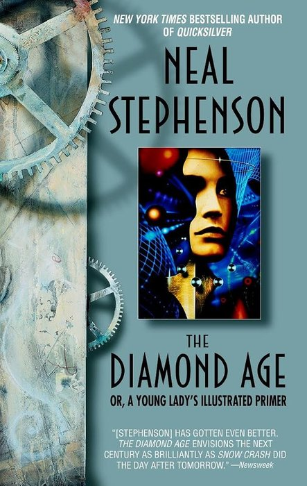
    [The Diamond Age](https://www.goodreads.com/en/book/show/827.The_Diamond_Age)

    - **Sci-Fi**
    - **Adventure**
    - Neal Stephenson
    - 1995

    '*... or a young lady's illustrated primer*'

    A near-future novel in a world of social enclaves and nano-technology; a young girl comes upon an artificially intelligent book that will change her life and those around her.

- 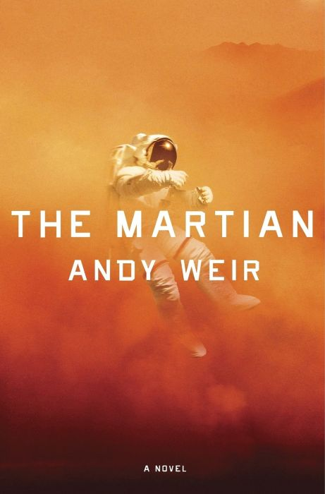
    [The Martian](https://www.goodreads.com/book/show/18007564-the-martian)

    - **Sci-Fi**
    - **Adventure**
    - **Comedy**
    - **Science**
    - Andy Weir
    - 2011

    Stranded alone on Mars, an astronaut uses science, stubbornness and a lot of potatoes to stay alive.

- 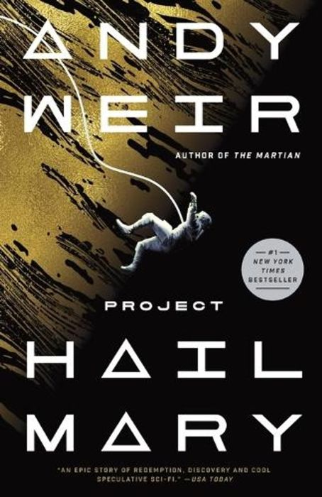
    [Project Hail Mary](https://www.goodreads.com/book/show/54493401-project-hail-mary)

    - **Sci-Fi**
    - **Adventure**
    - **Drama**
    - **Science**
    - Andy Weir
    - 2021

    An astronaut wakes alone in deep space and must solve an impossible scientific problem to save Earth.

- 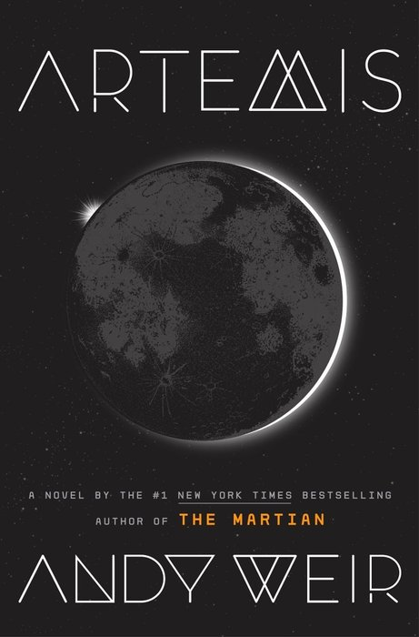
    [Artemis](https://www.goodreads.com/book/show/34928122-artemis)

    - **Sci-Fi**
    - **Adventure**
    - **Thriller**
    - **Crime**
    - Andy Weir
    - 2017

    A smuggler on the Moon takes one risky job too many and finds herself caught in a conspiracy over the city of Artemis.

- 
    The Three-Body Problem Trilogy

    - **Sci-Fi**
    - **Adventure**
    - **Drama**
    - Liu Cixin
    - 2006-2010

    A physicist uncovers a connection between a mysterious virtual world, a troubled past and an alien civilisation preparing for contact.

    1. [The Three-Body Problem](https://www.goodreads.com/book/show/20518872-the-three-body-problem) (2006)
    1. [The Dark Forest](https://www.goodreads.com/book/show/20518873-the-dark-forest) (2008)
    1. [Death's End](https://www.goodreads.com/book/show/20518875-death-s-end) (2010)

- 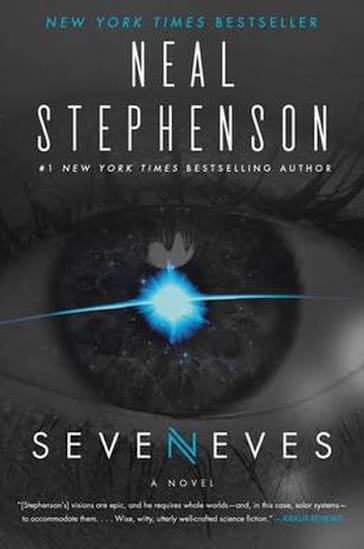
    [Seveneves](https://www.goodreads.com/book/show/22816087-seveneves)

    - **Sci-Fi**
    - **Thriller**
    - **Adventure**
    - **Science**
    - Neal Stephenson
    - 2015

    The world faces a catastrophic, unavoidable end, and races against time to save some of humanity. It all goes well... until it doesn't.

- 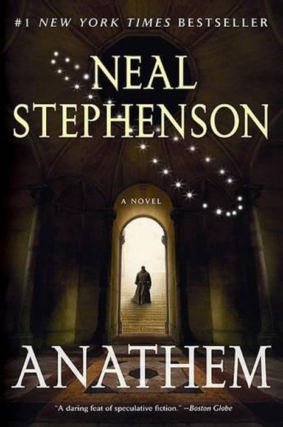
    [Anathem](https://www.goodreads.com/book/show/2845024-anathem)

    - **Sci-Fi**
    - **Adventure**
    - **Mystery**
    - **Science**
    - Neal Stephenson
    - 2008

    Life for the fraas and suurs of the Concent of Saunt Edhar, a sanctuary for science and maths, moves to a slow and steady beat, but a threat to the world triggers an exodus across, and then off the planet.

- 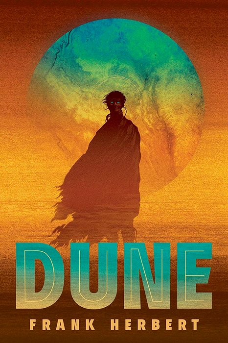
    Dune Series

    - **Sci-Fi**
    - **Adventure**
    - **War**
    - **Drama**
    - Frank Herbert
    - 1965-1985

    A planet of sand, an exotic spice, warring families and giant worms; the first volume in a series that spans millennia is gripping. Some of the later books get to be hard work, but the first few are amazing.

    1. [Dune](https://www.goodreads.com/book/show/44767458-dune) (1965)
    1. [Dune Messiah](https://www.goodreads.com/book/show/44492285-dune-messiah) (1969)
    1. [Children of Dune](https://www.goodreads.com/book/show/44492286-children-of-dune) (1976)
    1. ... and more

- 
    The Hitchhikers Guide to the Galaxy Series

    - **Sci-Fi**
    - **Comedy**
    - **Adventure**
    - Douglas Adams
    - 1979-1992

    An amusing romp around the galaxy with robots, aliens, whales, planetary destruction, petunias and towels. Uniquely silly humour from Douglas Adams.

    1. [The Hitchhikers Guide to the Galaxy](https://www.goodreads.com/book/show/11.The_Hitchhiker_s_Guide_to_the_Galaxy) (1979)
    1. [The Restaurant at the End of the Universe](https://www.goodreads.com/book/show/8695.The_Restaurant_at_the_End_of_the_Universe) (1980)
    1. [Life, the Universe and Everything](https://www.goodreads.com/book/show/8694.Life_the_Universe_and_Everything) (1982)
    1. [So Long, and Thanks for All the Fish](https://www.goodreads.com/book/show/6091075-so-long-and-thanks-for-all-the-fish) (1984)
    1. [Mostly Harmless](https://www.goodreads.com/book/show/569429.Mostly_Harmless) (1992)

- 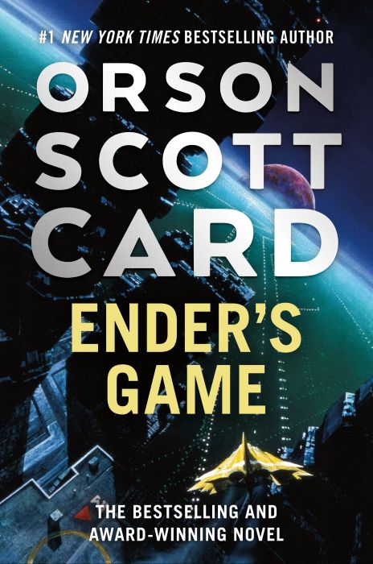
    Ender's Saga Series

    - **Sci-Fi**
    - **Adventure**
    - **War**
    - **Philosophy**
    - Orson Scott Card
    - 1985-2021

    Children trained to fight a world-threatening alien fleet, pushed beyond their limits; extinction of worlds and species; political machinations; redemption arcs... These books forse us to confront difficult questions about who we are as humans.

    1. [Ender's Game](https://www.goodreads.com/book/show/375802.Ender_s_Game) (1985)
    1. [Speaker for the Dead](https://www.goodreads.com/book/show/7967.Speaker_for_the_Dead) (1986)
    1. [Xenocide](https://www.goodreads.com/book/show/8648.Xenocide) (1991)
    1. [Children of the Mind](https://www.goodreads.com/book/show/31360.Children_of_the_Mind) (1996)
    1. [Ender in Exile](https://www.goodreads.com/book/show/3220405-ender-in-exile) (2008)
    1. [The Last Shadow](https://www.goodreads.com/book/show/7108926-the-last-shadow) (2021)

- 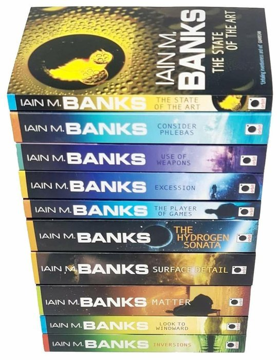
    The Culture Series

    - **Sci-Fi**
    - **Adventure**
    - **Philosophy**
    - **Society**
    - Iain M. Banks
    - 1987-2012

    Vast, powerful, intelligent spaceships, political intrigue, conspiracies... These hard sci-fi novels have epic scope, painting a vast universe full of great stories.

    1. [Consider Phlebas](https://www.goodreads.com/book/show/8935689-consider-phlebas) (1987)
    1. [The Player of Games](https://www.goodreads.com/book/show/18630.The_Player_of_Games) (1988)
    1. [Use of Weapons](https://www.goodreads.com/book/show/12007.Use_of_Weapons) (1990)
    1. [The State of the Art](https://www.goodreads.com/book/show/129131.The_State_of_the_Art) (1991)
    1. [Excession](https://www.goodreads.com/book/show/12013.Excession) (1996)
    1. [Inversions](https://www.goodreads.com/book/show/12017.Inversions) (1998)
    1. [Look to Windward](https://www.goodreads.com/book/show/12016.Look_to_Windward) (2000)
    1. [Matter](https://www.goodreads.com/book/show/886066.Matter) (2008)
    1. [Surface Detail](https://www.goodreads.com/book/show/7937744-surface-detail) (2010)
    1. [The Hydrogen Sonata](https://www.goodreads.com/book/show/13497991-the-hydrogen-sonata) (2012)

## Fantasy Books

- 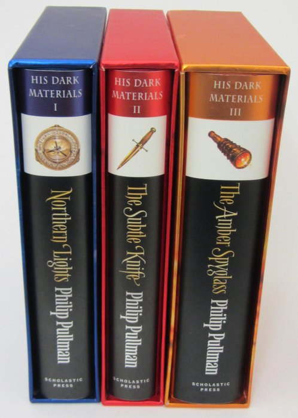
    His Dark Materials Trilogy

    - **Fantasy**
    - **Adventure**
    - **Drama**
    - Philip Pullman
    - 1995-2000

    Parallel worlds touch and vast powers battle for control; armoured bears, witches, daemons, innocence, betrayal, love, sacrifice... These books have it all.

    1. [Northern Lights](https://www.goodreads.com/book/show/70947.Northern_Lights) (1995)
    2. [The Subtle Knife](https://www.goodreads.com/book/show/41637836-the-subtle-knife) (1997)
    3. [The Amber Spyglass](https://www.goodreads.com/book/show/18122.The_Amber_Spyglass) (2000)

- 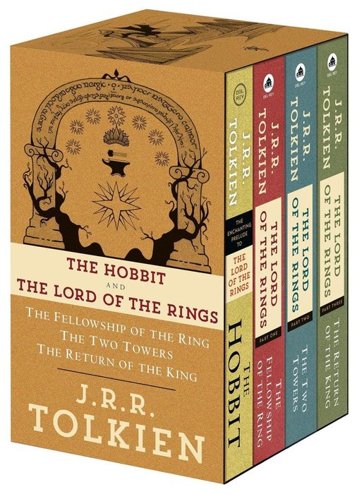
    Middle Earth Series

    - **Fantasy**
    - **Adventure**
    - **War**
    - J.R.R. Tolkien
    - 1937-1955

    A ring, some hobbits, a wizard, a dragons, many battles, many tragedies, true friendship... These books and the world they create are unforgettable.

    1. [The Hobbit](https://www.goodreads.com/book/show/5907.The_Hobbit_or_There_and_Back_Again) (1937)
    2. [The Fellowship of the Ring](https://www.goodreads.com/book/show/61215351-the-fellowship-of-the-ring) (1954)
    3. [The Two Towers](https://www.goodreads.com/book/show/61215372-the-two-towers) (1954)
    4. [The Return of the King](https://www.goodreads.com/book/show/61215384-the-return-of-the-king) (1955)

- 
    [Good Omens](https://www.goodreads.com/book/show/12067.Good_Omens)

    - **Fantasy**
    - **Comedy**
    - Terry Pratchett, Neil Gaiman
    - 1990

    '*The Nice and Accurate Prophecies of Agnes Nutter, Witch*'

    But how accurate? The apocalypse is next Saturday, armies of Good and Evil are massing, and the Antichrist is missing...

- 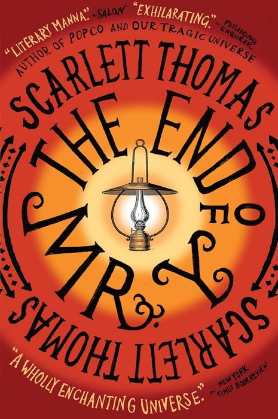
    [The End of Mr. Y](https://www.goodreads.com/book/show/93436.The_End_of_Mr_Y)

    - **Fantasy**
    - **Mystery**
    - **Sci-Fi**
    - Scarlett Thomas
    - 2006

    A find in an secondhand bookshop leads to an adventure involving science, love, death, and time travel. Really well written.

- 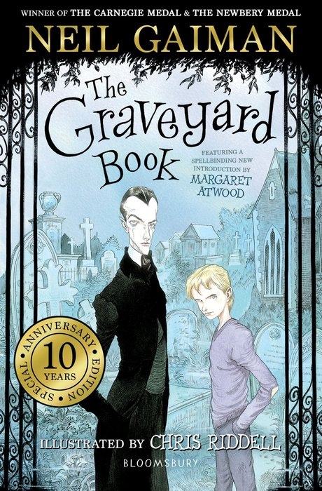
    [The Graveyard Book](https://www.goodreads.com/book/show/2213661.The_Graveyard_Book)

    - **Fantasy**
    - **Adventure**
    - Neil Gaiman
    - 2008

    Nobody Owens lives in a graveyard, raised by the dead. But now he's a little older, the world of the living is calling him... But is it safe?

- 
    [Jonathan Strange & Mr. Norrell](https://www.goodreads.com/book/show/14201.Jonathan_Strange_Mr_Norrell)

    - **Fantasy**
    - **Adventure**
    - Susanna Clarke
    - 2004

    An alternative 19th Century world where magic still exists, but long forgotten. One magician could win the war...

- 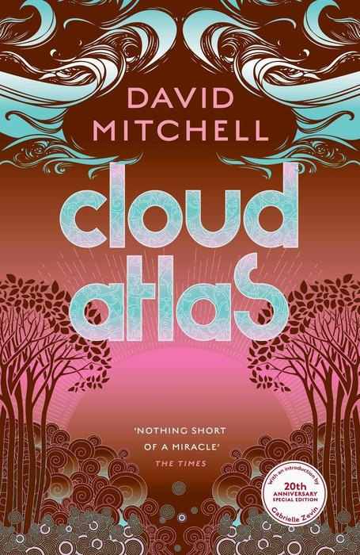
    [The Cloud Atlas](https://www.goodreads.com/book/show/49628.Cloud_Atlas)

    - **Fantasy**
    - **Sci-Fi**
    - **Dystopia**
    - **Drama**
    - David Mitchell
    - 2004

    An epic book of six interconnected stories, spanning from the nineteenth century to a post-apocalyptic future; see how choices and actions ripple across time.

- 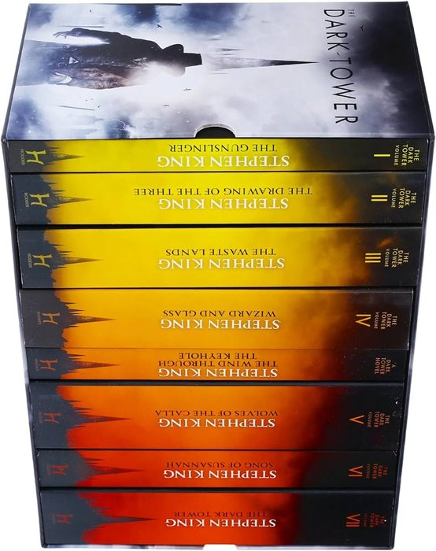
    The Dark Tower Series

    - **Fantasy**
    - **Adventure**
    - **Horror**
    - Stephen King
    - 1982-2012

    An epic and gripping tale of many worlds, linked an dying as the power of the Dark Tower wains. A gunslinger and a boy journey to save it.

    1. [The Gunslinger](https://www.goodreads.com/book/show/247642509-the-gunslinger) (1982)
    2. [The Drawing of the Three](https://www.goodreads.com/book/show/5094.The_Drawing_of_the_Three) (1987)
    3. [The Waste Lands](https://www.goodreads.com/book/show/34084.The_Waste_Lands) (1991)
    4. [Wizard and Glass](https://www.goodreads.com/book/show/5096.Wizard_and_Glass) (1997)
    5. [The Wind Through the Keyhole](https://www.goodreads.com/book/show/12341557-the-wind-through-the-keyhole) (2012)
    6. [Wolves of the Calla](https://www.goodreads.com/book/show/4978.Wolves_of_the_Calla) (2003)
    7. [Song of Sussanah](https://www.goodreads.com/book/show/5093.Song_of_Susannah) (2004)
    8. [The Dark Tower](https://www.goodreads.com/book/show/5091.The_Dark_Tower) (2004)

## Thoughtful & Factual Books

- 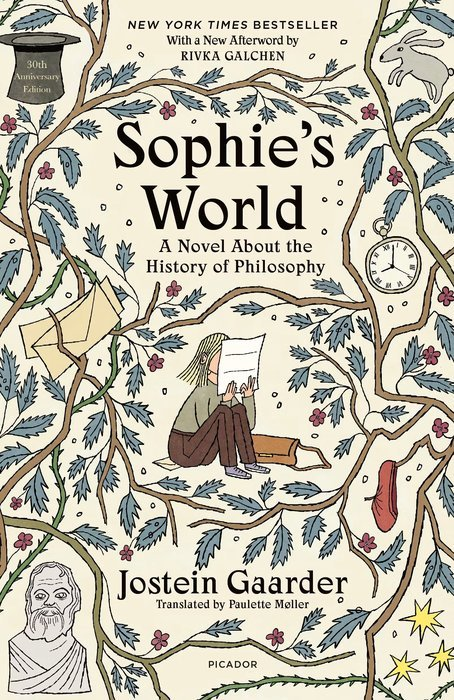
    [Sophie's World](https://www.goodreads.com/book/show/10959.Sophie_s_World)

    - **Philosophy**
    - **Drama**
    - Jostein Gaarder
    - 1991

    "Who are you?" and "Where does the world come from?" These notes are the start of journey of discovery for Sophie, through the rich history of philosophy.

- 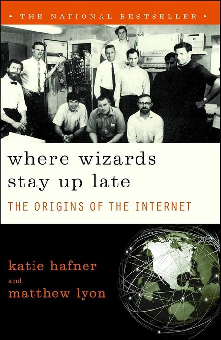
    [Where Wizards Stay Up Late](https://www.goodreads.com/book/show/281818.Where_Wizards_Stay_Up_Late)

    - **Computing**
    - **History**
    - **Factual**
    - Katie Hafner, Matthew Lyon
    - 1996

    '*The Origins of the Internet*'

    The amazing story of the creation of ARPANET, the predecessor of the Internet, and the incredible people who made it happen.

- 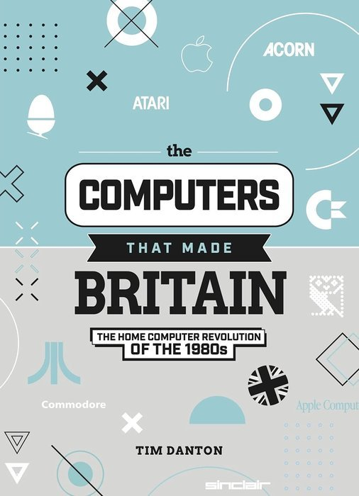
    [The Computers that Made Britain](https://www.goodreads.com/en/book/show/58312784-the-computers-that-made-britain)

    - **Computing**
    - **History**
    - **Factual**
    - Tim Danton
    - 2021

    A short history of some of the innovative and novel computers produced in the UK during the 1980s personal computer boom, and the people behind them.

- 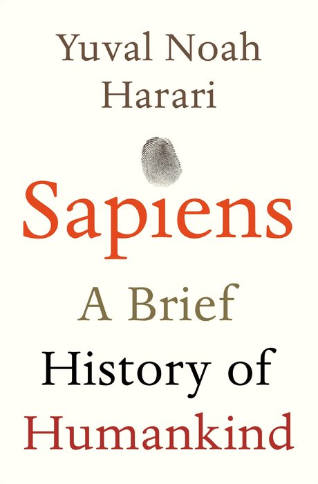
    [Sapiens: A Brief History of Humankind](https://www.goodreads.com/book/show/23692271-sapiens)

    - **Society**
    - **History**
    - **Factual**
    - Yuval Noah Harari
    - 2011

    An amazing, comprehensive and engaging history of the forces and events that shaped the human species.

- 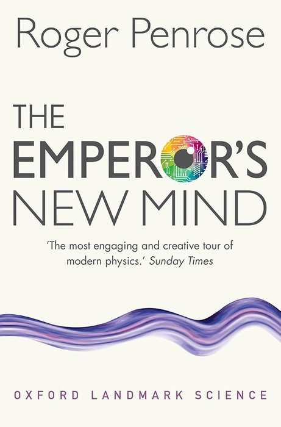
    [The Emperor's New Mind](https://www.goodreads.com/book/show/140377651-the-emporer-s-new-mind)

    - **Science**
    - **History**
    - **Factual**
    - Roger Penrose
    - 1989

    '*Concerning Computers, Minds, and the Laws of Physics*'

    A deep and detailed journey through maths, philosophy and artificial intelligence - it's a pretty dense read, but still very readable

- 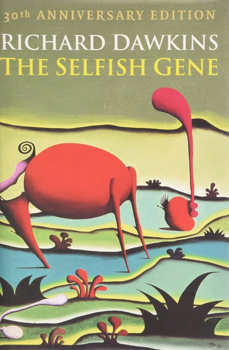
    [The Selfish Gene](https://www.goodreads.com/book/show/61535.The_Selfish_Gene)

    - **Science**
    - **Factual**
    - Richard Dawkins
    - 1976

    This amazing book asks you to consider our existence from the point of view of our genes: a collection of self-replicating chemicals, and once you do the origins of evolution, our biology and our behaviours all become clear.

