 # Brilliant Nerdy Documentaries *<i data-lucide="eye"></i>*

<!-- recommendations media -->

## Computers & Hacking

- 
    [Indie Game: The Movie](https://www.imdb.com/title/tt1942884/)

    - **Gaming**
    - **Computing**
    - **History**
    - **Factual**
    - 2012

    Explores the history, culture, and evolution of video games from their early arcade origins into a massive global industry. Really interesting.

- 
    [High Score](https://www.imdb.com/title/tt12759400/)

    - **Gaming**
    - **Computing**
    - **History**
    - **Factual**
    - 2020

    A nostalgic journey through the golden age of video games, chronicling how visionary pioneers built a multi-billion-dollar industry from the pixel up.

- 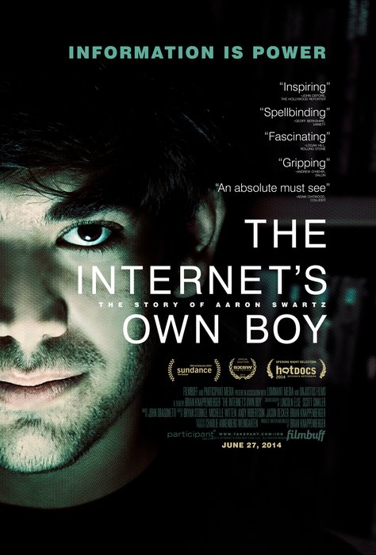
    [The Internet's Own Boy](https://www.imdb.com/title/tt3268458/)

    - **Computing**
    - **Hacking**
    - **Factual**
    - 2014

    The extraordinary life, groundbreaking tech contributions, and tragic federal prosecution of programming prodigy and open-access activist Aaron Swartz. Such a sad story.

- 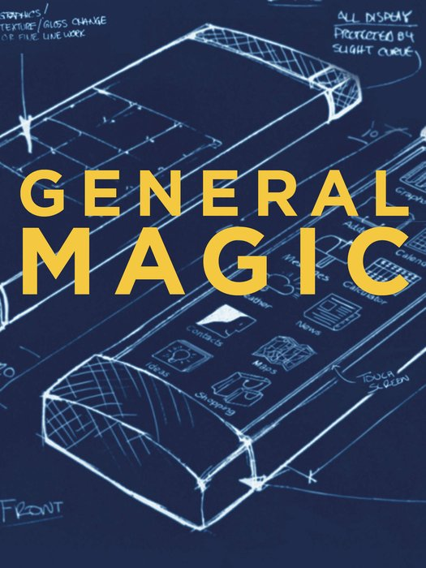
    [General Magic](https://www.imdb.com/title/tt6849786/)

    - **Computing**
    - **History**
    - **Factual**
    - 2018

   Tells the story of the 1990 Apple spin-off that pioneered early smartphone concepts before failing commercially, but also launching the careers of several industry visionaries. Amazing story.

- 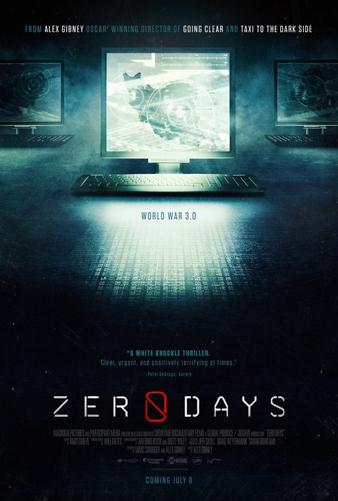
    [Zero Days](https://www.imdb.com/title/tt5446858/)

    - **Computing**
    - **Hacking**
    - **Society**
    - **Factual**
    - 2016

    Investigates how a joint U.S. and Israeli cyberattack using the Stuxnet malware sabotaged Iran's nuclear program and exposed the unregulated reality of global cyber warfare.

- 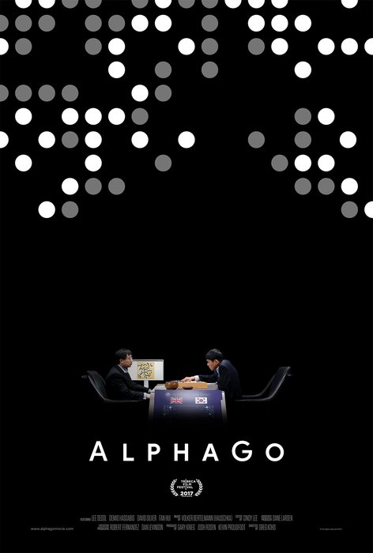
    [AlphaGo](https://www.imdb.com/title/tt6700846/)

    - **Computing**
    - **Factual**
    - **Drama**
    - 2017

    Chronicles the historic match between Go champion Lee Sedol and Google DeepMind's artificial intelligence program, AlphaGo. Surprisingly tense.

- 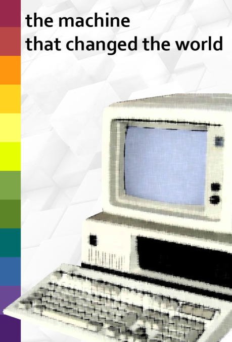
    [The Machine that Changed the World](https://www.imdb.com/title/tt1245829/)

    - **Computing**
    - **History**
    - **Factual**
    - 1992

    Explores the history of digital computing, from massive early vacuum-tube machines to personal computers, artificial intelligence, and global networks. An old show, but worth tracking down.

## Space

- 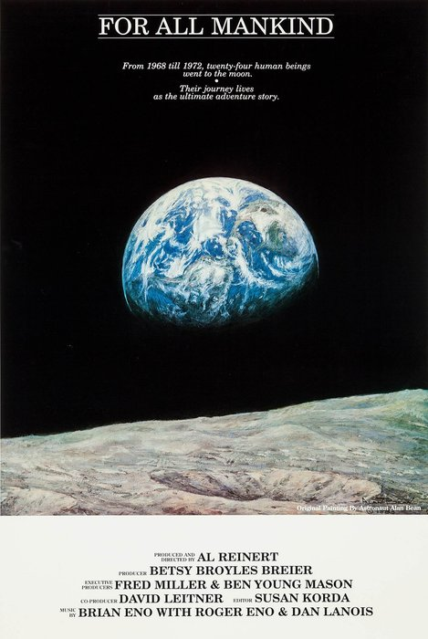
    [For All Mankind](https://www.imdb.com/title/tt0097372/)

    - **Space**
    - **History**
    - **Factual**
    - 1989

    Merges real NASA footage and astronaut interviews from multiple Apollo missions into a single, mesmerizing journey to the moon. Extraordinary.

    *(Note: not the recent TV drama)*

## Science & Nature

- 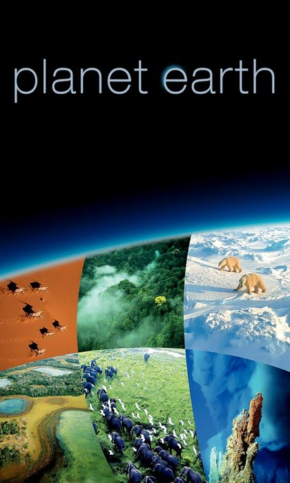
    Planet Earth Series

    - **Adventure**
    - **Science**
    - **Factual**
    - **Nature**
    - 2001-2024

    An extraordinary journey through the habitats, landscapes and wildlife of our planet. The production values and camera work in these shows is unsurpassed, and nobody voices a nature show better than Sir David Attenborough.

    - [Blue Planet I](https://www.imdb.com/title/tt0296310/) (2001)
    - [Blue Planet II](https://www.imdb.com/title/tt6769208/) (2017)
    - [Planet Earth I](https://www.imdb.com/title/tt0795176/) (2006)
    - [Planet Earth II](https://www.imdb.com/title/tt5491994/) (2016)
    - [Planet Earth III](https://www.imdb.com/title/tt9805674/) (2024)
    - [Human Planet](https://www.imdb.com/title/tt1806234/) (2011)
    - [Frozen Planet I](https://www.imdb.com/title/tt2092588/) (2012)
    - [Frozen Planet II](https://www.imdb.com/title/tt9805678/) (2023)
    - [A Life on Our Planet](https://www.imdb.com/title/tt11989890/) (2020)

- 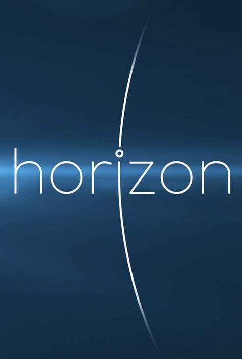
    [Horizon](https://www.imdb.com/title/tt0318224/episodes)

    - **Science**
    - **Nature**
    - **Factual**
    - 1964

    This UK TV show has created some of the best science-focussed TV for years. Always well produced, always interesting, and covering every topic that has impacted humanity for the past six decades.

- 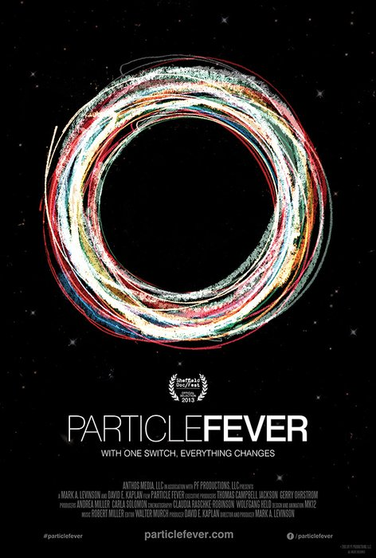
    [Particle Fever](https://www.imdb.com/title/tt1385956/)

    - **Science**
    - **Drama**
    - **Factual**
    - 2013

    A really gripping documentary that follows scientists during the launch of the Large Hadron Collider. It captures the intensity of discovering the Higgs boson.

- 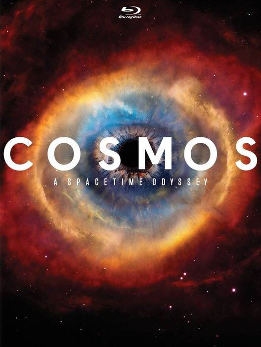
    [Cosmos](https://www.imdb.com/title/tt0081846/)
    and [Cosmos: A Spacetime Odyssey](https://www.imdb.com/title/tt2395695/)

    - **Science**
    - **Nature**
    - **Factual**
    - 1981 / 2014

    Two amazing documentary series, the original hosted by Carl Sagan, and the later one hosted by Neil deGrasse Tyson. They explore the laws of nature, humanity's historic quest for scientific knowledge, and our place within the universe.

## Technology

- 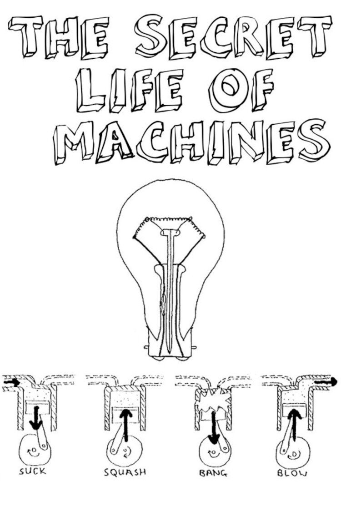
    [The Secret Life of Machines](https://www.imdb.com/title/tt0431571/)

    - **History**
    - **Comedy**
    - **Science**
    - **Factual**
    - 1988-1993

    Tim Hunkin takes everyday machines apart and explains how they work with wit, curiosity and wonderfully improvised models. A pretty old show, but really well done and genuinely informative.

    [Watch them all, remastered, on Tim's YouTube channel](https://www.youtube.com/playlist?list=PLtaR0lZhSyAPLuoSbMA29s3Ry8ZUvKff3)

