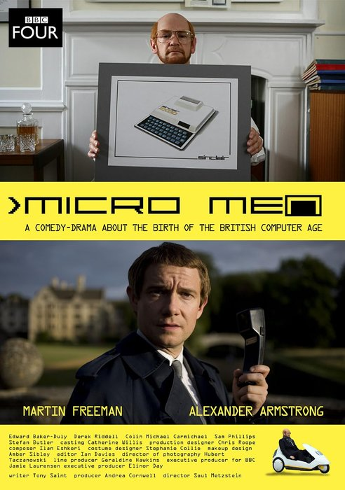
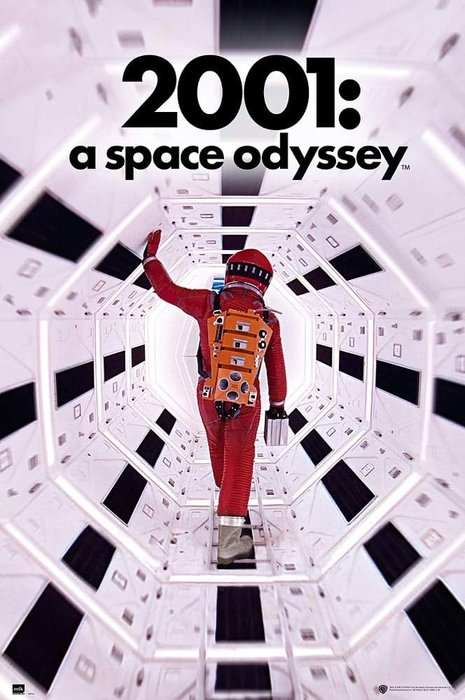
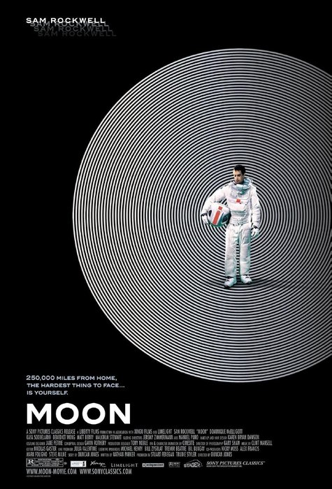
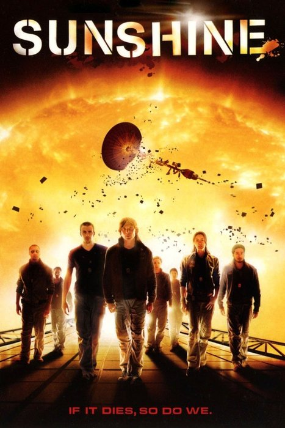
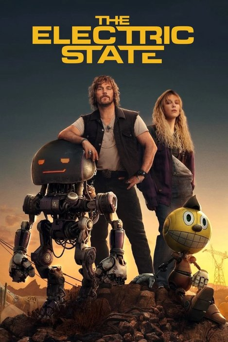
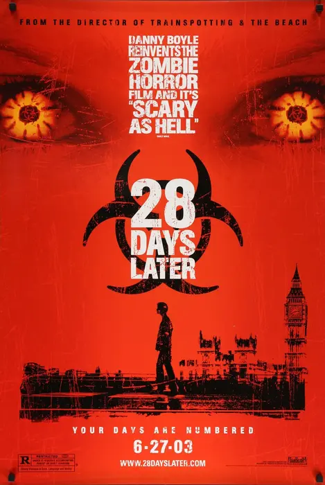

# Fantastic Nerdy Movies *<i data-lucide="clapperboard"></i>*

<!-- recommendations media -->

## Hacking & Computer Movies

- 
    [War Games](https://www.imdb.com/title/tt0086567/)

    - **Hacking**
    - **War**
    - **Thriller**
    - 1983

    A teenage hacker accidentally connects to a military computer and almost triggers World War III. Awesome 80s tech.

- 
    [Sneakers](https://www.imdb.com/title/tt0105435/)

    - **Crime**
    - **Comedy**
    - **Mystery**
    - **Thriller**
    - **Hacking**
    - 1992

    A team of eccentric security experts and former hackers are forced by the government to steal a universal code-breaking device, but end up in an international conspiracy.

- 
    [Pirates of Silicon Valley](https://www.imdb.com/title/tt0168122/)

    - **Drama**
    - **Biography**
    - **History**
    - **Computing**
    - 1999

    A sharp biographical drama about the early battle between Apple and Microsoft in the 80s. This is the era that shaped the future of personal computing.

- 
    [Tron](https://www.imdb.com/title/tt0084827/)

    - **Sci-Fi**
    - **Action**
    - **Hacking**
    - **Adventure**
    - 1982

    Another great 80s movie, one of the first to use computer graphics. It's a neon-drenched digital adventure, good vs bad, lots of computing reference easter eggs.

- 
    [Micro Men](https://www.imdb.com/title/tt1459467/)

    - **History**
    - **Drama**
    - **Computing**
    - 2009

    An entertaining drama about conflict between some of the key figures in the 80s personal computer boom: Clive Sinclair (ZX 80/81/Spectrum), Chris Curry (Acorn, BBC Micro)

## War & Thrillers

- 
    [The Imitation Game](https://www.imdb.com/title/tt2084970/)

    - **Drama**
    - **Biography**
    - **Thriller**
    - **War**
    - 2014

    A tense, human story about Alan Turing, Bletchley Park, and the codebreaking effort that changed history.

- 
    [The Hunt for Red October](https://www.imdb.com/title/tt0099810/)

    - **War**
    - **Thriller**
    - **Action**
    - **Drama**
    - 1990

    A tense Cold War submarine thriller full of strategy, suspicion, and nerve-rattling pressure.

- 
    [Crimson Tide](https://www.imdb.com/title/tt0112740/)

    - **War**
    - **Thriller**
    - **Action**
    - **Drama**
    - 1995

    A fierce and claustrophobic submarine drama where the world is teetering on the edge of World War III. really tense and thrilling.

## Space & Aliens

- 
    [2001: A Space Odyssey](https://www.imdb.com/title/tt0062622/)

    - **Sci-Fi**
    - **Drama**
    - **Thriller**
    - **Adventure**
    - 1968

    A mysterious artifact is uncovered on the Moon, leading to a mission to Jupiter being launched to discover its origins, carrying two scientists and an AI computer. This film was groundbreaking for its time, and really defined a new era of sci-fi movies. The cinematography is impressive and the visuals still hold up today.

- 
    Alien Series

    - **Sci-Fi**
    - **Horror**
    - **Action**
    - **Thriller**
    - 1979-2024

    A classic space horror series, each movies is different, but each is terrifying in its own way; minimal lighting and confined spaces add to the tension and fear.

    - [Alien](https://www.imdb.com/title/tt0078748/) (1979)
    - [Aliens](https://www.imdb.com/title/tt0090605/) (1986)
    - [Alien 3](https://www.imdb.com/title/tt0103644/) (1992)
    - [Alien: Resurrection](https://www.imdb.com/title/tt0118583/) (1997)
    - [Prometheus](https://www.imdb.com/title/tt1446714/) (2012)
    - [Alien: Covenant](https://www.imdb.com/title/tt2316204/) (2017)
    - [Alien: Romulus](https://www.imdb.com/title/tt13681062/) (2024)

- 
    Dune Series

    - **Sci-Fi**
    - **Action**
    - **Adventure**
    - **Drama**
    - 2021-2024

    A massive desert-world epic about power, prophecy, and survival; warring factions, betrayal, giant sand worms, epic visuals. A really great adaption of the books.

    - [Dune: Part 1](https://www.imdb.com/title/tt1160419/) (2021)
    - [Dune: Part 2](https://www.imdb.com/title/tt15239678/) (2024)

- 
    [Arrival](https://www.imdb.com/title/tt2543164/)

    - **Sci-Fi**
    - **Drama**
    - **Thriller**
    - 2016

    A smart, emotional sci-fi film about language, time, and the human cost of first contact. The styling of the alien ships and the aliens is so well done.

- 
    [Interstellar](https://www.imdb.com/title/tt0816692/)

    - **Sci-Fi**
    - **Adventure**
    - **Drama**
    - 2014

    A huge, emotional space adventure about love, survival, and humanity's future beyond Earth. Takes a couple of viewings to follow it properly.

- 
    [Moon](https://www.imdb.com/title/tt1182345/)

    - **Sci-Fi**
    - **Adventure**
    - **Drama**
    - **Mystery**
    - 2009

    A worker on a moon base, coming to the end of his three-year mission, discovers a disturbing secret. Dark, claustrophobic and clever.

- 
    [Starship Troopers](https://www.imdb.com/title/tt0120201/)

    - **Sci-Fi**
    - **Action**
    - **War**
    - 1997

    A satirical military sci-fi film packed with bugs, bravado, and a very big bug problem. Loosely based on Robert A. Heinlein's 1959 novel, but reframed brilliantly.

- 
    [Gravity](https://www.imdb.com/title/tt1454468/)

    - **Sci-Fi**
    - **Thriller**
    - **Drama**
    - 2013

    A terrifying survival film set in low Earth orbit. Things go horribly wrong, every mistake feels fatal and every second matters.

- 
    [Sunshine](https://www.imdb.com/title/tt0448134/)

    - **Sci-Fi**
    - **Thriller**
    - **Drama**
    - 2007

    The Sun is dying and the Earth with it, so a last-ditch mission to restart the Sun with a huge nuclear bomb is launched. Daft premise, but q pretty good movie.

- 
    [The Martian](https://www.imdb.com/title/tt3659388/)

    - **Sci-Fi**
    - **Comedy**
    - **Adventure**
    - **Drama**
    - 2015

    A great survival story about a astronaut stranded on Mars, trying to stay alive and stay sane. The book is even better than this movie adaption.

- 
    [Project Hail Mary](https://www.imdb.com/title/tt12042730/)

    - **Sci-Fi**
    - **Adventure**
    - **Drama**
    - 2026

    A lone astronaut wakes far from Earth with one impossible mission: save humanity. Along the way, he makes a pretty cool friend. Fantastic movie, even better book.

- 
    [Contact](https://www.imdb.com/title/tt0118884/)

    - **Sci-Fi**
    - **Drama**
    - **Mystery**
    - 1997

    A thoughtful, inspiring look at the search for alien life and what it means to be human. The book it is based on has more depth, but still a good movie.

- 
    [Edge of Tomorrow](https://www.imdb.com/title/tt1631867/)

    - **Sci-Fi**
    - **Action**
    - **Thriller**
    - **Adventure**
    - 2014

    A clever time-loop action film where a soldier keeps reliving the same battle until he learns to win. The beachhead battle scenes are intense.

- 
    [The Fifth Element](https://www.imdb.com/title/tt0119116/)

    - **Sci-Fi**
    - **Action**
    - **Adventure**
    - 1997

    A wildly colourful space opera full of strange creatures, big ideas, memorable quotes, and very 90s flair. It's as close to a comic book as you can get in a movie.

- 
    [Ender's Game](https://www.imdb.com/title/tt1731141/)

    - **Sci-Fi**
    - **Action**
    - **Adventure**
    - 2013

    A strategic military sci-fi story about genius, pressure, and the cost of winning. The book this is based on is amazing, and they did well to capture it.

## Brain-Twisters

- 
    [Inception](https://www.imdb.com/title/tt1375666/)

    - **Sci-Fi**
    - **Action**
    - **Thriller**
    - **Mystery**
    - 2010

    A layered, high-stakes dream-heist film that turns architecture, psychology, and obsession into pure spectacle; need to watch it multiple times.

- 
    [Primer](https://www.imdb.com/title/tt0390384/)

    - **Sci-Fi**
    - **Drama**
    - **Thriller**
    - **Mystery**
    - 2004

    A compact, clever time-travel film that has so many twisting timelines its hard to follow... the first time, and the second, and the third! But it's worth it.

## Cyberpunk, AI & Dystopia

- 
    Terminator Series

    - **Sci-Fi**
    - **Action**
    - **Thriller**
    - **Horror**
    - 1984-2003

    A relentless machine from the future, the possible end of humanity at the hands of AI machines, chases, time travel... these movies helped define the action sci-fi genre.

    - [The Terminator](https://www.imdb.com/title/tt0088247/) (1984)
    - [T2: Judgement Day](https://www.imdb.com/title/tt0103064/) (1991)
    - [T3: Rise of the Machines](https://www.imdb.com/title/tt0181852/) (2003)

- 
    The Matrix Trilogy

    - **Sci-Fi**
    - **Action**
    - **Thriller**
    - **Dystopia**
    - **Hacking**
    - 1999-2021

    A mind-bending cyberpunk series about reality, choice, and whether humans are still in control. These movies had such a huge impact on films that followed, and each one has much depth and clever detail. Brilliant.

    - [The Matrix](https://www.imdb.com/title/tt0133093/) (1999)
    - [The Matrix Reloaded](https://www.imdb.com/title/tt0234215/) (2003)
    - [The Matrix Revolutions](https://www.imdb.com/title/tt0242653/) (2003)
    - [The Matrix Resurrections](https://www.imdb.com/title/tt10838180/) (2021)

- 
    [Akira](https://www.imdb.com/title/tt0094625/)

    - **Animated**
    - **Sci-Fi**
    - **Action**
    - **Dystopia**
    - 1988

    A landmark cyberpunk anime with explosive energy, huge ideas, and a gorgeous futuristic city. The cinematography and story-telling is so good.

- 
    [Ghost in the Shell](https://www.imdb.com/title/tt0113568/)

    - **Animated**
    - **Sci-Fi**
    - **Action**
    - 1995

    A smart and atmospheric cyberpunk anime about identity, memory, and what makes a person real. Another animated classic.

- 
    Blade Runner

    - **Sci-Fi**
    - **Action**
    - **Drama**
    - **Crime**
    - 1982 / 2017

    Rain-soaked, moody, and full of big questions about humanity, memory, and identity. The incredible style of the original movie has been copied so many times, but the original stands the test of time. Note that the original 1982 cinema cut had a terrible, cheesy ;happy ending' tacked on - watch the director's cut!

    - [Blade Runner](https://www.imdb.com/title/tt0083658/) (1982)
    - [Blade Runner 2049](https://www.imdb.com/title/tt1856101/) (2017)

- 
    [Children of Men](https://www.imdb.com/title/tt0206634/)

    - **Dystopia**
    - **Thriller**
    - **Sci-Fi**
    - **Drama**
    - 2000

    A near-future movie that is bleak. Globally, women have become infertile, but a miraculous pregnancy leads to a tense and terrifying journey. The camerawork and action pieces are really well done.

- 
    [The Electric State](https://www.imdb.com/title/tt7766378/)

    - **Dystopia**
    - **Sci-Fi**
    - **Adventure**
    - **Comedy**
    - **Action**
    - 2025

    An amusing tale of a girl, her robot friend, and a rag-tag group travelling through a strange landscape. Based on wonderful [artwork by Simon Stalenhag](https://www.simonstalenhag.se/es.html), the movie is visually stunning.

- 
    [Ready Player One](https://www.imdb.com/title/tt1677720/)

    - **Sci-Fi**
    - **Adventure**
    - **Action**
    - 2018

    A fast, flashy virtual-reality adventure with endless 80s computer / gaming references and huge world-building energy. Super fun, and the book is even more nerdy.

- 
    [Snowpiercer](https://www.imdb.com/title/tt1706620/)

    - **Sci-Fi**
    - **Action**
    - **Thriller**
    - **Drama**
    - **Dystopia**
    - 2013

    A brutal, claustrophobic survival story set on a train that carries the last of humanity. Crazy premise, but a great movie.

- 
    [Brazil](https://www.imdb.com/title/tt0088846/)

    - **Sci-Fi**
    - **Comedy**
    - **Drama**
    - **Dystopia**
    - 1985

    A darkly funny dystopian satire about bureaucracy, freedom, and a world gone wrong. Terry Gilliam (ex. Monty Python) world-building is fantastic.

- 
    [District 9](https://www.imdb.com/title/tt1136608/)

    - **Sci-Fi**
    - **Action**
    - **Thriller**
    - **Comedy**
    - **Dystopia**
    - 2009

    A gritty, inventive alien-invasion story that mixes action with sharp social commentary. The look and feel of this is so real. Clever movie.

- 
    [Ex Machina](https://www.imdb.com/title/tt0470752/)

    - **Sci-Fi**
    - **Drama**
    - **Thriller**
    - 2015

    A tense, intimate AI thriller that asks whether a machine can really think, feel, or deceive.

- 
    [Watchmen](https://www.imdb.com/title/tt0409459/)

    - **Sci-Fi**
    - **Action**
    - **Drama**
    - **Thriller**
    - 2009

    A layered superhero story with big ideas, messy morals, and a lot of political weight. An Set during an alternative history Cold War, the graphic novel this is based on is captured beautifully in the film.

## Fantasy & Adventure Movies

- 
    The Lord of the Rings

    - **Fantasy**
    - **Adventure**
    - **Action**
    - **Drama**
    - 2001-2003

    A sweeping epic of friendship, courage, and a quest that decides the fate of Middle-Earth. Such a cultural touchstone that has influenced generations of story tellers since, painstakingly, beautifully rendered on-screen.

    - [The Fellowship of the Ring](https://www.imdb.com/title/tt0120737/) (2001)
    - [The Two Towers](https://www.imdb.com/title/tt0167261/) (2002)
    - [The Return of the King](https://www.imdb.com/title/tt0167260/) (2003)

- 
    [Love and Monsters](https://www.imdb.com/title/tt2222042/)

    - **Fantasy**
    - **Adventure**
    - **Comedy**
    - **Romance**
    - 2020

    A charming post-apocalypse adventure about finding your way home and learning to live again. Funny and fun, with great graphics.

## Action & Survival Movies

- 
    Mad Max Series

    - **Action**
    - **Sci-Fi**
    - **Adventure**
    - **Dystopia**
    - 1979-2016

    A brutal, unforgettable road-war saga about survival, revenge, and a broken future. These movies created a genre of gritty, post-apocalyptic stories.

    - [Mad Max](https://www.imdb.com/title/tt0079501/) (1979)
    - [Mad Max 2](https://www.imdb.com/title/tt0082694/) (1981)
    - [Mad Max Beyond Thunderdome](https://www.imdb.com/title/tt0094947/) (1985)
    - [Mad Max: Fury Road](https://www.imdb.com/title/tt1392190/) (2016)

- 
    [Source Code](https://www.imdb.com/title/tt0945513/)

    - **Sci-Fi**
    - **Thriller**
    - **Mystery**
    - **Action**
    - 2011

    A clever, fast-moving time-loop mystery where every restart carries a new clue and a new risk. Fun movie, and thought-provoking.

- 
    [V for Vendetta](https://www.imdb.com/title/tt0434409/)

    - **Action**
    - **Drama**
    - **Thriller**
    - **Dystopia**
    - 2006

    A stylish dystopian action film about freedom, identity, and the power of a single voice. Based on a graphic novel, the film does well to capture its feel.

- 
    [World War Z](https://www.imdb.com/title/tt0816711/)

    - **Action**
    - **Horror**
    - **Sci-Fi**
    - **Thriller**
    - **Zombie**
    - 2013

    A fast-moving zombie blockbuster about global panic, survival, and the cost of keeping humanity together. Brutal at times; the zombie hordes are done so well.

- 
    [28 Days Later](https://www.imdb.com/title/tt0289043/)

    - **Dystopia**
    - **Horror**
    - **Sci-Fi**
    - **Drama**
    - **Zombie**
    - 2013

    A mysterious, incurable virus spreads throughout the United Kingdom and a group of survivors try to find sanctuary. This movie changed the zombie genre, replacing the typical shuffling corpses with fast, terrifying infected.

- 
    Kill Bill

    - **Action**
    - **Crime**
    - **Thriller**
    - 2003-2004

    **<i data-lucide="triangle-alert"></i> R18**

    A stylish revenge epic that mixes samurai energy, comic-book attitude, and pure cinematic flair. Tarantino is a master story-teller, and the visuals here are a treat.

    - [Kill Bill: Volume 1](https://www.imdb.com/title/tt0266697/) (2003)
    - [Kill Bill: Volume 2](https://www.imdb.com/title/tt0378194/) (2004)

## Unlikely Superheroes

- 
    [Kick-Ass](https://www.imdb.com/title/tt1250777/)

    - **Action**
    - **Comedy**
    - **Crime**
    - 2010

    **<i data-lucide="triangle-alert"></i> R18**

    A funny, chaotic superhero story that turns the idea of being a hero into absolute chaos. Fun and funny in equal measure.

- 
    [Scott Pilgrim vs. the World](https://www.imdb.com/title/tt0446029/)

    - **Action**
    - **Comedy**
    - **Romance**
    - **Fantasy**
    - 2010

    A fast, stylish video-game movie with killer music, sharp jokes, and a lot of heart. Every nerd can empathise with the central character.

- 
    [Shaun of the Dead](https://www.imdb.com/title/tt0365748/)

    - **Comedy**
    - **Action**
    - **Sci-Fi**
    - **Horror**
    - **Zombie**
    - 2004

    Two hapless, every day mates find themselves in the midst of a zombie apocalypse. Obviously the pub will be the safest place to be.

