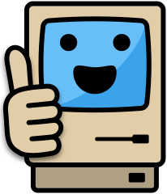

# Useful Tools

<speak>

The right tool for the job!

**Useful Tools** are the software that makes learning digital technologies easier.

</speak>

This is a list of tried-and-tested tools for coding, databases, design, and media - where possible, these are all **free**, **cross-platform** and **open-source**

<menu>

### Coding Tools

<i data-lucide="braces"></i>

[Link](/tools/code-edit.md)

Editors, online playgrounds and source control for writing code

---

### Database Tools

<i data-lucide="database"></i>

[Link](/tools/db-design.md)

Design, edit and generate data for your databases

---

### Design Tools

<i data-lucide="paintbrush"></i>

[Link](/tools/des-wire.md)

Wireframe, choose colours and pick fonts for your projects

---

### Image Tools

<i data-lucide="image-upscale"></i>

[Link](/tools/image-edit.md)

Edit images and create pixel art

---

### Media Libraries

<i data-lucide="images"></i>

[Link](/tools/media-image.md)

Find free images, sounds and game assets to use in your projects

</menu>

