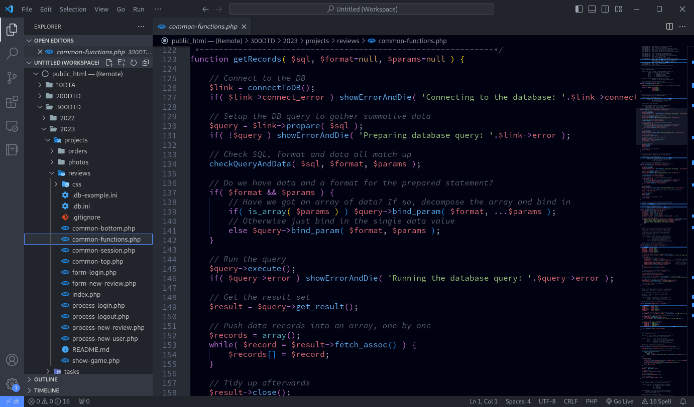

# IntelliJ IDEA by JetBrains

For the most part, you will be using the [VisualStudio Code](https://code.visualstudio.com/) editor to create and edit files on the DT Server. This is a highly popular and very configurable code editor with lots of great features to help you write solid code.

